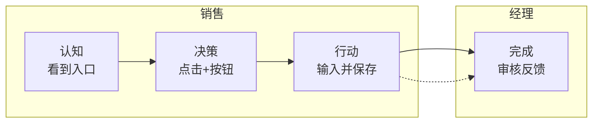

# PRD 文档表达规范 v1.0

> **职责范围**：本规范定义 prd.html **文档层**的表达方式——文档结构、版块布局、标准 HTML 区块、文档级视觉语言。
> 与以下两类规范相互独立，三者共同约束 prd.html 的生成：
> - **产品 UI 规范**（`bujue-design-system/tokens.md` + `components/`）：产品界面本身的色彩/字体/组件实现
> - **原型内容规范**（`proto_contract.md`）：触点编号、状态枚举、UX 守则、交互完整性等产品原型质量约束
>
> **配套文件**：`prd_template.html`（主模板，规划阶段直接 fork，不含产品内容）
> **使用时机**：
> - 任务规划阶段生成文档骨架时，必须读取本规范 + fork `prd_template.html`
> - 各模块 prd 片段生成时必须传入本规范

---

## 零、`[Should]` 元规范：视觉规范须达"零猜测实现"粒度

本规范涉及视觉的所有条款（含 §三 / §四 / §五 / §六 / §七 等以视觉效果为目标的章节），须达到**两个不同 PM 按规范实现得到肉眼可分辨相同视觉效果**的粒度。

> **`[Must]` PRD 正文禁内联变更标记（SSOT #79 / S4-68）**：prd.html 正文（含 interaction-card 交互说明、帧旁说明等）**禁**写内联变更 / 过程标记——`【vN.N 新增】`/`【历史留痕…】` 等方括号，及含 `CR-NNNN`/`议题 #N`/`SSOT #N`/`调整意见` 的圆括号。变更历史只走变更记录表（doc-changelog）+ git，泄漏进正文影响下游阅读。schema 标记（`【触发态】【组件】…`）+ `（来源：…）` 不在此列。`precheck_stage1/2/3/4` 各 `check_no_inline_change_markers` WARN；定位用 `strip_inline_change_markers.py`（只读报告，删除 PM 手动做）。真源详 `rule_hard_constraints.md §六 S4-68`。

**视觉规范条款的最低粒度要求**：
1. **必备 CSS 属性集合**：显式列出该元素 / 容器需指定的 CSS 属性（如 `padding` / `background` / `border` / `border-radius` / `box-shadow` / `margin`）；不可只说"分隔清晰" / "视觉一致"等抽象描述
2. **具体数值或 token 引用**：每个属性给具体数值（如 `padding: 24px 32px`）或显式引用 `bujue-design-system/tokens.md` 的 token（如 `padding: var(--fb-space-lg) var(--fb-space-xl)`）
3. **与上下层视觉容器的边界关系**：明示该元素与父容器、兄弟元素、子元素之间的间距 / 对齐 / 圆角衔接；避免"靠 margin/border-top 隔开"这种依赖单维度分隔的写法

**判定标准**：若两个不同 PM 按规范实现得到肉眼可分辨的不同视觉效果（容器高度差异 / 圆角差异 / 阴影有无 / 间距差异等）→ 规范粒度不足，按本条款补充到 CSS 级细节后再合并。

**违反案例**（说明）：
- ❌ "section 应分隔清晰" → 太抽象，PM 可能仅写 `border-top: 1px solid` 也可能写完整容器
- ✅ "`.proto-section` 须为独立容器：`background: var(--fb-color-surface); border: 1px solid var(--fb-color-border); border-radius: var(--fb-radius-lg); box-shadow: var(--fb-shadow-sm); padding: var(--fb-space-xl); margin: var(--fb-space-2xl) 0;`"

**与 SSOT 原则联动**：视觉规范须明示"`prd_template.html` 是技术真源 / 本规范是描述派生视图 / 调整方向：先改 template、再同步本规范"——参见 ``pm-workflow/rules/ssot_anchors.md` #4`。

> **`[Must]` 生产前判定标准必读（根因 C 防御）**：阶段 4 开工前，PM 须先读 `proto_cross_platform.md §七 生产前判定标准前置`——含 ① 端适配 vs 组件拆分（PRD 层一个组件 + 端适配）② 次级页面返回入口加 / 豁免 ③ 列表 / 数据展示选型 三类**已确立判定标准**。**生产前按标准定，不靠直觉、不等产品总监第 N 轮反馈才定**（这三类是历史下游反复试错才确立的，前置固化以杜绝多轮返工）。

---

## 零.1、`[Must]` 全局 z-index 数值规范表

> **本节定位**：定义 PRD 文档全局 z-index 数值锚（issue 2026-05-05_2243 复盘 T1-2）。所有 `position: sticky / absolute / fixed` 元素的 z-index 必须从本表选取,**禁止**自由发挥（如 999 / 1000）。
>
> **来源历史**：bujue-quotation-tool 历史出现"PM 给弹框写 z-index: 999 盖住 sticky section-header"的视觉漂移。本表统一全局数值后,各处规则只引用编号,避免散落。

| 编号 | 元素类型 | z-index 数值 | 用例 / class | 备注 |
|------|---------|-------------|------------|------|
| Z-300 | mermaid 全屏预览遮罩 | **300** | `.mmd-fs-overlay`(本规范 §A-10 mermaid 全屏预览) | Item 3 新增；真全屏遮罩，**高于** section-header（覆盖一切含 sticky 标题），文档内唯一 > 200 层；锁定值 |
| Z-200 | sticky 标题 / 顶部固定栏 | **200** | `.section-header`(本规范 §四 区块 A) | 锁定值,**禁止**业务方修改 |
| Z-150 | toast 反馈层 | 150 | `.fb-toast` | 短暂操作反馈,高于所有面板/浮层（弹框打开时仍可见）|
| Z-100 | dropdown / select 下拉 | 100 | `.fb-dropdown` / `.fb-select-dropdown` / `.dropdown-menu` | 浮于普通内容上,但不超过弹框 |
| Z-60 | tooltip / popover | 60 | `.fb-tooltip` / `.fb-popover` / `.popover` | 装饰性提示 |
| Z-50 | modal 容器（遮罩 + 居中）| 50 | `.fb-modal-overlay` / `.modal-mask` / `.fb-mask` | 覆盖业务区的 modal **容器**（flex 居中 + 遮罩底）；`.fb-modal` 作为其**子元素**渲染于遮罩之上（靠 DOM 嵌套，非 z-index 数值）→ modal 自身**无 z-index**（详见下方「modal vs drawer pattern」）|
| Z-41 | drawer 内容 | 41 | `.fb-drawer` | 略高于 drawer-overlay（drawer 与遮罩为**同级兄弟**，故内容需 +1 盖过遮罩；隔离机制确保不溢出帧）|
| Z-40 | drawer 遮罩 / 自定义弹框别名 | 40 | `.fb-drawer-overlay` / `.popup` / `.dialog` / `.bottom-sheet` | 抽屉遮罩（`.fb-drawer`=Z-41 内容在其上）；`.popup` / `.dialog` / `.bottom-sheet` 为 PM 自定义弹框别名（S4-25 禁用，列此仅为合法集完整 + **上限 199**，§四 区块 A 已规定）|
| Z-10 | 触点徽章 / 装饰浮标 | 10 | `.tp-marker` | 装饰元素,不参与交互层级 |
| Z-1 | 默认文档流 | auto / 1 | 普通元素 | 不需声明 |

**`[Must]` modal vs drawer pattern（为何 overlay 数值高于"弹框"不矛盾）**：
- **modal 是父子嵌套**：`.fb-modal-overlay`（Z-50 容器，flex 居中 + 遮罩底）**包含** `.fb-modal` 作为子元素。子元素天然渲染在父元素背景之上（DOM 绘制顺序），**与 z-index 数值无关** → 故 `.fb-modal` 在真源 `fb-fallback.css` 中**不写 z-index**（§零.2 7 组件表记为"文档流 / 继承父"）。overlay 取 Z-50 是为把**整个 modal 组**抬到业务区之上，非用于压制 modal。**S4-25 强制 `.fb-modal-overlay + .fb-modal` 嵌套结构** → modal **永不**成为遮罩的同级兄弟，"overlay 高于 modal 会盖住"的场景在本工作流不存在。
- **drawer 是同级兄弟**：`.fb-drawer-overlay`（Z-40 遮罩）与 `.fb-drawer`（Z-41 内容）是 frame-card 下的**同级 absolute 元素**，故内容必须 +1（41 > 40）才能盖过遮罩。
- **一句话**：modal 靠**嵌套**分层（无需 modal z-index）、drawer 靠**数值**分层（content z+1）；两种 pattern 不可混判。真源 = `fb-fallback.css`（结构）+ §零.2（组件表）；本 §零.1 表与之一致。

**`[Must]` 引用约束**：
- 任何 PM 自定义视觉元素的 z-index **必须**在 `<style>` 注释中显式标注引用编号,例如 `z-index: 40; /* Z-40 drawer 遮罩 */`
- 弹框相关 class 引用 Z-40 后,通过依赖 `.frame-card` 自带的 `isolation: isolate` 限制 stacking context（不会溢出到 sticky section-header）
- frame-card 自身**禁止**通过 inline `style="z-index: ..."` 加 z-index 属性（保持文档流默认 auto,这样弹框被 isolation 隔离即可）
- 若新加视觉元素需要表中**未列**的 z-index 数值,**必须**通过 `/retro` 流程修订本表,**禁止**就地写魔术数

**机械兜底**：
- precheck_stage4 加规则：扫 `outputs/prd_*.html` 中所有 `z-index: \d+` 数值,若不在 {300, 200, 150, 100, 60, 50, 41, 40, 10, 1} 集合 → **FAIL（已升 FAIL，`check_z_index_compliance` 实为 r.fail；非 WARN-phase）**。**Why 此处 FAIL 正确、不同于 S4-32 WARN-phase**：z-index 检查是 exact 判定（值 ∈ 稳定合法集，≈0 FP）且**无追溯性问题**——合法产物永不写非法 z-index（§零.1 表即 PM 遵循的契约），FAIL 只捕真实魔术数缺陷（如历史 PM 写 z-index:999 盖 sticky 标题），不会像 S4-32 那样追溯性误伤合法存量产物，故**不走 WARN-phase、勿"参照 S4-32 顺手降级"**。集合与本表 10 行 1:1 对应,运行时由 `_parse_z_index_truth_source` 反向解析对账
- prd_template.html 真源中所有 z-index 必须有对应注释 `/* Z-NNN xxx */`
- fb-fallback.css 真源中面板/浮层组件 z-index 必须有对应注释 `/* Z-NNN xxx */`

**与既有规则的关系**：
- §四 区块 A line 681「z-index 层级保护」是本表 Z-200 / Z-40 的具体落地约束（section-header=200,弹框 < 200）
- 区域 B 视觉边界 CSS line 824 `z-index: 200` 注释引用本表 Z-200
- 后续新加规则 z-index 数值时，引用本表编号而非散落写数值
- **§零.2「面板/浮层组件三大类规范」是本表的具体组件落地**（容器型 / 反馈型 / 浮层型 7 类组件已分类预设 z-index，PM 不需也不允许写自定义 z-index）

---

## 零.2、`[Must]` 面板/浮层组件三大类规范（默认隐藏 + 嵌入帧 + 预设 z-index）

> **本节定位**：定义 PRD 文档中所有面板/浮层组件（弹框 / 抽屉 / 下拉 / 气泡 / 提示 / Toast）的统一规范——**默认隐藏 + 嵌入 frame-card + 预设 z-index**（issue 2026-05-09_1206 # 10/# 11/# 12 复盘 + 产品总监 2026-05-11 架构决策 C-1 B 档位 / C-2 嵌入帧 / C-3 frame-card isolation）。
>
> **来源历史**：prd.html 出现 7 个 toast + 56 个 modal-overlay 节点**全局常驻显示**，连带触发滚动条不停闪烁。根因双重失守：①`fb-fallback.css` 中面板组件默认即可见（`display: flex/inline-flex`，无 `is-visible` 触发机制）；②drafts 中又用 inline `style="display:flex; position:absolute; z-index:..."` 三重强制显示。
>
> **三大支柱**：
> 1. **frame-card stacking context 隔离**：`.frame-card { isolation: isolate }`（在 `prd_template.html` 真源），帧内 z-index 不溢出到 sidebar / section-header
> 1.b. **frame 容器自身 `position: relative`**（NB-WE-25 补强，2026-05-12 issue # 4）：每个具体 frame 类（`.phone-frame` / `.desktop-frame` / `.h5-frame` / `.tablet-frame` / `.miniprogram-frame`）的 CSS 真源**必须含** `position: relative` — 为 `.fb-modal-overlay { position: absolute; inset: 0 }` 等内部 absolute 元素提供 positioning context；无此则 modal 沿 DOM 链向上冒泡找不到 positioned 祖先 → 一路冒泡到 `<body>` → 相对 viewport 定位 = **看起来全屏覆盖 / 全局常驻显示**。frame-card isolation（支柱 1）与 frame 容器 position: relative（支柱 1.b）互补：前者管 z-index 隔离，后者管 positioning context；**两者缺一不可**
> 2. **三大类组件分类 + 预设 z-index**：每类组件 css 真源自带 `position: absolute` + 引用 §零.1 表的 z-index 数值（PM 不需也不允许写自定义）
> 3. **可见性修饰类 `.is-visible`**：默认 `display: none`，加 `.is-visible` 才显示（状态机化）

### `[Must]` 三大类 7 组件预设规范（真源在 `fb-fallback.css`）

> z-index **数值唯一权威源**在 §零.1 表；本表「z-index」列仅引用编号，数值字面不复刻，避免双源漂移（参 SSOT #2）。

| 大类 | class | 默认 display | position | z-index | 触发显示 |
|-----|-------|------------|---------|--------|---------|
| **容器型** | `.fb-modal-overlay` | none | absolute | Z-50 | 加 `.is-visible` → flex |
| 容器型 | `.fb-modal` | flex column（已显示，被父隐藏） | 文档流 | 继承父 | — |
| 容器型 | `.fb-drawer-overlay` + `.fb-drawer` | none | absolute | Z-40 + Z-41 | 加 `.is-visible` |
| **反馈型** | `.fb-toast` | none | absolute | Z-150 | 加 `.is-visible` → inline-flex |
| **浮层型** | `.fb-dropdown` | none | absolute | Z-100 | 加 `.is-visible` → flex |
| 浮层型 | `.fb-popover` | none | absolute | Z-60 | 加 `.is-visible` → flex |
| 浮层型 | `.fb-tooltip` | none | absolute | Z-60 | 加 `.is-visible` → inline-block |

**特别说明**：`.section-header` 取 Z-200（sticky 顶栏，**不在 frame-card 内、不参与 frame 内 stacking context**），高于所有面板/浮层；z-index 数值大小排序见 §零.1 表自顶向下顺序。

### `[Must]` 嵌入帧不可突破原则（业务"全屏体验" → PRD 多帧拆分表达）

> **本节定位**：澄清 PRD 表达边界——所有面板/浮层组件**永远**嵌入页面帧（phone-frame / desktop-frame / miniprogram-frame）内，**不存在 PRD 层级的"全屏弹框"**。
>
> **认知前提**：PRD 是**设计文档**不是真实应用——读者看的是页面帧的视觉呈现，**不会真的在浏览器视口里"被弹框拦截"**。因此业务上的"全屏体验"在 PRD 层级**必须改用多帧拆分**来表达，而非用 modifier 类（如 `.is-fullscreen`）让弹框突破 frame。

#### 业务"全屏体验" → PRD 表达对照

| 业务体验 | PRD 错误表达 ❌ | PRD 正确表达 ✅ |
|---------|---------------|----------------|
| 全屏图片预览 | 一个帧 + modal 突破 frame | 两个独立帧：**帧1 图片列表** + **帧2 全屏预览页**（预览组件铺满 phone-frame 视口） |
| 全屏 wizard / 多步表单 | 一个帧 + modal 全屏 | 多个独立帧：**步骤1 帧 + 步骤2 帧 + ...**（每步独立帧） |
| 系统级通知（断网 / 升级提示）| 一个帧 + 全局浮层 | 一个帧 + `.fb-modal-overlay`（嵌入式 modal，PRD 读者不会真"看到"网络断了，他在看 PRD） |
| 危险操作全局拦截（删除全部数据）| 一个帧 + 全局阻断 modal | 专属"确认中"状态帧 + 该帧内 `.fb-modal-overlay is-visible` |

#### `[Must]` 反例禁令

- ❌ **禁止**给任何面板/浮层组件加自定义"突破 frame" 修饰类（如 `.is-fullscreen` / `.is-global` / `.is-viewport`）
- ❌ **禁止**给面板组件 inline 写 `style="position: fixed"` 强制突破 frame-card 的 isolation
- ❌ **禁止**用"业务上是全屏所以 PRD 也应该全屏"作为豁免理由——PRD 永远嵌入帧
- ❌ **禁止**用自定义 class（如 `.sheet` / `.bottom-sheet` / `.action-sheet` / `.popup` / `.modal-mask` / `.dialog` 等）+ inline `position: relative / absolute / flex: 1` 等自由发挥**完全规避**标准 `.fb-modal-overlay + .fb-modal` 结构 — 后果：① 缺遮罩（自定义 div 无 `.fb-modal-overlay` 自带 `background:var(--fb-overlay)`）② 不贴底（绕开真源 `.fb-modal { align-self: flex-end }` flex 锚定）。**正确做法**：phone-frame / miniprogram-frame 内 sheet 形态由真源 CSS 全自动适配（见状态帧约束第 5 条），PM 只须用标准 `.fb-modal-overlay + .fb-modal` 结构。

#### 设计哲学

PRD 越要表达"业务全屏 / 突破式"的体验，就越要**靠多帧拆分而非 modifier 突破**。这把"全屏问题"从 css 层（修饰类）下推到了**信息架构层**（多帧设计），与本规范"嵌入帧 + frame-card isolation"的 B 档位设计严丝合缝。

### `[Must]` 状态帧表达约束

1. **默认状态帧 = 全部隐藏**：PM 在 prd_M*_draft.html 中描绘任何状态帧时，**默认帧（如 `H-M[XX]-P[YY]-default`）禁止给任意面板/浮层组件加 `.is-visible`**——所有面板/浮层在默认帧保持隐藏
2. **触发态状态帧加 `.is-visible`**：仅在该面板真正应该显示的状态帧（典型命名 `H-M[XX]-P[YY]-modal-[name]` / `-toast-[name]` / `-drawer-[name]` / `-dropdown-[name]` 等）才加 `.is-visible`
3. **drawer 双层都要加**：drawer 是双层结构（`.fb-drawer-overlay` 包 `.fb-drawer`），触发显示时**两层都要加 `.is-visible`**
4. **modal 状态帧的"背景帧"加 `.is-modal-bg` modifier**：当状态帧主体是 modal-overlay 时，承载它的 phone-frame / desktop-frame / h5-frame / tablet-frame / miniprogram-frame **应加 `.is-modal-bg` modifier**（如 `<div class="phone-frame is-modal-bg">`），让 frame 用紧凑尺寸（min-height: 520px）显示被遮罩的背景内容，视觉焦点聚集在 modal 自身。**禁止**用 inline `style="min-height:XXpx"` 自由覆盖 frame class 真源尺寸（违反 SSOT #30 派生层禁修真源精神）；precheck_stage4 S4-FRAME-01 拦截。
   - 典型场景：`H-M[XX]-P[YY]-create-form` / `-delete-confirm` / `-edit-mode` 等含 `.fb-modal-overlay.is-visible` 的状态帧
   - 正例：`<div class="phone-frame is-modal-bg">` ✅ / 反例：`<div class="phone-frame" style="min-height:520px">` ❌
   - 真源：`pm-workflow/rules/prd_template.html` `.is-modal-bg` modifier CSS 块
   - **`[Should]` 装饰背景 navbar 配套指引**（modal-bg 帧内 navbar 选择）：背景层 navbar 仅作视觉表达（modal 遮罩后不可交互），不选 detail（会触发 S4-35 强制 nav-back 污染触点表）；推荐 `data-variant="list"` 兜底 + `style="opacity:0.5"` 视觉降权 + 仅 `.fb-nav-title` + 注释豁免 `<!-- modal-bg 装饰: list variant 兜底（背景层无返回语义）-->`（同 SSOT #58 注释豁免同型）。详 `fb-fallback-manifest.md §3.12 v2 装饰背景 navbar 选择指引` 段。
5. **phone-frame / miniprogram-frame 内 modal 自动 sheet 形态**：移动端 modal 的 Action Sheet 形态（贴底 + 全宽 + 顶部圆角）**由真源 CSS 全自动适配**，PM 不需也不允许自行实现：
   - 真源 CSS：`fb-fallback.css` L509-510 `.phone-frame .fb-modal, .miniprogram-frame .fb-modal { border-radius: 12px 12px 0 0; align-self: flex-end; width: 100%; max-width: 100% }`（① 上方圆角下方贴边 ② `align-self: flex-end` 锚到 cross-axis 末端 ③ 占满 frame 宽度）
   - 遮罩自动出：`.fb-modal-overlay.is-visible` 自带 `background: var(--fb-overlay)`
   - PM 唯一职责：在状态帧 HTML 写标准结构 `<div class="fb-modal-overlay is-visible"><div class="fb-modal">…</div></div>`，**禁止**自己写 `<div class="sheet">` 等自由发挥
   - 反例：`<div class="phone-frame"><div style="position:relative;flex:1"><div class="bottom-sheet">…</div></div></div>` ❌ 缺遮罩 + 不贴底
   - 正例：`<div class="phone-frame is-modal-bg"><div class="fb-modal-overlay is-visible"><div class="fb-modal">…</div></div></div>` ✅
   - 真源：`fb-fallback.css` L509-510 + `fb-fallback-manifest.md §3.2` 规范声明 + `precheck_stage4 rule-5 check_panel_class_evasion` 机械兜底

### `[Must]` 禁止 inline 覆盖（最高优先级）

PM 在 prd_M*_draft.html 中描绘面板/浮层组件时，**禁止**写以下 inline style 覆盖 css 真源：
- `style="display: flex / inline-flex / block / inline-block"` — 应用 `.is-visible` 修饰类
- `style="position: fixed / absolute / relative / static"` — css 真源已自带 position
- `style="z-index: <数值>"` — css 真源已按 §零.1 表预设
- `style="top / left / right / bottom: <值>"`（仅限 toast 自身的 left/transform 已由真源处理；drawer 方向由 `.fb-drawer-{top|right|bottom|left}` 修饰类控制；dropdown/popover/tooltip 方向由 `-{top|bottom|left|right}` 修饰类控制）

**例外**：仅在以下场景允许 inline 微调（须在 prd 注释中说明理由）：
- 业务必需的 width / height / max-width 微调（如 modal 自定义宽度）
- color / background 主题切换（且无对应修饰类时）

### 机械兜底（precheck_stage4）

- **rule-1**：扫 `outputs/prd_*.html` 中所有面板/浮层组件 class（`.fb-modal-overlay` / `.fb-toast` / `.fb-drawer*` / `.fb-dropdown` / `.fb-popover` / `.fb-tooltip`）节点的 inline style，若包含 `display:` / `position:` / `z-index:` / `top:` / `left:` / `right:` / `bottom:`（除 toast 内置 left/transform 豁免）→ FAIL（暂作 [Should]：当期 v1 仅 WARN，挂 NB-WE 给下迭代升 FAIL）
- **rule-2**：扫各类面板组件的 `.is-visible` 使用情况，若整文档**零次**使用某类（如 modal-overlay 全文 0 个 is-visible）→ WARN（提示可能漏掉所有触发态）
- **rule-3**：扫 `pm-workflow/rules/prd_template.html` `.frame-card` 必须含 `isolation: isolate`，否则 FAIL（防 isolate 丢失导致 z-index 全局污染）
- **rule-4**：扫 `fb-fallback.css` 中面板/浮层组件 z-index 数值必须 ⊂ §零.1 表 {200, 150, 100, 60, 50, 41, 40, 10} 集合 + 对应注释 `/* Z-NNN xxx */`

### 与既有规则的关系

- §四 区块 A 状态帧规范 + `proto_contract.md` 状态枚举规范：本节是它们对 7 类面板/浮层组件可见性 + 定位 + 层级的具体细则补充
- `fb-fallback-manifest.md` §3.2 Modal / §3.3 Toast / §3.5 Drawer / §3.6 Dropdown / §3.7 Popover / §3.8 Tooltip：派生层落地，HTML 示例已显式标注 `.is-visible` 用法 + 嵌入帧机制说明
- `fb-fallback.css`：技术真源，所有面板/浮层组件 css 规则定义于此（默认 display:none + position:absolute + 预设 z-index）
- `prd_template.html` `.frame-card { isolation: isolate }`：本节"嵌入帧机制"的物理底层，**任何修改本表 z-index 数值的方案都必须先确认 frame-card isolation 仍生效**

### 已知 PM 自由发挥越界反例库

`[Should]` 本表汇总历次 PM 自由发挥越界的已知模式，**持续维护**——未来发现新越界时**先**追加本表 → **再**评估是否值得加机械兜底（频率高 + 易机械化 → 加 precheck rule）。本表是规范层（PM 必读警示）和机械兜底层（precheck 规则）之间的"反例知识库"。

| # | 越界模式 | 应改用 | 机械兜底 | 来源 |
|---|---------|--------|---------|------|
| 1 | 面板/浮层组件 inline `style="display:flex"` / `style="position:fixed"` / `style="z-index:N"` 强制显示/定位 | `.is-visible` 修饰类 + 真源 css 预设 position/z-index | rule-1（已机械化）| §零.2 禁 inline 覆盖段 |
| 2 | 给面板组件加自定义"突破 frame"修饰类（如 `.is-fullscreen` / `.is-global` / `.is-viewport`）| 多帧拆分表达"全屏体验" | 暂无（建议补 precheck）| §零.2 嵌入帧不可突破原则 |
| 3 | frame inline `style="min-height:XXpx"` 覆盖 frame class 真源尺寸 | `.is-modal-bg` modifier（L2 真源 min-height: 520px）| S4-FRAME-01（已机械化）| §零.2 状态帧约束第 4 条 |
| 4 | `<div class="sheet" / "bottom-sheet" / "action-sheet" / "popup" / "modal-mask" / "dialog">` 平铺替代 `.fb-modal-overlay + .fb-modal` 标准结构 | 标准 `.fb-modal-overlay + .fb-modal`（真源 css 已自动适配 sheet 形态）| S4-25 / rule-5 `check_panel_class_evasion`（已机械化 WARN，v1 分支）| §零.2 反例禁令第 4 条 |
| 5 | 派生模块用通用 `fb-tag` / `fb-chip` / 裸 `fb-search` 平铺替代 owner 定义的 `.pf-*` 等专用 slot class | owner 全套 slot class（容器 + 内部子元素）| S4-27 v1 分支 `check_proj_slot_class_completeness`（已机械化 WARN）| `proj_component_protocol.md §5.1` 派生模块引用 owner 组件的内部结构规则 |
| 6 | 派生模块容器内完全退化为单行字面文本（0 slot class + 0 fb-tag + 长可视文本）| owner 全套 slot class | S4-27 v2 分支（已机械化 WARN）| `proj_component_protocol.md §5.1` + S4-27 NB-WE-33 增强 |

**维护规则**：
- ✅ 新发现越界 → **先**追加本表（[Should] 维护成本低）→ **再**评估机械化（[Recommended] ROI 排序）
- ✅ 已机械化的反例 → 「机械兜底」列必填具体 precheck 函数 / S4-XX 编号
- ✅ 暂无机械兜底的反例（如 # 2）→ 标"暂无（建议补 precheck）"作为架构债待办
- ❌ 不要把"PM 写错具体 class 名"（如 `fb-buton` 拼错）这种排版型错误加入本表 — 本表是**模式级**反例，不是字符级
- ❌ 不要把已废弃的越界（如某 class 已删）保留在本表 — 升级到删除而非堆积

**与 §零.2 既有禁令段关系**：
- 「禁止 inline 覆盖」段是**字符级**禁令（针对 inline style 字面）→ 对应本表 # 1
- 「反例禁令」段是**修饰类/结构级**禁令 → 对应本表 # 2 / # 4
- 「状态帧表达约束」段是**模式级**指引 → 对应本表 # 3
- 本节是上述 3 段的**索引化汇总**，PM 阶段 4 自审时优先查本表索引快速定位关联禁令

---

## 零.2.5、`[Must]` 统一底栏操作组 = `.fb-action-bar`（v3 单类覆盖三场景）

> **本节定位**：`.fb-action-bar` 是统一底栏操作组（v3 CSS 变量继承机制），单类覆盖 frame / modal / drawer 三场景。真源在 `fb-fallback.css`，HTML 模板见 `fb-fallback-manifest.md §3.11`。旧 `.fb-frame-bottom-bar` / `.fb-modal-footer` / `.fb-drawer-footer` 已 deprecated 别名（仍生效），下游可用 `migrate_action_bar.py` 自动迁移。

- **`[Must]` 任意底栏操作组**（"取消 / 保存"贴底按钮栏、modal 内底栏、drawer 内底栏等）**必须用 `.fb-action-bar`**；嵌套深度不敏感（不依赖直子 `>` / 兄弟 `+` 选择器）
- **行为自适应（CSS 变量就近继承）**：
  - 桌面 Web / Pad / 移动 frame 内 → sticky 贴底 + 背景 `--fb-bg-1` + padding `12px 24px`
  - `.fb-modal` 内 → 静态居底 + 透明背景 + padding `12px 20px`（与 §零.2 modal 段示例呼应）
  - `.fb-drawer` 内 → 同 modal（与 §零.2 drawer 段示例呼应）
- **`[Must]` 移动端 frame 直接子层禁用 `.fb-action-bar`** — 违 `proto_cross_platform.md §三` 设计哲学（移动端应用 navbar 顶部 + 「···」菜单方案）。**例外**：移动端 frame 内嵌套 modal / drawer 内可用（变量继承自动取静态行为）
- **`[Must]` 禁止** PM 在底栏元素写 inline `style="position:sticky/fixed"` / `bottom:0` / `background:...` 等真源管控属性 — 行为由真源 CSS 变量管控（与「禁 inline 覆盖 css 真源」同精神）。**历史**：v1 inline 启发式判定底栏 5/5 false positive 已下线，v2 改真源 class 匹配（零启发式），v3 升级 CSS 变量继承（单类 + 嵌套深度不敏感）
- **机械兜底（三层）**：
  - 结构层 `precheck_stage4 check_desktop_sticky_completeness`（扫 `.fb-action-bar` 及 3 deprecated 别名 + 移动端 frame 直接子层 WARN）
  - inline 层 `check_inline_position_compliance`（保留 v2 反规避，错误信息指向 `.fb-action-bar`）
  - deprecation 层 `check_deprecated_class_usage`（旧 3 class → WARN 迁移提示）
  - WARN 阶段，下游迁移完升 FAIL；规则见 `rule_hard_constraints.md §S4-28`

---

## 零.3、`[Must]` 组件父容器几何契约（absolute 子元素 / 越界 transform 的容器约束）

> **2026-05-13 下沉**：本节完整内容已迁移至 `pm-workflow/rules/proj_component_protocol.md §5.4 父容器几何契约`。主消费者是组件 CSS 作者（proj 派生组件、fb-fallback 组件、PROJ-CSS 内自定义样式），与 proj_component_protocol 主题更契合；prd_expression_standard 是 PRD Agent 阶段 4 派发必读资源，降低无关内容占用。
>
> **跨节关系**：本规范 §零.2 规范面板/浮层 7 类组件的父容器约束（特殊场景）；`proj_component_protocol.md §5.4` 是更广义的通用父容器契约（适用所有 absolute 子元素 / 越界 transform 场景）。§零.2 是 §5.4 的具体应用实例。
>
> **机械兜底**：`precheck_stage4 S4-PERF-05` 实施细则见 `proj_component_protocol.md §5.4` 末段。

---

## 一、`[Must]` 文档架构：两大区域

prd.html 是面向人类（PM / UI / 开发 / 测试）的完整产品需求文档，必须包含两大区域，缺一不可：

| 区域 | 内容 | 侧栏入口段 |
|------|------|----------|
| **区域 A — 产品规格区** | 需求背景、用户画像、权限矩阵、用户旅程、功能需求规格、数据字段、异常处理全景、非功能需求 | 「产品规格」段 |
| **区域 B — 交互原型区** | 可点击的页面线框图 + 触点交互卡 | 「交互原型」段 |

`[Must]` PM 不得仅输出区域 B 而省略区域 A。

### 导航侧栏结构

侧栏分 5 大顶层分组,**每组标题左侧含 `[+/-]` 折叠按钮**（issue 2026-05-09_1818 UX 优化；2026-05-18 Item 2「页面架构总览」升独立顶层组，4→5）:

- **文档说明**（封面 / 使用说明 / 变更记录,3 项固定）
- **产品规格**（A-01~A-08 + A-04.2 业务流程图，**9 项** Foundation 手填，由 `gen_scaffold.py build_spec_nav` 驱动 — **业务流程图 nav 入口归本组紧跟 A-04 用户旅程**，符合 §A-04.2 L642 [Must]「侧栏导航须含「业务流程」分组与 A-04「用户旅程」分组并列」规范；议题 27 2026-06-06 a136ddb 议题 26 落地后发现 L250-251 与 §A-04.2 L642 规范内部对立，按 §A-04.2 [Must] 修复为对齐 — 业务流程图 section DOM 顺序 A-04 → A-04.2 不变 + nav 入口归"产品规格"组紧跟用户旅程）
- **页面架构总览**（2026-05-18 Item 2 升独立顶层组，由 `gen_scaffold.py build_sitemap_nav` 驱动，共 **4** 项；WE-E 去 sk-gallery 5→4，WE-H 2026-05-19 #41 单源回 per-archetype 加 sk-askel 4→5；议题 27 2026-06-06 业务流程图 nav 归"产品规格"组按 §A-04.2 L642 [Must] 5→4）：4 个 spec-sitemap 单 section 内 `assemble.py` 现场派生块的**锚点滚动子项**——`页面层级图`(sk-hier,#38) / `页面结构契约`(sk-arch,#39) / `范式骨架`(sk-askel,#41) / `模块架构`(sk-mod,#40)，子项 `onclick="showSection('sk-*')"`（`showSection` 对任意 `<div id>` 锚生效，非仅 `<section>`）。**spec-sitemap 单 section 不拆**——4 块仍 colocate 同一 section、precheck S4-29/30/31 零回归。**#41 骨架屏 WE-H 单源回 per-archetype**——sk-askel 范式骨架画廊（#39 契约表后，子决策B 独立子节，每范式 `sk-askel-<aid>` 子锚；pre-WE-E 概览位对 per-archetype 本就正确）；per-page 具体只在罕见 override 时随帧（默认页帧旁仅 chip 深链 sk-askel-<aid>，详 §A-09）
- **交互原型**（按 scaffold 模块 → 页面 → 状态三层嵌套,N 项动态）
- **组件变更**（由 `assemble.py inject_component_changelog_nav` 派生注入,标题右侧附 `(N 项)` 徽章计数）

**[Must] 折叠机制实现要求**：
- 5 个 `.sidebar-section-title` 须含 class `sidebar-group-toggle` + `data-group="{doc|spec|sitemap|proto|changelog}"` + `onclick="toggleSidebarGroup('{group}')"`
- 5 个分组下属内容须包在 `<div class="sidebar-group-body" data-group-body="{group}">` 内
- JS 函数 `toggleSidebarGroup(group)`:状态记忆于 `localStorage('prd-sidebar-collapsed-' + group)`,默认全展开,折叠后图标 `−` → `+`,body display:none
- 启动时 `DOMContentLoaded` 从 localStorage 恢复折叠状态

**[Must] 组件变更徽章实现要求**：
- 「组件变更」标题含 `<span class="sidebar-changelog-badge" data-changelog-count style="display:none;"></span>` 占位
- assemble.py 注入条目数 N 时,把 style 改为 `display:inline-block;`,文本填 N
- N=0 时保持 `display:none`(无变更不显示徽章避免视觉噪声)

侧栏须同时包含两大区域的导航入口，产品规格区置于原型区之前：

```
┌──────────────────────────┐
│ — 产品规格               │
│  · 需求背景              │
│  · 用户画像              │
│  · 权限矩阵              │
│  · 用户旅程              │
│  · 功能需求              │
│    · F-001 [功能名]      │
│    · F-002 [功能名]      │
│  · 数据字段              │
│  · 异常处理全景           │
│  · 非功能需求             │
│                          │
│ — 页面架构总览            │  ← Item 2 独立顶层组
│  · 页面层级图            │  ← 锚 sk-hier(#38)
│  · 页面结构契约          │  ← 锚 sk-arch(#39)
│  · 范式骨架              │  ← 锚 sk-askel(#41,WE-H per-archetype)
│  · 模块架构              │  ← 锚 sk-mod(#40)
│  · 业务流程图            │  ← 移入(showSection spec-business-flow)
│   (#41 帧旁: 非override页 chip→sk-askel-<aid>, 罕见 override 页专属骨架)
│                          │
│ — 交互原型               │
│  ▼ P-01 列表页           │
│    · S01 默认态           │
│    · S02 空状态           │
│  ▼ P-02 新建页           │
│    · S01 默认态           │
└──────────────────────────┘
```

---

## 二、`[Must]` 区域 A：产品规格区

产品规格区紧接 `<body>` 后，位于所有原型帧之前。子区块固定顺序 A-01 → A-08（其中 A-04 与 A-04.2 之间为业务流程图独立 section, A-04.1 是 A-04 内的子视图复用 `spec-journey` section 不另建），共 9 个 **Foundation 手填**独立 `<section>` 节点；不得调整、省略或合并。

> **`[Must]` 派生 section（提议1，SSOT 双锚 #38）**：在上述 9 节**之后、原型区之前**，追加 1 个**派生** section `<section id="spec-sitemap">`「页面架构总览」。**section DOM 位置不变**（紧接 9 Foundation 节后、原型区前），但 **nav 入口 2026-05-18 升为独立顶层组**（Item 2，详 §一「导航侧栏结构」——非「产品规格」组末位）。本 section **不由 Foundation 手填**：`gen_scaffold.py DERIVED_SPEC_ITEMS` 生成空壳（`spec-body` 内置 `<!-- [SITEMAP-PRD] -->` 占位，**非** `<!-- Foundation Agent 填充 -->`），`assemble.py inject_prd_sitemap` 在 Step6 现场读 `scaffold.json` 派生 `<pre class="mermaid">` 层级图替换占位（重跑幂等，复用与 A-04.2 同一 mermaid **初始化/CDN**（`ensureMermaidReady`/`mermaidInitState`），但因本 section **无 toggle**，**渲染由 `prd_template.html <script>` 的 `renderStaticMermaid()` 在 `DOMContentLoaded` 急渲染触发**——`switchJourneyView` 只渲染 `.journey-flow-view pre.mermaid`，永不触达 sitemap；init≠render，二者不可混为「同一 mermaid init」）。它与 9 个 Foundation 节**解耦**——不计入 `detect_foundation_written` 占位计数（B5），故新鲜骨架 Foundation 占位数恒 = 9。骨架共 9 + 1 = 10 个产品规格 section。
>
> **该 section 内 colocate 四块 scaffold 派生内容**（`assemble.py inject_prd_sitemap` 顺序注入，**各裹 `<div id="sk-*">` 锚**供「页面架构总览」nav 组锚点滚动）：① `<div id="sk-hier">` 页面层级架构 mermaid（提议1，SSOT #38）② `<div id="sk-arch">` 页面结构范式契约表（提议2，SSOT #39，无 page_archetypes 优雅降级，锚 div 仍输出）③ `<div id="sk-askel">` **范式骨架画廊**（#41，WE-H per-archetype 单源回正：`build_archetype_skeleton_html` 从 `spec_foundation_draft.md`「## 范式骨架」派生，每范式 `<div id="sk-askel-<aid>">` 子锚，#39 契约表后/子决策B 独立子节，无 page_archetypes 优雅降级锚 div 仍输出）④ `<div id="sk-mod">` **模块架构说明**（提议3，SSOT #40：模块表 + 模块依赖 `graph TB` mermaid，源 `scaffold.modules`，无 modules 优雅降级；Item 3 方向 LR→TB）。**#41 骨架屏 WE-H（2026-05-19）单源回 per-archetype**（pre-WE-E 概览位对其本就正确）：中央 sk-askel 范式骨架画廊 + 帧旁非 override 页 chip 深链 `sk-askel-<aid>` / 罕见 override 页专属骨架（`assemble.inject_page_skeletons`，详 §A-09）。四块同处"架构总览"区，复用同一 `<!-- [SITEMAP-PRD] -->` 占位与 mermaid 初始化/CDN，零新 section/占位。四块中 ① 与 ④ 的 mermaid（`graph TD` / `graph TB`，均竖向）均由 `renderStaticMermaid()` 急渲染（选择器 `#spec-sitemap pre.mermaid`，裹 `<div id="sk-*">` 后仍命中；详 §A-04.1.4 第 4 项），② ③ 为纯 HTML 不涉渲染。**4 id 锚真源 = `assemble.py inject_prd_sitemap`，nav 派生对侧 = `gen_scaffold.SITEMAP_NAV_ANCHORS`，改名须双向同步**。
>
> **⚠️ 反 pattern 防张冠李戴（议题 25/26/27）**：本段「`<section id="spec-sitemap">` 无 toggle 急渲染」约束**仅适用于 sitemap 4 块派生**（sk-hier / sk-arch / sk-askel / sk-mod，共 **4 项**——议题 27 业务流程图 nav 归"产品规格"组按 §A-04.2 L642 [Must] 5→4）。**不适用于 `<section id="spec-business-flow">` 业务流程图** — 后者按 §A-04.2 [Must] 是**双视图懒渲染**（toggle + table-view + flow-view 三件套同构复刻 A-04.1，详 L587-608）+ **nav 入口归"产品规格"组紧跟 A-04 用户旅程**（议题 27 修复 L250-251 vs §A-04.2 L642 规范内部矛盾）。**禁止把本段 sitemap 约束误用到 business-flow**（同 [[feedback-pm-l2-root-cause-inference-unreliable]] 误读规范类）；引用本段时**必同时引用 §A-04.2 L587 + L642 对立约束**避免单向截取。

### 区域 A section 通用骨架（A-01 ~ A-08 共用）

所有 A-XX section 共享以下外壳，下方各小节仅声明**差异点**（section id / spec-header 文案 / 内部 spec-block 结构 + 表头列）。CSS 真源见本章末「区域 A CSS」段。

```html
<section id="{spec-XXX}" class="spec-section">
  <div class="spec-header">{标题}</div>
  <div class="spec-body">
    <!-- A-XX 各自的 spec-block 结构（见下方小节）-->
  </div>
</section>
```

「内部 spec-block」**典型形态**（A-02 / A-06 / A-08 等结构化字段类）：

```html
<div class="spec-block">
  <h3>{子块标题}</h3>
  <table class="spec-table[ full-width]">
    <thead><tr><th>{列1}</th><th>{列2}</th><!-- ... --></tr></thead>
    <tbody><tr><td>{数据}</td><td>{数据}</td><!-- ... --></tr></tbody>
  </table>
</div>
```

下方完整 HTML 仅在 **A-01 / A-04（含 A-04.1/A-04.2）/ A-05** 三个**异质代表**保留作为完整范式参考（A-01 双子块 / A-04 含 mermaid 派生 / A-05 索引层 4 列表格 assemble 派生）；其他 5 个 section（A-02 / A-03 / A-06 / A-07 / A-08）仅声明差异点。

### A-01 需求背景（来源：产品定义 §1 + §2）

```html
<section id="spec-background" class="spec-section">
  <div class="spec-header">需求背景 & 战略目标</div>
  <div class="spec-body">
    <div class="spec-block">
      <h3>问题陈述</h3>
      <table class="spec-table">
        <tr><th>谁有这个问题</th><td>{内容}</td></tr>
        <tr><th>问题是什么</th><td>{内容}</td></tr>
        <tr><th>为什么痛</th><td>{内容}</td></tr>
        <tr><th>用户证据</th><td>{内容}</td></tr>
      </table>
    </div>
    <div class="spec-block">
      <h3>战略背景</h3>
      <table class="spec-table">
        <tr><th>业务目标关联</th><td>{OKR / 战略意义}</td></tr>
        <tr><th>为什么是现在</th><td>{时机说明}</td></tr>
      </table>
    </div>
  </div>
</section>
```

### A-02 用户画像（来源：产品定义 §3）

**差异点**（套用 §通用骨架）：
- section id：`spec-persona` / spec-header 文案：`用户画像`
- 内部结构：**每个角色一个 `<div class="persona-card">`**（多角色重复），每张卡含 `<div class="persona-role">{角色名}</div>` + 一张**行式** `<table class="spec-table">`（**无 `thead`/`tbody`**，直接 `<tr><th>{字段名}</th><td>{值}</td></tr>`，5 行固定）
- 5 行字段清单：典型用户 / 核心诉求 / 使用场景 / 关键痛点 / Jobs-to-be-done（值格式 `当{场景}时，我想{动作}，这样我就能{获益}`）

### A-03 权限矩阵（来源：产品定义 §4）

**差异点**（套用 §通用骨架）：
- id：`spec-permission` / header：`权限矩阵`
- 内部结构：**单层** `<table class="spec-table full-width">`（无 `spec-block` 包裹，直接放在 `spec-body` 内）
- 表头列：`功能点 | {角色1} | {角色2} | ... | 未登录`（角色列按产品定义 §3 角色名抽取，无固定列数）
- 单元格内容约定：`✅`/`❌` + 简短说明（如 `✅ 仅本人` / `❌`）

### A-04 用户旅程（来源：产品定义 §5）

> **`[Must]` SSOT 派生约束**：本 section 内容必须由产品定义 §5「旅程步骤表」+「多角色参与矩阵」直接派生（表格视图）/ 自动生成（mermaid 流程图视图）。PM **禁止**在阶段 4 凭空写表格内容或 mermaid 源码。详细生成规则见下方「用户旅程可视化」小节。

每个用户旅程 section 须含**三部分组件**（`[Must]`）：①视图切换 toggle 按钮 ②表格视图 ③流程图视图（mermaid，初始隐藏）。

```html
<section id="spec-journey" class="spec-section">
  <div class="spec-header">用户旅程</div>
  <div class="spec-body">
    <div class="spec-block">
      <h3>{旅程名}</h3>

      <!-- 视图切换 toggle 按钮（必含） -->
      <div class="journey-toggle" role="tablist" aria-label="用户旅程视图切换">
        <button class="journey-view-btn is-active" data-view="table" onclick="switchJourneyView(this, 'table')" role="tab" aria-selected="true">表格视图</button>
        <button class="journey-view-btn" data-view="flow" onclick="switchJourneyView(this, 'flow')" role="tab" aria-selected="false">流程图视图</button>
      </div>

      <!-- 表格视图：直接渲染产品定义 §5 旅程步骤表 -->
      <div class="journey-table-view" data-view-pane="table">
        <table class="spec-table full-width">
          <thead><tr><th>序号</th><th>阶段名</th><th>用户行为</th><th>涉及页面</th><th>触点</th><th>痛点</th><th>期望</th><th>系统响应</th><th>异常/边界</th></tr></thead>
          <tbody>
            <tr><td>1</td><td>{阶段}</td><td>{行为}</td><td>P-01</td><td>{触点}</td><td>{痛点}</td><td>{期望}</td><td>{响应}</td><td>{处理}</td></tr>
          </tbody>
        </table>

        <!-- 多角色产品须额外渲染参与矩阵（产品定义 §5 多角色参与矩阵） -->
        <h4>多角色参与矩阵</h4>
        <table class="spec-table full-width">
          <thead><tr><th>步骤序号</th><th>主导角色</th><th>参与角色</th><th>协作关系描述</th></tr></thead>
          <tbody>
            <tr><td>1</td><td>{主导}</td><td>{参与}</td><td>{描述}</td></tr>
          </tbody>
        </table>
      </div>

      <!-- 流程图视图：mermaid 源码（默认隐藏，由 toggle 切换显示） -->
      <div class="journey-flow-view" data-view-pane="flow" style="display:none;">
        <pre class="mermaid">
flowchart LR
  subgraph 销售
    direction TB
    s1["认知<br/>看到入口"]
    s2["决策<br/>点击+按钮"]
    s3["行动<br/>输入并保存"]
  end
  subgraph 经理
    direction TB
    m4["完成<br/>审核反馈"]
  end
  s1 --> s2 --> s3 --> m4
  s3 -.-> m4
        </pre>
      </div>
    </div>
  </div>
</section>
```

### A-04.1 `[Must]` 用户旅程可视化（双视图 + mermaid 派生 + SSOT 联动）

> **本小节定位**：定义 A-04 用户旅程 section 的**双视图渲染规则**与**mermaid 源码自动派生算法**，以及与产品定义 §5 之间的 SSOT 主从关系。配套约束见 `proto_contract.md §十一`「prd.html 中 Mermaid 局部豁免规则」、precheck `MERMAID_ALLOWED_SECTION_KEYWORDS` 兜底。

#### 1. 结构定义（`[Must]` 三组件齐全）

每个用户旅程 section（id 含 `journey` / `user-journey` 关键字）须依次含以下三部分：

| 组件 | 用途 | HTML 容器 |
|------|------|---------|
| **视图切换 toggle** | 用户切换表格 / 流程图视图（互斥单选） | `.journey-toggle > .journey-view-btn[data-view="table\|flow"]` |
| **表格视图** | 默认显示；直接渲染产品定义 §5「旅程步骤表」+「多角色参与矩阵」 | `.journey-table-view[data-view-pane="table"]` |
| **流程图视图** | 默认 `display:none`；mermaid 源码由阶段 3 数据派生 | `.journey-flow-view[data-view-pane="flow"]` 包 `<pre class="mermaid">` |

**`[Must]` 缺一不可**：仅给 mermaid 不给表格 → 断网时不可读；仅给表格不给 mermaid → 多步骤旅程缺乏全局视觉概览。

#### 2. mermaid 源码派生规则（`[Must]` D4-A 自动推导）

**派生输入**：产品定义 §5「旅程步骤表」+「多角色参与矩阵」（多角色时双表，单角色时仅前者）。

**派生输出**：mermaid `flowchart LR` 源码（嵌入 `<pre class="mermaid">` 内）。

**算法（`[Must]`，PM 阶段 4 严格按此生成，不得自由发挥）**：

| 维度 | 规则 |
|------|------|
| 节点数量 | 严格等于「旅程步骤表」行数（每行 1 节点） |
| 节点 id | 单角色：`s{序号}`（如 `s1` `s2`）；多角色：`{角色拼音首字母小写}{序号}`（如销售 → `s2`、经理 → `m4`），冲突时改两位首字母 |
| 节点 label | `"{阶段名}<br/>{用户行为}"`（mermaid 节点文本中换行用 `<br/>`，不用 `\n`） |
| 主流连接 | 所有节点按序号顺序用实线 `-->` 串联（`s1 --> s2 --> s3 --> ...`） |
| 单角色布局 | `flowchart LR`（横向左到右），无 subgraph |
| 多角色布局 | `flowchart LR` 外层 + 每个**主导角色**一个 `subgraph "{角色名}"` 块，块内 `direction TB` 让步骤纵向排（视觉上即横向泳道）；步骤节点按"主导角色"列归入对应 subgraph |
| 跨泳道协作 | 每步骤的"参与角色"非 `—` 时，从该步骤的"参与角色"对应步骤节点用虚线 `-.->` 连到本步节点（语义：参与角色协作进入主导角色这一步） |
| 角色名一致性 | subgraph 标签的角色名必须 ⊂ 产品定义 §3 角色清单；本期 precheck 暂不强制（`pm-workflow/rules/ssot_anchors.md` #24 已挂账，下个迭代实现） |

**单角色派生示例**（输入：4 行旅程步骤表 → 输出 mermaid 源码）：


**多角色派生示例**（输入：4 行旅程步骤表 + 含「销售/经理」的参与矩阵 → 输出）：



#### 3. HTML 完整可复制模板

```html
<section id="spec-journey" class="spec-section">
  <div class="spec-header">用户旅程</div>
  <div class="spec-body">
    <div class="spec-block">
      <h3>旅程一：{旅程名}</h3>

      <div class="journey-toggle" role="tablist" aria-label="用户旅程视图切换">
        <button class="journey-view-btn is-active" data-view="table" onclick="switchJourneyView(this, 'table')" role="tab" aria-selected="true">表格视图</button>
        <button class="journey-view-btn" data-view="flow" onclick="switchJourneyView(this, 'flow')" role="tab" aria-selected="false">流程图视图</button>
      </div>

      <div class="journey-table-view" data-view-pane="table">
        <table class="spec-table full-width">
          <thead><tr><th>序号</th><th>阶段</th><th>用户行为</th><th>页面</th><th>触点</th><th>痛点</th><th>期望</th><th>响应</th><th>异常</th></tr></thead>
          <tbody>
            <tr><td>1</td><td>认知</td><td>...</td><td>P-01</td><td>...</td><td>...</td><td>...</td><td>...</td><td>...</td></tr>
          </tbody>
        </table>
        <h4>多角色参与矩阵（仅多角色产品填写）</h4>
        <table class="spec-table full-width">
          <thead><tr><th>步骤序号</th><th>主导角色</th><th>参与角色</th><th>协作关系</th></tr></thead>
          <tbody>
            <tr><td>1</td><td>销售</td><td>客户/经理</td><td>...</td></tr>
          </tbody>
        </table>
      </div>

      <div class="journey-flow-view" data-view-pane="flow" style="display:none;">
        <pre class="mermaid">
flowchart LR
  subgraph 销售
    direction TB
    s1["认知<br/>看到入口"]
  end
  s1
        </pre>
      </div>
    </div>
  </div>
</section>
```

#### 4. mermaid 渲染初始化（`[Must]` 真源在 `prd_template.html`）

> **SSOT 双锚 #4 调整方向**：CDN script tag + 三个全局 JS 函数 + 配套 CSS 的**完整真源**在 `prd_template.html`（`<head>` + `<script>` + `<style>`）；本节仅保留**调用约定 + 失败行为契约 + 调整方向**，**禁止反向**——不得在本规范增删 JS/CSS 实现细节后期望 template 同步。**机械兜底**：`pm-workflow/scripts/check_css_sync.py` 双向 diff template `<style>` ↔ 本规范 CSS 块 selector → body 字面对比（template 独有顶层 selector 已豁免清单）。

**`[Must]` template 已就位的四件组件**（PRD Agent **不重复定义、不在 PRD HTML 内联**）：

| 组件 | 真源位置 | 职责 |
|------|---------|------|
| mermaid CDN | `prd_template.html <head>` `<script src="https://cdn.jsdelivr.net/npm/mermaid@11/dist/mermaid.min.js" defer>` | mermaid v11 + `defer` 不阻塞首屏 |
| `switchJourneyView(btn, view)` | `prd_template.html <script>` | toggle 按钮 `onclick` 调用；切按钮 active 态 + 切 `[data-view-pane]` 容器 display + 首次切 flow 时懒渲染 `.journey-flow-view pre.mermaid`（运行时失败走 fallback）|
| `applyMermaidFailureFallback()` | 同上 | CDN 不可达 / mermaid 异常时降级到表格视图：致灰 `[data-view="flow"]` 按钮（`is-disabled` + `disabled` 属性 + `aria-disabled`）+ 强制激活 `[data-view="table"]` 按钮（`is-active`）+ 隐藏所有 `.journey-flow-view` / 显示所有 `.journey-table-view` |
| `renderStaticMermaid()` | 同上 | **静态 mermaid 急渲染**：`DOMContentLoaded` 时（与 `ensureMermaidReady` 同 tick）渲染 `#spec-sitemap pre.mermaid`（提议1 `graph TD` #38 + 提议3 `graph TB` #40，Item 3 方向 LR→TB）。sitemap 始终可见、**无 toggle**，`switchJourneyView` 永不触达，故需此独立渲染路径；复用 `renderMermaidWithRetry` 的就绪门 + 重试 + 降级（`startOnLoad:false` 仅约束初始隐藏的 `.journey-flow-view`，不约束始终可见的 sitemap）|

**`[Must]` CDN 失败回退「区分确定性失败 vs 瞬态慢」三类触发**（不再「失败即永久降级、零重试」——旧契约导致下游 ~20:1 误降级，根因为 defer 脚本 + mermaid@11 UMD 异步初始化的时序竞态）：
1. **确定性加载失败**：`<script onerror>` 设 `window.__mermaidLoadFailed=true`（404 / 网络断）→ 立即 `applyMermaidFailureFallback()`，不空等
2. **CDN 慢但最终可达**：`DOMContentLoaded` 时 `mermaid` 未就绪 → 有界轮询探测（`MERMAID_READY_TIMEOUT_MS` / `MERMAID_POLL_INTERVAL_MS`），就绪即 `initialize`；**仅超时才**降级
3. **运行时瞬态失败**：`switchJourneyView` 懒渲染走 `renderMermaidWithRetry()`，含就绪门 + `mermaid.run()` 失败有限重试（`MERMAID_RUN_MAX_ATTEMPTS`，间隔递增），**仅重试耗尽才**降级；`initialize` 抛异常仍立即降级

> 状态机 `mermaidInitState`（pending/ready/failed）+ 上述常量阈值的**具体取值真源在 `prd_template.html <script>`**；本规范仅描述失败行为契约与触发分类，不复刻数值（SSOT 双锚 #4 禁止反向）。

#### 5. 配套 CSS（`[Must]` 真源在 `prd_template.html <style>` 块）

> **SSOT 双锚 #4 调整方向同上**——`.journey-toggle` / `.journey-view-btn[.is-active/.is-disabled]` / `.journey-table-view` / `.journey-flow-view pre.mermaid`（与 `#spec-sitemap pre.mermaid` 同规则组，sitemap 渲染后 SVG 视觉一致）等 selector 的完整 CSS 规则（含暗色 `html[data-theme="dark"]` 覆盖块）**全部在 `prd_template.html <style>`**；PRD Agent **不重复定义、不内联**。视觉契约：致灰按钮 `opacity:0.5 + cursor:not-allowed + pointer-events:none`；激活按钮 `box-shadow` 浮起态；flow-view / sitemap `pre.mermaid` 带 padding/border/overflow-x:auto。具体数值见 template 真源；本规范不复刻避免双源漂移。

#### 6. SSOT 主从关系（`[Must]` 调整方向）

| 角色 | 文件 + 字段路径 | 说明 |
|------|---------------|------|
| **唯一权威源（SSOT）** | `tmpl_产品定义.md §5 用户旅程` 章节的「旅程步骤表」+「多角色参与矩阵」| 阶段 3 PM 填写的结构化数据 |
| **派生视图 1**（表格） | A-04 section 内 `.journey-table-view` 内表格 | 阶段 4 PM Foundation Agent / spec Agent 直接抄写 §5 数据 |
| **派生视图 2**（流程图） | A-04 section 内 `.journey-flow-view > pre.mermaid` | 阶段 4 按本小节"派生规则" §2 自动生成 mermaid 源码 |
| **调整方向** | 先改 §5 → 再让阶段 4 PRD Agent 重渲染派生 | **禁止反向**（不得在阶段 4 直接改 mermaid 而不回 §5）|
| **机械兜底** | precheck `MERMAID_ALLOWED_SECTION_KEYWORDS` 兜底"哪个 section 才能放 mermaid" | 角色名一致性 precheck 暂未实现，挂账 SSOT 双锚 #24（B 组）|

参见 ``pm-workflow/rules/ssot_anchors.md` #24`。

---

### A-04.2 `[Must]` 业务流程图（来源：阶段 2 §二）

> **⚠️ tl;dr 核心 [Must] 约束（防 Cherry-pick / 张冠李戴，议题 25/26）**：
> 1. **双视图 toggle + table-view + flow-view 三件套同构复刻 A-04.1**（详 L587-608 + L631 「双视图缺一不可」）
> 2. **`<section id="spec-business-flow">` 是懒渲染**（不是急渲染！急渲染仅适用 `<section id="spec-sitemap">` sitemap 4 块派生，详 L305）
> 3. **机械兜底**：`precheck_stage4.check_spec_business_flow_double_view`（S4-66 议题 25 WARN-only，dry-run FP=0%）
> 4. **报价工具实证范例**：`bujue-quotation-tool/outputs/prd_报价工具_latest.html` L3820-3900（3 张图 × 三件套 = 9 字面命中）
>
> **⚠️ 反 pattern 防张冠李戴**：本 section 是**懒渲染 + 双视图 toggle**（同构复刻 A-04.1），**不是**「急渲染、无 toggle」（那是 §A-04.1 sitemap section 的约束，详 L305）。引用本段时**必同时引用 L305 sitemap 对立约束**避免单向截取（同 [[feedback-pm-l2-root-cause-inference-unreliable]] 误读规范类）。
>
> **本 section 定位**：与 A-04 用户旅程（业务方视角）**互补**——本 section 是**工程视角**（系统/角色协作 / 判断分支 / 状态流转 / 异步交互），下游开发 / 测试 / 运维消费,**禁止**用 A-04 替代或省略本 section。
>
> **`[Must]` SSOT 派生约束**：本 section 的 mermaid 源码必须由**阶段 2 功能规划 §二**直接迁入（含 2.1 主流程总览 / 2.2 跨角色交互流程 / 2.3 补充流程全部子节）。**禁止 PM 在阶段 4 凭空写新流程图**;调整方向：先改阶段 2 §二 → 再重派 Foundation 重渲染 PRD A-04.2 + spec §3.4。
>
> **复用 A-04.1 已有渲染基础**：本 section 直接复用 A-04.1 的双视图 toggle 切换 + mermaid 多角色 subgraph 泳道 + 失败 fallback + 懒渲染机制（CSS class / JS 函数都已就位,无需重复实现）。

**HTML 结构 = A-04.1 用户旅程的同构复刻**（toggle / table-view / flow-view 三组件 + `switchJourneyView` + 失败 fallback + 懒渲染均**完全复用**，参 §A-04.1 第 3 节 HTML 模板）。本 section 仅以下差异：

| 字段 | A-04.1 用户旅程 | A-04.2 业务流程图（本 section）|
|------|----------------|----------------------------|
| `<section id>` | `spec-user-journey` | `spec-business-flow`（含 `flow` 关键字,豁免 precheck `MERMAID_ALLOWED_SECTION_KEYWORDS`）|
| `<div class="spec-header">` 文案 | 用户旅程 | 业务流程图 |
| spec-block 数量 | 单块 / 多块按角色组合 | **三块固定**：①主流程总览（必有）②跨角色交互流程（≥ 2 角色必有）③补充流程（按需）|
| 表格列 | `阶段 / 角色 / 系统响应 / 体验意图` | ①主流程：`步骤 / 主导角色 / 系统响应或判断分支 / 异常或边界`<br/>②跨角色：`步骤 / 主导角色 / 参与角色 / 协作描述`<br/>③补充：自由结构 |
| flowchart 类型 | `flowchart LR` 业务侧 | `flowchart LR`（跨角色用 `subgraph "角色名" direction TB` 泳道布局）|
| mermaid 源 | 派生自产品定义 §5 / D4-A 自动推导 | 派生自**阶段 2 §二 2.1/2.2/2.3 子节**——`[Must]` 直接迁入,禁止凭空写 |

骨架最小示例（只展示三 spec-block 差异点;toggle / table / flow-view 三组件 HTML **完全照搬** §A-04.1 模板）：

```html
<section id="spec-business-flow" class="spec-section">
  <div class="spec-header">业务流程图</div>
  <div class="spec-body">
    <div class="spec-block">
      <h3>主流程总览</h3>
      <!-- A-04.1 toggle + table-view + flow-view 三组件原样复用,表格列改为「步骤/主导角色/系统响应或判断分支/异常或边界」 -->
    </div>
    <div class="spec-block">
      <h3>跨角色交互流程</h3>
      <!-- 同上;表格列「步骤/主导角色/参与角色/协作描述」;flowchart 用 subgraph 泳道 -->
    </div>
    <div class="spec-block">
      <h3>补充流程：{名}</h3>
      <!-- 同上;无对应阶段 2 §2.3 时整块删除 -->
    </div>
  </div>
</section>
```

#### A-04.2 配套规则

| 项 | 规则 |
|----|------|
| section id | `spec-business-flow`（PRD section 命名;mermaid 块所属 section id 含 `flow` 关键字 → 受 precheck `MERMAID_ALLOWED_SECTION_KEYWORDS` 豁免）|
| 子 spec-block | 三类必含：主流程总览 / 跨角色交互（≥ 2 角色时）/ 补充流程（按需）|
| 流程图视图 | mermaid 源码**直接迁入**阶段 2 §二 对应子节,**禁止凭空写**;表格视图同步派生 |
| 多角色泳道 | 复用 A-04.1 多角色 subgraph 布局规则（`flowchart LR` + `subgraph "{角色名}"` + `direction TB`）|
| 跨泳道协作 | 虚线 `-.->` 从参与角色对应节点连到主导角色节点 |
| 双视图缺一不可 | 仅给 mermaid 不给表格 → 断网时不可读;仅给表格不给 mermaid → 复杂分支无可视化 |
| 侧栏导航 | 须含「业务流程」分组,与 A-04「用户旅程」分组并列,点击展开三类 spec-block |

#### A-04.2 SSOT 主从关系

| 角色 | 文件 + 字段路径 |
|------|---------------|
| **唯一权威源（SSOT）** | `tmpl_功能规划.md §二`「主流程 / 跨角色 / 补充流程」mermaid 块 |
| **派生视图 1**（spec.md） | spec §3.4 业务流程图（已实现,commit be5f6b8）|
| ⚠️ **派生视图 2**（PRD A-04.2，**[Must] 不可省**） | PRD A-04.2 业务流程图（**本节新增**，**[Must] 双视图 + 泳道**：toggle + table-view + flow-view 三件套同构复刻 A-04.1，详 §A-04.2 L587-608 + 议题 25 S4-66 机械兜底）|
| **调整方向** | 先改阶段 2 §二 → 阶段 3 §5.5 + spec §3.4 + PRD A-04.2 三派生层同时重渲染（assemble 重生）|
| **机械兜底** | `precheck_stage4.check_business_flow_in_spec` 已校验 spec 侧 mermaid 数 + `precheck_stage4.check_business_flow_in_prd` 校验 prd 侧 mermaid 数 + `precheck_stage4.check_spec_business_flow_double_view`（S4-66 议题 25）校验 prd 三件套齐全（WARN 阶段 dry-run FP=0%）|

---

### A-05 功能索引（SSOT #67，来源：产品定义 §7，每功能一行索引）

> **SSOT #67 信息架构重组**：A-05 由原「功能需求规格」（每个 F-xxx 独立 article 含交互说明 + 业务规则 + 验收标准三段）**重组为「功能索引」**——4 列轻量表格供人类快速浏览本产品全部功能 + 跳转到主页面查看完整契约。功能详情（交互说明 / 业务规则 / 验收标准）下沉到**区域 B 触点卡 C-4 业务契约**子区块（SSOT #68），减少跨章节阅读 + 派生层 single source of truth。
>
> **`[Must]` 派生约束**：本节由 `assemble.py build_function_overview_index` 从 spec.md F-xxx 节派生注入（SSOT #67 真源），**禁手写**。Foundation 写 prd 骨架时占位 `<!-- [FUNCTION-INDEX] -->`，assemble Step6 替换。
>
> **`[Must]` 4 列 schema**：编号 / 功能名 / 优先级 / 主页面跳转——「主页面跳转」列点击触发 `showSection('H-M[XX]-P[YY]-default')` 跳到该功能的主页面状态帧；主页面识别真源在 spec.md F-xxx 节「主页面：P-xx」字段（SSOT #68）。

```html
<section id="spec-feature" class="spec-section">
  <div class="spec-header">功能索引</div>
  <div class="spec-body">
    <!-- [FUNCTION-INDEX] -->
    <!-- assemble.py 派生注入：build_function_overview_index → 替换为 4 列表格 -->
    <table class="spec-table full-width">
      <thead><tr><th>编号</th><th>功能名</th><th>优先级</th><th>主页面</th></tr></thead>
      <tbody>
        <tr>
          <td>F-001</td>
          <td>{功能名}</td>
          <td><span class="priority-tag">P0</span></td>
          <td><a href="#" onclick="showSection('H-M01-P02-default')">P-02 {主页面名}</a></td>
        </tr>
      </tbody>
    </table>
  </div>
</section>
```

**与 C-4 业务契约的派生关系**（SSOT #67 + #68 协同）：
- A-05 提供**总览索引**（编号 + 功能名 + 优先级 + 跳转），不含详情
- C-4 提供**详情契约**（业务规则 + 数据规模 + 验收标准 Gherkin），按状态帧承载
- 主页面识别（spec.md F-xxx 节「主页面：P-xx」）决定 A-05 跳转目标 + C-4 副页面是否缩略

**反 pattern**：
- ❌ 在 A-05 内复制 F-xxx 详情（重复 C-4 内容 → 派生层双源漂移）
- ❌ Foundation 凭空手写 A-05 表格（必须 assemble 派生）
- ❌ 副页面 C-4 写全量内容（应缩略 + 跳主页面，避免 N × 重复）

### A-06 数据字段说明（来源：产品定义 §9）

**差异点**（套用 §通用骨架）：
- id：`spec-data` / header：`数据字段说明`
- 内部结构：**每个实体一个 `<div class="spec-block">`**（多实体重复），每块含 `<h3>{实体名}</h3>` + 列式 `<table class="spec-table full-width">`
- 表头列：`字段 | 业务含义 | 约束/说明 | 数据来源`

### A-07 异常处理全景（来源：产品定义 §11）

**差异点**（套用 §通用骨架）：
- id：`spec-exception` / header：`异常处理全景`
- 内部结构：**单层** `<table class="spec-table full-width">`（无 `spec-block` 包裹）
- 表头列：`场景类型 | 具体场景 | 触发条件 | 用户反馈 | 系统处理`

### A-08 非功能需求（来源：产品定义 §13）

**差异点**（套用 §通用骨架）：
- id：`spec-nonfunc` / header：`非功能需求`
- 内部结构：**双 `<div class="spec-block">`**（顺序固定）
  - **spec-block 1**：`<h3>性能体验</h3>` + `<table class="spec-table full-width">`，列：`指标 | 目标值 | 测量条件 | 体验意图`
  - **spec-block 2**：`<h3>兼容性</h3>` + `<table class="spec-table full-width">`，列：`平台 | 支持范围`

### A-09 `[Must]` 范式骨架画廊 + 帧旁范式 chip / override（SSOT 双锚 #41，WE-H per-archetype 单源）

> **定位（WE-H 重设 2026-05-19，per-archetype + 条件 per-page override）**：**#41 = #39 的视觉化身**，颗粒度 = **per-archetype**（一类页一骨架，非 per-page）。两处渲染：① **中央范式骨架画廊**——`<section id="spec-sitemap">` 内 `<div id="sk-askel">`，#39 契约表后紧跟（子决策B 独立子节），每范式一 `<div id="sk-askel-<aid>">` 子锚（pre-WE-E 概览位对 per-archetype 本就正确；per-archetype 是 ~N 小目录，非 WE-E 批"重复页清单"）；② **帧旁**——非 override 页（默认，绝大多数）渲轻量「结构范式」chip 深链 `sk-askel-<aid>`（**零 per-page 撰写，「排列太乱」基本消解**），仅罕见 override 页（本页 2D 排布确无法套范式）渲该页专属骨架 + 「页面专属骨架（覆盖范式 X）」distinct 标记。
>
> **`[Must]` 单源不漂移**：范式骨架唯一源 = `drafts/spec_foundation_draft.md`「## 范式骨架」内每范式 `- **<aid> 范式名**` 锚行下 ```skeleton 块（Foundation 子阶段二填，gen_scaffold 据 `scaffold.page_archetypes` 预生成 ~N 占位；规范见 `proto_spec_md.md §四`，SSOT #41 真源）。`assemble.build_archetype_skeleton_md/_html` 据 `- **<aid>**` 锚 → `page_archetypes[].id` **白名单映射**，派生注入 spec.md §3.0「#### 范式骨架」子节 + PRD `<div id="sk-askel">`。per-page override 唯一源 = 模块草稿 `S2.M[XX].1` 该页 marker 下新增的 ```skeleton（`assemble.inject_page_skeletons` 据 `extract_spec_skeletons` 的 `**P[XX]**` 锚 → scaffold `{mid}/{pid}` 确定性映射，填 `gen_scaffold.build_module_sections` 每页首帧前 `<!-- [PAGE-SKELETON: {mid}-{pid}] -->` 占位，START..END 幂等）；非 override 页该占位填 chip。**PRD 侧禁止另写骨架**。调整方向：先改 `spec_foundation_draft.md`「## 范式骨架」/ 模块草稿 override，重跑 `assemble.py spec`+`prd` 刷新；禁反向手改 outputs。
>
> **`[Must]` 非组件层级声明**：骨架仅平面布局示意，**非组件树 / 非实现 DOM**；组件容纳权威仍归 `page_archetypes`（#39）。每块保留首行免责注释。
>
> **渲染**：① 范式骨架画廊（`build_archetype_skeleton_html`）——每范式 `<div id="sk-askel-<aid>">` + 范式名（`<aid>`）+ 骨架；Foundation 未填该范式 → 占位说明（precheck S4-32 WARN 兜底，非静默）。② 帧旁（`inject_page_skeletons` 单注入点）——非 override 页渲 `结构范式：<aid> ▸ 见 页面架构总览 › 范式骨架` chip（`onclick="showSection('sk-askel-<aid>')"`，复用 sk-* 锚机制，check_prd 解析合法）；override 页渲专属骨架 + distinct 标记。③ **WE-G 条件 per-platform（archetype/override 级复用）**：单 ` ```skeleton `（agnostic）渲一块，多 ` ```skeleton:{frame} ` 逐块堆叠 + 平台小标题（`PAGE_SKELETON_PLATFORM_LABEL`：phone→📱 APP / desktop→🖥 桌面 Web / tablet→📲 PAD / h5→📱 H5 / mp→💬 小程序；未知 token 回退原文，不阻断）。④ **平台几何 + 横排 wrapper**——per-platform 块（plat ≠ None）自动包 `<div class="sk-platform sk-platform-<plat>">` 一层；CSS `.sk-platform-{phone,h5,mp} .sk-page { max-width: 360px }` 让 phone/h5/mp 端骨架收窄至窄宽 portrait（与 desktop 720px 视觉区分；tablet/desktop 保默认 720）；当 archetype/override 含 ≥1 个 per-platform 块时，所有 `.sk-platform` 外层再包 `<div class="sk-archetype-platforms">` flex 容器（CSS `display:flex; flex-wrap:wrap; gap:16px; align-items:flex-start`），多端骨架**横排左右对比**利用横向空间，窄视口自动换行兜底；agnostic 单块零包裹零影响。`.sk-*` 色块 CSS 见下「区域 A CSS」块（与 `prd_template.html` 字面一致，SSOT #4）；`data-w`/`data-h` 由模板 `applySkeletonDims()` 文档级落地为 flex-grow / min-height。机械兜底 `precheck_stage4` S4-32（**WARN 阶段 档 C**，存量迁移完升 FAIL；① per-archetype 每范式 ≥1 良构骨架 + data-r⊆该范式 ② per-page override 良构 ③ PRD sk-askel + 每范式子锚齐全；逐块校形 + 平台 token 合法；1-vs-N 属判断层不机械强制；详 `rule_hard_constraints.md`）。

### A-10 `[Must]` mermaid 全屏预览（Item 3，2026-05-18，issue #3）

> **定位**：解决 mermaid 图（尤泳道角色多 / 标签横排）整体过宽不便阅读——为**全部 mermaid**（`#spec-sitemap` 的 #38 层级图 + #40 模块依赖图 / `spec-business-flow` A-04.2 业务流程图 / `spec-journey` A-04 用户旅程流程图）提供**自包含无 CDN** 的全屏放大预览，支持滚轮缩放 + 拖拽平移。
>
> **`[Must]` 方向规则（竖向优先）**：`assemble.py` 现场派生的两图均**竖向**——#38 `graph TD`、#40 `graph TB`（Item 3 由 `graph LR`→`graph TB`，并列模块竖向堆叠省宽，真源 `assemble._module_dep_mermaid_lines`）。Foundation 手绘的 A-04/A-04.2 泳道方向不强制改（其超宽场景由本全屏预览兜底，不靠改方向）。
>
> **`[Must]` 触发 UX**：每个 `pre.mermaid` 由 `enhanceMermaidFullscreen()` 在渲染前包进 `.mmd-fs-host`（`position:relative`）并在右上角注入显式 `⤢ 全屏` 按钮（`.mmd-fs-btn`，hover 区显形，发现性优先、不误触）。按钮为 host 直接子（非 `pre` 子）——`mermaid.run()` 替换 `pre.innerHTML` 为 svg 不波及按钮。
>
> **`[Must]` 全屏遮罩 + 交互**：点击按钮 → `openMermaidFs()` clone 该 `pre` 内已渲染 `<svg>` 注入 `#mermaidFsCanvas` → 遮罩 `.mmd-fs-overlay`（`z-index:300`，引用 §零.1 **Z-300**，高于 section-header Z-200，真全屏盖一切）`is-open`。交互：滚轮缩放（scale 0.2–8，中心缩放）/ 指针拖拽平移（pointer events，覆盖鼠标+触屏）/「重置视图」按钮 / ESC 或点击空白处或「✕ 关闭」关闭。
>
> **`[Must]` 同族对称零回归（WE-C4，关键）**：全屏遮罩静态容器**刻意不含任何 mermaid 标记**——①无 `<pre class="mermaid">`/无 ` ```mermaid ` 字面（SVG 仅运行时 clone）；②**class 名用 `.mmd-fs-*` 而非 `.mermaid-fs-*`**——`check_prd` 游离-mermaid 检测正则 `<(?:pre|div)[^>]*class="[^"]*\bmermaid\b[^"]*"` 中 `\bmermaid\b` 的 `\b` 会在 `mermaid-fs` 的 `-` 处成边界 → `.mermaid-fs-overlay` **会被误判**为游离 mermaid 块（静态容器在任何 `<section>` 外 → FAIL）；`.mmd-fs-*` 无 `mermaid` 词元，规避之。交互 JS 全在 `<script>` 内，经 `check_prd._blank_mermaid_scan_noise` 等长留白 `<script>`/注释域后亦不被扫描（与 9e1a405 同族对称硬化同型，`agent_methodology §七.2`）。**CSS/JS 真源在 `prd_template.html`**（`.mmd-fs-*` + `enhanceMermaidFullscreen`/`openMermaidFs`/`_initMermaidFsInteractions` 等），本规范**不复刻避免双源漂移**（同 §A-04.1 journey toggle 真源在 template 的处置）。

### 区域 A CSS（写入全局 `<style>`）

```css
/* ── 产品规格区 ── */
.spec-section {
  padding: 32px 40px;
  border-bottom: 2px solid var(--fb-border-1);
}
.spec-header {
  font-size: 18px;
  font-weight: 600;
  color: var(--fb-text-primary);
  margin-bottom: 20px;
  padding-bottom: 10px;
  border-bottom: 1px solid var(--fb-border-2);
}
.spec-body { display: flex; flex-direction: column; gap: 20px; }
.spec-block h3 {
  font-size: 14px; font-weight: 600;
  color: var(--fb-text-secondary); margin-bottom: 10px;
}
.spec-block h4 {
  font-size: 12px; font-weight: 600;
  color: var(--fb-text-hint); margin-bottom: 6px;
  text-transform: uppercase; letter-spacing: 0.5px;
}
.spec-table { border-collapse: collapse; font-size: 13px; color: var(--fb-text-primary); }
.spec-table.full-width { width: 100%; }
.spec-table th {
  background: var(--fb-bg-2); padding: 8px 12px;
  text-align: left; font-weight: 500;
  color: var(--fb-text-secondary);
  border: 1px solid var(--fb-border-1); white-space: nowrap;
}
.spec-table td {
  padding: 8px 12px; border: 1px solid var(--fb-border-1);
  vertical-align: top; line-height: 1.6;
}
.persona-card { border: 1px solid var(--fb-border-1); border-radius: 8px; overflow: hidden; }
.persona-role { background: var(--fb-bg-3); padding: 10px 16px; font-weight: 600; font-size: 14px; }
.feature-block {
  border: 1px solid var(--fb-border-1); border-radius: 8px;
  overflow: hidden; margin-bottom: 20px;
}
.feature-title {
  background: var(--fb-bg-2); padding: 10px 16px;
  font-weight: 600; font-size: 14px;
  display: flex; align-items: center; gap: 8px;
}
.priority-tag {
  background: var(--fb-text-primary); color: var(--fb-white);
  padding: 2px 8px; border-radius: 4px;
  font-size: 11px; font-weight: 500;
}
.feature-meta { font-size: 12px; color: var(--fb-text-hint); font-weight: 400; margin-left: auto; }
.feature-block .spec-block { padding: 12px 16px; border-top: 1px solid var(--fb-border-1); }
.gherkin {
  background: var(--fb-bg-2); padding: 10px 14px; border-radius: 4px;
  font-size: 12px; line-height: 1.8;
  font-family: 'Courier New', monospace; white-space: pre-wrap; margin: 0;
}
/* ── 页面骨架屏色块（SSOT #41，与 prd_template.html 字面一致；先改 template 再同步本块）── */
.sk-page { display: flex; flex-direction: column; gap: 6px; padding: 12px; border: 1px dashed var(--fb-border-2); border-radius: 8px; background: var(--fb-bg-1); max-width: 720px; }
.sk-row { display: flex; gap: 6px; }
.sk-col { display: flex; flex-direction: column; gap: 6px; flex: 1; }
.sk-region { flex: 1; min-height: 36px; padding: 8px 10px; border: 1px solid var(--fb-border-1); border-radius: 4px; background: var(--fb-bg-3); color: var(--fb-text-secondary); font-size: 12px; line-height: 1.4; display: flex; align-items: center; }
.sk-region::before { content: "▢ "; color: var(--fb-text-hint); }
/* 平台几何收窄:per-platform 块的 phone/h5/mp 端容器自动收窄至窄宽 portrait,
   让 reviewer 一眼看出 phone 端骨架的几何形态（避免与 desktop 同宽 720px 视觉无差异）。
   tablet/desktop 保留默认 720px max-width。wrapper 由 assemble 据 ```skeleton:{plat} info-string 包裹。 */
.sk-platform-phone .sk-page,
.sk-platform-h5 .sk-page,
.sk-platform-mp .sk-page { max-width: 360px; }
/* 同一 archetype 下多端骨架横排（左右对比）容器:含 ≥1 个 per-platform 块时,
   assemble 包此 wrapper 让各 .sk-platform 横向并排。flex-wrap:wrap 兜底窄视口
   自动换行避免横向溢出;align-items:flex-start 顶对齐。 */
.sk-archetype-platforms {
  display: flex;
  flex-wrap: wrap;
  gap: 16px;
  align-items: flex-start;
}
```

---

## 三、区域 B：交互原型区页面组织

内容区包含以下四个内部区块（均固定存在）：

**区块1：导航侧栏**（左侧固定，宽 220px）
- 按页面 ID 分组
- 每个页面下列出全部状态变体，状态 ID 格式：`S[两位序号]`
- 当前选中项高亮；点击任意条目调用 `showSection(id)` 切换内容区

**区块2：内容区**（右侧主体，可滚动）
- 移动端原型：居中显示，宽度固定 440px，外侧为页面背景色
- 桌面端原型：宽度 1440px，自适应浏览器宽度
- 每个页面/状态作为独立 `<section>` 节点，通过 JS `showSection(id)` 控制显示/隐藏

**区块3：页面信息栏**（每个状态帧 section-header 内）

```
┌───────────────────────────────────────────────────────┐
│ P-02 · 新建页 · S03 字段错误态 │ 功能：F-001 │ 优先级：P0 │
└───────────────────────────────────────────────────────┘
```

**区块4：触点卡片区**（视觉帧下方）
- 每个触点一张交互说明卡，浅灰背景、左侧蓝色竖线（`#0055CC`）
- 触点 ID、触发方式、条件、行为、反馈、跳转、边缘情况逐行列出

---

## 四、`[Must]` 状态帧强制结构（section 三区块模板）

每个状态帧是一个 `<section>` 节点，内部**必须按以下固定顺序**包含三个区块：

```
┌─────────────────────────────────────────────────────────────────┐
│  区块A：section-header（页面标识 + 全状态导航 chip）                │
├─────────────────────────────────────────────────────────────────┤
│  区块B：视觉帧主体（phone-frame / desktop-frame）                  │
├─────────────────────────────────────────────────────────────────┤
│  区块C：交互说明（状态差异 + 列表回显 + 数据展示[C 索引+D 子表] + 触点）│
└─────────────────────────────────────────────────────────────────┘
```

**`[Must]` 区块A — section-header 规则**
- 每个 `<section>` 有且仅有一个 section-header，位于帧内容之前
- section-header 须位于 `.proto-section` 一级层级（直接子元素），**禁止在 `.frame-card` 内嵌套** section-header（避免重复一级标题）；frame-card 仅承载视觉帧主体（frame-wrapper），不再放页面级标题卡
- `interaction-card` 须为 `.proto-section` 直接子元素，**禁止嵌套在 `.frame-card` 内**——frame-card 仅承载 frame-wrapper 视觉帧主体；interaction-card 与 frame-card 是 proto-section 的同级兄弟，位于 frame-card 之后
- 横向撑满内容区全宽（`width: 100%; box-sizing: border-box;`），不受 phone-frame 宽度限制
- 显示：页面编号、页面名称、访问角色标签、全部状态 chip（当前帧对应 chip 高亮）
- **`[Must]` z-index 层级保护**：section-header 是 sticky 吸顶元素，z-index 锁定为 200（`prd_template.html` 真源）。**所有弹框 / 浮框 / 模态框 / dialog / overlay 等视觉相关元素的 z-index 必须 < 200**——确保 sticky 标题在任何情况下都不被弹框盖住。具体约束：①`.frame-card` 自身**禁止**通过 inline `style="z-index: ..."` 加 z-index 属性（保持文档流默认 auto）②弹框相关 class（如 `.modal` / `.popup` / `.dialog` / `.bottom-sheet` / `.overlay` 等 PM 自定义 class）**z-index 上限 199** ③触点徽章 `.tp-marker`（z-index: 10）等装饰性元素已在安全范围内，不受影响（注：v1.1 端口标签 `.frame-platform-tag` 已改为文档流定位 inline-block，无 z-index 概念）。**Why**：历史 PM 在 PRD 业务任务中曾给弹框帧加高 z-index（如 999 / 1000）盖住 sticky section-header，导致页面阅读时标题失踪——本规则从 template + 规范双层防御。

**`[Must]` 区块B — 视觉帧主体规则**
- 移动端：`phone-frame` 宽度固定 440px，居中展示
- 桌面端：`desktop-frame` 自适应内容区宽度（最大 1440px）
- 帧内所有可交互元素须附加触点徽章（见第六节）
- **`[Must]` 端口标签 + 视觉帧 DOM 嵌套（`.frame-cell` 父子模式）**：当 1 个 frame-card 内并列 ≥ 2 个不同端口的视觉帧时，**必须**用 `.frame-cell` 容器把每个端口的「`.frame-platform-item` 标签 + 视觉帧」绑定为父子嵌套；`.frame-cell` 作为 `.frame-wrapper` 的直接子元素，多个 cell 横向并排。**端口标签放在视觉帧外面、同 cell 内帧之上，禁止放在 phone-frame / desktop-frame 等页面帧内部**。单端产品（仅 1 个端口）可省略 `.frame-cell` + `.frame-platform-item`，frame-wrapper 内直接放视觉帧。
  - **标签文本枚举**：`桌面` / `手机` / `平板` / `小程序` / `H5`（与 `proto_contract.md §五` 平台标签文本对齐）
  - **嵌套机制（取代旧 `.frame-platforms-bar` 兄弟 flex 方案）**：标签与帧在同 `.frame-cell` 内（DOM 父子绑定），`align-items: flex-start` + cell 宽度自适应让标签随 cell 自然跟随帧位置；zoom 缩 frame 后 cell 宽度收缩 → 标签紧贴对应帧。**完全 CSS-only，无需 JS sync**（DOMContentLoaded 期 reflow = 0）
  - 视觉层端口标签（本规则）与 `proto_contract.md §五` 文档文本层平台标签互补——文本层用于章节标题区分（如 `P-03 [手机]`），视觉层用于帧内一眼分辨（避免移动端 H5 与小程序帧因尺寸接近误判）

- **`[Must]` 端口差异说明（同 cell 内、标签下方）**：当某端口与其他端口存在布局 / 内容简化差异（如"桌面端：布局同手机帧，空态居中显示"、"小程序端：布局同 H5"）时，**必须**在该端口的 `.frame-platform-item` 内、`.frame-platform-tag` 下方独立一行使用 `<p class="frame-platform-note">说明文字</p>` 承载，**禁止**把端口差异说明放在视觉帧（phone-frame / desktop-frame / miniprogram-frame / h5-frame）内。
  - **`[Must]` SSOT 派生关系**：本规则是 PAD/tablet 布局规则的 **HTML 渲染约束层**——业务真源 = `proto_platform_app.md §三`（PAD 默认横向 + 同手机帧豁免触发条件 4 项 + 骨架屏质量标准）。本规则只规定**怎么渲染**说明文字（class / 位置 / DOM），不规定**何时可省略 PAD 帧**——后者必须查 `proto_platform_app.md §三` 真源。详见 `ssot_anchors.md #47`。
  - 说明文字应简短（建议 ≤ 30 字），描述本端口的差异要点（如"布局同手机帧"、"空态居中显示"、"无桌面侧边栏"）
  - 紧跟端口标签的位置让用户在看到"桌面端"标签时立即看到该端口的简化说明，无需进入帧内查找
  - 单端产品 / 端口间无差异时可省略 `.frame-platform-note`

  **HTML 模板示例**（多端并列 + 端口差异说明，`.frame-cell` 嵌套）：
  ```html
  <div class="frame-card">
    <div class="frame-wrapper">
      <!-- 手机端 cell：标签 + 视觉帧绑定在同一父容器 -->
      <div class="frame-cell">
        <div class="frame-platform-item">
          <span class="frame-platform-tag">手机</span>
          <!-- 主帧无差异说明,可省略 frame-platform-note -->
        </div>
        <div class="phone-frame">
          <!-- 手机帧内容,无端口标签 -->
        </div>
      </div>
      <!-- 桌面端 cell -->
      <div class="frame-cell">
        <div class="frame-platform-item">
          <span class="frame-platform-tag">桌面</span>
          <p class="frame-platform-note">布局同手机帧，空态居中显示</p>
        </div>
        <div class="desktop-frame">
          <!-- 桌面帧内容,无端口标签 -->
        </div>
      </div>
    </div>
  </div>
  ```

  **单端简化形态**（仅 1 端口，省略 cell + platform-item）：
  ```html
  <div class="frame-card">
    <div class="frame-wrapper">
      <div class="phone-frame">
        <!-- 手机帧内容 -->
      </div>
    </div>
  </div>
  ```

  **SSOT 双锚 #4 调整方向**：`.frame-cell / .frame-platform-item / .frame-platform-tag / .frame-platform-note` CSS 定义真源在 `prd_template.html`，本节描述是派生视图——CSS 数值变更须先改 template 再同步本节。

  **机械兜底**：`precheck_stage4.py check_frame_platform_tag` 校验「frame-card 内并列 ≥ 2 端口时每个视觉帧必须在 `.frame-cell` 内 + cell 内 `.frame-platform-item` + `.frame-platform-tag` 齐全」，详见 `pm-workflow/scripts/precheck_stage4.py`。

**`[Must]` 区块C — 交互说明规则**

数据回显与触点交互合并为一张 `interaction-card`，主标题格式：`交互说明 — [状态名称]`。

内部固定五个子区块（顺序不可调整，无内容时注明原因，不得省略子区块）：

> **`[Must]` 子区块完整性（真无内容豁免）规范**：每个 `.interaction-card` 必须显式包含全部 4 个标准 sub-title 头（C-1 列表回显说明 / C-2 数据展示说明 / C-3 触点交互说明 / C-4 业务契约）的 `<div class="data-sub-title">…</div>` 容器；缺失任一即视为子区块漏写（precheck check_interaction_card_subtitle_order 校验，WARN 阶段）。
>
> 真无内容场景须改用**豁免文案**而非省略子区块：
>
> - C-1 无列表 → `<div class="data-sub-title">列表回显说明</div>\n<p>本帧无列表。</p>`
> - C-2 无展示单元 → `<div class="data-sub-title">数据展示说明</div>\n<p>本帧无数据展示。</p>`
> - C-3 无交互触点 → `<div class="data-sub-title">触点交互说明</div>\n<p>本帧无交互触点。</p>`
> - C-4 纯展示 / 无业务规则 → `<div class="data-sub-title">业务契约</div>\n<p>本帧无业务契约。</p>`
>
> 派生层兜底：assemble.py `_inject_c1_placeholder_when_missing` / `_inject_c2_placeholder_when_missing` / `_inject_c3_placeholder_when_missing` 三函数在 PM 写源缺 sub-title 时自动注入上述豁免占位（idempotent，已含 PM 写源不覆盖）。PM 主动写源比派生兜底语义更准，鼓励主动写。
>
> 反 pattern（教育层禁止）：①直接省略整个子区块 → sub-title 缺失，下游 AI 消费缺锚 ②sub-title 改写自造名（如 `卡片字段说明` 替代 `数据展示说明`）→ 标准命名失效，索引层校验失锚（PM 自造 sub-title 不在 4 个标准白名单内的，派生层有兜底但 PM 应回归标准命名）③sub-title 头存在但无紧跟文案 → 视觉残缺。

**子区块 C-0：状态差异说明**（非默认/初始态帧必填；默认态/初始态/业务独立场景帧豁免标注）

文本格式（**单段文字，非表格**，写入 `.state-diff-note` div）：

```
相比默认态，本帧 [变化点 1]、[变化点 2]、...
```

差异点维度：元素增减 / 状态切换 / 内容更新 / 反馈呈现 / 数据加载等**业务-交互层**差异；**禁止**写入 inline 视觉细节（字号/色值/像素 — 与 SSOT #58 D 方案克制纪律冲突）。

豁免标注（满足任一即可，仍须显式写入而非省略）：

- 默认态 / 初始态帧 → 「本帧为初始/默认态，无对照状态」
- 业务独立场景（如成功反馈页 / 错误页 / 引导页等无对照默认态的独立帧）→ 「本帧业务独立，无对照默认态」

**子区块 C-1：列表回显说明**（帧内含列表时必填；无列表的帧注明「本帧无列表」）

固定行目（可增补，不可减少）：

| 属性 | 说明 |
|------|------|
| 排序规则 | 默认排序字段及方向；可排序列及切换规则 |
| 加载方式 | 上滑加载更多 / 下拉刷新 / 分页控件，含每次加载条数 |
| 总数回显 | 是否展示列表总条数；展示格式（如「共 XX 条」） |
| 空列表判断 | 接口何种返回值触发切换至空态 |

**子区块 C-2：数据展示说明**（无展示单元时注明「本帧无数据展示」；v2 升级：从单表 → 索引+详情双层结构，治"一页多种卡片"覆盖盲区）

C-2 段内含**两层子结构**（顺序固定）：

**C-2.A：C 展示单元清单表**（索引层，1 张，列出本帧所有展示单元）

| C 触点 ID | 单元名称 | 是否封装为组件 | 渲染时机 | 跨平台差异 | 关联 T 触点 |
|-----------|---------|---------------|---------|-----------|------------|

- **C 触点 ID**：C 系列前缀（C01/C02...），表示展示单元（聚合 ≥ 2 字段的 UI 块）
- **单元名称**：如「项目卡片」「业主信息卡」「报价记录条」
- **是否封装为组件**：填具体组件 ID（如 `proj.L1.project-card`）或 `—`（未封装为组件）
- **渲染时机**：何时显示该单元（默认进入页 / 接口返回后 / 触发筛选后 等）
- **跨平台差异**：phone/desktop/h5 该单元的差异（无差异填 `—`）
- **关联 T 触点**：该单元上绑定的 T 触发触点（如 `T05 点击进入详情`，无填 `—`）

**C-2.B：字段说明子表 ×N**（详情层，每个 C 展示单元一张子表）

每张子表 sub-title 格式：`字段说明 — C01 项目卡片`（含 em-dash + 绑定具体 C 触点 ID）

| D 触点 ID | 字段名 | 接口字段 | 显示格式 | 空值处理 |
|-----------|--------|---------|---------|---------|

- **D 触点 ID**：D 系列前缀（D01/D02...），表示单字段被动回显
- 单卡场景：C 清单 1 行 + D 子表 1 张
- 多卡场景：C 清单 N 行 + D 子表 N 张
- 字段全无场景：C 清单注明「本帧无数据展示」+ 不展开 D 子表

**无 C 触点绑定场景**（议题 12 P3，纯字段表 / 系统设置 / 异常态等）：

部分页面不含 C 触点绑定（即帧内无 `data-tp="...-C\d+"` 元素，如纯字段管理页 / 系统设置页 / 空态 / 错误态），但仍需展示字段说明子表（D 触点回显层）。此时 PM 既无 C 触点 ID 可填入 sub-title，规范原模板「`字段说明 — C01 项目卡片`」语义也不适用。

处理方式（PM 不必手填，`assemble.py` 后处理 `_inject_c2b_subtitle_for_no_c_binding` 自动派生）：

- **派生命名优先级**：
  - 优先 B：从 frame section `<span class="page-name">…</span>` 提取页面名 → `字段说明 — {页面名}`（如「字段说明 — 自定义字段管理页」）
  - B 兜底：从 `<div class="card-title">交互说明 — {状态名}</div>` 抽状态名 → `字段说明 — {状态名}`
  - A 兜底：从 section id 抽 `MXX-PYY` → `字段说明 — MXX-PYY`
  - C 终极兜底：`字段说明 — 数据展示`
- **触发条件**（必须全部满足）：① 该 frame 内无 `data-tp="...-C\d+"` 元素 + ② interaction-card 内已含 C-2.B 字段子表（thead 5 列含「D 触点 ID」+「字段名」强信号）+ ③ 字段子表前缺 `<div class="data-sub-title">…字段说明…</div>` sub-title
- **PM 写源建议**：仍鼓励 PM 主动写 sub-title（语义比派生更准）；PM 写源形态（如 `字段说明 — 字段列表项`/`字段说明 — 系统配置项`）规范认可，派生层检测到已含 sub-title 即跳过（idempotent，不覆盖 PM 写源）
- **精度约束**：派生 sub-title 容器格式 `<div class="data-sub-title">字段说明 — XXX</div>` 与 precheck S4-59 容器锁定 regex 一致（详 `precheck_stage4.py _C2B_SUB_TITLE_RE`），派生形态在 S4-59 校验下合规

**子区块 C-3：触点交互说明**（无触点时注明「本帧无交互触点」）

| 序号 | 触点说明 | 触发 | 行为 | 跳转 | 边缘 |
|------|---------|------|------|------|------|

- **序号**：两位数字，01 起递增，仅在当前帧内唯一；视觉帧内对应元素的 `tp-marker` 徽章显示相同序号
- **触点说明**：元素名称，如「登录按钮」「内容卡片」，不含触点 ID
- **触发**：从 `proto_contract.md §三` 标准词中选取，不得自造
- **行为**：UI 层动作描述（含中间状态）
- **跳转**：目标帧 ID 或「—」；有跳转必须在视觉帧中绑定 `onclick`
- **边缘**：异常/边界情况处理

> `proto_contract.md §三` 中的触点 ID（P-T格式）用于 spec.md 机器可读层，prd.html 中统一以序号替代，两者通过帧顺序对应。

**子区块 C-4：业务契约**（SSOT #68，主页面必填；副页面跳转至主页面查看；纯展示帧 / 无业务规则帧注明「本帧无业务契约」）

C-4 段用于承载该状态帧的**业务契约**——业务规则 + 数据规模 + 验收标准（Gherkin）三段。**主页面识别**（SSOT #68）：spec.md `F-xxx` 节内「主页面：P-xx」字段显式声明的页面为主页面；副页面在 C-4 段仅渲染跳转链接（`onclick="showSection('主页面 prd_id')"`），不重复全量内容。

C-4 段内含**三段子结构**（顺序固定）：

**C-4.A：业务规则**（必填，列出本帧涉及的业务规则；议题 2A 表达规范化：`<table class="c4-business-rules">` 两列）

格式：`<table class="c4-business-rules">`，2 列结构：
- 列 1 `#`：序号（1 / 2 / 3 ...），**序号字面包 `<span class="tp-num">N</span>`**（与 C-3 触点交互表序号字面统一，普通文字 + mono 字体）
- 列 2 `规则描述`：规则文本，应含**边界值**（如「最多保存 50 条」/「字段长度 ≤ 500」）
  - **thead 列名「规则描述」（非「业务规则」）** — 子标题 `<div class="c4-sub-title">业务规则</div>` 已承担分类语义，thead 内若再写「业务规则」会形成视觉冗余（同字面出现 2 次）

派生源：spec.md `## S2.M[XX].4B 业务规则` 段对应本页内容（assemble 自动注入）
反 pattern：写"按业务需求处理"等抽象描述；规则必须可机械校验

**C-4.B：数据规模**（必填，议题 2A 表达规范化：`<table class="c4-data-scale">` 两列）

格式：`<table class="c4-data-scale">`，2 列结构：
- 列 1 `维度`：单用户数据量 / 单次返回量 / 操作频率（或其他业务定义维度，跟 spec.md 一致）
- 列 2 `值`：数量级 + 单位（如 `≤ 200 项` / `分页 20` / `日均 5 次`），无对应维度填 `—`

派生源：spec.md `## S2.M[XX].5B 数据规模` 段对应本页内容（assemble 自动按 "维度：值" 拆解）
回退：spec 写成散文（无明确「维度：值」格式）→ 派生层用单列「说明」表保留视觉一致
用途：开发 Agent 据此评估接口分页 / 缓存 / 限流策略

**C-4.C：验收标准（Gherkin）**（必填，**保留 `<pre class="gherkin">`** — Gherkin 三段式语义代码格式，议题 2A 不改表格）

格式：`<pre class="gherkin">` 代码块，采用 Gherkin 三段式 `Given/When/Then(+And)`：

```
Given {前置条件}
When  {用户操作}
Then  {UI 层期望结果}
And   {数据层验证}
```

- 派生源：spec.md `## S2.M[XX].7 状态清单与验收标准` 段对应本状态的 Gherkin 块（每状态一段）
- 多场景：每场景一个独立 `<pre class="gherkin">` 块，按 `场景一：` / `场景二：` 区分

**副页面 C-4 缩略形态**（SSOT #68）：

```html
<div class="data-sub-title">业务契约</div>
<p class="c4-cross-page-note">本页业务契约详见主页面 <a href="#" onclick="showSection('H-M[XX]-P[YY]-default')">P-YY 主页面名</a></p>
```

主页面识别真源：spec.md `F-xxx` 节内「主页面：P-xx」字段（SSOT #68 详 `proto_spec_md.md` F-xxx 节）。

HTML 模板：

```html
<div class="interaction-card">
  <div class="card-title">交互说明 — [状态名称]</div>

  <div class="state-diff-note">相比默认态，本帧 [变化点 1]、[变化点 2] ...</div>

  <div class="data-sub-title">列表回显说明</div>
  <table>
    <thead><tr><th>属性</th><th>说明</th></tr></thead>
    <tbody>
      <tr><td>排序规则</td><td>{排序说明}</td></tr>
      <tr><td>加载方式</td><td>{加载方式，含每次加载条数}</td></tr>
      <tr><td>总数回显</td><td>{是否展示，展示格式}</td></tr>
      <tr><td>空列表判断</td><td>{触发空态的接口条件}</td></tr>
    </tbody>
  </table>

  <div class="data-sub-title">数据展示说明</div>

  <!-- C-2.A 索引层：C 展示单元清单表（1 张） -->
  <table>
    <thead><tr><th>C 触点 ID</th><th>单元名称</th><th>是否封装为组件</th><th>渲染时机</th><th>跨平台差异</th><th>关联 T 触点</th></tr></thead>
    <tbody>
      <tr><td>C01</td><td>项目卡片</td><td>proj.L1.project-card</td><td>接口返回后</td><td>—</td><td>T05</td></tr>
    </tbody>
  </table>

  <!-- C-2.B 详情层：字段说明子表 ×N（每个 C 单元一张，单卡 1 张，多卡 N 张） -->
  <div class="data-sub-title">字段说明 — C01 项目卡片</div>
  <table>
    <thead><tr><th>D 触点 ID</th><th>字段名</th><th>接口字段</th><th>显示格式</th><th>空值处理</th></tr></thead>
    <tbody>
      <tr><td>D01</td><td>{字段名}</td><td>{api_field}</td><td>{格式说明}</td><td>{空值规则}</td></tr>
    </tbody>
  </table>

  <div class="data-sub-title">触点交互说明</div>
  <table>
    <thead><tr><th>序号</th><th>触点说明</th><th>触发</th><th>行为</th><th>跳转</th><th>边缘</th></tr></thead>
    <tbody>
      <tr>
        <td><span class="tp-num">01</span></td><td>登录按钮</td>
        <td>点击</td><td>校验表单 → 调用登录接口</td>
        <td>H-M01-P01-loading</td><td>表单未填写时按钮置灰不可点</td>
      </tr>
    </tbody>
  </table>

  <!-- C-4 业务契约（SSOT #68，主页面必填；副页面用 c4-cross-page-note 缩略形态） -->
  <div class="data-sub-title">业务契约</div>

  <!-- C-4.A 业务规则（议题 2A：2 列表格 # + 规则描述；thead 列名避免与 c4-sub-title 字面重复） -->
  <div class="c4-sub-title">业务规则</div>
  <table class="c4-business-rules">
    <thead><tr><th>#</th><th>规则描述</th></tr></thead>
    <tbody>
      <tr><td><span class="tp-num">1</span></td><td>{业务规则一，含边界值}</td></tr>
      <tr><td><span class="tp-num">2</span></td><td>{业务规则二}</td></tr>
    </tbody>
  </table>

  <!-- C-4.B 数据规模（议题 2A：2 列表格 维度 + 值） -->
  <div class="c4-sub-title">数据规模</div>
  <table class="c4-data-scale">
    <thead><tr><th>维度</th><th>值</th></tr></thead>
    <tbody>
      <tr><td>单用户数据量</td><td>{N}</td></tr>
      <tr><td>单次返回量</td><td>{N}</td></tr>
      <tr><td>操作频率</td><td>{N}</td></tr>
    </tbody>
  </table>

  <!-- C-4.C 验收标准（Gherkin） -->
  <div class="c4-sub-title">验收标准</div>
  <pre class="gherkin">Given {前置条件}
When  {用户操作}
Then  {UI 层期望结果}
And   {数据层验证}</pre>
</div>
```

**`[Must]` 区块 C inline 字号防御 + 自造结构禁令**

PM 在 drafts 中写入 interaction-card 时，禁止以下两类操作：

1. **inline 字号覆盖**：`.interaction-card` 内任何元素（`.card-title` / `.state-diff-note` / `.data-sub-title` / `<table>` / `<th>` / `<td>`）**不得**使用 `style="font-size: ..."` 覆盖模板默认字号（模板字号体系详见 `prd_template.html` `.interaction-card` 段，含各 class 各自字号 + padding + line-height）
2. **自造结构替代**：描述交互/状态/数据/触点时**必须**使用标准结构 `.interaction-card > (.card-title + .state-diff-note + .data-sub-title + <table>)`，禁止用 `<div class="my-custom">` / `<section>` / inline 表格 等自造结构替代

**机械兜底**：
- 第 1 条：`precheck_stage4.check_interaction_card_no_inline_font` WARN-phase（dry-run ≥ 2 仓 + FP < 30% 后升 FAIL）
- 第 2 条：当期不实装 precheck（自造结构启发式空间复杂，待 dry-run 实证后设计），仅文档层 [Must] 约束 + Supervisor §4.5 抽查

**Why**：跨项目字号散乱根因（用户原话「字体有大有小」）= PM 在 drafts 中 inline 覆盖模板字号 / 自造结构脱离 `.interaction-card` 规范化容器。模板已硬编码字号体系（13/12/11px 含 padding/line-height），本条通过 [Must] + WARN 双闸点防御 PM 越界。**适用范围**：仅约束新生产或重 assemble 后的 drafts；存量 PRD 按产品总监决策"以后再说"，本期不动。

### `[Must]` 区域 B 视觉边界 CSS（section 容器 + 三层结构间距）

> **目的**：让每个 `<section>` 是独立的"页面卡"，避免与区域 A（产品规格区）和相邻 section 视觉粘连；section 内部三个直接子元素（section-header / frame-card[包 frame-wrapper 视觉帧] / interaction-card）之间有明确间距，便于 PM/总监滚动审阅时识别"在哪开始/结束"。

```css
/* ① proto-section 自身完整视觉容器（每个 section 是独立"页面卡"） */
.proto-section {
  background: var(--fb-bg-1);
  border: 1px solid var(--fb-border-1);
  border-radius: 12px;
  margin: 32px 0;
  padding: 0;                              /* 内部三层各自管 padding */
  box-shadow: 0 2px 12px rgba(0, 0, 0, 0.05);
  overflow: visible;                       /* 不能 hidden,否则 sticky section-header 失效 */
}
/* ② 相邻 section 间距由 margin 提供（不再依赖 border-top 分隔） */
.proto-section + .proto-section {
  margin-top: 32px;
}

/* ③ section-header — 吸顶页面标题卡（圆角与 proto-section 上沿对齐）
   width:100% + box-sizing:border-box 显式撑满父容器,避免被 inline-block / fit-content 收缩。
   z-index: 200 — 显著高于弹框帧上限（199）,确保 sticky 标题永远在弹框视觉帧之上;
   配套 §四 区块 A z-index 层级保护规则。 */
.section-header {
  width: 100%;
  box-sizing: border-box;
  background: var(--fb-bg-2);
  border-bottom: 2px solid var(--fb-border-1);
  border-radius: 12px 12px 0 0;            /* 上圆角与 .proto-section 对齐 */
  padding: 14px 24px;
  margin-bottom: 16px;                     /* header → frame 间距 */
  display: flex; flex-direction: column; gap: 8px;
  position: sticky; top: 0; z-index: 200;
  box-shadow: 0 2px 8px rgba(0, 0, 0, 0.06);
}
/* frame-card 内不嵌套 section-header（已位于 proto-section 一级层级,见 §四 区块 A 规则） */

/* ④ frame-card — 单个状态帧外壳（PRD 草稿层 wrapper,仅包裹 frame-wrapper 视觉帧主体）
   interaction-card 已平级移出,作为 proto-section 直接子元素（与 frame-card 同级兄弟）;
   四周 padding 提供阅读呼吸空间,内容文字距离 frame-card 边缘有充足间距;
   margin-bottom 提供 frame-card → interaction-card 视觉间距 */
.frame-card {
  padding: 20px 24px;
  margin-bottom: 24px;                     /* frame-card → interaction-card 间距（接管原 frame-wrapper margin-bottom） */
  box-sizing: border-box;
  isolation: isolate;                      /* 建独立 stacking context,帧内 z-index 不溢出（SSOT #2 物理底层依赖,issue # 10/# 11/# 12） */
  overflow-x: auto;                        /* 2026-05-12 多端帧横排总宽 > frame-card 宽度时显示横向滚动条 */
}

/* ⑤ frame-wrapper — 视觉帧主体容器（frame-card 内唯一子元素,左对齐展示视觉帧主体）
   底部 margin 由父级 frame-card margin-bottom 接管,本元素不再单独维护 frame → interaction-card 间距 */
.frame-wrapper {
  display: flex; justify-content: flex-start;  /* 2026-05-12:多端页面帧左对齐(原 center) */
  padding: 32px 24px;
  gap: 24px; align-items: flex-start;
}

/* ⑤.1 帧单元 — 每端一个 cell，纵向排列「端口标签 + 视觉帧」。
   作为 frame-wrapper 的直接子元素，多 cell 横向并排；标签与帧 DOM 父子绑定。
   配套区块 B「端口标签 + 视觉帧 DOM 嵌套」「端口差异说明」[Must] 规则。
   核心机制: align-items: flex-start + cell 宽度自适应 → 标签随帧位置自然移动，
   zoom 缩 frame 后 cell 收缩 → 完全 CSS-only，无需 JS sync。 */
.frame-cell {
  display: flex;
  flex-direction: column;
  align-items: flex-start;
  gap: 8px;                                /* 标签 → 帧间距 */
  flex-shrink: 0;                          /* 横向并排时 cell 不被挤压 */
}
.frame-platform-item {
  display: flex;
  flex-direction: column;
  align-items: flex-start;
  gap: 4px;
}
.frame-platform-tag {
  display: inline-block;
  background: var(--fb-text-primary);
  color: var(--fb-white);
  padding: 2px 8px;
  border-radius: 4px;
  font-size: 11px;
  font-weight: 500;
  letter-spacing: 0.5px;
  white-space: nowrap;
  box-shadow: 0 2px 4px rgba(0, 0, 0, 0.1);
}
.frame-platform-note {
  margin: 0;
  font-size: 11px;
  color: var(--fb-text-secondary);
  line-height: 1.4;
  max-width: 280px;
}
html[data-theme="dark"] .frame-platform-tag {
  box-shadow: 0 2px 4px rgba(0, 0, 0, 0.5);
}

/* ⑥ interaction-card — proto-section 直接子元素（与 frame-card 同级兄弟）;
   左右 24px 与 frame-card 内 frame-wrapper 视觉对齐;上方 0（由 frame-card margin-bottom 提供间距）;
   box-sizing: border-box 保证 padding 不撑大容器,内部 table 已 width:100% 撑满 */
.interaction-card {
  box-sizing: border-box;
  background: var(--fb-white);
  border: 1px solid var(--fb-border-1);
  border-radius: 8px;
  margin: 0 24px 24px;                     /* 上方 0（由 frame-card margin-bottom 提供间距）/ 左右 24px 与 frame-wrapper 对齐 / 下方 24px 与 section 容器底部对齐 */
  overflow: hidden;
}

/* section-header 内部排版 */
.section-meta { display: flex; flex-direction: column; gap: 6px; font-size: 13px; }
.page-id { font-size: 17px; font-weight: 700; color: var(--fb-text-primary); letter-spacing: -0.3px; }
.page-name { font-size: 17px; font-weight: 500; color: var(--fb-text-primary); }
.role-tag {
  background: var(--fb-bg-4); color: var(--fb-text-secondary);
  padding: 2px 8px; border-radius: 4px; font-size: 11px;
}
.func-tag {
  background: var(--fb-bg-3); color: var(--fb-text-secondary);
  padding: 2px 8px; border-radius: 4px; font-size: 11px;
}
```

> **双锚同步约束**：本节 CSS 与 `prd_template.html` 中 `<style>` 区域 B 段的 CSS **必须一致**——template 是真源（拼装后注入产物），本规范是文档说明；调整时遵循「工作流维护守则·双锚同步检查清单」（见 `workflow_maintenance_protocol.md`），先改 template、再同步本节，禁止反向。

---

## 五、`[Must]` 状态 Chip 导航

每个 section-header 中显示该页面**全部状态 chip**（S01 / S02 / S03 …），当前激活状态的 chip 以主色高亮。

每个状态 chip **必须可点击**，点击后切换至同页面对应状态帧：

```html
<div class="state-chips">
  <span class="state-chip active" onclick="showSection('H-M01-P01-default')">S01 默认态</span>
  <span class="state-chip"        onclick="showSection('H-M01-P01-empty')">S02 空状态</span>
  <span class="state-chip"        onclick="showSection('H-M01-P01-loading')">S03 加载态</span>
</div>
```

视觉帧内不单独放置状态名称标签条；状态识别完全依赖 section-header chip 高亮。

```css
/* segmented control 风格：灰底容器 + 白底浮起激活项 */
.state-chips {
  display: inline-flex; gap: 2px; flex-wrap: wrap;
  background: var(--fb-bg-2); border: 1px solid var(--fb-border-1);
  border-radius: 100px; padding: 3px;
  align-self: flex-start;
}
.state-chip {
  padding: 4px 12px; border-radius: 100px; font-size: 12px;
  cursor: pointer; border: none; white-space: nowrap;
  background: transparent; color: var(--fb-text-secondary); font-weight: 400;
}
.state-chip.active {
  background: var(--fb-white); color: var(--fb-text-primary); font-weight: 600;
  box-shadow: 0 1px 3px rgba(0,0,0,0.10), 0 0 0 0.5px rgba(0,0,0,0.06);
}
```

---

## 六、`[Must]` 触点徽章

视觉帧内每个可交互元素须标注触点编号徽章（触点 ID 命名规则见 `proto_contract.md §三`）。

```css
.tp-marker {
  position: absolute; top: -6px; right: -6px;
  width: 18px; height: 18px;
  background: #003080; color: #fff;
  border-radius: 50%; font-size: 10px; font-weight: 700;
  display: flex; align-items: center; justify-content: center;
  z-index: 10; pointer-events: none;
  letter-spacing: -0.5px;
}
.tp-wrap { position: relative; display: inline-flex; }
```

**使用方式**：

```html
<!-- 普通按钮 -->
<div class="tp-wrap">
  <button class="btn-primary">保存</button>
  <span class="tp-marker">01</span>
</div>

<!-- 表单行（块级元素） -->
<div class="form-group" style="position:relative;">
  <input type="text" placeholder="标题">
  <span class="tp-marker">02</span>
</div>
```

注意事项：
- 导航栏区域徽章改为 `bottom: -4px; right: -4px`，避免被裁切
- `.card` / `.p-card` 须设 `overflow: visible`，防止圆角裁切徽章

### 6.1 `[Must]` 交互元素 data-tp 绑定（实例级标识符）

**目的**：让产品总监 / 主管 / 开发能用机械路径（CSS selector）精确指代任一交互元素，而非用位置 / 样子描述（如"第二个 frame 右下角的取消按钮"）。

**规则**：每个交互元素（含 `<button>` / `<a>` / 表单元素 / 自定义可点击 div / 列表项 / Tab 切换 / 分页等）**必须**含 `data-tp` 属性：

```html
<!-- 普通按钮 -->
<div class="tp-wrap">
  <button class="fb-btn-primary" data-tp="M01-P01-T01" onclick="...">保存</button>
  <span class="tp-marker">01</span>
</div>

<!-- 表单输入 -->
<input class="fb-input" data-tp="M01-P01-T02" name="productName">

<!-- 自定义可点 div（如卡片整体可点）-->
<div class="fb-card" data-tp="M01-P02-T03" onclick="...">
  ...
</div>

<!-- 弹层内触点用 D 替换 T -->
<button class="fb-btn-default" data-tp="M01-P01-D01" onclick="...">取消</button>
```

**字段约束**：

| 项 | 规则 |
|----|------|
| 属性名 | 固定 `data-tp` |
| 取值格式 | `M[XX]-P[XX]-T[NN]`（页面触点）或 `M[XX]-P[XX]-D[NN]`（弹层/抽屉触点）|
| 取值来源 | 与 spec.md 模块触点表（`§S2.M[XX].3 触点表`）的触点 ID 列严格一致 |
| 与触点徽章关系 | 同 `tp-wrap` 内的 `.tp-marker` 文字（如 `01`）= `data-tp` 末段（如 `T01` 去掉 `T`）|

**总监 / 主管使用方式（指代某个交互问题）**：

```
"[data-tp='M01-P01-T01'] 点击没响应"
"M01-P02-T03 触点样式错（按 spec 应为 ghost 而非 primary）"
浏览器 inspect → 看 data-tp 值即知触点 ID
```

**例外（免 data-tp）**：

- 纯展示元素（无 onclick / 非表单 / 非链接）：免
- 触点徽章 `.tp-marker` 自身：免（属于触点的显示装饰）
- 状态展示区（`#proj-component-{name}` section 内的样例渲染）：免（属于规格展示，非交互）
- 浏览器原生表单的 hidden input / type=button 在 form 中作为 submit 触发但无独立触点：免

**precheck 兜底（详见 `rule_hard_constraints.md S4-24`）**：扫所有 onclick / 表单 / 链接元素的 `data-tp` 属性集合 ↔ spec 触点表 ID 集合双向对照；扫同 `tp-wrap` 内 `.tp-marker` 数字 ↔ 兄弟元素 `data-tp` 末段一致性。

### 6.2 `[Must]` 渲染契约可追溯标记（R8 layer 3，SSOT #77）

**目的**：把「PRD agent 到底渲染了 spec 声明的某项没有」从**事后语义猜测**（FP 不可控）转为**显式标记 presence**（机械零 FP）。渲染契约（编排器在 Step 5 前用 `gen_render_contract.py` 落进任务卡 `[RENDER-CONTRACT-START]…[END]` checklist）的「机械可核」项，PRD agent 渲染时**必须在对应 DOM 元素打可追溯标记**，机械层 `check_render_contract` 据此核完整性。

**两类标记（均复用既有 / 声明属性，零新增属性）**：

| 契约项 | 标记 | 取值 | 真源 |
|---|---|---|---|
| 触点 | `data-tp="M[XX]-P[XX]-T[NN]"` | canonical 触点 ID | **复用 §6.1**（已 [Must]）|
| 字段 | `data-field="<字段名>"` | spec `.4 字段绑定`「prd 属性」列声明的 data-field 值 | spec `.4` per-field 声明 |

**规则**：
- 契约「机械可核」段每个 `- [ ] tp:<id>` → 渲染该触点元素时打 `data-tp="<id>"`（同 §6.1）；每个 `- [ ] field:<name>` → 渲染该字段元素时打 `data-field="<name>"`。
- **逐条勾 + 打标记并行**：每完成一项即勾 `[ ]→[x]`（分步执行规范，禁批量）+ 打标记。
- **勾是自报、标记是物证**：`check_render_contract`（layer 4，WARN）**验标记不验勾** + 交叉核对「勾↔标记」（勾了无标记 = 抓自报注水，治 memory feedback_pm_self_reported_precheck_numbers）。
- **「人工对照」段（§11 异常态 / NB 模糊项）不打标记**——不可枚举、归 Supervisor 抽样语义核（`AI产品主管_Agent.md`），绝不进机械 check（§8.6 天花板显式划归人工区）。

**例外**：modal 内部交互元素若未编入 spec `.3 触点表`（在 `.2 页面表现` 自由文本描述）→ 属契约 v1 已知边界，归人工对照区，不强制 `data-tp`（仍受 §6.1 通用触点标注约束）。

---

## 七、`[Should]` 新增业务组件标注

「新增组件」指本次需求首次引入的 UI 组件，不含通用系统组件（按钮、输入框等）。

**在 prd.html 中**：每个使用到新增组件的页面帧，在帧组右侧放置「组件说明栏」（宽约 300px，`var(--fb-bg-1)` 背景，左边线 3px `#0055CC`），与帧组并排展示。

```css
.comp-panel {
  width: 300px; background: var(--fb-bg-1);
  border-left: 3px solid #0055CC;
  border-radius: 4px; padding: 12px; flex-shrink: 0;
}
.comp-panel-title { font-size: 13px; font-weight: 600; color: var(--fb-text-primary); margin-bottom: 12px; }
```

**重复出现的组件**：首次出现页面完整绘制；后续出现页面仅注明「[复用组件] 组件名 — 见 P-xx 完整说明」，仅补充本页特有差异状态（若有）。

### 7.1 `[Must]` 组件说明（集中容器,Component Reference Section）

> 本节适用于由 PM 在阶段 4 Step 2.5 新建的 **`proj.*` 组件**。完整规范见 `proj_component_protocol.md`，本节给出 PRD 文档结构层面的约束。
>
> **2026-05-12 调整**：本节**从「项目组件状态展示区」改名为「组件说明」**(更简洁,与「组件清单」§11 形成对偶概念:**清单 = diff 全揽 / 说明 = 详情展开**);同时**物理结构从「散在各模块内」改为「集中容器」** — 所有 proj 组件的 showcase section 集中堆放在主模板 `<section id="proj-component-area">` 容器内,由 `assemble.py extract_proj_component_showcase()` 自动从各 module drafts 提取注入。**CSS class `.proj-component-showcase` 保留**(避免派生层连锁修改)。

新建 `proj.*` 组件除了在使用页面的 comp-panel 中标注（§七 通用规则）外，**必须**为每个组件在自己所属 module draft 中提供一个**独立的状态展示区 section**(写在 draft 的任意位置,assemble.py 会自动提取),集中展示该组件的所有可见状态。assemble.py 拼装时把所有 module drafts 中的 `<section id="proj-component-*">` 块**全量提取并集中**注入到主模板的 `<section id="proj-component-area">` 容器内 `[PROJ-COMPONENT-SHOWCASE-AREA]` 占位处。

**Section 结构（强制）：**

```html
<section id="proj-component-{kebab-case-name}" class="proj-component-showcase">
  <h2>proj.L{tier}.{name} · 状态全集</h2>

  <div class="showcase-row">
    <span class="showcase-label">default 默认态</span>
    <article class="proj-{name}" data-component-status="NEW" data-component-id="proj.L{tier}.{name}">
      [完整渲染样例：真实数据 + 真实文案]
    </article>
  </div>

  <div class="showcase-row">
    <span class="showcase-label">hover 悬停态</span>
    <article class="proj-{name} is-hover" data-component-status="NEW" data-component-id="proj.L{tier}.{name}">
      [完整渲染样例]
    </article>
  </div>

  <!-- 每个 needed: yes 的状态各一行 -->
</section>
```

**强制约束：**

| 项 | 规则 |
|----|------|
| section id | `proj-component-{kebab-case-name}`，与 schema id 一致映射 |
| showcase-row 数量 | = schema `states.applicable` 中 `needed: yes` 的状态数 + 1（default 行）|
| showcase-label | 每行左侧标签，格式「{state-name} {中文译名}」 |
| 组件实例 | 必须含 `data-component-status="NEW"` + `data-component-id="proj.L{tier}.{name}"` 属性 |
| CSS 抽象 | 仅引用 `<style>` 块定义的 `.proj-{name}` 与 `.proj-{name}.is-{state}` 类，禁止 inline style（CSS 变量与 slot 数据属性除外）|

**配套 CSS（可放入主模板或 prd 顶部 `<style>` 块）：**

```css
.proj-component-showcase { padding: 24px 24px; border-top: 1px solid var(--fb-border-1); }
.proj-component-showcase h2 { font-size: 16px; font-weight: 600; margin-bottom: 16px; }
.showcase-row { display: flex; align-items: center; gap: 16px; padding: 12px 0; border-bottom: 1px dashed var(--fb-border-1); }
.showcase-label { width: 140px; font-size: 12px; color: var(--fb-text-secondary); flex-shrink: 0; }
```

**与模块帧引用的关系：**

| 区域 | 用途 | 关系 |
|------|------|------|
| `proj-component-{name}` showcase section | 集中展示组件全部状态，给设计/开发团队看「这个组件长什么样、有哪些状态」 | **必有** |
| 模块帧内引用 `<article class="proj-{name}">` | 在使用场景中实例化展示，给产品总监看「这个组件在真实业务里怎么用」 | **必有** |

两者**不能互相替代**——模块帧内的使用是业务上下文，showcase 是组件参考；缺一即 precheck fail（S4-18）。

**保真度：** 中保真——状态视觉差异肉眼可辨即可，不追求像素精雕；详见 `proj_component_protocol.md §四.1`。

---

## 八、`[Must]` 内容分工规则

| 区块类型 | 允许内容 | 禁止内容 |
|---------|---------|---------|
| `comp-panel` | 组件的多个**可视化状态卡片** | 说明性文字、业务规则、交互行为描述 |
| `interaction-card` | 触点说明、数据回显、边缘情况、业务规则文字 | 可视化渲染的组件帧 |

---

## 九、主模板使用规则

`prd_template.html` 是跨项目共用的主模板。**项目初始化**：fork `prd_template.html` → 重命名为 `prd_[产品名]_latest.html` → 修改 `<title>` 为 `[产品名] PRD — [日期]`。其余占位（`[PROTO-NAV]` / `[MODULE SPEC]` / `[MODULE M-XX]` 等机器标记）由 `gen_scaffold.py` 生成 + `assemble.py prd` 拼装阶段**自动填充**，PM / 项目维护者**不手填**。

**子 Agent 编辑规则**：每个模块 Agent 只写 `process_record/drafts/prd_M[XX]_draft.html`（独立文件），由编排器在全部模块完成后跑 `assemble.py prd` 拼装到对应 `[MODULE M-XX]` 占位。

### 9.1 `[Must]` 兜底组件库 CSS 自动注入

> 本节解决"公司前端组件库未就位时，PRD 中的常规 UI 元素（按钮、输入框、卡片等）由谁提供 CSS"的问题。
>
> **三层引用关系（PM 必读）**：
> 1. **`pub_components_index.md`** — pub 组件统一检索入口（**首要权威**）：分类总览、组件总表、业务场景反查、D1-D5 能力反查、变更历史；PM 先在此锁定要用的组件 id
> 2. **`components/*.md`** — 单个组件的详细规范（按需精读）
> 3. **`fb-fallback-manifest.md`** + **`fb-fallback.css`** — 实际 HTML 模板与 CSS 实现（最终落地）
>
> 三者关系：先 pub 索引（找候选）→ 再 components/*.md（精读规范）→ 再 manifest（取模板写 PRD）。**禁止**绕过 pub 索引直接从 manifest 写 class。

**机制：**

`assemble.py prd` 在拼装阶段**自动**把 `pm-workflow/rules/bujue-design-system/fb-fallback.css` 的内容注入到 PRD 第一个 `<style>` 块顶部，包裹注释标记：

```css
/* === FB FALLBACK START — auto-injected by assemble.py === */
... 兜底 CSS 完整内容（约 414 行，覆盖 26 个 fb-* class 系列） ...
/* === FB FALLBACK END === */
```

注入是**幂等**的——每次 `assemble.py prd` 运行都会先移除旧标记块再插入新内容，保持与最新 fallback CSS 同步。

**PM Agent 强制约束：**

| 约束 | 含义 |
|------|------|
| **先查索引再写 class** | 阶段 4 PRD 中任何标准 UI 元素，**先**在 `pub_components_index.md §三 组件总表` 锁定 id，**再**去 `fb-fallback-manifest.md` 取 HTML 模板；禁止跳过索引直接拍脑袋写 class |
| **所有 fb-\* 必须已登记**（S4-23）| PRD 中所写的每一个 `fb-*` class 必须能在 pub 索引 §三 找到——查不到的 class 视为自创、自合成或拼写错误，违反硬规则 |
| **禁止重写 fb 类 CSS** | PRD 模块草稿（`prd_M[XX]_draft.html`）中**禁止**为 fb-fallback 提供的 class 重写视觉细节 |
| **不在草稿粘贴 fallback CSS** | PM 模块草稿中**不要**重复粘贴 fb-fallback.css 内容，由 `assemble.py prd` 拼装时自动注入 |
| **能力缺口必须派生 proj，不依赖外部 fallback 维护** | pub 索引 §四/§五 中标 `⚠ pub 无` 的能力 / 5 维 D1-D5 任一不通过 → PM **自己**派生 proj 组件（违反 S4-19/S4-20）。**禁止**用 inline style 硬凑，**禁止**仅停留在"上报 NB 等他人补 fallback"等待 |
| **proj 组件 CSS 由 PM 写** | proj 组件 CSS 由 PM 自己写，定义位置在 PRD `<style>` 块内（在 fallback CSS 之后），引用规则参见 `proj_component_protocol.md §五` |

**端口适配速查：**

PM **不需要**为不同端写不同 class，只需把组件放在正确的 frame 容器内：

| 容器 | 行为 |
|------|------|
| `<div class="desktop-frame">` | 桌面 Web 视觉密度（默认值）|
| `<div class="phone-frame">` | 自动放大为触控目标 ≥ 44px、字号 +1px、圆角降为 4px |
| `<div class="tablet-frame">` | 介于桌面与手机之间 |
| `<div class="miniprogram-frame">` | 与手机端一致 |

详细 class 清单与 HTML 模板见 `pm-workflow/rules/bujue-design-system/fb-fallback-manifest.md`；**但 PM 入口为 pub 索引而非 manifest**——manifest 是写代码时取模板的二级参考。

**派发清单更新：**

阶段 4 PRD Agent 派发 prompt 的路径清单**必读**：
- `pm-workflow/rules/bujue-design-system/pub_components_index.md`（**一级检索入口**：分类总览 + 业务场景反查 + D1-D5 能力反查）
- `pm-workflow/rules/bujue-design-system/fb-fallback-manifest.md`（**二级**：实际 HTML 模板与 class 调用方式）
- 兜底 CSS 不需要传入 PM Agent（assemble.py 自动注入），但上述两份文件必读

---

### 9.2 `[Must]` 机器标记 audit trail（PM 须知，不要误删）

阶段 4 流水线中存在多类 HTML / Markdown 注释作为脚本拼装与重跑的"机器标记"。下表标识各标记的来源、维护方与 PM 是否可见 / 可改：

| 标记 | 出现位置 | 写入者 | PM 是否需要写 | PM 是否可改 | 用途 |
|------|---------|-------|--------------|-----------|------|
| `<!-- [FRAME: prd_id] -->` | prd.html 骨架 / prd 草稿 | gen_scaffold.py 写入骨架；模块 PRD Agent 在草稿中包裹帧内容 | ✅ 草稿中必须 | ❌ 骨架中的不可改 | 标识帧内容边界，供 assemble.py prd 提取 |
| `<!-- [/FRAME: prd_id] -->` | prd 草稿 | 模块 PRD Agent | ✅ 草稿中必须（与 [FRAME:] 配对） | ❌ | 同上 |
| `<!-- [FRAME-START: prd_id] -->` 与 `<!-- [FRAME-END: prd_id] -->` | 拼装后的 prd.html | assemble.py prd 自动写入 | ❌ | ❌ **不可删** | 重跑可重入：assemble.py 重跑时按这两个标记定位旧内容并替换为新草稿 |
| `<!-- [PROJ-CSS-START] -->` 与 `<!-- [PROJ-CSS-END] -->`（草稿）| prd 草稿头部、第一个 FRAME 之前 | 模块 PRD Agent（按 proj 协议 §五.1 约定） | 可选（仅当本模块定义 proj 组件 CSS 时）| ✅ 写本模块 proj CSS | 提取后由 assemble 注入到 PRD `<style>` 占位 |
| `/* === [PROJ-CSS-START] === */` 与 `/* === [PROJ-CSS-END] === */`（PRD 模板/产物）| `prd_template.html` 第一个 `<style>` 顶部 / 最终 prd.html 同位 | 模板预留占位 / assemble.py 注入合并 CSS | ❌ | ❌ **不可删** | 多模块 proj CSS 的物理落点 |
| `<!-- [SPEC-MODULES-START] -->` 与 `<!-- [SPEC-MODULES-END] -->` | 拼装后的 spec.md（在 S1 之后、模块章节之前 / 在变更记录前）| assemble.py spec 自动写入 | ❌ | ❌ **不可删** | 重跑可重入：assemble.py spec 重跑时按这两个标记截断旧内容（保留 Foundation 写的 S0/S0.5/S1）后重新追加模块章节 |
| `/* === FB FALLBACK START === */` 与 `/* === FB FALLBACK END === */` | 最终 prd.html `<style>` 内 | assemble.py prd 自动注入（幂等）| ❌ | ❌ **不可删** | 兜底 CSS 注入边界，重跑时被脚本完整替换 |
| `<!-- [SPEC-NAV] -->` / `<!-- [PROTO-NAV] -->` / `<!-- [COVER-PAGE] -->` / `<!-- [GUIDE-PAGE] -->` / `<!-- [CHANGELOG-PAGE] -->` / `<!-- [MODULE SPEC] -->` | `prd_template.html` 模板 | 模板预留占位 | ❌ | ❌（仅由 gen_scaffold.py 替换）| 一次性占位，骨架生成时被替换为内容 |
| `<!-- Foundation Agent 填充 -->` | prd.html 骨架的 8 个 `<section id="A-XX">` + 1 个 `<section id="spec-business-flow">` (A-04.2 业务流程图) 共 9 个 section 内 | gen_scaffold.py 生成 | ❌ | ✅ 子阶段二 Foundation Agent 替换为内容 | Foundation Agent 写产品规格区时定位填充点 |

**红线（违反即触发 precheck FAIL）：**

- 模块 PRD Agent 草稿中 `[FRAME: id]` 与 `[/FRAME: id]` 必须配对；id 集合必须等于 scaffold.json 中本模块 `prd_id` 集合
- 拼装产物中的 `[FRAME-START/END]` / `[PROJ-CSS-START/END]` / `[SPEC-MODULES-START/END]` / `[FB FALLBACK START/END]` 任一被人为删除会导致下次重跑失败
- gen_scaffold.py 的"一次性占位"（`[SPEC-NAV]` / `[MODULE SPEC]` 等）若残留在最终 prd.html 中（precheck 检测）→ 说明 gen_scaffold 未执行或骨架被错误覆盖

---

## 十、`[Conditional]` 多语言支持

> **触发条件**：产品定义中明确要求多语言（中/英文切换），或产品面向多语言用户群体。不满足条件时跳过本节，禁止在无多语言需求的帧中写入 i18n 属性。

### 原理

PRD 模板侧栏底部内置中/英文切换组件（`lang-switcher`），点击后调用 `setLang(lang)` 函数，遍历所有带 `data-zh` 和 `data-en` 属性的元素并切换 `textContent`。

### 用法：`i18n` 元素写法

所有需要多语言切换的 UI 文本，使用 `<span>` 包裹并添加双语属性：

```html
<span data-zh="首页" data-en="Home">首页</span>
<span data-zh="暂无内容" data-en="No content yet">暂无内容</span>
<button data-zh="+ 新建" data-en="+ New">+ 新建</button>
```

- `data-zh`：中文文本（元素初始 `textContent` 与 `data-zh` 保持一致）
- `data-en`：英文文本
- 适用元素：`<span>`、`<button>`、`<div>`、`<p>` 等任何文本容器
- 仅需覆盖交互帧（`phone-frame` / `desktop-frame`）内的可见 UI 文本；交互说明表格、状态枚举表无需 i18n 处理

### 帧内示例（APP 端）

```html
<!-- [FRAME: H-M01-P01-default] -->
<div class="frame-wrapper">
  <div class="phone-frame">
    <div style="padding:16px 20px;font-size:17px;font-weight:700;">
      <span data-zh="首页" data-en="Home">首页</span>
    </div>
    <div class="tp-wrap">
      <button onclick="..." style="...cursor:pointer;"
              data-zh="+ 新建" data-en="+ New">+ 新建</button>
      <span class="tp-marker">01</span>
    </div>
  </div>
</div>
...
<!-- [/FRAME: H-M01-P01-default] -->
```

### 验收要求（多语言帧）

- [ ] 交互帧内所有可见 UI 文本节点均已添加 `data-zh` + `data-en` 属性
- [ ] 元素初始 `textContent` 与 `data-zh` 值一致
- [ ] 侧栏底部切换组件可正常切换（无需 Agent 处理，模板内置）
- [ ] 交互说明卡（`interaction-card`）内的说明文字**无需** i18n 处理

---

## 十一、`[Must]` 组件变更清单 section

> 本节是 prd.html 文档尾部**强制章节**，与 spec.md `§八 组件变更清单`（见 `proto_spec_md.md §八`）逐行对应。两者内容必须完全等价（spec 用 markdown 表达 / prd 用 HTML 表达），增、删、改、升级建议的条目数完全相同。

### 11.1 Section 结构

```html
<section id="component-changelog" class="proto-section">
  <div class="section-header">
    <h2>组件变更清单</h2>
  </div>

  <!-- 4 类变更各一个 sub-section，按需呈现，无内容时仍保留 sub-section 含占位说明 -->

  <div class="changelog-group changelog-new">
    <h3>新增（NEW）</h3>
    <table class="proto-changelog-table">
      <thead>
        <tr><th>组件 ID</th><th>派生原因</th><th>使用页面</th><th>组件说明锚点</th></tr>
      </thead>
      <tbody>
        <tr>
          <td><code>proj.L2.product-card</code></td>
          <td>A 跨模块复用 + D1 字段缺口</td>
          <td>M02-P01, M03-P03, M07-P10</td>
          <td><a onclick="showSection('proj-component-product-card')">查看组件说明</a></td>
        </tr>
      </tbody>
    </table>
  </div>

  <div class="changelog-group changelog-update">
    <h3>修改（UPDATE）</h3>
    <!-- 列：组件 ID / 修改类型 / 修改描述 / 上一版本 / 本版本 / 影响页面 -->
  </div>

  <div class="changelog-group changelog-deprecated">
    <h3>弃用（DEPRECATED）</h3>
    <!-- 列：组件 ID / 弃用版本 / 弃用原因 / 替代组件 -->
    <!-- 边缘场景：组件大重构时保留旧组件，加 deprecated tag + 新组件指针 -->
  </div>

  <div class="changelog-group changelog-promote">
    <h3>建议升级 proj → pub（PROMOTE-SUGGESTION）</h3>
    <!-- 列：组件 ID / 建议原因 / 当前使用项目数 / 复用价值评估 -->
  </div>
</section>
```

**字段说明**：
- **派生原因**（仅「新增」段）：必以 `A` / `B` / `A+B` 开头（SSOT #8 双触发条件，A=跨模块复用 / B=能力缺口 D1-D5）— 这是"为什么需要派生 proj 组件"的业务理由
- **使用页面**：值格式 `M{XX}-P{YY}` 细粒度（如 `M02-P01, M03-P03`），用逗号或斜杠分隔；assemble.py 自动转 `onclick="showSection('H-M{XX}-P{YY}-default')"` 跳转
- **组件说明锚点**：值为 `proj-component-{name}`（§7.1 组件说明集中容器中的 section id），assemble.py 自动转 `onclick="showSection('proj-component-{name}')"` 跳转

### 11.2 强制约束

| 项 | 规则 |
|----|------|
| section id | 固定 `component-changelog`（侧栏导航需添加对应链接） |
| 内容来源 | spec.md `§八 组件变更清单`，逐行映射，不得遗漏 |
| 4 个 sub-section | 新增 / 修改 / 弃用 / 升级建议四类**全部**保留；某类无内容时保留 sub-section + 写"本期无 X 类变更"占位 |
| 弃用条目的"替代组件"列 | 必须是本清单"新增"或已存在的组件 ID（不得指向不存在的组件）|
| 状态展示区与本清单的关系 | 新增 / 修改 / 弃用条目**必须**指向对应的 `proj-component-{name}` section（组件说明锚点列）|

### 11.3 弃用边缘场景（强制）

当对一个 proj 组件做**大重构**（API 不兼容 / 视觉完全重做 / 字段集合大变）时：

1. **保留旧组件**：原 `proj-component-XXX` section 保留，添加可视的"已弃用"标记（如 `<span class="deprecated-tag">已弃用 v1.0</span>` 红字标记）
2. **添加新组件指针**：在旧组件 section 顶部加跳转链接，明示"本组件已被 `proj.L2.XXX-v2` 替代"
3. **新组件单独条目**：创建新的 `proj-component-XXX-v2` section
4. **变更清单"弃用"段对应一行**：组件 ID / 弃用版本 / 弃用原因 / 替代组件 ID
5. **变更清单"新增"段对应一行**：新组件 ID / 派生原因 / 使用页面 / 组件说明锚点

**禁止行为：**
- ❌ 直接删除旧组件 section（断了 audit trail，下游开发团队拿不到历史信息）
- ❌ 就地修改旧组件 section 改成新组件（版本号失去意义）

### 11.4 配套 CSS（可放主模板顶部 `<style>` 块）

```css
.changelog-group { margin-bottom: 24px; padding: 16px; border-radius: 8px; background: var(--fb-bg-1); }
.changelog-new { border-left: 4px solid #2c8c4d; }
.changelog-update { border-left: 4px solid #1665ff; }
.changelog-deprecated { border-left: 4px solid var(--fb-text-disabled); }
.changelog-promote { border-left: 4px solid #e6a300; }
.deprecated-tag { color: var(--fb-error); font-size: 11px; padding: 2px 6px; border: 1px solid var(--fb-error); border-radius: 4px; margin-left: 8px; }
.proto-changelog-table { width: 100%; border-collapse: collapse; font-size: 13px; margin-top: 8px; }
.proto-changelog-table th, .proto-changelog-table td { padding: 8px 12px; border: 1px solid var(--fb-border-2); text-align: left; vertical-align: top; color: var(--fb-text-primary); }
.proto-changelog-table thead th { background: var(--fb-bg-2); font-weight: 600; }
```

### 11.5 `[Must]` 侧栏导航联动（issue 2026-05-07_1613）

PRD 侧栏（`<nav class="sidebar">`）须含**第 4 个 `sidebar-section-title`**「组件变更」分组，与本节（`<section id="component-changelog">`）大标题对应。每个 proj 组件以**单组件粒度**作为一个 sidebar nav 项，含状态 tag（新增/更新/弃用）+ 锚点链接（`onclick="showSection('proj-component-{name}')"`）。

**SSOT 数据源**：本节 §11.1 内 3 个 changelog-group（changelog-new / changelog-update / changelog-deprecated）的 tr 行——单一权威源，sidebar 项**禁止手写**，由 `assemble.py prd inject_component_changelog_nav()` 自动从主体派生注入。

**HTML 模板**：

```html
<nav class="sidebar">
  ...（其他 3 个 sidebar-section-title）...

  <div class="sidebar-section-title sidebar-group-toggle" data-group="changelog">
    <span data-changelog-title>组件变更</span>
  </div>
  <!-- [COMPONENT-CHANGELOG-NAV-START] auto-injected by assemble.py -->
  <div class="sidebar-spec-item" data-target="proj-component-product-card"
       onclick="showSection('proj-component-product-card')">
    <span class="sidebar-component-status sidebar-status-new">新增</span>proj.L2.product-card
  </div>
  <div class="sidebar-spec-item" data-target="proj-component-feedback-form"
       onclick="showSection('proj-component-feedback-form')">
    <span class="sidebar-component-status sidebar-status-update">更新</span>proj.L1.feedback-form
  </div>
  <div class="sidebar-spec-item" data-target="proj-component-old-card"
       onclick="showSection('proj-component-old-card')">
    <span class="sidebar-component-status sidebar-status-deprecated">弃用</span>proj.L2.old-card
  </div>
  <!-- [COMPONENT-CHANGELOG-NAV-END] -->
</nav>
```

**配套 CSS**（已落 `prd_template.html`，本节描述派生）：

```css
.sidebar-component-status { display: inline-block; font-size: 10px; font-weight: 600;
  padding: 1px 6px; border-radius: 3px; margin-right: 6px;
  letter-spacing: 0; text-transform: none; vertical-align: 1px; }
.sidebar-status-new { background: #2c8c4d; color: var(--fb-white); }
.sidebar-status-update { background: #1665ff; color: var(--fb-white); }
.sidebar-status-deprecated { background: var(--fb-text-disabled); color: var(--fb-white); }
```

**强制约束**：

| 项 | 规则 |
|----|------|
| 分组标题 | 固定文字「组件变更」（与本节大标题「组件变更清单」语义对应，措辞精简便于侧栏） |
| 单组件粒度 | 每个 proj 组件作为一个 `sidebar-spec-item`（不按 L0-L4 层级再分组）|
| 状态 tag 三类 | new / update / deprecated 与 changelog-group 类型一一对应；promote-suggestion **不进侧栏**（属内部建议，对开发不直接 actionable）|
| 状态 tag 颜色 | new=#2c8c4d 绿 / update=#1665ff 蓝 / deprecated=var(--fb-text-disabled) 灰，与本节 §11.4 changelog-group border-left 色板对齐 |
| 注入时机 | `assemble.py prd` 拼装末尾自动注入（在 proj-css / fallback-css 注入之后），幂等（重跑会替换既有注入块）|
| 空变更 | 主体 component-changelog 三个 group 全为占位（无 tr）时,sidebar 注入「（本期无组件变更）」灰色占位 |
| 机械兜底 | `precheck_stage4.py check_sidebar_component_changelog`（Step 6.5 校验 sidebar 含分组 + 锚点完整性 + 状态 tag 一致性）|

**SSOT 调整方向**（**[Must]**）：sidebar 导航是**派生视图**，主体 component-changelog section 是**主源**。修改组件变更必须先改主体 §11.1 的 changelog-group tr → 重跑 `assemble.py prd` → sidebar 自动同步。**禁止**手写 sidebar 项或就地改 sidebar 注入块。

### 11.6 与 §7.1 组件说明的关系

| 内容 | 在哪体现 | 物理位置（2026-05-12 调整后）|
|------|---------|---------|
| 组件**变化全揽**（增/删/改/升级建议）| §11 组件变更清单 `component-changelog` | 区域 B **开篇**（modules 之前）|
| 组件**详情展开**（schema + 状态全集 + 视觉样例）| §7.1 组件说明集中容器 `proj-component-area` | §11 之后,modules 之前 |
| 组件**业务上下文使用**（实际页面中的实例）| 各模块帧内 `<article class="proj-{name}">` | 模块内(区域 B 主体)|

三层并存——分别面向"读懂变化(diff 全揽)"/"读懂组件(detail 展开)"/"读懂业务(context 实例)"。**阅读路径**：§11 在前作 diff 全揽 → 读者点变更条目「使用页面」列跳到具体页面看上下文实例,或点组件 ID 跳到 §7.1 集中容器看详情;§7.1 在中作 detail 展开,读者看完组件详情后可进入模块查使用上下文。符合 abstract → concrete 三层阅读路径。

**侧栏「组件变更」分组结构**：
- 分组标题:`组件变更`
- **2 个固定子章节**(顶层入口,assemble 注入前的静态部分):
  - 「组件清单」→ 跳 `#component-changelog`
  - 「组件说明」→ 跳 `#proj-component-area`
- **派生子项**(assemble.py `inject_component_changelog_nav` 注入):
  - 每个 proj 组件含状态 tag(新增/更新/弃用)+ 跳到对应 `#proj-component-{name}`

**侧栏顺序**：文档说明 → 产品规格 → **组件变更** → 交互原型,与主体顺序匹配。

---

## 十二、`[Should]` UI 表达克制原则（D 方案 4 项，SSOT #58）

> **强度**：`[Should]` WARN 档（违反不阻断，Supervisor §4.4 抽查 + 提示精化）
>
> **触发时机**：阶段 4 PM 写 PRD/spec 时遵循；PM 自审 §5.4 + Supervisor §4.4 抽查
>
> **治本**：PM 实施倾向"信息密集 / 全表达"反 pattern — issue #33 骨架屏过详尽 / #46 每节点旁挂取消按钮 / #50 手机版竖向缺 / #66 取消显示资源详单 / #67 取消弹窗显示详单

### 十二.1 skeleton 轻量标度

skeleton 块（`.skeleton`）的视觉表达遵循"轻量优先"：

- **data-h 轻量标度**（沿用 SSOT #44 base，本节不重复阈值定义）：小条 32-40 / 主内容 ≤ 160 / 弹层主体 120 / 兜底插画 96
- **单页 skeleton 区域数 ≤ 6**：超过 6 → WARN（除非该页业务确为信息密集型如 dashboard）
- **嵌套深度 ≤ 3**：skeleton 内不再嵌套 skeleton（除非状态帧明示展示嵌套加载层级）

**反 pattern**：
- ❌ issue #33 实证：单页 11 个 skeleton 区域 + 4 层嵌套 → PM 凭"还原真实页面"直觉过详尽
- ❌ skeleton data-h 用 240/280/320 等大于主内容阈值 → 视觉拥挤

**正例**：
- 单页 ≤ 6 个 skeleton 区域 + 嵌套 ≤ 3 + data-h ≤ 160 → 给用户"加载中"信号即可，不模拟真实内容

**`[Should]` skeleton 总尺寸 + 方向倾向**（治"PM 凭良构 PASS 自审漏视觉合理性"反 pattern；2026-05-31 下游 PM 提议 + Explore 精化）：

- **方向倾向**：phone/h5/mp 默认竖向 stack / desktop / tablet 才用 sk-row 横向分组（详 `proto_spec_md.md §四 §495` 真源，不重写规则）
- **总尺寸推导**：单页 skeleton 总高沿用本节现有阈值推导（单页 ≤ 6 区域 × 主内容 ≤ 160 ≈ ≤ 960px 上限），**不另设具体数值阈值**（避免与 data-h 层次冗余）
- **注释豁免**：信息密集页（dashboard / 长 banner / viewport 占满）或产品总监诉求 → `<!-- skeleton 特殊尺寸: 业务原因 #issue-N -->`

**反 pattern 补充**：
- ❌ phone skeleton 反向用 sk-row 横排（违 §四 §495 phone 默认竖向规则）
- ❌ skeleton data-h 用 600+/800+（超本节主内容 ≤ 160 阈值 4x，视觉夸张）

### 十二.2 反馈 toast / 弹窗克制

反馈反馈（toast / modal / drawer 弹层）的内容表达遵循"默认简洁"：

- **默认不展示**：资源清理详单 / 数据流转明细 / 内部状态枚举 / 后台任务进度细节
- **仅简洁语义**：「已取消」/「已发布」/「操作成功 + 一句关键提示」
- **特例豁免**：含产品总监诉求文档/批准时显式标注

  ```html
  <!-- 详单展示: 客户原始诉求 #issue-N（来源：issues/YYYY-MM-DD_HHMM.md）-->
  <div class="fb-modal">
    <div class="fb-modal-body">
      <!-- 含详单内容 -->
    </div>
  </div>
  ```

**反 pattern**：
- ❌ issue #66 实证：取消操作 toast 显示"已取消草稿编辑、释放草稿锁、回滚自动保存、清除 3 张缓存图、撤销 2 条历史记录"
- ❌ issue #67 实证：取消弹窗显示"7 条资源详单 + 内部任务 ID + 后台进度百分比"
- ❌ 失败态弹窗显示资源详单（用户焦虑）

**正例**：
- 取消 → toast「已取消」；失败 → toast「保存失败，请重试」+ 重试 CTA；成功 → toast「已发布」

### 十二.3 多节点流程统一入口

多节点流程（如审批 / 多步操作 / 批量任务）的高破坏操作（**取消 / 重试 / 跳过**）遵循"统一入口"：

- **仅一处全局入口**：通常放底栏 `.fb-action-bar`（SSOT #51）或顶栏 `.fb-navbar`（SSOT #53）右侧
- **不旁挂每节点**：每节点（步骤卡 / 任务行 / 子流程块）旁不再放取消/重试/跳过按钮
- **特例豁免**：节点本身**业务上**独立可操作（如审批工作流每步独立通过/驳回 / 多任务队列每条独立暂停）→ 显式在该节点 HTML 注释标 `<!-- 节点级操作: 业务独立 -->`

**反 pattern**：
- ❌ issue #46 实证：每节点旁挂取消按钮 → 用户误以为可"部分取消"（实际取消是全局动作）
- ❌ 5 节点流程 5 个独立取消按钮 + 1 个底栏全局取消 → 6 个取消入口冲突

**正例**：
- 5 节点流程 → 底栏单一「取消」按钮 → 取消整个流程；节点内无取消入口

### 十二.4 仪式感 vs 克制对偶

成功 vs 失败 / 中间态的视觉对偶遵循"仪式感↔克制"：

| 状态 | 视觉表达 | 内容表达 | 后续 CTA |
|---|---|---|---|
| **成功 / 完成** | 可显式增强（绿色对勾 / 烟花动画 / 庆贺色）| 激励文案（如"已发布到 N 个频道"）| 关键 CTA（去查看 / 继续创建）|
| **失败 / 中间** | **保持克制**（图标 + 文案 + 必要兜底，无烟花/无激励文案）| 仅必要信息（错误原因 + 操作建议）| 兜底 CTA（重试 / 返回）|

**反 pattern**：
- ❌ 失败态显示烟花动画 + 激励文案（情感错位）
- ❌ 失败态显示资源详单（用户焦虑加剧）
- ❌ 中间态（加载中 / 处理中）显示成功仪式感元素

**正例**：
- 成功态：绿色对勾 + 「已发布」+ 「去查看 →」CTA
- 失败态：警示图标 + 「保存失败，请重试」+ 「重试」CTA

### 十二.5 与已有 SSOT 协同关系

D 方案与 PRD 表达规范的协同（**不重复定义**，仅引用真源）：

| 维度 | D 方案 §十二 | 真源 SSOT |
|---|---|---|
| skeleton data-h 阈值 | §十二.1 不重复阈值定义 | SSOT #44 骨架屏 base（4 轮迭代精简）|
| skeleton 方向 / 总尺寸 | §十二.1 不重写规则，仅引用 + 总高推导 | `proto_spec_md.md §四 §495` phone 默认竖向 / desktop 横向 [Should] |
| 底栏统一入口 | §十二.3 引 `.fb-action-bar` | SSOT #51 S4-28 v3 .fb-action-bar |
| 顶栏统一入口 | §十二.3 引 `.fb-navbar` | SSOT #53 navbar v2 7 variant |
| modal/toast 视觉容器 | §十二.2 引 fb-fallback.css | SSOT #4/#11 |
| 状态帧表达约束 | §十二.4 状态对偶 | 本规范 §四 状态帧强制结构 |

### 十二.6 完备性 PM 自审清单（[Should]）

PM 阶段 4 PRD 自审时建议核查：

- [ ] §十二.1 skeleton — 单页 ≤ 6 + 嵌套 ≤ 3 + data-h ≤ 160
- [ ] §十二.2 反馈 — 无非业务必要的资源详单/进度细节
- [ ] §十二.3 多节点 — 取消/重试/跳过仅一处全局入口（含节点级独立豁免标注）
- [ ] §十二.4 仪式感对偶 — 失败/中间态无烟花/激励文案

违反任一项 → WARN（不阻断），由 Supervisor §4.4 抽查时提示精化。

---

## 变更记录

| 版本 | 变更内容 | 日期 |
|------|---------|------|
| v1.1 | 新增第十节：多语言支持规范（i18n 元素写法 + 触发条件）；模板侧栏新增语言切换底栏 | 2026-04-22 |
| v1.0 | 从 proto_prd_html.md 中拆分文档表达层，独立为本规范 | 2026-04-22 |
