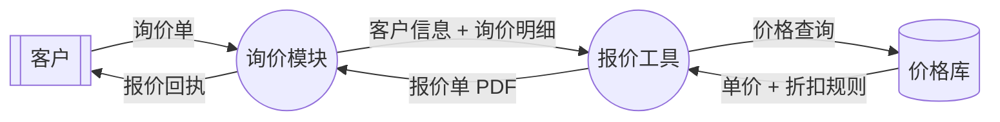
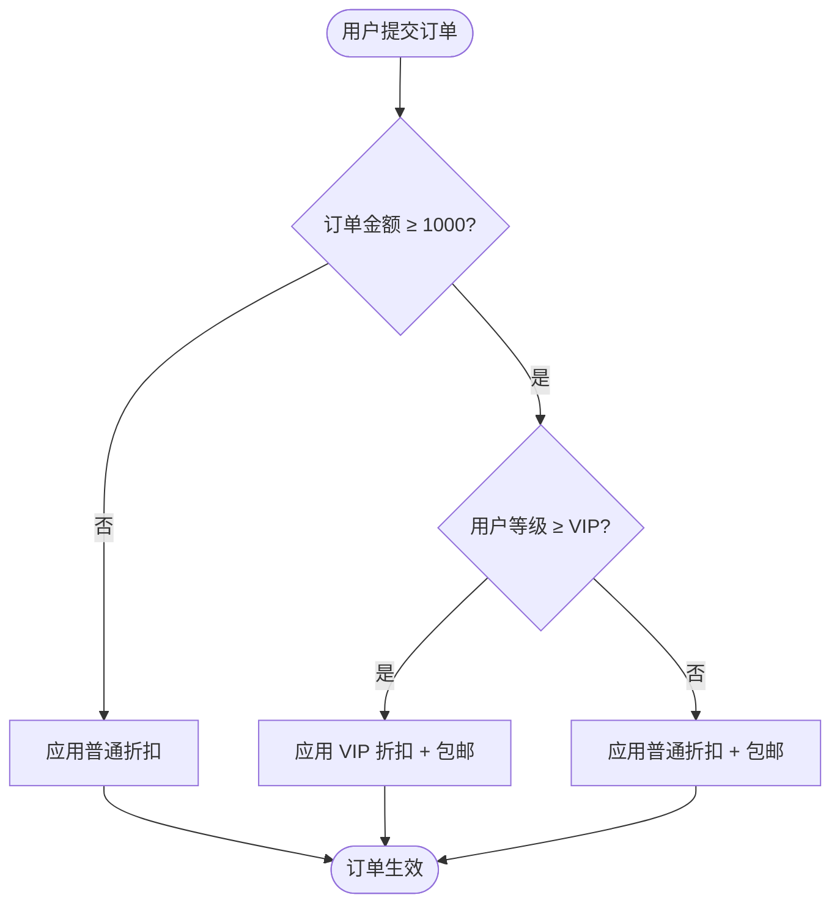
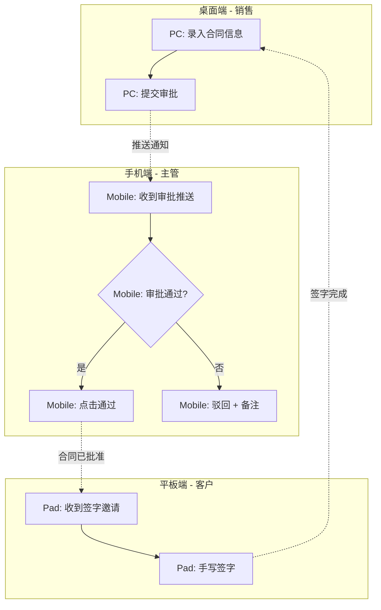

# 业务流程图选型规范（proto_business_flow_selection）

> **文件性质**：`[Recommended]` 决策路径集合（引导 PM 思考），非硬约束。业务流程边界 case 多 / 业务语境敏感，须 PM 判断 + 与产品总监确认。
>
> **适用阶段**：
> - 阶段 2 功能规划（业务流程图设计时按需对照）
> - 阶段 3 产品定义（状态机 / 异常分支 / UI 跳转流程设计时按需对照）
> - 阶段 4 PRD 实现（多端协作流程 / 触点跳转图选型时按需对照）
>
> **触发方式**：PM 在每个流程图设计时**按需 Read**。**不进**编排器派发 PM 的必读路径清单（避免每次派发都拉全文增加 token 成本）。
>
> **机械兜底**：本文件 `[Should]` 配套 `precheck_stage2/3/4.py check_business_flow_diagrams` WARN 档校验（仅校"图类型 vs 章节匹配"+ "终态节点完整性"+ "判断节点全覆盖"等可机械化项；选型决策本身因业务语境敏感无法机械化校验，PM 自觉对照 + Supervisor 审核兜底）。
>
> **SSOT 真源声明**：本文件是 PM 业务流程图选型决策的 SSOT 主源（SSOT 双锚 #70）。派生：`tmpl_功能规划.md §二` / `tmpl_产品定义.md §5.5 / §8 / §11` / `AI产品经理_Agent.md` 阶段 2/3/4 自审清单 / `precheck_stage2/3/4 check_business_flow_diagrams`。调整方向：先改本文件 → 下游派生层重派同步；禁反向。

---

## 元规则

`[Must]` **决策路径的写法纪律**（每个新增小节必须满足）：
- 含 Q1/Q2/Q3 引导问题（按权重从高到低）
- 含各选项与适用场景对照
- 含端差异表（若与端相关）
- 含反例 / false positive（已知边界 case）
- **不写**"硬约束规则"（如 `[Must] 必须用 X`）—— 不符合本文件性质；硬约束在 `tmpl_*.md` / `rule_hard_constraints.md` 真源处声明

`[Should]` **新增决策路径触发条件**：
- 同类流程图选型问题在不同项目 / 调整意见中**累计出现 ≥ 3 次**
- 或产品总监明确要求沉淀

`[Recommended]` **本文件膨胀阈值**：行数超过 600 行或主题 ≥ 8 个时，按主题拆分子文件（如 `proto_business_flow_dfd.md` / `proto_business_flow_state_machine.md`）。

---

## 一、流程图类型选择 — 10 类全集矩阵 + 决策树

### 10 类流程图矩阵

| # | 类型 | mermaid 语法 | 主用阶段 | 典型场景 | 强度 |
|---|------|------------|---------|---------|------|
| 1 | **用户旅程 Journey** | `journey` / 阶段表 | 阶段 1 | 用户首次使用 / 完整跨场景路径 | `[Should]` |
| 2 | **业务流程 Business Flow** | `flowchart TD` | 阶段 2 | 单角色完整业务路径（创建订单 / 报价生成）| `[Must]` |
| 3 | **跨角色泳道 Swim Lane** | `sequenceDiagram` | 阶段 2 | 多角色协作（销售 + 客户 + 系统）| `[Must]` |
| 4 | **状态机 State Machine** | `stateDiagram-v2` | 阶段 3 | 实体状态生命周期（订单 / 笔记 / 任务）| `[Must]` |
| 5 | **时序图 Sequence** | `sequenceDiagram` | 阶段 2-3 | 系统间精确请求响应时序（API 调用链）| `[Should]` |
| 6 | **DFD 数据流图** | `flowchart LR` | 阶段 1-3 | 跨系统数据流（询价模块 → 报价工具 → CRM）| `[Should]` |
| 7 | **决策树 Decision Tree** | `flowchart TD` | 阶段 2-4 | 业务规则分支密集（资格审核 / 路由策略）| `[Recommended]` |
| 8 | **UI 跳转图 Page Flow** | `flowchart TD` | 阶段 3 | 页面路由与跳转关系 | `[Should]` |
| 9 | **异常 / 兜底流程 Error Flow** | `flowchart TD` | 阶段 3 | 异常路径分支（网络异常 / 权限异常）| `[Must]` |
| 10 | **多端协作流程 Cross-Device Flow** | `flowchart TD` 含 swimlane 注 | 阶段 2-4 | 同一业务跨多端衔接（PC 录入 → 手机审批）| `[Should]` |

### 决策路径

```
Q1 [权重最高] 这是什么阶段的流程？
   阶段 1 体验视角 → 用户旅程 Journey
   阶段 2 业务路径 → 进 Q2
   阶段 3 实体生命周期 / 异常 / UI 跳转 → 进 Q3
   阶段 4 触点交互 → 进 Q4

Q2 阶段 2 业务路径：参与方？
   单角色完整路径(单方操作)        → 业务流程 flowchart TD
   多角色协作 / 跨系统交互        → 跨角色泳道 sequenceDiagram
   含精确请求响应时序(API / 异步)→ 时序图 sequenceDiagram(+ 时间轴注)
   含跨系统数据流(模块间数据传递)→ DFD flowchart LR(数据视角)
   业务规则分支密集(≥ 4 条 if-else)→ 决策树 flowchart TD

Q3 阶段 3：流程对象？
   实体状态变化 → 状态机 stateDiagram-v2
   页面跳转    → UI 跳转图 flowchart TD
   异常分支    → 异常 / 兜底流程 flowchart TD(从主流程引出)

Q4 阶段 4 触点交互流程？
   单端触点跳转 → UI 跳转图 flowchart TD
   多端协作衔接 → 多端协作流程 flowchart TD + swimlane 注

Q5 业务流程 vs 跨角色泳道 vs 时序图 vs DFD 边界模糊？
   → 详见 §四「时序图 vs 跨角色泳道辨析」
   → 详见 §二「DFD 数据流图规范」
```

### 端差异

流程图本身跨端通用（mermaid 渲染），但**多端协作流程**（# 10）含端衔接节点，详 §五。

### 反例（已知 false positive）

- 单角色简单流程被强行画成跨角色泳道 → **应业务流程 flowchart TD**（无多角色协作硬性需求时泳道过重）
- 系统间数据流转被画成业务流程 → **应 DFD**（重点在数据流，不在角色操作）
- 状态机变化被画成业务流程 → **应 stateDiagram-v2**（状态切换条件 + 切换权限是核心）
- 异常分支塞进主流程 flowchart → **应抽离为独立异常流程**（主流程节点 > 30 时混入异常视觉爆炸）
- 业务规则 4+ 条 if-else 用文字描述 → **应决策树**（视觉化分支减轻 PM 撰写 + Supervisor 审核负担）

---

## 二、DFD 数据流图规范（P0 缺口补全）

### 适用场景

`[Should]` 以下场景**推荐使用 DFD** 替代或补充业务流程图：

- 阶段 1：跨系统数据流梳理（如询价模块如何把客户信息传递给报价工具）
- 阶段 2：模块间数据依赖（如阶段 2 §三模块依赖关系表的视觉化补充）
- 阶段 3：数据字段跨实体流转（订单 → 物流 → 售后的数据传递）

### DFD 节点类型

| 节点 | mermaid 形状 | 语义 |
|------|------------|------|
| **外部实体** External Entity | `[[ ]]` 矩形 / `>>` 标识 | 系统边界外的数据源 / 数据宿（用户 / 第三方系统）|
| **过程** Process | `(( ))` 圆角 / `( )` | 数据加工节点（如「报价计算」「订单审核」）|
| **数据存储** Data Store | `[( )]` 圆柱 | 数据持久化节点（数据库 / 文件 / 缓存）|
| **数据流** Data Flow | `-->` 含标签 | 数据传递方向 + 数据内容 |

### DFD 模板



### 决策路径

```
Q1 [权重最高] 流程的关注点是？
   角色操作链路        → 业务流程 flowchart TD（非 DFD）
   数据流转 + 加工      → DFD flowchart LR
   两者并重            → 主图 DFD + 角色注释 / 拆分两张图

Q2 涉及几个系统？
   单系统内部数据流转   → DFD 罕用，flowchart TD 即可
   跨系统(≥ 2 系统)     → DFD 优选

Q3 数据存储节点 ≥ 1？
   是 → DFD 必含数据存储节点 [( )]
   否 → 简化版 DFD（仅 Process + External + Data Flow）
```

### 反例（已知 false positive）

- 单系统内业务流程画 DFD → **过重**（应 flowchart TD）
- DFD 含「点击按钮」「弹出 toast」UI 操作节点 → **混淆**（DFD 不含 UI 操作，UI 交互归触点交互卡 / UI 跳转图）
- 数据流箭头无标签（不写「客户信息」「订单 ID」）→ **失去 DFD 价值**（DFD 核心是"流的是什么"）
- 外部实体与过程节点形状混用 → **语义不清**（必严格遵守节点类型对应形状）

---

## 三、决策树规范（P0 缺口补全 — 产品总监明确诉求）

### 适用场景

`[Recommended]` 以下场景**推荐使用决策树**替代文字描述：

- 业务规则含 ≥ 4 条 if-else 分支（如资格审核 / 路由策略 / 优惠匹配）
- 路径密集且需穷举所有分支（PM 写文字易遗漏分支，Supervisor 审核难定位漏点）
- 跨阶段引用频繁（阶段 2 业务规则 + 阶段 3 验收标准 + 阶段 4 触点交互均涉及同一决策逻辑）

### 决策树节点类型

| 节点 | mermaid 形状 | 语义 |
|------|------------|------|
| **入口** Entry | `([ ])` 圆角 | 决策起点（如「用户提交订单」）|
| **判断** Decision | `{ }` 菱形 | if-else 决策点（如「用户等级 ≥ VIP？」）|
| **过程** Action | `[ ]` 矩形 | 中间动作（如「应用 VIP 折扣」）|
| **终态** Terminal | `([ ])` 圆角 | 决策路径终止（如「订单生效」「拒绝订单」）|

### 决策树模板



### 决策路径

```
Q1 [权重最高] 业务规则分支密度？
   ≤ 3 条 if-else     → 文字描述 / 业务规则表即可
   4-10 条 if-else    → 决策树优选
   > 10 条            → 拆分为多个决策树 + 主索引图

Q2 分支是否完全穷举？
   是 → 决策树必含「兜底分支」(else 分支 / 异常出口)
   否 → 用判断节点 + 标注「待补充」(NB 上报)

Q3 决策路径终态？
   单一终态(全部回到一个出口) → 主流程嵌入即可
   多终态(成功 / 失败 / 重试)   → 必标注终态类型（视觉区分）
```

### 与异常 / 兜底流程的关系

决策树**兜底分支**与 §一 # 9 异常 / 兜底流程的边界：

- 决策树兜底分支 = **业务规则范围内的"否"分支**（如「VIP？否 → 普通折扣」），仍属业务正常路径
- 异常 / 兜底流程 = **系统级异常**（网络中断 / 权限不足 / 数据冲突），独立于业务决策

### 反例（已知 false positive）

- 决策节点无「否」分支 → **遗漏路径**（每个菱形必含 ≥ 2 分支）
- 决策树深度 > 5 层 → **过深**（拆分为子决策树 + 主索引）
- 用嵌套 if-else 代替决策树（文字累积 200 字）→ **应可视化**
- 决策树终态用箭头开放无 `([ ])` → **缺终态节点**（违反 mermaid 通用规则 1）

---

## 四、时序图 vs 跨角色泳道辨析（P1 含糊缺口）

### 现状问题

`tmpl_功能规划.md §二.2.2` 跨角色交互流程使用 `sequenceDiagram`，但 mermaid 中 `sequenceDiagram` 既可表达**跨角色泳道**也可表达**时序图**，PM 易混用 → 输出风格不稳定。

### 二者差异

| 维度 | **跨角色泳道**（# 3）| **时序图**（# 5）|
|------|---------------------|----------------|
| **关注点** | 角色协作链路 + 谁做什么 | 系统间精确请求响应时序 + 时间轴 |
| **典型场景** | 销售 + 客户 + 系统三方协作 | API 调用链（前端 → 后端 → DB → 缓存）|
| **参与方** | 业务角色（人 / 角色 + 系统）| 技术节点（前端 / 服务 / DB / 第三方）|
| **箭头语义** | `->>` 操作 / `-->>` 响应 | `->>` 请求 / `-->>` 响应（强调同步 / 异步）|
| **时间维度** | 弱（按 step 顺序）| 强（含等待 / 超时 / 异步标注）|
| **mermaid 语法** | `sequenceDiagram` + `participant 角色名` | `sequenceDiagram` + `participant 系统名` + `Note over` 时序注 |

### 决策路径

```
Q1 [权重最高] 主语是？
   业务角色(销售 / 客户 / 管理员) → 跨角色泳道
   技术系统(前端 / 后端 / DB)     → 时序图

Q2 是否含时序敏感约束？
   否(顺序无关 / 顺序由业务自然规定) → 跨角色泳道
   是(超时 / 异步 / 并发)            → 时序图 + Note 注

Q3 阶段定位？
   阶段 2 业务规划层 → 跨角色泳道优选
   阶段 3 产品定义层 → 时序图按需（API 调用链）

Q4 是否需要技术细节？
   否(纯业务交互)   → 跨角色泳道
   是(含状态码 / 重试) → 时序图
```

### 反例

- 阶段 2 业务规划画时序图（含 HTTP 200 / 401 / 503 状态码）→ **越界**（技术细节归阶段 3+ / 开发设计层）
- 阶段 3 跨系统 API 调用画跨角色泳道 → **过粗**（应时序图含精确请求响应）
- 跨角色泳道含「数据库读取」「Redis 写入」 → **混淆主语**（系统节点不应与业务角色并列）

---

## 五、多端协作流程规范（P1 缺口补全）

### 适用场景

`[Should]` 以下场景**推荐使用多端协作流程**：

- 同一业务跨 ≥ 2 端衔接（如 PC 录入合同 → 手机推送审批 → 平板签字确认）
- 阶段 2 多端产品的核心业务路径
- 阶段 4 PRD 多端触点交互的端衔接视觉化

### 多端协作节点类型

| 节点 | mermaid 标注 | 语义 |
|------|------------|------|
| **端容器** Device Container | subgraph 块 | 端边界（桌面 / 手机 / Pad / 小程序）|
| **触点** Touch Point | `[ ]` 含端前缀（如「PC: 创建合同」）| 端内操作节点 |
| **跨端衔接** Cross-Device Handoff | `--xx-->` 含数据标签 | 数据跨端传递（推送 / 同步 / 同账户）|
| **端等待** Wait Across Device | `Note` 注 | 跨端衔接的时间间隔（如「等待审批人查看」）|

### 多端协作流程模板



### 决策路径

```
Q1 [权重最高] 涉及几个端？
   单端                → 业务流程 flowchart TD
   2 端                → 多端协作（subgraph 2 块）
   ≥ 3 端              → 多端协作（subgraph N 块）+ 摘要图 + 子图拆分

Q2 跨端衔接性质？
   实时同步(同账户同时在线)   → 跨端衔接箭头 + 「实时同步」标签
   异步推送(消息 / 通知)       → 跨端衔接箭头 + 「推送」标签 + Note 等待标
   独立操作(无衔接 / 并行)     → 不画跨端协作（分独立流程图）

Q3 端衔接的数据载体？
   含数据(订单 ID / 文件 / 状态) → 衔接箭头必带数据标签
   仅信号(通知触发)              → 衔接箭头带「触发」标签 + Note 信号说明
```

### 端差异

| 端 | 流程图角色 | 典型衔接动作 |
|----|-----------|------------|
| 桌面 | 录入 / 审核中心 | 推送到 手机 / Pad / 小程序 |
| Pad | 展示 / 签字 / 演示 | 桌面同步 / 手机推送结果 |
| 手机 / H5 | 审批 / 接收 / 触发 | 推送到 桌面 / Pad / 小程序 |
| 小程序 | 客户触点 / 轻量操作 | 同步到 桌面 / Pad 跟进 |

### 反例

- 多端流程画成单流程 flowchart 不分 subgraph → **端边界不清**（应 subgraph 显式分端）
- 跨端衔接箭头无数据标签 → **失去衔接价值**（看不出传递什么）
- subgraph 内含多端节点（如 PC subgraph 内有「Mobile 推送」）→ **越界**（subgraph 须严格按端边界划分）
- ≥ 3 端塞一张图 → **视觉爆炸**（应拆为摘要图 + 子图 / 分多张）

---

## 反 pattern（常见错配速查）

| 错配 | 典型表现 | 应改为 |
|------|---------|--------|
| 单角色简单流程画跨角色泳道 | 泳道仅 1 个角色 | 业务流程 flowchart TD |
| 阶段 2 业务规划用时序图含技术状态码 | 出现 HTTP 200/401/503 | 跨角色泳道（去技术细节）|
| 实体状态变化画成业务流程 | flowchart 节点全是状态名 | 状态机 stateDiagram-v2 |
| 业务规则 ≥ 4 条 if-else 用文字描述 | 业务规则段落 ≥ 200 字 | 决策树 |
| DFD 含「点击按钮」「弹 toast」UI 操作 | UI 节点混入数据流 | 删除 UI 节点（UI 归触点卡）|
| 决策树菱形仅含「是」分支 | 「否」分支缺失 | 补全所有分支 + 兜底 |
| 异常分支塞主流程 flowchart | 主流程节点 > 30 | 抽离独立异常流程 |
| 多端流程无 subgraph 分端 | 节点端归属不清 | subgraph 按端划分 |
| 时序图无 Note 时序注 | 看不出超时 / 异步 | 加 Note over 时间标 |
| 跨端衔接箭头无数据标签 | 仅画箭头不写传递什么 | 加数据标签（如「订单 ID」）|

---

## 与既有规则的关系

| 既有规则 | 关系 |
|---------|------|
| `tmpl_需求分析.md §一 用户旅程` | 本文件 # 1 类型对应阶段 1 用户旅程；旅程具体模板在 tmpl_需求分析 |
| `tmpl_功能规划.md §二 业务流程图` | **真源 SSOT 双锚 #30**（含 2.1 主流程 / 2.2 跨角色 / 2.3 补充）；本文件是**选型指南**（# 2/# 3/# 5/# 6 选哪种），不重复 tmpl 规范正文 |
| `tmpl_产品定义.md §5.5 业务流程图` | 派生 SSOT #30（tmpl_功能规划 §二 复述视图）；本文件不重复 |
| `tmpl_产品定义.md §8 状态流转` | 本文件 # 4 类型对应；状态机模板真源在 tmpl_产品定义 §8 |
| `tmpl_产品定义.md §6 页面路由与跳转关系` | 本文件 # 8 类型对应；UI 跳转图模板真源在 tmpl_产品定义 §6 |
| `tmpl_产品定义.md §11 异常处理全景` | 本文件 # 9 类型对应；异常表真源在 tmpl_产品定义 §11，flowchart 视觉化由本文件指导 |
| `proto_cross_platform.md` / `proto_platform_*.md` | 本文件 # 10 多端协作流程指导**端衔接画法**；各端规范是端内细节真源 |
| `proto_data_display_selection.md` | 对偶文件（数据展示选型 vs 流程图选型）；二者协同构成 PM "选什么"决策路径全集 |
| `AI产品经理_Agent.md` 阶段 2/3/4 自审清单 | 派生：自审检查"流程图类型选型是否合理"+ "是否走对应阶段推荐类型"（不要求逐 Q1/Q2/Q3 走，仅自我提示）|
| `precheck_stage2/3/4.py check_business_flow_diagrams` | 派生：本文件 `[Should]` 机械化项（图类型 vs 章节匹配 + 终态完整 + 判断节点全覆盖）WARN 档 |

---

## 版本与变更

- v1.0 首版：10 类全集矩阵 + 5 大决策路径（DFD / 决策树 / 时序图 vs 跨角色泳道辨析 / 多端协作）+ 反 pattern + 元规则
- 后续累积到 8 个主题或 600 行时按主题拆分子文件
