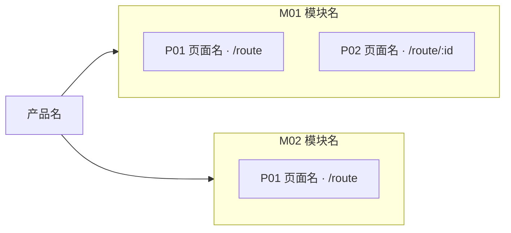
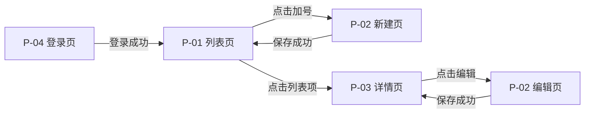
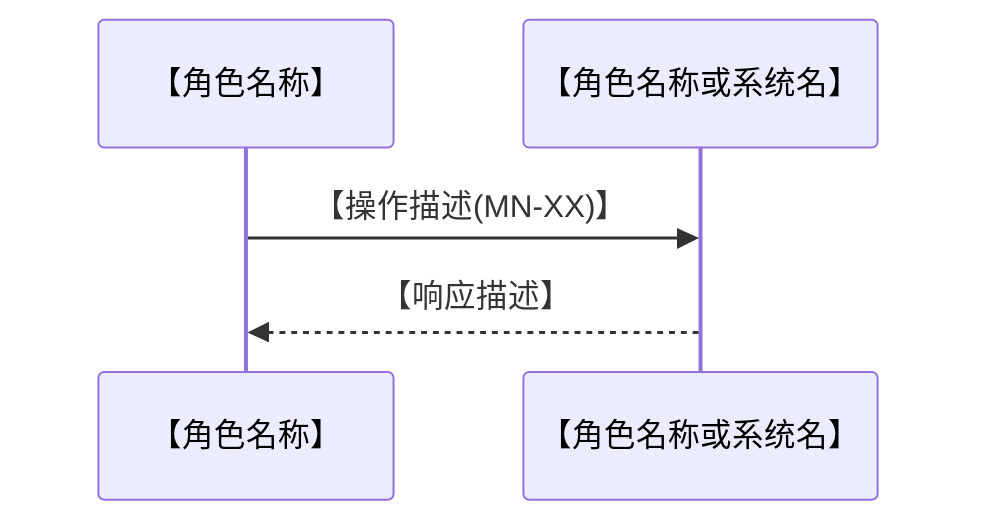

# spec.md 生成规范 v1.0

> **适用对象**：Claude PM Agent
> **读取时机**：生成 `spec_[产品名]_latest.md` 前必须完整读取
> **前置依赖**：本文件所有规则建立在 `proto_contract.md` 全局约束之上，两者必须同时传入
> **产出目标**：面向 UI Agent / 开发 Agent / 测试 Agent 的严格 Markdown 结构规格，无 HTML，无装饰性内容

---

## 一、文档整体结构

```
├── 区块 0：文档头
│   ├── 版本信息、日期、对应产品定义版本
│   ├── Agent 阅读指引
│   └── 全局编号说明
│
├── 区块 0.5：产品背景（[Must] 必须包含，不得省略）
│   ├── 问题陈述（谁、什么问题、为什么痛、用户证据）
│   ├── 用户画像（每个角色独立小节）
│   ├── 权限矩阵
│   ├── 用户旅程（主流程步骤表）
│   ├── 功能需求规格（每个 F-xxx 独立小节，含交互说明/业务规则/验收标准）
│   ├── 数据字段说明
│   ├── 异常处理全景
│   └── 非功能需求
│
├── 区块 1：页面流转总图
│   ├── 页面层级架构（§3.0，gen_scaffold/assemble 从 scaffold 派生，禁手写）
│   ├── 全量页面清单
│   ├── 核心流程跳转链路（Mermaid 流程图，每条流程单独呈现）
│   └── 页面跳转关系总表
│
├── 区块 2～N：各页面区块（按产品页面架构顺序）
│   ├── 页面标题行（编号、名称、路由、访问权限）
│   ├── 状态枚举表（所有状态 + 触发前提 + 互斥说明）
│   ├── 元素交互规范表
│   ├── 业务逻辑规则
│   ├── 触点总表（本页所有触点）
│   ├── 页面跳转表
│   ├── 状态清单与验收标准（Given-When-Then）
│   └── 本页新增组件（如有）
│
└── 区块 N+1：文档尾部
    ├── 全局交互规则
    ├── 组件状态库
    ├── 异常场景全景
    ├── 组件变更清单（本期 proj 组件的增/删/改/升级建议）
    ├── 非阻塞性问题清单
    └── 变更记录表
```

---

## `[Must]` 一（续）、区块 0.5 — 产品背景格式规范

spec.md 是面向 **UI Agent / 开发 Agent / 测试 Agent** 的完整产品规格文档，**不仅仅是页面交互描述**。区块 0.5「产品背景」须紧接文档头（区块 0）之后、页面流转总图之前输出，内容完整照搬自产品定义对应章节，不得精简或省略。

> **Agent 使用方式**：阅读指引（区块 0）中已标注哪些 Agent 需读区块 0.5——UI Agent 重点读用户画像，开发 Agent 重点读功能需求规格和数据字段，测试 Agent 重点读验收标准和异常处理全景。

### 格式模板

```markdown
---

## 产品背景

> 本区块内容来源于阶段3《产品定义》，完整保留以便各 Agent 理解业务上下文。

### 问题陈述（来源：§1）

| 维度 | 内容 |
|------|------|
| 谁有这个问题 | {内容} |
| 问题是什么 | {内容} |
| 为什么痛 | {内容} |
| 用户证据 | {引用真实数据或用户原话} |

**业务目标关联**：{OKR / 战略意义}
**为什么是现在**：{时机说明}

---

### 用户画像（来源：§3）

#### {角色名，例：普通用户}

| 属性 | 描述 |
|------|------|
| 典型用户 | {描述} |
| 核心诉求 | {描述} |
| 使用场景 | {描述} |
| 关键痛点 | {描述} |
| Jobs-to-be-done | {当…时，我想…，这样我就能…} |

<!-- 多角色重复以上格式 -->

---

### 权限矩阵（来源：§4）

| 功能点 | {角色1} | {角色2} | 未登录 |
|--------|---------|---------|--------|
| {功能点} | {✅/❌ 说明} | {权限} | {权限} |

---

### 用户旅程（来源：§5）

#### 旅程一：{旅程名}

| 步骤 | 页面 | 用户操作 | 系统响应 | 异常/边界情况 |
|------|------|----------|----------|--------------|
| 1 | P-xx | {操作} | {响应} | {处理} |

<!-- 多旅程重复 -->

---

### 功能需求规格（来源：§7）

> **`[Must]` F-xxx 节必填字段（SSOT #68 + #67）**：每个 F-xxx 节**必须**含以下 4 必填字段（顺序固定，缺一即 precheck FAIL）：
> 1. **优先级**：P0 / P1 / P2
> 2. **所属旅程**：旅程一 / 旅程二 / ...
> 3. **涉及页面**：P-XX, P-YY, ...（逗号分隔）
> 4. **主页面**：P-XX（**SSOT #68 显式字段**——本功能的主页面，必须 ∈「涉及页面」集合；副页面在 PRD C-4 仅渲染跳转链接，主页面渲染完整业务契约）
>
> **多页 F 注入策略**（SSOT #68）：
> - **主页面 C-4**：业务规则 + 数据规模 + 验收标准全量渲染
> - **副页面 C-4**：仅渲染「本页业务契约详见主页面 P-XX 主页面名」+ 跳转链接（`onclick="showSection('H-M[XX]-P[YY]-default')"`）
>
> **主页面识别真源**：本字段是 SSOT #68 唯一权威源；assemble.py `extract_main_page(spec_text, fid)` 解析此字段 → 决定 C-4 派生策略 + A-05 索引层跳转目标。
>
> **反 pattern**：①「主页面」字段缺失 → assemble 无法识别主页面，A-05 索引层跳转目标缺失 + C-4 派生失败 ②「主页面」值不 ∈「涉及页面」集合 → precheck FAIL ③ 多页 F 在 spec.md 内每页都全量重复业务规则 → 违反 SSOT 单源约束（F.2，SSOT #59）

#### F-001：{功能名}

**优先级**：P0　｜　**所属旅程**：旅程一　｜　**涉及页面**：P-02, P-03　｜　**主页面**：P-02

**交互说明**

| 元素 | 默认态 | 交互态 | 异常/禁用态 |
|------|--------|--------|------------|
| {元素} | {描述} | {描述} | {描述} |

**业务规则**

- {规则，含边界值}

**数据规模**：{单用户数据量 / 单次返回量 / 操作频率}

**验收标准**

```gherkin
场景一：{场景名}
  Given {前置条件}
  When  {用户操作}
  Then  {UI 层期望结果}
  And   {数据层验证}
```

<!-- 多功能重复 F-002、F-003 … -->

---

### 数据字段说明（来源：§9）

#### 实体：{实体名}

| 字段 | 业务含义 | 约束/说明 | 数据来源 |
|------|----------|-----------|---------|
| {字段} | {含义} | {约束} | {来源} |

---

### 异常处理全景（来源：§11）

| 场景类型 | 具体场景 | 触发条件 | 用户反馈 | 系统处理 |
|----------|----------|----------|----------|---------|
| {类型} | {场景} | {条件} | {反馈} | {处理} |

---

### 非功能需求（来源：§13）

**性能体验**

| 指标 | 目标值 | 测量条件 | 体验意图 |
|------|--------|---------|---------|
| {指标} | {目标} | {条件} | {意图} |

**兼容性**

| 平台 | 需支持范围 |
|------|-----------|
| {平台} | {范围} |

**可靠性**：{描述}

**安全与隐私**：{描述}
```

---

## 二、Agent 阅读指引（区块 0）

在 spec.md 文档头部写入以下指引表：

| Agent | 必读章节 | 可跳过 | 核心任务 |
|-------|---------|-------|---------|
| 🎨 UI Agent | **产品背景**（用户画像、用户旅程）、全局交互规则、各页面（元素交互列）、组件状态库、新增组件说明 | 非阻塞性问题清单、数据字段、非功能需求 | 输出高保真设计稿，所有组件状态须覆盖组件状态库 |
| ⚙️ 开发 Agent | **产品背景**（功能需求规格、数据字段、异常处理全景、非功能需求）、各页面（业务逻辑 + 触点总表）、页面跳转总表 | 组件状态库 | 实现页面逻辑、路由、状态控制、接口 |
| 🧪 测试 Agent | **产品背景**（验收标准、异常处理全景、非功能需求）、各页面（验收标准列）、页面跳转总表 | 组件状态库 | 覆盖每个状态、每条跳转路径、每条异常场景 |

---

## 三、页面流转总图（区块 1）

> **本章节定位**：spec.md 是面向 AI / 开发的最终交付物，本章节承担**两类工程视图**——①页面流转视图（基于产品定义 §6 页面路由 + §5 用户旅程派生）②业务流程图（基于阶段 2 功能规划 §二 迁入）。两类视图视角互补：流转视图回答"页面如何跳转"，业务流程图回答"系统/角色如何协作"。
>
> **`[Must]` SSOT 派生约束**：
> - §3.0 页面层级架构来源：**`process_record/tasks/scaffold.json modules[].pages[]`**（SSOT 双锚 #38 真源）；由 `assemble.py` 在 Step4 现场派生注入，**Foundation 与各 PM 一律禁手写本节**——Foundation 仅在区块1 顶写 `<!-- [SITEMAP-3.0] -->` marker 占位（不写内容）。调整方向：先改 scaffold（编号锁定下属正常派生），重跑 assemble 自动刷新；禁反向手改 spec。
> - §3.1 / §3.2 / §3.3 视图来源：产品定义阶段 3 §6 页面路由表 + §5 用户旅程
> - §3.4 业务流程图来源：**功能规划阶段 2 §二**（参 `pm-workflow/rules/tmpl_功能规划.md §二`）；**Foundation Agent 写 spec §三时**（阶段 4 子阶段二），将阶段 2 §二 的全部 mermaid 块迁入本节，**禁止凭空写新流程图**。派发链路：`pm-workflow/rules/agent_dispatch_protocol.md` Step 2 路径清单已含阶段 2 输出文件路径,Foundation 必读。调整方向：先改阶段 2 §二，再重派 Foundation 重渲染；禁止反向。
> - prd.html **必含 A-04.2 业务流程图 section**（工程视角,与 A-04 用户旅程的业务方视角**互补,不可互替**）;同样由 Foundation Agent 写,源同 spec §3.4（阶段 2 §二）,渲染规则见 `prd_expression_standard.md §A-04.2`。下游开发 / 测试 / 运维需以工程化视角理解业务,本 section 为其消费目标。

### 3.0 页面层级架构

> **定位**：全产品「模块 → 页面」两层结构总览，作为下游（开发 / 测试 / 设计）在深入逐页规格前的整体定位地图——回答"产品由哪些模块组成、各模块下有哪些页面、如何分组"。与 §3.1 扁平清单职责互补（§3.0 看分组层级，§3.1 逐页枚举路由/角色），与 §3.2 流转图互补（§3.0 看归属树，§3.2 看跳转流）。

> **`[Must]` 派生约束**：本节由 `assemble.py build_hierarchy_mermaid` 从 `scaffold.json modules[].pages[]` 现场派生（SSOT 双锚 #38），**禁止 Foundation / 任何 PM 凭空写或手改**。Foundation 写 spec 区块1 时，仅在区块1 顶部（§3.1 之前）写一行占位 marker `<!-- [SITEMAP-3.0] -->`，**§3.0 真实内容不写**；assemble.py 在 Step4 用 `<!-- [SITEMAP-3.0-START] -->...<!-- [SITEMAP-3.0-END] -->` 包裹块替换该 marker（重跑幂等）。粒度仅到页面级（状态已在侧栏三层导航 + §3.2 流转图覆盖，不在此重复）；**布局**：外层 `graph LR`（流向左→右、模块 subgraph 竖排）+ 每模块 subgraph 内 `direction TB`（页面竖排）——治本"同级横排挤压字号"痛点（2026-05-25 WE-LRTB，issue 2026-05-18/05-25 两次反馈根因 = mermaid TD/TB 同级横排反相关性）；统一按模块拆 subgraph（规模无关，原 > 40 阈值分支已废）。

派生产物形如（`graph LR` + 模块 subgraph 内 `direction TB`，节点 = 产品根 / 模块 / 页面带路由）：



机械兜底：`precheck_stage4` check①——spec 含 `### 3.0 页面层级架构` + 其 mermaid 中页面节点（`M\d+_P\d+`）数 == scaffold 全量 pages 数；缺失或数不对称即 FAIL 阻断 Step 7 自审。

#### 页面结构范式契约（提议2，SSOT 双锚 #39）

> **定位**：在并行派发模块 subagent 前，由 PM 在 scaffold 顶层定义「页面结构范式」（list / detail / form / wizard…），每页指派一个范式 id，作为 Step3/5 模块 subagent 的页面结构强约束，保证跨模块相似页面结构统一、整体交互连贯。本契约表由 `assemble.py build_archetype_contract_*` 从 `scaffold.json page_archetypes` 现场派生注入 §3.0 区块（与层级图 colocate），**禁止任何角色手改**。

**契约 schema（scaffold.json）**：

- 顶层 `page_archetypes[]`：范式**定义本体**，每条 `{id, name, regions:[{slot,hosts}], invariants:[], extension:[]}`——`regions` 是具名区域及其容纳什么，`invariants` 是结构不变量，`extension` 是声明的扩展位。每产品定义一次、被多页共用。
- `modules[].pages[].archetype`：**薄引用**，必 ∈ `page_archetypes[].id`。多页引用同一 id = 强制套同一结构契约。

**`[Must]` Step3 / Step5 subagent 容纳性二值校验 SOP**（填/绘每页前强制前置）：

1. 从 scaffold 现场读本页 `archetype` → 解析对应 `page_archetypes` 定义（**不依赖任何预烘焙副本**，H1=(c) 按引用消费）。
2. 枚举本页**强制元素**——分步定义（H3）：
   - **Step3 Spec**：输入 = 本页 scaffold `states` + 产品定义对应功能点（触点本步才产出，不计入）。
   - **Step5 PRD**：输入 = 本页**完整 spec 草稿**（状态枚举 + 触点表 + 字段绑定，触点已由 Step3 产出）。
3. 逐强制元素核对：范式 `regions` slot 或 `extension` 扩展位是否能容纳、且不破坏 `invariants`。
4. **二值判定**：
   - **PASS**（每个强制元素都有归属）→ 严格照范式结构填/绘，**零自由度**（"我想换布局更好"是偏好、不构成偏离理由，必须服从）。
   - **FAIL**（任一强制元素既无 slot 也无可用 extension）→ **不填/不绘该页**，产出结构化冲突报告，**仅阻塞该页**、继续本模块其他页，回报编排器。
5. 无论 PASS/FAIL，每页一行**定长记录**写入本模块子进度文件 `process_record/progress/stage4_[产品名]_M[XX]_plan.md` 的 `## 页面结构容纳性校验记录` 段。

**`[Must]` 定长记录格式**（precheck S4-30 check③ 据此校验"做没做"+覆盖全页）：

```markdown
## 页面结构容纳性校验记录

| 页面 | archetype | 结论 | 冲突元素 / 说明 |
|------|-----------|------|----------------|
| M01-P01 | list | PASS | — |
| M01-P02 | detail | FAIL | 强制元素「批量导出」无 slot；建议 detail 范式 extension 加 bulk-export |
```

- 每页恰一行；「结论」列严格 ∈ `{PASS, FAIL}`；FAIL 行「冲突元素/说明」必填具体元素 + 最小修正建议。

**`[Must]` 冲突回报与范式增殖纪律（路径 i / ii）**：FAIL 回报后由编排器复用 SSOT #31 NB 上报 SOP 走**自然语言路径 B** 派 PM 改 `scaffold.page_archetypes`：

- **路径 i（优先）**：缺陷是该范式的系统性结构问题 → **改共享范式定义**（加 region/extension/调 invariant），所有引用该范式的页同时受益；须广播受影响并行模块复核。
- **路径 ii（限定）**：仅当该页**确属独立结构类型** → 新建一个范式 + 把该页指针改指新范式。**严禁"每遇冲突就新建范式"**——范式增殖会把"跨模块统一"稀释回去（提议2 初衷落空）。Step1.X Supervisor 审核增殖合理性。
- 改完重派 Step1.X 复审修订后契约 → 受影响模块重派 Step3/5 → 必重跑 Step4/6 assemble 自然刷新契约表；**禁重跑 gen_scaffold**；非编号变更不升 /changeRequest（与 owner_assignments 路径 B 先例同构）。

**机械兜底与债诚实声明（A+C，SSOT #39 行）**：

- **结构层 A 级**：`gen_scaffold.validate_v2_schema`（首次闸：page_archetypes 必备键 + archetype 引用不悬空）+ `precheck_stage4.check_page_archetype_contract`（Step6.5 恒跑承接，因 post-Foundation 不再重跑 gen_scaffold）。
- **过程层 A 级**：`precheck_stage4.check_archetype_containment_record`——校验定长记录每页齐全+覆盖（"二值校验做没做"机械化，同 SSOT #35 手法）。
- **判断层 B 组（低优挂账）**：每条容纳判断"对不对"**不可脚本化**——靠 Step1.X Supervisor + 终审 + subagent 二值闸三道非脚本门。**不做**事后启发式 precheck（违 `workflow_maintenance_protocol §dry-run 纪律` FP≥30% 禁上线 + NB-LIT-25-B 教训）。偿还触发见 `ssot_anchors.md #39`。

#### 模块架构说明（提议3，SSOT 双锚 #40）

> **定位**：回答"本产品由哪些模块组成、各模块负责什么、谁依赖谁"——补齐 §3.0 页面层级图（结构树）与 §3.4 业务流程图（系统协作）之外的**模块组成与依赖视图**。下游开发/测试读 spec 即得模块组成，无需回溯阶段 2。

> **`[Must]` 派生约束**：本块由 `assemble.py build_module_arch_md` 从 `scaffold.json modules[]`（`name` / **可选** `purpose` / `depends_on`）现场派生（SSOT #40），**禁手改**；与 §3.0 页面层级图、提议2 页面结构范式契约 **colocate** 于同一 §3.0 区块（`assemble.py` 在层级图、契约后追加）。`purpose` 为可选字段——缺省时职责列回退 `—`（不阻断）。改 scaffold 后重跑 `assemble.py spec`+`prd` 刷新；禁反向手改 outputs。lineage：阶段 2 §三 → 阶段 3 §6.5 复述 → PM 子阶段一构建 scaffold.modules → 本块。

派生产物 = 模块表（模块 / 名称 / 职责 / 依赖 kind→目标模块）+ 模块依赖 `graph TB` mermaid（节点=模块，边=depends_on；Item 3 方向 LR→TB，竖向堆叠省宽）。

机械兜底：`precheck_stage4 check_module_architecture`（S4-31）——spec §3.0 + PRD spec-sitemap 含「模块架构说明」+ 模块表行数 == scaffold.modules 数 + 依赖边数 == 全 depends_on 条目数；缺失/数不对称即 FAIL。**全数对称、无判断层 → SSOT #40 干净 A 组 5/5**。

### 3.1 全量页面清单

| 页面编号 | 页面名称 | 路由地址 | 访问角色 | 状态数量 |
|---------|---------|---------|---------|---------|
| P-01 | 列表页 | /notes | 登录用户 | 6 |
| P-02 | 新建/编辑页 | /notes/edit | 登录用户 | 10 |

### 3.2 核心流程 Mermaid 图

每条核心用户流程独立一个 `flowchart LR` 代码块（**视角：页面流转**——节点为页面 P-XX，边为跳转触发条件）：



**节点类型约定**：

| 类型 | Mermaid 语法 | 适用场景 |
|------|-------------|---------|
| 普通页面 | `[P01 页面名称]` | 独立路由页面 |
| 弹窗/抽屉 | `(P05c 组件名称)` | 覆盖在页面上的浮层 |
| 条件分支 | `{条件判断?}` | 流程分叉节点 |
| 外部页面 | `{{P12 外部页面}}` | 无需登录的公开页面 |

### 3.3 跳转关系总表

| 来源页面 | 触发操作 | 跳转目标 | 跳转条件 | 携带参数 | 失败处理 |
|---------|---------|---------|---------|---------|---------|
| P-01 列表页 | 点击「+」 | P-02 新建页 | 已登录 + 当日 < 500 条 | 无 | 未登录→P-04；达上限→Toast |

**要求**：穷举所有页面间跳转（含边缘路径），产品定义中用户旅程和页面路由为主要来源。

### 3.4 业务流程图（来源：阶段 2 §二）

> **视角**：工程契约——回答"系统/角色如何协作、判断分支如何走、状态如何流转"。**消费者**：开发（实现工程逻辑时核对系统行为）。
>
> **`[Must]` 来源约束**：本节**全部 mermaid 块直接迁入自** `outputs/功能规划_[产品名]_latest.md §二`，包含其下全部子节（2.1 主流程总览 / 2.2 跨角色交互流程 / 2.3 补充流程）。**执行者：Foundation Agent**（阶段 4 子阶段二,见 `pm-workflow/rules/agent_dispatch_protocol.md` Step 2 + AI产品经理_Agent.md 子阶段二任务清单）。禁止 Foundation 凭空新增或删改阶段 2 已有的流程图——如需调整，回到阶段 2 §二 修订后，再重派 Foundation。
>
> **`[Must]` 完整性约束**：阶段 2 §二 中每一张 mermaid 图（无论 `flowchart TD` / `sequenceDiagram` / `stateDiagram-v2`）均须迁入本节，按原标题层级（2.1/2.2/2.3）保留，**不得只迁主流程而省略跨角色交互或补充流程**。

#### 3.4.1 主流程总览（必有，对应阶段 2 §2.1）

```mermaid
flowchart TD
    Start([【入口描述】]) --> A{【第一个决策点】}
    A -->|【分支条件一】| B[【操作节点(MN-XX)】]
    A -->|【分支条件二】| C[【操作节点】]
    B --> End([【终态】])
    C --> End
```

#### 3.4.2 跨角色交互流程（条件必有，对应阶段 2 §2.2）

> 阶段 2 §二2.2 存在时迁入；不存在时本节删除。



#### 3.4.3 补充流程（按需，对应阶段 2 §2.3）

> 阶段 2 §二2.3 存在时按子节迁入；不存在时本节删除。

```mermaid
flowchart TD
    Enter([【触发条件】]) --> A[【操作节点(MN-XX)】]
    A --> B{【判断】}
    B -->|【条件一】| End([【终态】])
    B -->|【条件二】| End
```

**通用格式约束**（与阶段 2 §二 头部"流程图通用格式规则"完全一致，迁入后不变）：每条路径末端有终态 `([文字])`；每个菱形 `{}` 节点的所有分支均有出口条件标注；流程中涉及具体功能操作时节点描述内用括号标注子功能编号（如 `草稿冲突检查(M2-20)`）；不得有孤岛节点。

---

## 三.5、单模块 spec 草稿章节标准（v2.0 — 由 gen_scaffold 生成骨架）

> **【v2.0 重大变更】**：模块 spec 草稿（`process_record/drafts/spec_M[XX]_draft.md`）的章节结构由 `gen_scaffold.py` 在 Step 1.5 **预生成固定骨架**；Step 3 模块 Spec PM **在固定占位填空**，禁止改章节顺序 / 标题 / 删除子章节。
>
> **目的**：消除"不同模块产出不同结构"的不一致风险——多模块项目中 N 个 PM 产出 N 份结构一致的草稿，下游 assemble.py / Supervisor / 人类阅读体验统一。
>
> **`[Must]` 正文禁内联变更标记（SSOT #79 / S4-68）**：spec 草稿正文**禁**写内联变更 / 过程标记——`【vN.N 新增】`/`【历史留痕…】` 等方括号，及含 `CR-NNNN`/`议题 #N`/`SSOT #N`/`调整意见` 的圆括号。变更历史只走**变更记录表 + git**，**查版本差异用 `git diff`**，泄漏进正文影响下游阅读。schema 标记（`【触发态】【组件】【区域】【字段回显】【业务定位】`…）+ 派生溯源 `（来源：…）` + workflow 信号 `【✅ PM 自审完成…】`（check_submit_marker 强制）不在此列。`precheck_stage1/2/3/4` 各 `check_no_inline_change_markers` WARN；定位用 `strip_inline_change_markers.py`（只读报告，删除 PM 手动做）。详 `rule_hard_constraints.md §六 S4-68`。

### 单模块草稿固定章节（顺序与标题不可变）

```markdown
# spec — M[XX] [模块名]（草稿）

## S2.M[XX] 模块概述
[业务定位 / 关键路由 / 核心角色 / 与产品定义 §7 功能映射]

## S2.M[XX].1 页面概述
[逐页一块（gen_scaffold 预生成）：`**P[XX] 页面名** · 路由 · 状态数` 锚行 + 交互意图段 + per-page 骨架槽（SSOT #41，WE-H **override-only**：纯注释 marker，默认页复用其 `archetype` 的范式骨架——范式骨架单源在 `spec_foundation_draft.md`「## 范式骨架」由 Foundation 子阶段二填，详 §四「页面结构（骨架屏）」；仅本页确无法套范式才在 marker 下新增 ```skeleton 覆盖块）；页面清单已由 scaffold 锁定]

## S2.M[XX].2 状态枚举
[预填表：scaffold 中本模块全部状态；PM 补全「触发条件」「主要差异」列]

## S2.M[XX].3 触点表
[ID 格式 M[XX]-P[XX]-T[NN]，弹窗用 D 替换 T；含触发动作 + 系统响应]

## S2.M[XX].4 数据字段绑定
[每页面表单元素的字段名 + 绑定 spec §9 字段；纯展示元素免填]

## S2.M[XX].4B 业务规则（SSOT #68 — C-4 业务契约派生真源）
[按页面分组撰写本模块每页业务规则（含边界值）；assemble.extract_business_rules → C-4.A]

## S2.M[XX].5 跨模块跳转引用
[预填表：本模块 scaffold.depends_on 全部条目；PM 补全跳转触发条件 / 携带参数 / 返回行为]

## S2.M[XX].5B 数据规模（SSOT #68 — C-4 业务契约派生真源）
[按页面分组撰写本模块每页数据规模三维度：单用户数据量 / 单次返回量 / 操作频率；assemble.extract_data_scale → C-4.B]

## S2.M[XX].6 API 摘要（详 产品定义 §10）
[预填段头（gen_scaffold）；PM 按本模块涉及 API 编号补全表格——`API 编号 / 端点摘要 / 触发场景 / 真源引用` 4 列；模块**无 API 涉及**时本段可省略；详 SSOT #61 升级后 §三.5 §S2.M[XX].6 [Should] 规范]

> **v2.0 .6 异常路径已由 SSOT #61 升级撤销**（2026-06-01）：模块级异常路径合并到 §S5 异常场景全景（文档尾部 Foundation 子阶段二在 `spec_foundation_draft.md` 撰写）；.6 编号空间复用为 API 摘要 [Should] 子段。
```

### PM 子阶段三的工作约束

- **禁止**改章节顺序、标题、删除子章节、增加非标准章节
- 章节标题之间的"占位提示文字"（`[Spec Agent 填...]` / `[业务定位...]`）写完真实内容后**直接覆盖**，不保留占位文字
- 跨章节引用使用预分配的 spec_id / prd_id，不自造 ID
- **页面结构范式（提议2，SSOT #39）按引用消费**：本页 `archetype` 与 `page_archetypes` 定义**现场从 scaffold.json 读取**（gen_scaffold **不**把 archetype 注入草稿——不预烘焙，H1=(c)），填本节前须按 §3.0「页面结构范式契约」SOP 完成容纳性二值校验并写定长记录入本模块子进度文件
- assemble.py spec 拼装后整体进入 outputs/spec_*_latest.md 的「区块 2~N」对应位置（详见 §四）

### 子章节内部细则（SSOT #61 spec 章节完整度纪律，2026-06-01 落地）

> **背景**：v2.0 §三.5 模块草稿章节原仅含 4 个子块（.1-.5 / .6 异常路径），但 §四「各页面区块格式」定义的 8 个子块多数未在 §三.5 实例化（元素交互/业务逻辑/Gherkin/本页组件/per-page 骨架）；尾部 §五/§六/§七 章节规范保留但 v2.0 未明示如何拼接 → 实际产物常缺失。SSOT #61 在 §三.5 补 5 个子块（.2A / .3A / .6 / .7 / .8）+ 多列回归（互斥/平台/渲染元素）+ "主要差异"→"页面表现" 重命名 + 页面概述强制 5 维分点 + 尾部 §五/§六/§七 由 Foundation 子阶段二填入 spec_foundation_draft.md（与 S0/S0.5/S1 同模式 assemble 自然拼接）。

- **`[Must]` S2.M[XX].1 页面概述强制 5 维分点（SSOT #61，治"散文化失去快速扫读"反 pattern）**：gen_scaffold 逐页预生成 `- **P[XX] 页面名** · 路由 \`…\` · 共 N 个状态` 锚行后，PM 按下方 5 维白名单分点撰写（每维一行 bullet，全段 ≤ 250 字；散文堆叠 ≥ 500 字 → Supervisor §4.4 抽查 WARN）：
  1. **【业务定位】**（1-2 句）：本页在产品旅程中的位置 + 核心角色
  2. **【页面区域构成】**（按 archetype regions 列点）：顶部 / 主区 / 侧栏 / 底部各装什么
  3. **【核心交互链路】**（按步骤）：用户进入 → 关键操作 → 离开的顺序
  4. **【跨平台关键差异】**（如有）：phone vs desktop 布局/交互不同点；无差异写"phone/desktop 一致"
  5. **【跨模块关联】**（如有）：本页入口来自哪些模块 + 本页出口到哪些模块；无关联写"无"
  - **`[Must]` 锚行格式不可改**（`assemble.extract_spec_skeletons` 按 `**P[XX] …**` 锚行映射 override skeleton→页面）。**默认页复用其 `archetype` 的范式骨架（单源 = `spec_foundation_draft.md`「## 范式骨架」由 Foundation 子阶段二填，gen_scaffold 据 `scaffold.page_archetypes` 预生成 ~N 占位），PM 无需在 .1 逐页填骨架**；仅当本页 2D 排布确无法套范式（罕见，PM 判断）才在该页 marker 下新增 ```skeleton 覆盖块（首行恒为固定免责注释字面不可改、`data-r` 须 ⊆ 本页 archetype 的 `regions[].slot ∪ extension`，precheck S4-32 校验）。骨架块撰写细则详 §四「页面结构（骨架屏）」
- **`[Must]` S2.M[XX].2 状态枚举（SSOT #61 多列回归）**：表头由 gen_scaffold 预填 `| 页面 | 状态名 | 触发条件 | 是否互斥 | 平台 | 页面表现 | prd_id |`（7 列）；PM 补全「触发条件」「是否互斥」「平台」「页面表现」四列：
  - **「是否互斥」列**（v2.0 砍后 SSOT #61 回归）：写 `与 SXX/SXX 互斥` / `与 SXX 可叠加` / `独立` 之一；UI Agent 状态机的核心信息
  - **「平台」列**（SSOT #61 新增可选列）：默认 `agnostic`（多平台一致）；phone-only/desktop-only 帧填具体平台标识（`phone` / `desktop` / `tablet` / `h5` / `mp`）
  - **「页面表现」列**（原"主要差异"，SSOT #61 重命名 — 治"对比基线无定义被迫填外观描述"反 pattern）：按 4 元素白名单结构化展开：`【区域】xxx + 【组件】xxx + 【字段回显】xxx + 【触发态】xxx`；default 行填该状态自身的页面表现，非"与什么的差异"
- **`[Must]` S2.M[XX].2A 元素交互细则（SSOT #61 新增，治"spec/prd 内容不一致"维度 1 根因）**：表头 `| 元素 | 组件类型 | 默认态 | 交互态 | 异常/禁用态 | 触发条件 |`；PM 把 PRD 详细交互卡（含组件类型 / 字段回显 / 触发态）的内容反哺回 spec — 每页 ≥ 1 行
- **`[Must]` S2.M[XX].3 触点表（SSOT #61 平台列回归 + T/D 语义明示）**：表头 `| 触点 ID | 所在状态 | 元素 | 触发动作 | 系统响应 | 适用平台 |`（6 列）；触点 ID 编号空间 = `{mod_id}-P[XX]-T01..T[NN]` 或 `D01..D[NN]`：
  - **T = Trigger**（交互触发：按钮点击 / 跳转 / 输入提交 等用户主动行为）
  - **D = Data display**（数据回显：字段绑定展示 / 状态切换显示等系统被动表达）
  - **「适用平台」列**：默认 `all`（所有平台）；platform-only 触点填 `phone-only` / `desktop-only` 等
- **`[Should]` S2.M[XX].3A 本模块页面跳转表（SSOT #61 新增 — 治"v2.0 砍 §四 .5 后跳转散落触点行"反 pattern）**：表头 `| 触发操作 | 跳转目标（prd_id）| 跳转条件 | 携带参数 |` — 本模块**内**页面跳转矩阵，让测试 Agent 一眼获取本模块跳转链路；跨模块跳转仍由 .5 承载
- **`[Must]` S2.M[XX].4 数据字段绑定（SSOT #61 渲染元素列回归）**：表头 `| 页面 | 字段名 | 类型 | 来源（spec §9）| 必填 | prd 渲染元素 | prd 属性 |`（7 列）；字段名必须与 spec.md §9 全文严格一致（详见硬规则 S4-21）；「prd 渲染元素」/「prd 属性」两列让 spec 阅读者直接看到字段在 PRD 哪个组件
- **`[Must]` S2.M[XX].4B 业务规则（SSOT #68 — C-4 业务契约派生真源）**：按**页面**分组撰写本模块每页的业务规则，格式：

  ```markdown
  #### P[XX] 页面名

  - {规则一，含边界值，如「单用户最多保存 50 条」}
  - {规则二}

  #### P[YY] 页面名

  - {规则三}
  ```

  - **派生路径**：`assemble.py extract_business_rules(spec_text, mid, pid)` 解析本节按页面分组的 markdown 列表 → 注入 PRD interaction-card C-4.A
  - **必填**：每个**主页面**（spec.md F-xxx 节「主页面：P-xx」字段指向的页）至少有一条业务规则；纯展示页 / 无业务规则页明示「本页无业务规则」
  - **反 pattern**：①写抽象描述（如「按业务需求处理」），规则必须可机械校验 ②业务规则下沉到 .2A 元素交互细则段（应留在 .4B 集中承载），妨碍派生提取 ③主页面缺业务规则（C-4 派生为空，违反 SSOT #68）
- **`[Must]` S2.M[XX].5 跨模块跳转引用**：每条 `- 依赖 [模块id]（kind: [section_jump|...]）→ target: [...]` 已由 gen_scaffold 从 scaffold.depends_on 预填；PM 在每条下展开补"跳转触发条件 / 携带参数 / 返回行为"
- **`[Must]` S2.M[XX].5B 数据规模（SSOT #68 — C-4 业务契约派生真源）**：按**页面**分组撰写本模块每页的数据规模，三维度（单用户数据量 / 单次返回量 / 操作频率），格式：

  ```markdown
  #### P[XX] 页面名

  - 单用户数据量：{N}
  - 单次返回量：{N}
  - 操作频率：{N}

  #### P[YY] 页面名

  - 单用户数据量：—（纯展示页）
  - 单次返回量：—
  - 操作频率：—
  ```

  - **派生路径**：`assemble.py extract_data_scale(spec_text, mid, pid)` 解析本节按页面分组的 markdown 列表 → 注入 PRD interaction-card C-4.B
  - **三维度统一**：开发 Agent 据此评估接口分页 / 缓存 / 限流策略；任一维度无对应填 `—`
  - **必填**：每个**主页面**三维度齐全；纯展示页 / 非数据驱动页三维度全填 `—` 并明示「本页无数据规模」
  - **反 pattern**：①散文化描述（如「数据量较大」），缺乏量化数字 ②与 .4B 业务规则混写（应分段，业务规则归 .4B / 数据规模归 .5B）③**[Must] 值内多项列举禁用 ` / ` 分隔**（与 assemble `_split_data_scale` 多 dim 分隔启发式冲突致 c4-data-scale 派生退化为单列「说明」回退；issue #8 NB-WE-2A-R2-01 真因）：值内 ≥ 2 个并列项一律用 **`；` / `、` / `，`**（如 `销售人员典型 3-10 次/天/项目（创建后回看；编辑业主信息；跳转材料清单或 H5）`），**禁** `（创建后回看 / 编辑业主信息 / 跳转材料清单或 H5）`；单 dim 一行 bullet `- {维度}：{值}` 不动 ④**[Should] 单行多 dim** 不推荐用 `dim1：v1 / dim2：v2`，推荐每 dim 独立 bullet 行（与第 ③ 条本质同源 — 都是 ` / ` 在 PM 写源既承担分项又承担分维度的歧义根因）
- **`[Should]` S2.M[XX].6 API 摘要（SSOT #61 新增可选段，治"开发 Agent 需绕回产品定义"反 pattern）**：格式 `### API 摘要（详 产品定义 §10 API-MX-YY~ZZ）`，列出本模块涉及的 API 编号清单（无 API 则该段省略）；开发 Agent 拿 spec 即可知本模块 API 集合
- **`[Must]` S2.M[XX].7 状态清单与验收标准 Gherkin（SSOT #61 新增 — 从 §四 .7 回迁，治"测试 Agent 缺验收契约"反 pattern）**：每状态一段，含「互斥说明」「触发条件」「页面表现」「验收标准」4 子项；验收标准用 Gherkin 三段式 `Given/When/Then(+And)`
- **`[Should]` S2.M[XX].8 本页新增组件（SSOT #61 新增 — 从 §四 .8 回迁）**：仅当本页含**未在 pub 库**的 proj 组件时填；表头 `| 组件 ID | 组件名 | 触发场景 | 关键视觉差异 |`

### 单模块草稿与 §四「各页面区块格式」的关系

- §四（下一节）是 spec.md **整体结构**中的"各页面区块"格式（P-{ID} 节，每个页面一节）——v2.0 中 §四多数 per-page 子块**不被机械实例化为独立 `### P-{ID}` 节**，而是映射进 §三.5 固定章节：状态枚举表→`.2` / 触点总表→`.3` / 数据字段绑定→`.4` / 页面跳转→`.5`
- §三.5（本节）是 spec.md 模块**草稿层**的章节结构（`drafts/spec_M[XX]_draft.md`），由 gen_scaffold 机械生成、PM 占位填空——这是 v2.0 的**实现真相**
- assemble.py spec 拼装时按 scaffold modules 顺序追加各模块草稿；最终 spec.md 的"各页面区块"由各模块草稿的内容自然承载（无单独"P-{ID}" 标题分割）
- **`[Must]` §四↔§三.5 对齐（骨架屏部分，WE-H per-archetype 重设 2026-05-19）**：§四「页面结构（骨架屏，SSOT #41）」颗粒度 = **per-archetype**，其实现落脚 = `spec_foundation_draft.md`「## 范式骨架」内每范式 `- **<aid> 范式名**` 锚行下 ```skeleton 块（gen_scaffold 据 `scaffold.page_archetypes` 预生成，Foundation 子阶段二填）；§三.5 `S2.M[XX].1` 的 per-page 槽是 **override-only 纯注释 marker**（默认复用范式骨架，罕见 override 才填 ```skeleton）。读 §四 撰写规范、范式骨架按 `spec_foundation_draft.md` 落笔、override 按 §三.5 `.1` marker 落笔——二者描述同一物，不得分叉。
- **`[Must]` §五/§六/§七 文档尾部章节落地（SSOT #61，2026-06-01 落地——治 NB-WE-05 漂移）**：§五全局交互规则 / §六组件状态库 / §七异常场景全景 三段由 **Foundation Agent 子阶段二** 在 `drafts/spec_foundation_draft.md` 末尾**追加** `## S3 全局交互规则` / `## S4 组件状态库` / `## S5 异常场景全景` 三段（与 S0/S0.5/S1 同模式），内容按 §五/§六/§七 各自模板撰写（§六组件状态库可 Read `bujue-design-system/fb-fallback-manifest.md` 各组件 §3.x 状态描述按需复用 + 本产品 proj 组件状态）。assemble.py 拼接 modules 草稿后自然带这三段（无需新增派生逻辑）。**`[Must]` PM 自审清单 §5.4 SSOT #61 自审段核查这三段非空 + 包含产品定义 §11/§13 关键映射**。

### `[Must]` 反 pattern（SSOT #66 precheck_stage4 5 函数机械化兜底，2026-06-03 落地）

> **治本路径**：SSOT #61 落地后 PM 写 spec 仍存在 5 类规范↔实施漂移；SSOT #66 在 SSOT #61 文档级三层（规范 + PM 自审 + Foundation 落地）基础上补 5 个 precheck_stage4 函数机械化兜底，dry-run 3 仓 FP = 0% 验收上线，均 WARN 阶段（按 S4-28 v3 纪律待 ≥ 2 仓真实 PM 反馈 + FP < 30% 后升 FAIL）。

| 反 pattern | 触发场景 | precheck 检测 | 命中示例（2026-06-03 dry-run）|
|------------|---------|--------------|----------------------|
| ❌ 模块子块漏写 | PM 偷懒跳过 .2A / .3A 等 SSOT #61 必填子块 | `check_spec_module_subsections_completeness` (S4-44) | 报价工具 .6 全缺（治 .6 撞号根因）+ .8 6/10 部分缺 |
| ❌ Gherkin 4 子项缺失 | PM 在 .7 段写状态条目但漏「互斥说明 / 触发条件 / 页面表现 / 验收标准」或缺 ```gherkin 围栏 / 缺 Given/When/Then 三段 | `check_spec_gherkin_completeness` (S4-45) | 私域主页 60/114 状态缺 Gherkin 完整度要素（真违规暴露）|
| ❌ API 引用占位字面 | PM 写 API-M10-XX / API-TBD 等占位未替换实际编号 | `check_spec_api_id_closure` (S4-46) | 报价工具 9/60 占位（API-M10-XX, API-M2-XX 等）|
| ❌ NB 引用孤儿 | PM 自定义 NB 命名（如 NB-PM-Areflow-A）但未在 decisions_ledger / scaffold.notes / §S0.5 登记 | `check_spec_nb_id_closure` (S4-47) | 报价工具 5/7 业务 NB 漏闭环 |
| ❌ 模块编号跳号 / 子段无父 | PM 删模块后未重编号 / 写 .2A 但缺父 .2 | `check_spec_section_numbering_consistency` (S4-48) | dry-run 3 仓未命中（基线良好）|

**.6 撞号修复**（2026-06-03 WE-1 同步落地，治"PM 看到 §三.5 .6 撞号两个都不写"根因）：v2.0 顶层 `.6 异常路径`（L409）与 SSOT #61 升级 `.6 API 摘要`（L444）三方不同步（含 gen_scaffold.py L1168）— 已统一为 `.6 = API 摘要 [Should]`（异常路径合并到 §S5 异常场景全景，与「§五/§六/§七 文档尾部章节落地」一致）；同步修复 `gen_scaffold.py L1168` 模块骨架预生成。

**启发式豁免**：①spec 顶层无 `^## S2\.M\d+` 段头 → 旧版 spec（SSOT #61 升级前），5 函数全部跳过；②`NB-WE-*` / `NB-LIT-*` / `NB-SSOT*` / `NB-SNB*` 等 L2 工作流 NB 前缀启发式豁免（S4-47）；③产品定义文件不存在（阶段 4 前置）→ S4-46 跳过。

---

## 四、各页面区块格式（区块 2～N）

每个页面独立一节，格式固定：

```markdown
---

### P-{ID}：{页面名称}

**路由**：`/路径`　｜　**对应功能**：F-xxx　｜　**访问权限**：{角色}　｜　**类型**：新增/改版

#### 状态枚举表

| 状态 ID | 状态名称 | 触发前提 | 是否互斥 | 对应帧 |
|--------|---------|---------|---------|-------|
| S01 | 默认态（有数据） | 接口返回非空 | 与 S02/S03 互斥 | 帧1 |
| S02 | 空态 | 接口返回空数据 | 与 S01/S03 互斥 | 帧2 |
| S03 | 加载失败态 | 接口超时/网络错误 | 与 S01/S02 互斥 | 帧3 |
| S04 | 角色差异态（管理员） | 当前用户为管理员 | 可与 S01 叠加 | 帧4 |

#### 页面结构（骨架屏，SSOT 双锚 #41）

> **定位（WE-H 重设 2026-05-19，per-archetype + 条件 per-page override）**：以**单源 HTML 骨架片段**表达**平面布局**——回答"这类页面分哪几个区、各区相对位置/占比/装什么"。**#41 = #39 的视觉化身**：颗粒度 = **per-archetype**（一个 `page_archetypes` 范式画一个代表性骨架，被所有引用该范式的页复用），**非 per-page**（原始构想即"一类页面一个骨架、页面架构章节统一说明"——WE-A→WE-G 误优化成 per-page，本批回正）。取代原 ASCII 树（ASCII 只表达容纳层级、无法表达 2D 空间与占比）。**同一片段双渲染**：spec.md §3.0「#### 范式骨架」子节（Markdown 原文，供 AI/开发按结构解析）；prd.html 由 `assemble.py` 注入 spec-sitemap `<div id="sk-askel">` 范式骨架画廊、靠 `.sk-*` 色块 CSS 渲染。
>
> **`[Must]` 骨架屏不是组件层级 / 不是实现 DOM 依据**：骨架屏仅示意**平面布局**。页面的**组件容纳权威**仍归 `page_archetypes`（SSOT #39）`regions/invariants`；下游 UI/开发 Agent **禁止**把骨架屏的 div 嵌套当作组件树或 DOM 实现契约。每个骨架块**首行强制免责注释**（缺失即 precheck S4-32 WARN——档 C WARN 阶段，存量产物迁移完升 FAIL）。
>
> **`[Must]` 撰写者与单源（per-archetype）**：由 **Foundation Agent 子阶段二**在 `drafts/spec_foundation_draft.md` 的 **`## 范式骨架`** 段内、各 `- **<archetype_id> 范式名**` 锚行下的 ```skeleton 占位处**按范式逐个**撰写（gen_scaffold 据 `scaffold.page_archetypes` 预生成 ~N 占位 + 锚行；Foundation 仅替换占位内容——一次定义、所有引用该范式的页复用；§3.0/archetype 内容本就此时产 + Step1.X 审）。本片段是该范式平面布局的**唯一源**；`assemble.build_archetype_skeleton_md/_html` 据 `- **<aid>**` 锚 → `scaffold.page_archetypes[].id` 白名单映射，派生注入 spec.md §3.0「#### 范式骨架」子节（#39 契约表后，子决策B 独立子节）+ PRD spec-sitemap `<div id="sk-askel">`（每范式 `<div id="sk-askel-<aid>">` 子锚）。调整方向：先改 `spec_foundation_draft.md`「## 范式骨架」、重跑 `assemble.py spec`+`prd` 刷新；禁反向手改 outputs。
>
> **`[Must]` 散文段「2D 平面布局意图 / 区域职责说明」是真源的一部分**：每个 `- **<aid> 范式名**` 锚行下到首个 ```skeleton 围栏之间的**散文段**（gen_scaffold 预生成的 `[Foundation 填：本范式代表性 2D 平面布局意图 / 区域职责说明]` 占位由 Foundation 子阶段二替换为实际业务文字说明）是该范式的**业务语义文字说明**，与 ```skeleton 块**同属范式真源**。`assemble.build_archetype_skeleton_md/_html` 在派生注入 spec §3.0 + PRD sk-askel 双源时，**会把散文段一并渲染**在范式标题下、骨架块上方（spec 侧 Markdown 原文 / PRD 侧 `<p>` 段落带基础 markdown→HTML 转换：`**bold**` → `<strong>`、`` `code` `` → `<code>`、双换行 → 段落、单换行 → `<br>`）。Foundation 漏填散文 → 派生层完全无文字说明 → 下游 PM/Supervisor/产品总监无法理解范式语义；草稿层文字段已饱满但派生层不注入 = 同型缺陷。Foundation 写散文段时建议：①开头一句明示范式定位（"承载 R-XX 在 X 场景的 X 表达"）②列举本范式 regions 区域职责 + extension 扩展位语义 ③承接关键 NB 决策（如 admin-progress-pipeline 含 NB-247 invariants）④跨端发散范式可显式说明 desktop/phone 差异化意图。空 `[Foundation 填：…]` 占位会被 `extract_archetype_skeletons` 在散文段提取时自动剔除（不误注入）；非空散文段必转发到派生层。
>
> **`[Must]` 条件 per-page override（罕见）**：默认页**复用其 `archetype` 的范式骨架**（**零 per-page 撰写**——模块草稿 `S2.M[XX].1` 的 per-page 槽是纯注释 marker，非活动围栏，PM 无需逐页填）。**仅当某页 2D 排布确无法套用其范式骨架**（罕见；同 #39 容纳判断属判断层、不机械化）时，Step3 Spec subagent 才在该页 marker 下**新增**一个 ```skeleton 覆盖块（格式同范式骨架）。`assemble.extract_spec_skeletons` 仅对**有 override 围栏**的页 fire（无围栏 = 复用范式 = 不提取、不 FAIL——杜绝"每页必填"压力 / SNB-006 redux）；override 页帧旁渲该骨架 + 「页面专属骨架（覆盖范式 X）」distinct 标记，非 override 页帧旁仅渲轻量「结构范式」chip 深链中央 `sk-askel-<aid>`（详 `prd_expression_standard.md §A-09`）。

**`[Must]` 骨架块格式（紧凑白名单，archetype 范式骨架 与 per-page override 共用；违反即 precheck S4-32 WARN——档 C WARN 阶段，存量迁移完升 FAIL）**：

````markdown
```skeleton
<!-- 平面布局示意，非组件层级/非实现 DOM 依据；容纳权威归 page_archetypes(#39) -->
<div class="sk-page">
  <div class="sk-region" data-r="topbar" data-h="48">顶部导航栏 · 返回/标题/操作</div>
  <div class="sk-row">
    <div class="sk-region" data-r="sidebar" data-w="20">侧栏 · 分类树</div>
    <div class="sk-region" data-r="main" data-w="80">内容区 · 列表（可滚动）</div>
  </div>
  <div class="sk-region" data-r="footer" data-h="56">底部固定区 · 主操作</div>
</div>
```
````

- **围栏**：必须 ` ```skeleton ` info-string（Markdown 渲染为代码块，AI 读原文；precheck 据此 marker 定位）。
- **`[Must]` 条件 per-platform（WE-G，archetype 级复用）**：`#41` 价值 = 2D 排布+占比（相对 #39 区域清单的增量），而 2D 排布**跨产品平台实质发散**（同范式 phone 竖叠+底导 vs desktop 侧栏+多列）。规则（archetype 范式骨架 与 per-page override 均适用）：
  - **默认单块** ` ```skeleton `（platform-agnostic，应用引用本范式的全部平台帧）——单端产品 / 布局跨端稳定范式用此。
  - **跨端发散范式**：将单块替换为**多个** ` ```skeleton:{frame} ` 块，`frame ∈ {phone, desktop, tablet, h5, mp}`（对齐帧 class 根：phone-frame/desktop-frame/tablet-frame/h5-frame/miniprogram-frame）。
  - **一范式内 EITHER 1 个 agnostic OR ≥1 个 per-platform，不混用**（杜绝歧义；混用 / 非法 frame token → precheck S4-32 WARN）。
  - **1-vs-N 是 Foundation 按"布局是否实质发散"的判断**——非机械强制（与 #39 容纳判断同属判断层，不做事后启发式 FP 误报，详 S4-32「为何不机械化 1-vs-N」+ `agent_methodology §七` 同族对称）。仅"排布/占比真不同"才拆 per-platform；区域增减优先回 #39 archetype（archetype 是平台无关的容纳契约）。
  - PRD 渲染：范式骨架在 `<div id="sk-askel">` 画廊内 1 或 N 块**堆叠**渲染，per-platform 块前置平台小标题（📱 APP / 🖥 桌面 Web / …）；override 页帧旁同理。详 `prd_expression_standard.md §A-09`。
- **首行**：每块（含每个 per-platform 块）首行必须为上述固定免责注释（字面一致，S4-32 校验）。
- **允许标签白名单**：仅 `<div>`；`class` ∈ `{sk-page, sk-row, sk-col, sk-region}`；属性仅 `data-r`（区域键）/ `data-w`（`sk-row`/`sk-col` 子项相对占比%，同级和≈100）/ `data-h`（高度示意 px）；文本仅短标签（区域名 ≤ 12 字 + 可选「· 关键内容」提示）。**禁**其他标签 / 真实组件标签 / inline style / 真实文案 / 嵌套 > 3 层。
- **`[Must]` `data-r` 值必 ⊆ 该 archetype 的 `page_archetypes[].regions[].slot`（或 `extension` 扩展位）**——骨架屏是 #39 契约的**符合性视图**，不得引入契约外区域（范式骨架据其 `<aid>`、per-page override 据本页 `archetype` 反向解析 `page_archetypes` 校验子集关系；precheck S4-32；#39 仍为容纳权威）。
- **token 纪律**：纯布局，无真实文案，紧凑类名而非 verbose inline style——单范式骨架应 ≈ 数百 token 量级；全产品 ~N 范式（N≪页数）总量远小于旧 per-page。
- **`[Should]` phone/h5/mp 端默认竖向 stack**：移动端 portrait 视口窄宽,布局以**垂直堆叠**为主——直接把 `<div class="sk-region">` 作为 `.sk-page` 子元素即可（`.sk-page` CSS `flex-direction: column` 已默认竖向），**无需用 `.sk-row` 横向分组**。仅当 desktop / tablet 横屏需多列侧栏+主区时才用 `.sk-row` 横向分组。渲染层配套：assemble 据 ` ```skeleton:{phone|h5|mp} ` info-string 包 `.sk-platform-<plat>` wrapper，CSS 自动把 `.sk-page` 收窄至窄宽 portrait（详 `prd_expression_standard.md §A-09` 区域 A `.sk-platform-*` CSS）——reviewer 一眼看出 phone 几何与 desktop 区分。

#### 元素交互规范

| 元素 | 默认态 | 交互态 | 异常/禁用态 | 触发条件 |
|------|--------|--------|------------|---------|
| {元素名} | {描述} | {描述} | {描述} | {条件} |

#### 业务逻辑规则

- **{规则名}**：{具体描述，包含边界值}

#### 数据字段绑定表（来源：产品定义 §9）

> **强制**：本表是 spec ↔ prd 字段绑定的唯一规范源（S4-21）。本页每个表单元素 / 数据展示字段必须在此登记，PRD Agent 据此设置 `<input name="..." />` / `<span data-field="..." />` 属性。

| 字段 id | 业务含义 | 数据类型 | 约束 | 来源 §9 | prd 渲染元素 | prd 属性 |
|--------|---------|---------|------|---------|------------|---------|
| feedback_text | 反馈正文 | string | required, maxlength=500 | §9.f1 | `<textarea>` | `name="feedback_text"` |
| contact_info | 联系方式 | string | optional, maxlength=50 | §9.f2 | `<input>` | `name="contact_info"` |

字段 id **必须**与产品定义 §9 数据字段表中字段名严格一致（区分大小写）；PRD 中表单元素的 `name` / `data-field` 属性值取此列字段 id（precheck S4-21 机械核查）。

#### 触点总表

| 触点 ID | 操作对象 | 触发方式 | 行为描述 | 系统反馈 | 跳转目标 | 边缘情况 |
|--------|---------|---------|---------|---------|---------|---------|
| M01-P01-T01 | {按钮名} | 点击 | {行为} | {反馈} | H-M02-P01-default | {边缘} |

> **跳转目标格式约束**（与 `proto_contract.md §四` 一致）：
> - **同模块跳转**：用本模块的 `prd_id`（`H-M[XX]-P[XX]-[状态名]`），与 prd.html `<section id="...">` 保持一致
> - **跨模块跳转**：用目标模块的 `prd_id`（任务卡「跨模块技术契约」预分配的全量 ID 表中查得）
> - **不允许**用 `M01-P02` 这种页面级 ID（缺少状态名）或 `#spec-M02-P01` 这种 spec 级锚点
> - PRD Agent 在 prd.html `interaction-card` 中按 `data-target="prd_id"` 或 `onclick="showSection('prd_id')"` 落地
> - precheck `check_prd` 自动核查 `showSection` 全部目标可解析；此处约定让 spec 与 prd 共享同一编号体系

#### 页面跳转

| 触发操作 | 跳转目标（prd_id）| 跳转条件 | 携带参数 |
|---------|---------|---------|---------|
| 点击{操作} | H-M[XX]-P[XX]-[状态名] | {条件} | {参数} |

#### 状态清单与验收标准

**S01：默认态**
- 互斥说明：与 S02、S03 互斥
- 触发条件：{描述}
- 页面表现：{描述每个元素的状态}
- 验收标准：
  ```gherkin
  Given {前置条件}
  When  {用户操作}
  Then  {UI 层期望结果}
  And   {数据层验证}
  ```

#### 本页新增组件（如有）

| 状态 ID | 状态名称 | 触发前提 | 关键视觉差异 |
|--------|---------|---------|------------|
| C01 | 正常态 | {条件} | {描述} |
```

### §四.9 父级系统容器层规约（[Should]，2026-06-02 治"模块上下文表达缺失"反 pattern）

`[Should]` 本模块若是**父级系统的子模块**（即与其他兄弟模块并列于同一父级系统下，模块自身不构成独立产品），spec 模块概述段（§S2.M[XX] 模块概述 / .1 页面概述）必须明示「父级系统容器层」段，至少包含 2 维度：

#### §四.9.1 桌面端父级容器层

- **sidebar 父导航上下文**：列父级系统下 N 个兄弟模块入口 + 当前模块在 sidebar 中高亮的视觉表达约定
- **承载约定**：sidebar 属父级系统容器层，**不属本模块 prd 业务范围**（不在本模块设计范围内绘制 sidebar 完整规约），但**模块入口需在 prd 帧中可视化呈现**，便于 reviewer 识别本模块在父级系统中的归属位置

#### §四.9.2 移动端（app / h5 / mp）父级容器层

- **navbar 父导航上下文**：按 SSOT #53 navbar v2 7 variant + S4-35 `fb-nav-back` 配置 `data-variant="detail"` + 返回按钮
- **承载约定**：`fb-nav-back` 的 `onclick` 占位指向"返回父级上一层"语义；具体返回目标（如父级系统首页 / 模块列表页）属父级容器层，**不在本模块 prd 业务范围**绘制

#### §四.9.3 非父级子模块场景豁免

如本模块**非父级系统子模块**（即独立产品 / 独立路由树根 / 自身就是父级系统），spec 模块概述段可显式声明：

```
[父级系统容器层] N/A — 本模块为独立产品 / 独立路由树根
```

#### §四.9.4 任务卡（task_M[XX]_*.md）配套字段

`[Should]` 任务卡模板增加字段「父级系统容器层归属」，声明本模块在父级系统中的位置 + 兄弟模块清单 + 上一级 navbar 返回目标语义。如本模块非父级子模块，此字段可声明「N/A 独立产品」。

#### §四.9.5 反 pattern 警示

- ❌ spec 写本模块为父级系统子模块但**未明示**父级容器层 → reviewer 无法识别本模块在父级系统中的归属（sidebar 兄弟模块 / app navbar 返回到上一级）
- ❌ spec 在本模块 prd 范围内**完整绘制**父级 sidebar / navbar 规约（越界承载 — sidebar/navbar 属父级容器层非本模块业务范围）
- ❌ 移动端 `fb-nav-back` 的 `onclick` 占位指向本模块某页（语义错位 — `fb-nav-back` 应指返回父级上一层非本模块内导航）

#### §四.9.6 与 SSOT #58 D 方案 + SSOT #61 §三.5 .1 协同

- **SSOT #58 §十二.3 多节点流程统一入口** = 操作入口克制（与本节正交）
- **SSOT #61 §三.5 .1「跨模块关联」5 维分点** = spec 章节落点描述本模块入口出口
- **本 §四.9** = 父级系统容器层规约（提供"父级容器层归属"判定方法论）
- 三者协同：本节定父级容器层约定 + SSOT #61 描述本模块入口出口 + SSOT #58 控制操作入口克制

---

## 五、全局交互规则（文档尾部）

```markdown
### 导航行为
- 返回按钮：始终返回上一个历史页面，无历史时返回首页
- 底部导航栏：在所有一级页面显示，二级及以上页面隐藏

### 全局反馈规则
- Toast：移动端底部居中，桌面端左下角；成功 2 秒，错误 3 秒，含撤销操作 4 秒
- 加载 > 300ms：显示骨架屏；> 10s：显示超时错误态
- 所有写操作按钮：点击后立即进入 Loading 态，防止重复提交

### 全局异常规则
- 网络断开：Toast「网络异常，请检查连接」，保留当前页面状态
- 登录态失效（401）：弹窗提示，用户确认后跳转登录页，登录成功返回原页面
- 无权限（403）：Toast「无权限执行该操作」，不跳转页面
- 服务器异常（5xx）：Toast「服务繁忙，请稍后重试」

### 表单全局规则
- 校验时机：字段失焦触发单字段校验；点击提交触发全量校验
- 错误展示：字段边框变 `var(--fb-error)` + 字段下方红色提示文字（12px）
- 提交中：禁用所有输入（opacity 0.6），按钮显示 Loading
- 表单保留：网络请求失败时，表单数据不自动清空
```

---

## 六、组件状态库（文档尾部）

描述本产品中出现的所有通用组件及完整状态，UI Agent 直接以此为设计输入：

```markdown
### {组件名，例：文本输入框（单行）}

| 状态 | 视觉描述 | 触发条件 | 交互行为 |
|------|---------|---------|---------|
| 默认态 | 边框 `var(--fb-border-2)`，占位文字 `var(--fb-text-hint)` | 页面加载 | 点击进入聚焦态 |
| 聚焦态 | 边框 `var(--fb-border-2)` 加粗 2px，光标显示 | 用户点击或 Tab 聚焦 | 移动端键盘弹起 |
| 填写态 | 边框加粗，文字 `var(--fb-text-primary)` | 用户输入内容后 | 失焦触发单字段校验 |
| 错误态 | 边框 `var(--fb-error)`，字段下方 `var(--fb-error)` 提示文字 | 校验失败 | 再次输入后错误消失 |
| 禁用态 | 背景 `var(--fb-bg-2)`，文字 `var(--fb-text-hint)`，不可点击 | 条件不满足 | 无交互响应 |
```

---

## 七、异常场景全景（文档尾部）

| # | 异常类型 | 具体场景 | 触发页面 | 触发条件 | 用户感知 | 元素变化 | 可用操作 |
|---|---------|---------|---------|---------|---------|---------|---------|
| E-01 | 网络异常 | 列表加载失败 | P-01 | 接口超时，无缓存 | 错误态插图 + 「加载失败」 | 内容区替换为错误态 | 「重新加载」按钮 |
| E-02 | 网络异常 | 保存失败 | P-02 | 保存接口失败 | Toast「保存失败，已缓存本地」 | 「保存」按钮恢复可点击 | 手动重试 |

---

## 八、组件变更清单（文档尾部，强制章节）

本节列本期阶段 4 涉及的 **proj 组件**变更（含建议升级 proj→pub），供下游设计/前端团队拿到 PRD 时可一目了然「本期组件相比上一版的所有变化」。

### 格式

```markdown
## 组件变更清单

### 新增（NEW）

> **`[Must]` 表格 ID 字面规则**：本节 4 张子表「组件 ID」「替代组件」列一律**裸写**（不加反引号）。理由与适用范围见 `proj_component_protocol.md §二.1` 顶部「表格 ID 字面规则」段；「组件说明锚点」列内 `proj-component-{name}` 是 HTML section id（非 proj 组件 id），保留反引号示意。

| 组件 ID | 派生原因 | 使用页面 | 组件说明锚点 |
|---------|---------|---------|-----------|
| proj.L2.product-card | A 跨模块复用（M02/M03/M07）+ D1 字段缺口 | M02-P01, M03-P03, M07-P10 | `proj-component-product-card` |

> **字段说明**：
> - **派生原因**：必以 `A` / `B` / `A+B` 开头（SSOT #8 双触发,A=跨模块复用 / B=能力缺口 D1-D5）— 仅「新增」段使用,其他段已有"修改描述/弃用原因/建议原因"
> - **使用页面**：
>   - 推荐格式 `M{XX}-P{YY}`（具体页面,如 `M02-P01, M03-P03`），用逗号或斜杠分隔
>   - 兼容格式：纯模块级 `M{XX}`（如 `M02, M03`），assemble.py 兜底取该模块 scaffold 首页面
>   - assemble.py 自动转 `onclick="showSection('H-M{XX}-P{YY}-default')"` 跳转，方便读者从 changelog 直接跳到使用页面查看组件实际渲染
> - **组件说明锚点**：值为 `proj-component-{name}`（指向 §7.1 组件说明集中容器内的 section id）；assemble.py 自动转 `onclick="showSection('proj-component-{name}')"` 跳转

### 修改（UPDATE）

| 组件 ID | 修改类型 | 修改描述 | 上一版本 | 本版本 | 影响页面 |
|---------|--------|---------|---------|--------|---------|
| proj.L2.product-card | 字段扩展 | 新增「促销标签」slot | v1.0 | v1.1 | M02-P01, M03-P03 |

### 弃用（DEPRECATED）

> **边缘场景**：当组件做大重构（API 不兼容、视觉完全重做、字段集合大变）时，**保留旧组件 + 标"已弃用" + 添加新组件指针**；不直接删除，给下游 audit trail。

| 组件 ID | 弃用版本 | 弃用原因 | 替代组件 |
|---------|--------|---------|---------|
| proj.L2.product-card-legacy | v1.0 | 字段架构与新业务流程不兼容，重构为新组件 | proj.L2.product-card-v2 |

### 建议升级 proj → pub（PROMOTE-SUGGESTION）

> 本期识别到的 proj 组件，**建议下游设计/前端团队**评估是否纳入公司 pub 组件库（fallback 批次或正式 pub 库）。

| 组件 ID | 建议原因 | 当前使用项目数 | 复用价值评估 |
|---------|---------|--------------|------------|
| proj.L2.product-card | 当前已在 M02/M03/M07 复用 3 次，且字段在多电商类产品中通用 | 3 | 高（建议升级 pub.L2.product-card 加入 fallback 批次 6+）|

### 本期无组件变更（占位）

若本期既无新增、也无修改、无弃用、无升级建议，则填写：

> 本期无 proj 组件变更（fallback 已完全覆盖业务需求）。
```

### 字段说明

| 字段 | 取值 |
|------|------|
| 组件 ID | 严格按 `proj_component_protocol.md §六.1` 命名约定（`proj.L{tier}.{kebab-case-name}`）|
| 触发原因 | 引用 `proj_component_protocol.md §一` 触发因素：A 跨模块复用 / B 能力缺口（D1-D5 任一）|
| 上一版本 / 本版本 | 标准 SemVer：v1.0 / v1.1 / v2.0 |
| 弃用原因 | 简短说明为什么不能就地修改而是要弃用重做 |
| 替代组件 | 必须是本清单中"新增"或已存在的组件 ID（不得指向不存在的组件）|

### 与 prd.html 的同步

prd.html 中**必须**有同等内容的章节（结构等价，HTML 表达），见 `prd_expression_standard.md §11`。spec ↔ prd 内容**逐行一致**——增、删、改、升级建议条目数完全相等。
