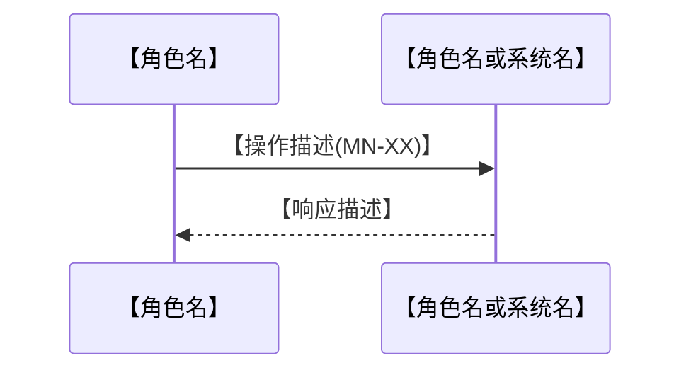
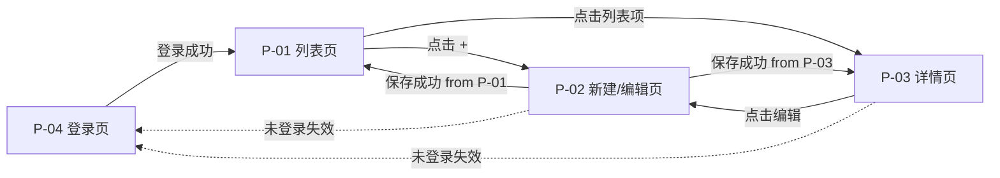
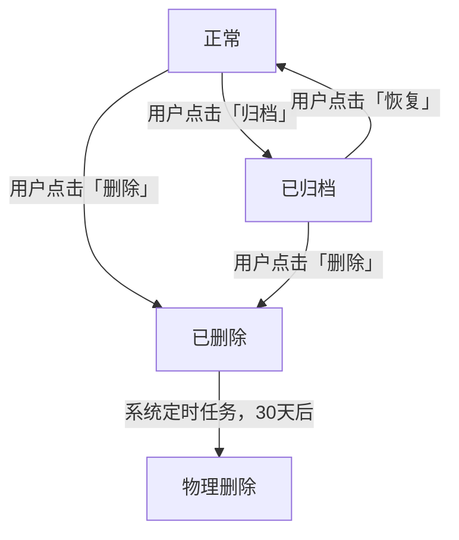

# PRD：【功能/产品名称】

> **本模板用途**：适用于工作流「阶段3 产品定义」的输出。产品定义是最终交付给开发的 PRD 和规格文档（prd.html + spec.md）的功能规格输入，不含交互设计细节。
>
> 阶段3输出：`outputs/产品定义_[产品名]_latest.md`
> 阶段4基于产品定义生成最终交付物：`outputs/prd_[产品名]_latest.html` + `outputs/spec_[产品名]_latest.md`

> **版本**：v1.0　｜　**状态**：草稿 / 评审中 / 已确认　｜　**PM**：【姓名】　｜　**日期**：YYYY-MM-DD

---

## 📌 填写规范（PM 必读，填写前确认）

> 本模板面向 UI Agent · 开发 Agent · 测试 Agent 直接执行，填写须满足以下要求：

| 规范项 | 要求 | 反例 → 正例 |
|--------|------|-------------|
| 无歧义 | 所有数值、规则必须明确，禁止模糊表述 | "不宜过长" → "最多 100 字" |
| 无口语 | 禁止"大概""可能""类似""暂定"等表述 | "大概 3 秒" → "≤ 3 秒" |
| 闭环完整 | 每个功能必须同时描述正常场景和异常场景 | 只写成功路径 → 补充所有异常处理 |
| 前后一致 | 字段名、页面 ID、功能 ID 全文统一，不得前后矛盾 | 同一字段叫"标题"又叫"名称" → 统一用一个 |
| 可验证 | 验收标准必须可被客观判断，不能依赖主观感受 | "体验流畅" → "操作响应 ≤ 200ms" |


---

> **`[Must]` 正文禁内联变更标记（SSOT #79，跨阶段）**：本阶段产物正文**禁**写 `【vN.N 新增】`/`【历史留痕…】`/含 `CR-…`/`议题 #…`/`SSOT #…` 的圆括号等版本 / 变更标记。**产品定义是阶段 4 spec/prd 的直接上游**，此处标记会被搬进交付物——守源头尤为关键。变更历史只走**变更记录表 + git**；**查版本差异请用 `git diff` 命令**。**正向原则（该怎么写）**：成果正文只描述产品**当前态**（本版应有的样子），不留新旧版本对照 / 演进批注；版本演进信息只进变更记录表 + git。schema 标记（如 `【业务定位】`…）+ 派生溯源 `（来源：…）` 不在此列。`precheck_stage1/2/3/4` 各 `check_no_inline_change_markers` WARN；定位用 `strip_inline_change_markers.py`（只读报告，删除 PM 手动做）。详 `rule_hard_constraints.md §六 S4-68`。

## 📐 阶段分层粒度纪律（[Must]，SSOT #54）

> **本节定位**：约束阶段 3 产物的描述粒度 + UI 字面来源标注。阶段 3 是"交互意图层"（可写具体 UI 描述），但视觉细节 / 文案最终字面 / 元素排布 schema 仍归阶段 4 落点。详 `rule_hard_constraints.md §S3-XX`。

**阶段 3 产品定义允许 / 禁止写入清单**：

- ✅ **主体写入**（核心层）：交互意图 / 状态机 / 行为描述 / 接口 schema / 字段绑定 / 权限矩阵 / 用户旅程
- ✅ **允许具体 UI 描述**（归"交互意图层"，可写"点击按钮后弹 modal 显示 X" 等描述性句子）
- ✅ **允许 UI 字面承载客户原始诉求**，**`[Must]` 必须显式标注来源**：
  - 标注格式：**`【来源：产品总监诉求 / 客户访谈 / issue #N】`**（同阶段 1/2）
  - 示例：`【来源：客户访谈】顶部 banner 显示「未开通会员」提示`
- ❌ **禁视觉细节 / 文案最终字面 / 元素排布 schema**（属阶段 4 落点）：
  - 反例：`按钮放置：右上角，字号 14px，颜色 #1890FF`（视觉细节）
  - 反例：`错误提示文案："您的输入不符合要求，请检查后重试"`（文案最终字面）
  - 正例：`错误提示展示在输入框下方，引导用户修正输入`（交互意图层）
- ❌ **禁 PM 推导的 UI 实现细节**（属阶段 4 落点）

**Why（治"交互意图 vs 视觉细节"分层歧义根因）**：
- 历史教训：阶段 3 含视觉细节（按钮位置 / 字号 / 颜色 / 文案最终字面）时，PRD 阶段 4 修订视觉规范时跨阶段同步漏判
- 治本：阶段 3 仅写"做什么 / 用户看到什么"（交互意图），不写"怎么呈现"（视觉细节属阶段 4）；UI 字面带【来源】标注承载客户原始诉求合法
- 兼容：现有产物无标注 → WARN 不阻断（产品总监已决策）

**机械兜底**：`precheck_stage3.py S3-XX UI 字面来源标注校验`（视觉细节关键词扫描 + ±2 行无【来源：…】→ WARN [Recommended]，不阻断 EXIT=0）

**Supervisor 审核**：`AI产品主管_Agent.md §4.0.X 调整层次纪律核查`（PM 提交阶段 3 时视觉细节 / 文案最终字面无标注 → WARN 档）

---

## 0. 文档导读（Agent 快速定位）

| Agent | 必读章节 | 可跳过章节 | 核心任务 |
|-------|----------|------------|----------|
| 🎨 UI Agent | §3 用户画像、§5 用户旅程、§6 页面路由与跳转、§7 功能需求（交互列） | §2 战略背景、§10 接口规范、§14 技术建议 | 输出每个页面的界面与交互方案 |
| ⚙️ 开发 Agent | §4 权限矩阵、§7 功能需求（业务规则+数据规模列）、§8 状态流转、§9 数据字段、§10 接口规范、§11 异常处理全景、§13 性能意图与 SEO 约束 → **自动填写 §14** | §2 战略背景 | 实现业务逻辑、接口与数据层；并在 §14 输出技术实现建议 |
| 🧪 测试 Agent | §7 功能需求（验收标准列）、§11 异常处理全景、§13 非功能需求、§14 技术建议（验证方式列）、§15 测试数据准备 | §2 战略背景 | 覆盖功能、边界、异常、性能场景 |

---

## 1. 问题陈述

<!--
回答四个问题，是整份 PRD 的立论基础。
所有 Agent 都应先读本节，理解「为什么做」比「做什么」更重要。
-->

**谁有这个问题？**
【例：日常使用手机记录工作灵感的职场人】

**问题是什么？**
【例：灵感散落在微信、备忘录、便利贴等多处，无法统一检索和复盘】

**为什么痛？**
【例：每次回顾项目时需要翻找 5 个以上的地方，平均浪费 20 分钟，且经常遗漏关键信息】

**用户证据**（引用真实数据或用户原话，禁止填"待补充"）
- 【例：用户访谈 #23："我的想法记在太多地方了，找的时候比想的时候还累。"】
- 【例：问卷数据：68% 的受访用户表示曾因找不到历史记录而重复思考同一个问题】

**`[Must]` 产品边界与系统集成（复述阶段 1 §一·产品边界,展开业务术语）**

<!--
本节复刻阶段 1 需求分析 §一「产品边界与系统集成」5 字段（系统形态/上级模块/进入入口/退出返回/跨系统数据流）,
并以阶段 3 PRD 业务术语精确化展开（如 NavBar 返回按钮的具体页面归属 / 跨系统数据契约的字段类型）。
真源:阶段 1 §一·产品边界（本节为派生复述,字面值必须 ⊂ 真源）；调整方向:先改阶段 1 真源,再同步本节。
precheck_stage3 校验本节字段齐全 + 字面值 ⊂ 阶段 1 §一·产品边界。
-->

- **系统形态**：【与阶段 1 §一·产品边界一致】
- **上级模块**：【与阶段 1 一致 + 阶段 3 可补具体路径细节】
- **进入入口**：【与阶段 1 一致 + 阶段 3 补具体页面 ID(若已分配)】
- **退出/返回**：【与阶段 1 一致 + 阶段 3 补 NavBar 返回按钮触点说明（如适用）】
- **跨系统数据流**：【与阶段 1 一致 + 阶段 3 补字段类型 / 字段约束 / 接口规范引用】

---

## 2. 战略背景

<!-- Agent 可跳过本节，直接从 §3 开始执行。 -->

**业务目标关联**
- 关联 OKR：【例：Q3 目标——提升用户 DAU，本功能预计贡献次日留存提升 5%】
- 战略意义：【例：补全产品「输入-整理-输出」闭环中缺失的「输入」环节】

**为什么是现在**
【例：竞品 Notion 近期推出移动端快速记录功能，用户流失风险上升；同时内部基础架构已具备支撑条件】

**竞品参考**（🎨 UI Agent 据此了解设计调性，开发 / 测试 Agent 可跳过）

| 竞品 | 借鉴的点 | 差异化的点 |
|------|----------|------------|
| 【例：Notion】 | 悬浮快速入口体验 | 避免层级过深 |
| 【例：Apple 备忘录】 | 极简编辑体验 | 增加标签和搜索能力 |

---

## 3. 用户画像

<!--
每个角色独立描述，决定功能的权限边界、交互差异和验收视角。

[Must] 本章节是「角色名 SSOT 真源」——下游消费点（§4 权限矩阵 / §5 多角色参与矩阵 / scaffold.json roles / spec / PRD）
中所有"角色名"字面值必须来自本章节。每个角色块**必填**两个结构化字段：
  - `**角色 ID**：[role-N]`（机械稳定标识，N 为正整数；本章节内全局唯一）
  - `**角色名**：[业务名]`（人类可读名，中英文均可；下游可选用 ID 或名引用，但同一 scaffold 内必须统一）

抽取算法详见 §5 末尾「角色名抽取算法」段。precheck_stage3 校验本节结构化字段齐全；precheck_stage4 校验
下游 scaffold roles / depends_on permission target 全部 ⊂ §3 角色 ID 集合或角色名集合（不混用）。
-->

### 角色一：【角色名，例：普通用户】

- **角色 ID**：[`role-1`]
- **角色名**：[【角色名，例：普通用户】]

| 属性 | 描述 |
|------|------|
| 典型用户 | 【例：日常使用手机的职场人，25-35 岁】 |
| 核心诉求 | 【例：快速记录、随时搜索】 |
| 使用场景 | 【例：碎片化时间，通勤、开会间隙】 |
| 关键痛点 | 【例：记录步骤繁琐，历史内容找不到】 |
| Jobs-to-be-done | 【例：当我有突发灵感时，我想在 10 秒内完成记录，这样我就不会因为操作繁琐而放弃】 |

### 角色二：【角色名，例：管理员】（如有则填，无则删除本节）

- **角色 ID**：[`role-2`]
- **角色名**：[【角色名，例：管理员】]

| 属性 | 描述 |
|------|------|
| 典型用户 | 【描述】 |
| 核心诉求 | 【描述】 |
| 使用场景 | 【描述】 |
| 关键痛点 | 【描述】 |
| Jobs-to-be-done | 【当…时，我想…，这样我就能…】 |

---

## 4. 权限矩阵

<!--
明确每个角色对每个功能点的操作权限。
开发 Agent：权限控制必须在接口层实现，不可仅依赖前端隐藏。
-->

| 功能点 | 普通用户 | 管理员 | 未登录 |
|--------|----------|--------|--------|
| 查看列表 | ✅ | ✅ | ✅ 仅公开内容 |
| 新建内容 | ✅ | ✅ | ❌ 跳转登录页 |
| 编辑自己的内容 | ✅ | ✅ | ❌ |
| 编辑他人内容 | ❌ 返回 403 | ✅ | ❌ |
| 删除内容 | ✅ 仅自己的 | ✅ 全部 | ❌ |
| 【功能点】 | 【权限】 | 【权限】 | 【权限】 |

---

## 5. 用户旅程（主流程）

<!--
描述用户从入口到完成目标的完整路径。
UI Agent 据此确定页面数量；测试 Agent 据此覆盖主路径和异常分支。
每条旅程对应一个核心用户目标，复杂产品可有多条旅程。

[Must] 本章节是阶段 4 PRD「用户旅程可视化」（A-04 section）的 SSOT 主源——
PRD 中的「表格视图」直接渲染本章节「旅程步骤表」+「多角色参与矩阵」；
「流程图视图」（mermaid 源码）由本章节数据自动派生，PM 不得在阶段 4 凭空写 mermaid。
调整方向：先改本章节数据 → 再让阶段 4 PRD Agent 重渲染派生视图，禁止反向。
详见 prd_expression_standard.md「用户旅程可视化」小节。
-->

### 旅程一：【旅程名，例：用户首次记录一条笔记】

**主路径流程（可选辅助说明，非必填）**

```
入口：首页底部导航「+」按钮
  │
  ▼
[P-02 新建页] 用户输入标题和内容
  │ 点击「保存」
  ▼
[成功状态] Toast 提示「已保存」，停留当前页
  │ 点击「返回」
  ▼
[P-01 列表页] 新建内容出现在顶部
```

#### `[Must]` 旅程步骤表（结构化主源 — 必填）

> 阶段 4 PRD A-04 用户旅程「表格视图」直接渲染本表；「流程图视图」mermaid 源码的节点数 = 本表行数，节点 label = `{阶段名}<br/>{用户行为}`。

| 序号 | 阶段名 | 用户行为 | 涉及页面 | 触点 | 痛点 | 期望 | 系统响应 | 异常 / 边界 |
|------|--------|---------|---------|------|------|------|---------|------------|
| 1 | 认知 | 看到入口/链接，决定进入 | P-01 | 短信/朋友圈/首页 Banner | 不知道是否值得点 | 一眼判断价值 | — | 链接失效：返回首页提示 |
| 2 | 决策 | 点击「+」按钮 | P-01 | 「+」悬浮按钮 | 操作步骤多 | 一键直达 | 跳转 P-02 新建页 | 未登录：跳转登录页，登录后回到此步骤 |
| 3 | 行动 | 输入内容并点击「保存」 | P-02 | 标题框 / 正文区 / 保存按钮 | 怕丢失/操作出错 | 自动保存兜底 | 保存成功 + Toast 提示 | 内容为空：保存禁用；网络异常：本地缓存 |
| 4 | 完成 | 返回列表查看新内容 | P-01 | 返回按钮 / 列表项 | 找不到刚保存的内容 | 顶部置顶突出 | 列表新条目高亮 2 秒 | 有未保存修改：弹「是否保存」确认弹窗 |
| 【N】 | 【阶段】| 【行为】| 【页面】| 【触点】| 【痛点】| 【期望】| 【响应】| 【异常】|

**字段说明**：
- **阶段名**：用户在该步骤所处的心理阶段（认知 / 决策 / 行动 / 反馈 / 完成 等）
- **用户行为**：该步用户实际做的动作（动词短语）
- **涉及页面**：对应 §6 页面路由表中的 P-XX
- **触点**：用户接触产品的具体载体（按钮 / 入口 / 渠道）
- **痛点**：当前可能让用户卡住或放弃的障碍（产品需消解）
- **期望**：用户希望此处发生什么（产品设计的优化方向）
- **系统响应** / **异常 / 边界**：阶段 4 各页面状态枚举的依据

#### `[Must]` 多角色参与矩阵（产品涉及 ≥ 2 角色时必填）

> 单角色产品仅填上方「旅程步骤表」即可，跳过本表。多角色产品双填——本表用于阶段 4 PRD 的 mermaid 流程图渲染时按"主导角色"归入对应 subgraph 泳道。

| 步骤序号 | 主导角色 | 参与角色 | 协作关系描述 |
|---------|---------|---------|-------------|
| 1 | 销售 | 客户 / 经理 | 销售向客户发送链接（朋友圈），经理可见同步状态 |
| 2 | 销售 | — | 销售独立操作 |
| 3 | 销售 | 客户 | 销售填写客户信息时需客户口头确认 |
| 4 | 经理 | 销售 | 经理审核结果，反馈给销售 |
| 【序号】 | 【主导角色】 | 【参与角色】 | 【描述】 |

**`[Must]` 字段约束**：
- **角色名必须来自本文档 §3 用户画像**（即"角色一"/"角色二"等命名块的「角色名」字段）；不得自造未在 §3 出现的角色名
- **主导角色**：阶段 4 PRD 渲染 mermaid 流程图时，该步骤节点所在的 subgraph（泳道）；每步骤恰好一个主导角色
- **参与角色**：该步骤辅助参与的其他角色（多个用 `/` 分隔，无则填 `—`）；阶段 4 PRD 渲染时用虚线箭头 `-.->` 从参与角色对应步骤连到主导角色对应步骤
- **协作关系描述**：一句话说清两/多角色在该步骤的交互形式（信息流向 / 触发条件 / 决策权归属）

**`[Must]` 角色名抽取算法**（下游 scaffold.json / spec / PRD 必须按此抽取，不得自由发挥）：

1. **从 §3 提取角色清单**：
   - 扫描全部 `### 角色N：` 三级标题（N 为"一"/"二"/"三"等中文序号或阿拉伯数字均可）
   - 每个标题下读取首个 `- **角色 ID**：[role-N]` 行（提取 `role-N` 字面值，N 为正整数）和首个 `- **角色名**：[xxx]` 行（提取方括号内字面值）
   - 形成 `(角色 ID, 角色名)` 对清单（例：`[("role-1", "销售"), ("role-2", "经理"), ("role-3", "客户")]`）
2. **从 §5 cell 拆分**：
   - 主导角色列：单字符串，整体 strip 首尾空格后即角色名
   - 参与角色列：含 ` / `（空格-斜杠-空格）时按此分隔符 split → 每个元素 strip 首尾空格后形成数组；不含 ` / ` 时整体作为单元素数组；填 `—` 时视为空数组
   - 例："销售 / 经理" → `["销售", "经理"]`；"销售" → `["销售"]`；"—" → `[]`
3. **归一规则**：
   - 严格字面匹配 §3「角色名」字段值，**不做同义词折叠**（"销售"/"销售员"视为不同；如需统一须改 §3 真源）
   - 中文不区分大小写（无意义）；英文区分大小写（"Manager" / "manager" 视为不同）
   - **不自动转换全角/半角**——若 §3 写"销售"（半角），§5 写"销 售"（含全角空格）则视为不同字面值，precheck 报错
   - **不允许尾部空格**——cell 中的 `"销售 "` 与 `"销售"` 是不同字面值（cell 编辑时 PM 须自行 trim）
4. **scaffold.json roles 字段格式约束**：
   - 数组（list of strings）类型，每个元素是 §3 中**角色 ID 字面值**（如 `"role-1"`）**或**§3 中**角色名字面值**（如 `"销售"`）
   - **同一 scaffold.json 文件内**：所有 roles 数组必须**统一使用 ID 或统一使用名**，不得混用（precheck_stage4 强制校验）
   - **推荐使用角色 ID**——业务名变更时仅改 §3 真源，scaffold 不动，下游消费点零修改
5. **下游消费点的字面值传递**：spec.md（§3.4.2 mermaid `participant` / §页面表「访问角色」列）/ PRD（`.persona-role` / 权限矩阵列头 / 用户旅程多角色矩阵）/ scaffold.json `depends_on[].kind=permission` 的 target —— 全部使用 §3 真源中的角色名或角色 ID 字面值，不得二次加工

**填写规则总览**：

| 产品类型 | 旅程步骤表 | 多角色参与矩阵 | 阶段 4 mermaid 类型 |
|---------|----------|--------------|------------------|
| 单角色 | ✅ 必填 | — | `flowchart LR`（横向流程） |
| 多角色 | ✅ 必填 | ✅ 必填 | `flowchart LR` + 多个 `subgraph` 模拟泳道 |
| 复杂多旅程产品 | 每条旅程独立填一份 | 同左 | 每条旅程独立渲染一组视图

#### `[Should]` 多旅程产品组织规则

若产品含 ≥ 2 条**相对独立**的用户旅程（如"用户购买流程" + "商家管理流程"，二者目标用户、入口、终态均不同），按以下规则组织本节：

1. **每条旅程独立写一组「旅程步骤表 + 多角色参与矩阵」**——旅程间用三级标题分割（如 `### 旅程一：用户购买流程`、`### 旅程二：商家管理流程`），每个三级标题下完整复刻"旅程步骤表 + 多角色参与矩阵 + 字段说明"段
2. **追加「旅程间流转关系表」**——列出旅程之间相互跳转的入口（页面 / 事件 / 触发条件），格式如下：

| 起点旅程 | 起点步骤 | 跳转触发 | 终点旅程 | 终点步骤 |
|---------|---------|---------|---------|---------|
| 旅程一：用户购买流程 | 步骤 4：完成支付 | 用户点击订单详情中「联系商家」 | 旅程二：商家管理流程 | 步骤 2：客服回复消息 |
| 旅程二：商家管理流程 | 步骤 5：发货 | 商家点击「通知用户」 | 旅程一：用户购买流程 | 步骤 5：确认收货（系统通知触发） |
| 【起点旅程】 | 【步骤】 | 【触发条件】 | 【终点旅程】 | 【步骤】 |

3. **判定独立旅程的标准**——以下任一成立即为独立旅程：
   - 目标用户不同（如客户 vs 商家、外部用户 vs 内部运营）
   - 入口不同（如外部分享链接 vs 后台登录）
   - 终态不同（如完成支付 vs 完成发货）
   - 旅程时长差异显著（如"一次性 5 分钟操作" vs "持续 7 天的多次交互"）

4. **判定不独立的反例**——以下情况须合并为同一旅程的不同分支，**不另开旅程**：
   - 同一目标的不同入口（如"首页入口"和"分享链接入口"都通向同一注册流程）→ 在同一旅程的步骤 1 中标多个触点
   - 同一旅程的失败回退路径（如"支付失败重试"）→ 写在原旅程步骤的"异常 / 边界"列

> **单旅程产品**保持现有简单格式（仅一组「旅程步骤表 + 多角色参与矩阵」），无需补流转关系表与三级标题分割。

---

## 5.5 业务流程图（来源：阶段 2 §二，工程视角与 §5 用户旅程互补）

> **`[Must]` SSOT 派生约束**：本章节是 `tmpl_功能规划.md §二` 业务流程图的**复述视图**——内容（含 5.5.1 主流程总览 / 5.5.2 跨角色交互流程 / 5.5.3 补充流程）必须由阶段 2 §二全部 mermaid 块按原标题层级直接迁入,字面值与阶段 2 §二一致。
>
> **调整方向**：先改阶段 2 §二真源 → 再让阶段 3 复述段重派 PM 同步迁入；禁止反向（直接改本章节而不回写阶段 2）。同源派生还含 spec.md §3.4 + PRD A-04.2（阶段 4）。SSOT 双锚 #30 precheck_stage3 校验本章节 mermaid 数 = 阶段 2 §二 mermaid 数,漏迁入会 FAIL 阻断。
>
> **本章节定位**：业务方读产品定义时一站式获得「业务视角（§5 用户旅程）+ 工程视角（§5.5 业务流程图）」对偶,无需跳回阶段 2 功能规划。
>
> **`[Recommended]` 流程图类型选型**：阶段 3 派生时若发现阶段 2 §二图类型选型不当（如单角色简单流程被画成跨角色泳道、业务规则密集应改决策树），按需对照 `pm-workflow/rules/proto_business_flow_selection.md`（SSOT 双锚 #70 真源）→ NB 上报回阶段 2 修真源（按本章节调整方向硬约束，禁派生层自决修正真源精神）。

### 5.5.1 主流程总览

<!--
迁入阶段 2 §二.2.1 主流程总览的 mermaid 块（flowchart TD）。
PM 阶段 3 写作时直接 cp 阶段 2 内容,禁止凭空写。
-->

```mermaid
flowchart TD
    Start([【入口描述,如：销售人员进入系统】]) --> A{【第一个决策点】}
    A -->|【分支条件一】| B[【操作节点(MN-XX)】]
    A -->|【分支条件二】| C[【操作节点】]
    B --> End([【终态描述】])
    C --> End
```

### 5.5.2 跨角色交互流程（条件必选）

<!--
迁入阶段 2 §二.2.2 跨角色交互流程的 mermaid 块（sequenceDiagram）。
若阶段 2 §二.2.2 不存在（无跨角色场景）则本节也不存在,与阶段 2 保持对称。
-->



### 5.5.3 补充流程（按需）

<!--
迁入阶段 2 §二.2.3 补充流程的 mermaid 块（flowchart TD 或 stateDiagram-v2）。
若阶段 2 §二.2.3 不存在则本节也不存在,与阶段 2 保持对称。
-->

#### 5.5.3.1 【补充流程名称】

```mermaid
flowchart TD
    Enter([【触发条件】]) --> A[【操作节点(MN-XX)】]
    A --> B{【判断条件】}
    B -->|【条件一】| C[【处理方式】]
    B -->|【条件二】| D[【处理方式】]
    C --> End([【子流程终态】])
    D --> End
```

> **若阶段 2 §二仅有 5.5.1 主流程**（无跨角色 / 无补充流程）→ 本章节也仅含 5.5.1,5.5.2/5.5.3 删除（与阶段 2 §二完整性保持字面对称）。

---

## 6. 页面路由与跳转关系

<!--
🎨 UI Agent：据此确认需要设计的页面总数和跳转逻辑，路由地址供生成原型链接。
⚙️ 开发 Agent：据此配置前端路由，路由地址为前端相对路径。
-->

> **`[Recommended]` UI 跳转图选型**：当页面跳转关系复杂（≥ 8 页 / 含条件分支跳转 / 跨端衔接）时，按需对照 `pm-workflow/rules/proto_business_flow_selection.md §一 # 8 UI 跳转图`（SSOT 双锚 #70 真源）将页面跳转规则视觉化为 flowchart TD；跨多端衔接场景见该文件 §五 多端协作流程规范。

### 页面路由表

<!--
「对客」列填写规则（角色名以本文档 §3 用户画像中实际角色为准,不强制使用以下示例字面）：
  - 是：外部用户角色（§3 中标注为对外角色,如示例项目的"客户端访客"）可直接访问,须在 §13 SEO 约束节中补充对应优化说明
  - 否：仅内部用户角色（§3 中标注为对内角色,如示例项目的"销售人员/管理员"）使用
-->

| 页面 ID | 页面名称 | 路由地址 | 父页面 | 对应功能 | 访问权限 | 类型 | 对客 |
|---------|----------|----------|--------|----------|----------|------|------|
| P-01 | 列表页 | /notes | 首页 | F-002 | 登录用户 | 改版 | 否 |
| P-02 | 新建 / 编辑页 | /notes/edit | P-01 | F-001 | 登录用户 | 新增 | 否 |
| P-03 | 笔记详情页 | /notes/:id | P-01 | F-003 | 登录用户 | 新增 | 否 |
| P-04 | 登录页 | /login | 无 | F-010 | 所有人 | 已有 | 否 |
| 【P-N】 | 【页面名】 | 【/路径】 | 【父页面ID】 | 【功能ID】 | 【权限】 | 新增/改版/已有 | 是/否 |

### 页面跳转规则

```
[P-04 登录页]
    │ 登录成功
    └──▶ [P-01 列表页]
              │ 点击「+」
              ├──▶ [P-02 新建页] ──保存成功──▶ 返回 P-01
              │
              │ 点击列表项
              └──▶ [P-03 详情页]
                        │ 点击「编辑」
                        └──▶ [P-02 编辑页] ──保存成功──▶ 返回 P-03
```

**补充跳转规则**（明确触发条件 + 目标页面）
- 未登录用户访问任何需登录页面 → 跳转 P-04，登录后返回原目标页
- 【其他特殊跳转规则】

#### `[Should]` 复杂跳转用 Mermaid 补充

上方 ASCII 流程图适合**简单跳转**（≤ 5 节点 / 单一线性入口）。复杂产品的完整跳转链路建议用 Mermaid `flowchart LR` 或 `flowchart TD` 补充，理由：

1. **阶段 4 PRD 用户旅程 section 会用 mermaid 渲染**——参 `prd_expression_standard.md §A-04.1`（用户旅程可视化双视图）+ `proto_contract.md §十一`（prd.html 中 Mermaid 局部豁免规则——`flow` 类 section 关键字 `journey` / `user-journey` / `flow` 允许 mermaid）
2. **此处提前给出 mermaid 源码可在阶段 4 直接被 PRD Agent 复用**——避免重复绘制；阶段 4 PRD 不允许 PM 凭空写 mermaid（必须由产品定义派生），本节给出的 mermaid 源码即派生输入
3. **mermaid 源码格式参 `prd_expression_standard.md §A-04.1.2`** 派生算法（节点 id / 节点 label / 主流连接 / subgraph 子图）

**何时必用 mermaid**（[Should] 触发条件）：
- 跳转节点数 > 5
- 含分支 / 合并节点（如多入口聚合到同一终态、单一入口分多种结果）
- 涉及多角色泳道（如客户旅程与商家旅程交叉跳转）
- 含异常 / 回退路径 ≥ 3 条

**示例**（含登录页 + 列表页 + 详情页 + 编辑页 + 异常回退的 5 节点跳转，可作为阶段 4 PRD 派生输入）：



> **单旅程或简单产品**：保持上方 ASCII 流程图即可，无需冗余补充 mermaid。

### 设计参考与调性说明

- **整体调性**：【例：简洁高效，减少装饰元素，操作路径越短越好】
- **参考应用**：【例：Apple 备忘录的编辑体验 + Notion 的快速入口设计】
- **需要避免**：【例：复杂层级；进入核心功能前出现过多引导弹窗】
- **特殊要求**：【例：必须支持深色模式；字体大小跟随系统设置缩放】

---

## 6.5 产品架构（来源：阶段 2 §三，模块组成视角与 §6 页面路由互补）

> **`[Must]` SSOT 派生约束**：本章节是 `tmpl_功能规划.md §三 产品架构` 的**复述视图**——模块清单 + 模块依赖关系 + 各模块职责由阶段 2 §三（尤其 3.2 模块依赖关系表）按原内容直接迁入，字面值与阶段 2 §三一致。
>
> **调整方向**：先改阶段 2 §三真源 → 再让阶段 3 复述段重派 PM 同步迁入；禁止反向（直接改本章节而不回写阶段 2）。同源派生还含阶段 4：PM 子阶段一据本节构建 scaffold.modules（name / 可选 purpose / depends_on），assemble 现场派生 spec §3.0 + PRD spec-sitemap「模块架构说明」。SSOT 双锚 #40 precheck_stage3 校验本章节模块行数 = 阶段 2 §一 模块总览模块数，漏迁入 FAIL 阻断。
>
> **本章节定位**：业务方/下游读产品定义时一站式获得「页面视角（§6 页面路由）+ 模块组成视角（§6.5 产品架构：谁依赖谁、各模块负责什么）」对偶，无需跳回阶段 2 功能规划。

<!--
迁入阶段 2 §三：模块清单（对齐 §一 模块总览）+ 3.2 模块依赖关系表（只运行时依赖）
+ 各模块一句话职责。PM 阶段 3 写作时直接 cp 阶段 2 §三内容，禁止凭空写。
页面层级树（阶段 2 §3.1）不在此重复——已由阶段 4 §3.0/spec-sitemap 自动派生（SSOT #38）。
-->

| 模块 | 名称 | 职责（一句话） | 依赖于（模块 + 原因）|
|------|------|---------------|---------------------|
| 【MN】 | 【模块名】 | 【本模块负责什么】 | 【被依赖模块 + 依赖原因；无则填"无"】 |

---

## 7. 功能需求

<!--
每个功能独立描述，按三视角展开——PM 只填需求，不填技术实现。
- 交互说明 → UI Agent 关注
- 业务规则 → 开发 Agent 关注（含数据来源 + 数据规模）
- 验收标准 → 测试 Agent 关注（Given-When-Then，Then 含数据层验证）

⚠️ 数据规模必填说明（PM）：
  业务规则中必须包含「数据规模」子项，描述该功能涉及的数据量级、操作频率、文件大小等。
  这是开发 Agent 在 §14 推导技术实现建议的核心依据——没有数据规模，AI 无法判断是否需要分页、缓存、虚拟列表、分片上传等方案。
  例：「单用户最多 5,000 条 / 单次返回 20 条 / 图片最大 10MB」
-->

### `[Must]` 交互说明表元素最小集

每个功能的「交互说明表」须穷举该功能涉及的所有用户可交互元素，按页面从上到下、从左到右排序，**不得遗漏**。最低必含以下元素，每类元素一行（多元素时各自独立成行）：

- **主要表单字段**（每个字段一行：账号 / 密码 / 验证码 / 标题 / 正文 等）
- **主要操作按钮**（每个按钮一行：提交 / 保存 / 取消 / 删除 等）
- **成功反馈**（一行：Toast 文案 + 显示位置 + 后续行为）
- **异常态**（每种异常一行——空数据 / 加载中 / 错误 / 禁用 / 越权 等，与 §11 异常处理全景表内涉及本功能的行**一一对应**）

> **判定标准**：交互说明表行数 ≥（表单字段数 + 操作按钮数 + 1 成功反馈 + N 异常态行）。少于此数视为遗漏，PM 自审与 Supervisor 审核须据此核对。

### `[Must]` 业务规则格式约束

本节业务规则的子项必须按以下格式填写，**禁止段落叙述、禁止子项间格式混用**：

- 「**数据规模**」子项**必须用表格**（列：字段 / 量级 / 说明），独立成块，与其他 bullet 子项区分；禁止把数据规模合并入其他 bullet
- 其他子项（标题 / 正文 / 时间戳 / 频率上限 / 自动保存 / 数据来源 / 业务约束 等）统一为 markdown bullet 格式：`- **子项名**：约束描述`，每个子项一行；约束多于一句时换行缩进继续
- 「**数据来源**」子项**仍用表格**（列：字段 / 来源 / 说明），独立成块，因其语义为字段映射而非散点约束

### `[Must]` 验收场景选取标准

本节验收标准须穷举以下四类场景，**缺一不可**：

1. **正常主路径**（成功完成功能）— **至少 1 个场景**
2. **所有枚举值分支**（如状态机各状态、字段值的不同分支）— **每个枚举值 1 个场景**
3. **业务规则中的约束触发点**（如字段长度上限触发、频率上限触发、权限不足触发）— **每个约束 1 个场景**
4. **异常处理全景**（§11）中涉及本功能的所有场景 — **每个异常 1 个场景**

**场景命名格式**：`场景：[简短描述]`（如"场景：正常创建" / "场景：超出每日上限"），**禁止**用"场景一/场景二"等无语义编号。

**G-W-T 句子格式**：遵循 Gherkin 规范——
- `Given [前置条件]`：用户角色 + 系统状态 + 输入数据
- `When [触发动作]`：用户的一次明确操作（点击 / 提交 / 输入等）
- `Then [系统响应]`：UI 层期望结果（Toast / 跳转 / 状态变化）
- `And [数据层验证]`：数据库 / 接口 / 缓存等可机械验证的判定

**`[Must]` 可机械验证约束**：每个 Then / And 句子必须含**可机械验证的判定条件**（如"标题字段值 = 用户输入" / "数据库 created_at 与服务端时间误差 ≤ 5 秒" / "Toast 文案 = '已保存'"），**禁止**用"标题正确显示" / "体验流畅" / "保存成功"等无客观判定的描述。

---

### F-001：【功能名，例：创建笔记】

**优先级**：P0　｜　**所属旅程**：§5 旅程一　｜　**涉及页面**：P-02

#### 交互说明（UI Agent）

| 元素 | 默认态 | 交互态 | 异常 / 禁用态 |
|------|--------|--------|---------------|
| 页面入口 | P-01 底部「+」悬浮按钮，品牌主色 | 点击：缩小动画 → 跳转 P-02 | — |
| 页面结构 | 顶部导航（返回 + 「保存」）；中部：标题框 + 正文区；底部：工具栏（插图/标签） | — | — |
| 标题输入框 | 占位文字「给这条笔记起个名字」，灰色 | 聚焦：蓝色边框 + 光标 | — |
| 正文编辑区 | 占位文字「开始记录…」，自动聚焦，唤起软键盘 | 输入中：右下角实时显示剩余字数 | ≤ 200 字时字数提示变警示色 |
| 保存按钮 | 内容全空：置灰禁用 | 有内容：高亮可点击；点击后：Loading 态防重复提交 | 保存失败：恢复可点击，Toast 提示「保存失败，请重试」 |
| 离开确认弹窗 | — | 有未保存修改时触发，选项：「保存」/「不保存」/「取消」 | — |

#### 业务规则（开发 Agent）

- **标题**：最长 100 字；可为空，空时系统自动命名为「无标题 YYYY-MM-DD HH:mm」
- **正文**：最长 10,000 字，达到上限后禁止继续输入，不截断已有内容
- **时间戳**：`created_at` 首次保存时生成，`updated_at` 每次保存更新，精度秒，UTC+8，由服务端生成，不信任客户端时间
- **创建频率上限**：同一用户每日创建 ≤ 500 条；超出后拒绝新建，提示「今日创建已达上限，明日 00:00 重置」
- **自动保存**：用户停止输入 3 秒后静默触发；失败时不提示用户，下次手动保存时合并提交；成功时界面显示「已自动保存」
- **数据规模**（⚙️ 开发 Agent 据此推导性能方案，见 §14）：
  - 单用户笔记总量：最多 5,000 条
  - 列表单次请求返回：最多 20 条（分页加载）
  - 正文最大长度：10,000 字（约 20KB 纯文本）
  - 图片附件（如有）：单文件最大 10MB，每条笔记最多 9 张
  - 保存操作频率：自动保存每 3 秒一次，用户手动保存无频率限制但需防重复提交
- **数据来源**：

| 字段 | 来源 | 说明 |
|------|------|------|
| 标题、正文 | 用户输入 | 前端传参 |
| 创建人 ID | 服务端 Session | 不由前端传参，防篡改 |
| created_at / updated_at | 服务端生成 | 不信任客户端时间 |
| 自动命名时间 | 服务端时间 | 格式 `YYYY-MM-DD HH:mm` |

#### 验收标准（测试 Agent）

```gherkin
场景一：正常创建
  Given 用户已登录，位于 P-02 新建页
  When  输入标题「测试笔记」和正文「内容」，点击「保存」
  Then  Toast 显示「已保存」
  And   P-01 列表页第一条显示「测试笔记」，时间戳正确
  And   数据库 created_at 与服务端当前时间误差 ≤ 5 秒

场景二：标题为空自动命名
  Given 用户已登录，位于新建页
  When  不填标题，只填正文，点击「保存」
  Then  保存成功，列表页标题显示「无标题 YYYY-MM-DD HH:mm」
  And   标题中的时间与数据库 created_at 一致

场景三：超出字数限制
  Given 正文已输入 10,000 字
  When  用户继续输入任意字符
  Then  输入框不接受新字符，内容长度保持 10,000
  And   字数提示显示警示色「已达最大字数 10,000」

场景四：网络异常保存
  Given 用户断网状态下已输入内容
  When  点击「保存」
  Then  Toast 提示「已保存至本地，联网后自动同步」
  And   重新联网后数据自动上传，数据库出现对应记录，本地缓存清除

场景五：每日创建上限
  Given 用户当日已创建 500 条笔记（见 §15 测试数据准备）
  When  点击「+」尝试新建
  Then  提示「今日创建已达上限，明日 00:00 重置」，不跳转 P-02
  And   数据库当日该用户记录数仍为 500，无新增

场景六：离开未保存内容
  Given 用户在 P-02 已输入内容但未保存
  When  点击「返回」
  Then  弹出确认弹窗，含「保存」「不保存」「取消」三个按钮
  And   点击「不保存」：返回 P-01，数据库无新增记录
  And   点击「取消」：停留 P-02，已输入内容完整保留

【场景N：补充边界场景】
  Given 【前置条件】
  When  【操作】
  Then  【UI 层期望结果】
  And   【数据层验证】
```

---

### F-002：【功能名，例：用户登录】

**优先级**：P0　｜　**所属旅程**：§5 旅程一　｜　**涉及页面**：P-04

> 本功能作为**中等复杂度参考示例**——三表（交互/业务规则/验收）严格按上方 §7 章节头部三个 `[Must]` 段执行；PM 在新项目中复用 F-002 时只替换业务字段名与数值，**不得**改变表格结构与场景类别覆盖度。

#### 交互说明（UI Agent）

| 元素 | 默认态 | 交互态 | 异常 / 禁用态 |
|------|--------|--------|---------------|
| 账号输入框 | 占位文字「请输入手机号 / 邮箱」，灰色边框 | 聚焦：蓝色边框 + 光标 | 失焦后格式不合法：红色边框 + 提示「账号格式错误」 |
| 密码输入框 | 占位文字「请输入密码」，明文/密文切换图标默认密文 | 聚焦：蓝色边框 + 光标；点击眼睛图标切换显隐 | 失焦后为空：红色边框 + 提示「密码不能为空」 |
| 验证码输入框（连续登录失败 ≥ 3 次后出现） | 占位文字「请输入验证码」+ 右侧图形验证码图片 | 点击图片刷新；输入时实时校验 4 位长度 | 错误：红色边框 + 提示「验证码错误」+ 自动刷新图片 |
| 登录按钮 | 账号或密码为空：置灰禁用 | 都已填写：高亮可点击；点击后：Loading 态 1 秒防重复提交 | 登录失败：恢复可点击，按钮下方显示具体错误 |
| 「忘记密码」链接 | 灰色链接，位于密码框下方右侧 | hover：变品牌主色 | — |
| 成功反馈 | — | 登录成功：Toast 显示「登录成功」(2 秒) → 跳转目标页 | — |
| 加载中态 | — | 接口请求期间：登录按钮内 Loading spinner + 文案「登录中...」 | — |
| 错误态（账号密码错误） | — | — | 按钮下方红色文案「账号或密码错误，剩余 N 次机会」（N 由后端返回） |
| 错误态（账号锁定） | — | — | 按钮下方红色文案「账号已锁定，请 30 分钟后重试」+ 登录按钮置灰 |
| 错误态（网络异常） | — | — | Toast「网络异常，请检查网络后重试」+ 表单内容保留不清空 |

> **元素覆盖度自审**：本表共 10 行 = 3 个表单字段 + 2 个操作按钮（登录 + 忘记密码链接）+ 1 行成功反馈 + 4 行异常态（格式错 / 账号密码错 / 账号锁定 / 网络异常），符合 §7「交互说明表元素最小集」。

#### 业务规则（开发 Agent）

- **账号**：手机号或邮箱二选一；手机号正则 `^1[3-9]\d{9}$`，邮箱正则 `^[\w.+-]+@[\w-]+\.[\w.-]+$`；前端实时校验 + 后端二次校验
- **密码**：长度 8-32 字符，必须含字母 + 数字（不强制特殊字符）；前端仅校验长度，后端校验完整规则
- **验证码触发条件**：同一账号连续登录失败 ≥ 3 次（24 小时窗口）后必须填验证码；图形验证码 4 位字符 + 图片刷新机制
- **失败次数策略**：
  - 连续失败 3 次：要求填验证码
  - 连续失败 5 次：账号锁定 30 分钟（按服务端时间，不信任客户端）
  - 失败次数计数 24 小时滑动窗口，成功登录一次清零
- **会话有效期**：登录成功后服务端签发 Token，默认有效期 7 天；用户勾选「记住我」后延长至 30 天
- **跳转规则**：
  - 登录前若有目标页（URL query `?redirect=xxx`）→ 登录成功后跳转该页
  - 无目标页 → 跳转 P-01 列表页（默认首页）
- **数据规模**：

| 字段 | 量级 | 说明 |
|------|------|------|
| 单用户日活登录次数 | 平均 ≤ 5 次 | 用于估算登录接口 QPS 峰值 |
| 全平台 DAU 登录峰值 | 单分钟 ≤ 1,000 次 | 用于评估接口限流阈值 |
| 验证码图片大小 | 单图 ≤ 8 KB | 影响 CDN 流量 |
| Token 长度 | 固定 256 字符 | JWT 编码后长度，影响 Cookie / Header 大小 |

- **数据来源**：

| 字段 | 来源 | 说明 |
|------|------|------|
| 账号、密码、验证码 | 用户输入 | 前端传参 |
| 客户端 IP、User-Agent | 服务端从请求头取 | 用于风控与审计 |
| 失败次数 | 服务端 Redis 维护 | 滑动窗口计数 |
| Token | 服务端签发 | 不由前端传参，防伪造 |
| 锁定到期时间 | 服务端时间 | 不信任客户端时间 |

#### 验收标准（测试 Agent）

```gherkin
场景：正常登录（主路径）
  Given 用户已注册，账号 13800138000，密码 Test1234
  When  在 P-04 登录页输入正确账号密码，点击「登录」
  Then  Toast 显示「登录成功」
  And   跳转到 P-01 列表页
  And   浏览器 Cookie 中存在名为 `auth_token` 的 Token，长度 = 256
  And   后端 Redis 中该账号失败次数 = 0

场景：账号格式错误（约束触发：账号正则）
  Given 用户位于 P-04 登录页
  When  输入账号「abc123」（既非合法手机号也非合法邮箱），失焦
  Then  账号输入框显示红色边框
  And   下方提示文案 = 「账号格式错误」
  And   登录按钮保持置灰禁用（前端拦截，不调用接口）

场景：密码长度不足（约束触发：密码长度下限 8）
  Given 用户在 P-04 登录页输入合法账号
  When  输入密码「Abc12」（5 位），点击「登录」
  Then  密码输入框显示红色边框
  And   下方提示文案 = 「密码长度需 8-32 位」
  And   后端接口未被调用（前端拦截）

场景:账号或密码错误（异常分支:登录失败计数 < 3）
  Given 用户在 P-04 登录页，该账号当前失败次数 = 0
  When  输入账号 13800138000、错误密码「Wrong123」，点击「登录」
  Then  按钮下方红色文案 = 「账号或密码错误，剩余 4 次机会」
  And   表单字段值保持不清空（账号、密码原值仍在）
  And   后端 Redis 该账号失败次数 = 1

场景:连续失败 3 次触发验证码（约束触发:失败次数 ≥ 3）
  Given 用户在 P-04 登录页，该账号当前失败次数 = 2
  When  再次输入错误密码，点击「登录」
  Then  失败次数变为 3
  And   页面新增验证码输入框（位于密码框下方）
  And   下次登录请求必须携带验证码字段，否则后端拒绝并返回 `code=NEED_CAPTCHA`

场景:账号锁定（枚举值分支:锁定态）
  Given 用户在 P-04 登录页，该账号当前失败次数 = 5
  When  输入正确密码 + 正确验证码，点击「登录」
  Then  按钮下方红色文案 = 「账号已锁定，请 30 分钟后重试」
  And   登录按钮置灰
  And   后端返回 `code=ACCOUNT_LOCKED`
  And   Redis 中该账号锁定到期时间 = 当前时间 + 30 分钟

场景：网络异常（异常处理 §11 — 提交时网络中断）
  Given 用户在 P-04 登录页输入正确账号密码
  When  在断网状态下点击「登录」
  Then  Toast 提示「网络异常，请检查网络后重试」
  And   表单字段值保持不清空
  And   登录按钮恢复可点击态，未进入 Loading 长时间转圈

场景：勾选「记住我」延长会话（枚举值分支：记住我开/关）
  Given 用户在 P-04 登录页输入正确账号密码
  When  勾选「记住我」，点击「登录」
  Then  Token 有效期 = 30 天（默认 7 天）
  And   后端签发的 JWT `exp` 字段值 = 当前时间 + 30 * 24 * 3600 秒
```

> **场景覆盖度自审**：8 个场景 = 1 正常主路径 + 2 枚举值分支（锁定态 / 记住我开关）+ 4 业务约束触发点（账号正则 / 密码长度 / 失败次数 ≥ 3 / 失败次数 ≥ 5）+ 1 异常处理全景（网络中断），符合 §7「验收场景选取标准」四类穷举。

---

<!-- 按需继续添加 F-003、F-004… 结构完全相同 -->

---

## 8. 状态流转

<!--
⚙️ 开发 Agent：据此实现状态机逻辑，枚举值须与 §9 数据字段中的枚举定义一致。
🧪 测试 Agent：据此覆盖所有状态切换路径，包括非法切换。
-->

> **`[Recommended]` 状态机图类型选型**：实体状态生命周期建模按需对照 `pm-workflow/rules/proto_business_flow_selection.md §一 # 4 状态机`（SSOT 双锚 #70 真源），状态机 vs 业务流程的边界、状态切换规则的完备性检查、stateDiagram-v2 语法选择等以该文件决策路径为参考。

### 【实体名，例：笔记】状态流转



**状态切换规则**

| 当前状态 | 触发条件 | 目标状态 | 操作权限 | 不可逆说明 |
|----------|----------|----------|----------|------------|
| 正常 | 用户点击「归档」 | 已归档 | 仅本人 / 管理员 | 可恢复 |
| 已归档 | 用户点击「恢复」 | 正常 | 仅本人 / 管理员 | — |
| 正常 / 已归档 | 用户点击「删除」 | 已删除 | 仅本人 / 管理员 | 30 天内可联系管理员恢复 |
| 已删除 | 系统定时任务 | 物理删除 | 系统自动执行 | **不可逆** |
| 【状态】 | 【触发条件】 | 【目标状态】 | 【权限】 | 【备注】 |

---

## 9. 数据字段说明

<!--
PM 只需说明业务含义、约束和数据来源。
字段类型、索引、分表策略由开发 Agent 自行决定。
-->

### 实体：【实体名，例：笔记（Note）】

| 字段 | 业务含义 | 约束 / 说明 | 数据来源 |
|------|----------|-------------|----------|
| 标题 | 笔记的名称 | 最长 100 字；可为空，空时系统自动命名 | 用户输入 |
| 正文 | 笔记的主体内容 | 最长 10,000 字；纯文本，不支持富文本 | 用户输入 |
| 创建人 | 创建该笔记的用户 | 关联用户账号，创建后不可更改 | 系统从 Session 取 |
| 创建时间 | 笔记首次保存的时间 | 精度到秒，UTC+8；创建后不可更改 | 服务端生成 |
| 最后修改时间 | 最近一次保存的时间 | 每次保存自动更新 | 服务端生成 |
| 标签 | 用户给笔记打的分类标签 | 每条笔记最多 10 个；每个标签最长 20 字 | 用户输入 |
| 状态 | 笔记当前状态 | 枚举：正常 / 已归档 / 已删除（见 §8 状态流转） | 系统维护 |
| 【字段】 | 【含义】 | 【约束】 | 用户输入 / 系统生成 / 第三方返回 |

---

## 10. 接口需求说明

<!--
PM 只描述「需要什么能力的接口」和「业务层面的输入输出」。
接口地址、请求方式、参数命名、错误码设计由开发 Agent 决定。
-->

| 接口 ID | 对应功能 | 业务能力描述 | 输入（业务语言） | 输出（业务语言） | 关键业务约束 |
|---------|----------|--------------|-----------------|-----------------|--------------|
| API-001 | F-001 | 创建一条新笔记 | 标题（可空）、正文（可空）、标签列表（可空） | 创建成功的笔记 ID 和时间戳 | 同一用户当日 ≤ 500 条；手机号唯一 |
| API-002 | F-002 | 查询当前用户的笔记列表 | 状态筛选（可空）、关键词（可空）、分页参数 | 笔记列表（含标题、摘要、时间、状态） | 只返回当前登录用户的数据 |
| API-003 | F-001 | 自动保存笔记草稿 | 笔记 ID（已有）或空（新建中）、当前标题、当前正文 | 保存结果（成功 / 失败） | 失败时静默，不影响用户操作 |
| 【API-N】 | 【功能ID】 | 【能力描述】 | 【业务输入】 | 【业务输出】 | 【业务约束】 |

---

## 11. 异常处理全景

<!--
穷举所有异常场景，Agent 不得自行补充未在此列出的处理方式。
🧪 测试 Agent：本表每一行对应至少一个测试用例。
-->

> **`[Recommended]` 异常流程图选型**：当异常分支复杂（≥ 5 类异常 / 含级联兜底 / 跨系统恢复）时，按需对照 `pm-workflow/rules/proto_business_flow_selection.md §一 # 9 异常 / 兜底流程`（SSOT 双锚 #70 真源）将本表视觉化为独立 flowchart TD，避免异常分支塞进主业务流程导致视觉爆炸（异常分支抽离纪律见该文件 §三 决策树 § 与异常 / 兜底流程的关系）。

| 场景类型 | 具体场景 | 触发条件 | 用户反馈（界面表现） | 系统处理逻辑 |
|----------|----------|----------|----------------------|--------------|
| 表单校验 | 必填字段未填写 | 点击提交时 | 阻止提交，定位到未填字段，红色边框 + 提示「请填写：XXX」 | 前端拦截，不发送请求 |
| 表单校验 | 字段超出长度限制 | 输入时实时检测 | 禁止继续输入，字数提示变警示色 | 前端拦截，不截断已有内容 |
| 权限异常 | 访问他人数据 | 接口返回 403 | Toast 提示「无权限执行该操作」 | 接口拒绝，前端展示提示 |
| 权限异常 | 未登录访问需登录页 | 页面进入时检测 | 跳转登录页，登录后返回原页面 | 前端路由守卫拦截 |
| 网络异常 | 提交时网络中断 | 接口请求超时 / 失败 | 保留表单数据，Toast「网络异常，请检查网络后重试」，提供「重试」按钮 | 前端捕获异常，不清空表单 |
| 网络异常 | 页面加载时网络中断 | 接口返回失败 | 显示错误态：插画 + 「加载失败，点击重试」 | 前端捕获异常，显示错误组件 |
| 数据异常 | 查询结果为空 | 接口返回空列表 | 显示空态：插画 + 引导文案 + 操作按钮（如「新建笔记」） | 正常响应，前端判断空数组后展示空态 |
| 数据异常 | 唯一性冲突 | 接口返回业务错误 | Toast 提示具体冲突原因（如「该手机号已注册」） | 接口返回明确错误信息，前端透传展示 |
| 系统异常 | 服务端内部错误 | 接口返回 500 | Toast「服务繁忙，请稍后重试」，保留当前页面状态 | 前端统一捕获 5xx，不暴露技术细节 |
| 频率限制 | 超出每日操作上限 | 接口返回业务限制错误 | Toast 提示「今日 XXX 已达上限，明日 00:00 重置」 | 接口拒绝并返回重置时间 |
| 【场景类型】 | 【具体场景】 | 【触发条件】 | 【用户反馈】 | 【系统处理】 |

---

## 12. 数据埋点需求

<!--
PM 说明需要记录哪些用户行为和结果，供后续数据分析使用。
埋点实现方式（SDK 选型、上报格式）由开发 Agent 决定。
-->

| 埋点 ID | 触发时机 | 记录内容 | 用途 |
|---------|----------|----------|------|
| E-001 | 用户点击「保存」按钮 | 用户 ID、笔记 ID（新建时为空）、操作时间、操作结果（成功/失败） | 分析保存成功率，定位失败原因 |
| E-002 | 用户停留 P-02 超过 30 秒后离开且未保存 | 用户 ID、停留时长、内容字数 | 分析放弃率，优化自动保存策略 |
| E-003 | 用户点击「+」新建按钮 | 用户 ID、操作时间、当前所在页面 | 分析新建入口使用频率 |
| 【E-N】 | 【触发时机】 | 【记录内容】 | 【用途】 |

---

## 13. 非功能需求

<!-- 只写「要达到什么结果 + 为什么重要」，不写「怎么实现」。测试 Agent 据此制定非功能测试用例。 -->

### 性能体验

<!--
填写说明（PM）：
  - 填「目标值」「测量条件」「体验意图」三列。
  - 「体验意图」说明这个指标不达标时用户会遇到什么问题——这是开发 Agent 推导技术方案的依据。
  - 意图写得越具体，AI 生成的方案越贴合实际场景；禁止填「体验好」「速度快」等无意义表述。

⚙️ 开发 Agent：读取「体验意图」+ §7 各功能的「数据规模」后，在 §14 自动输出技术实现建议，无需 PM 预设方案。
🧪 测试 Agent：「目标值」+「测量条件」即为性能测试的验收断言，直接转化为测试用例。
-->

#### `[Must]` 体验意图填写格式

「体验意图」列必须给具体业务影响，**禁止抽象描述**（如"用户会放弃" / "体验差" / "影响转化" / "用户流失"等无可执行性的措辞）。统一格式：

> `[业务角色] 在 [触发场景] 时 [遭遇的具体问题]，导致 [可量化的业务后果]`

**反例 → 正例对照**：

| ❌ 反例（抽象，无可执行性） | ✅ 正例（具体，可被开发 Agent 推导技术方案） |
|---------|---------|
| 用户会放弃 | 销售在客户询价高峰时段（10:00-12:00）等待报价响应超过 3 秒时，会切换到电话沟通，导致每日询价转化损失 ~15% |
| 体验差 | 重度用户在累积笔记 ≥ 300 条后滚动列表出现明显卡顿，会感觉"产品越用越慢"，是次月留存下降的主因之一 |
| 影响转化 | 访客在落地页首屏加载 > 2 秒时，48% 会直接关闭页面，转化漏斗第一步即流失 |
| 速度快 | 销售在拜访客户现场录入信息时，提交按钮反馈延迟 > 1 秒会引发重复点击，可能造成数据重复或客户感知不专业 |

**填写四要素核查**：每条体验意图须包含——
1. **业务角色**（销售 / 客户 / 管理员 / 访客 / 重度用户 等，与 §3 用户画像呼应）
2. **触发场景**（时间 / 网络 / 设备 / 数据量 等具体条件）
3. **具体问题**（可观测的用户行为或感知，禁止"体验差"类抽象词）
4. **可量化的业务后果**（百分比 / 留存影响 / 转化损失 / 数据问题 等具体指标）


| 指标 | 目标值 | 测量条件 | 体验意图（PM 填：不达标时用户会遇到什么问题） |
|------|--------|----------|-------------------------------------------------|
| 列表页首屏加载 | ≤ 2 秒 | 4G 网络，非首次缓存 | 普通用户在通勤、开会间隙打开 App 时，首屏加载超 2 秒会直接关闭页面，导致列表入口次日留存下降 ~10% |
| 长列表渲染 | 300 条数据无明显卡顿 | 低端主流机型实测 | 重度用户在累积笔记 ≥ 300 条后滚动列表出现明显卡顿，会感觉"产品越用越慢"，是次月留存下降 ~8% 的主因 |
| 搜索结果展示 | ≤ 500ms | 用户停止输入到第一屏结果出现 | 普通用户在搜索框输入 ≥ 500ms 无结果反馈时，会以为搜索功能失效转而手动翻列表，核心内容复用率从 ~60% 跌至 ~30% |
| 保存操作反馈 | ≤ 1 秒 | 用户点击到出现 Toast | 用户在编辑页点击保存后 1 秒内无 Toast 反馈时，倾向重复点击 2-3 次，可能产生重复数据或内容丢失感知（影响信任度） |
| 接口响应 | P95 ≤ 1 秒，P99 ≤ 3 秒 | 正常并发压测 | 全平台用户在高并发时段（如午休 12:00-13:00）经历接口响应 > 1 秒时，会归因于"产品质量差"导致 NPS 下降 ~15 分 |
| 图片 / 文件上传（如有） | 单文件 ≤ 5 秒（10MB 以内） | Wi-Fi 网络 | 用户在记录灵感时附图上传 > 5 秒会放弃附图，附图使用率从 ~40% 跌至 ~15%；弱网下上传失败且无法续传会引发投诉 |
| 【指标】 | 【目标值】 | 【测量条件】 | 【体验意图：[业务角色] 在 [触发场景] 时 [具体问题]，导致 [可量化业务后果]】 |

### 兼容性

| 平台 | 需支持范围 |
|------|------------|
| iOS | 【例：iOS 16 及以上，对应近 4 年内 iPhone 机型】 |
| Android | 【例：Android 10 及以上，主流品牌近 3 年高销量机型】 |
| Web 浏览器（如适用） | 【例：Chrome 最新 2 个大版本、Safari 近 3 年版本、Edge 最新 2 个大版本；明确不支持 IE 全系列】 |
| 屏幕适配 | 【例：320px 至 2560px，支持系统字体大小调整（无障碍场景）】 |

### 可靠性

- 用户编辑中的内容，即使 App 崩溃或误关闭，重新打开后内容不丢失
- 服务不可用时，已缓存内容仍可正常查看（只读降级，不可编辑）

### 安全与隐私

- 用户只能访问自己的数据，接口层须鉴权，不可仅依赖前端隐藏
- 笔记内容不得用于模型训练或对外共享（除非用户明确授权）
- 用户注销账号后，数据在 30 天内完全物理删除

### SEO 与搜索可见性

<!--
仅当 §6 页面路由表中存在「对客=是」的页面时填写。
无对客页面时注明"本产品无对客公开页面，本节不适用"。
⚙️ 开发 Agent：据此实现 meta 标签、Schema 注入、SSR/SSG 配置、robots.txt、sitemap 生成。
-->

**适用页面**：【列举 §6 中对客=是 的页面 ID，如 P-05 H5 分享页】

| 页面 ID | `<title>` 模板 | `<meta description>` 方向 | Schema 类型 | 渲染方式 |
|---------|---------------|--------------------------|------------|---------|
| 【P-N】 | 【如：{项目名} 报价单 - {公司名}】 | 【≤160字，概括页面核心内容】 | 【如 Product / Organization / WebPage】 | SSR / SSG / 不要求 |

**通用要求**（开发 Agent 全部实现）：
- 所有对客页面的 `<title>` 和 `<meta description>` 必须由服务端动态注入，禁止仅在客户端 JS 中设置
- 图片必须设置有意义的 `alt` 属性；核心文字内容禁止以图片或 Canvas 形式呈现
- 对客页面链接使用语义化 `<a href>`，禁止用 `onclick` 替代超链接
- `robots.txt` 明确声明允许爬取的对客路径和禁止爬取的内部路径
- `sitemap.xml` 包含全部对客页面，随上线自动更新
- 嵌入 Schema.org JSON-LD 结构化数据（类型见上表），注入到页面 `<head>` 中

---

## 14. 技术实现建议（⚙️ 开发 Agent 自动生成，PM 不填）

<!--
本节由开发 Agent 在接收 PRD 后自动填写，PM 不预设任何内容。

⚙️ 开发 Agent 填写指引：
  1. 读取 §13 性能体验表的「体验意图」列，理解每个指标背后的用户场景和风险。
  2. 读取 §7 各功能「业务规则」中的「数据规模」子项，了解数据量级和操作频率。
  3. 结合以上两项，为每个性能指标推导最合适的技术方案，填入下表。
  4. 如对某项意图理解有歧义，优先向 PM 确认，不得自行假设。

🧪 测试 Agent：本节每条建议对应至少一个专项验收场景（如缓存命中验证、幂等性验证），在 §15 测试数据准备中补充对应前置数据。

边界说明：
  ✅ 开发 Agent 可写：「列表使用虚拟滚动，仅渲染可视区域内节点」（具体方案）
  ✅ 开发 Agent 可写：「保存接口基于请求唯一 ID 做幂等，重复请求返回首次结果」
  ❌ PM 不应预填此节：技术方案由开发 Agent 根据实际技术栈选择最优实现
-->

### 14.1 性能实现建议

> ⚙️ 开发 Agent 根据 §13 性能体验意图 + §7 数据规模自动填写，示例如下：

| 约束 ID | 对应指标 | 体验意图摘要 | 技术实现建议 | 可验证方式 |
|---------|----------|--------------|--------------|------------|
| C-010 | 列表页首屏加载 ≤ 2s | 碎片化场景，超 2s 用户放弃 | 【开发 Agent 填，例：客户端缓存列表数据，二次进入优先展示缓存，后台静默刷新；首屏加载前 20 条，滚动时懒加载】 | 【例：关闭网络后进入列表页，验证缓存数据正常展示】 |
| C-011 | 长列表渲染无卡顿 | 重度用户积累 300+ 条后感知变慢 | 【开发 Agent 填，例：列表条目超 50 条启用虚拟滚动，只渲染可视区域节点】 | 【例：模拟 300 条数据，低端机快速滚动，FPS ≥ 50】 |
| C-012 | 搜索结果 ≤ 500ms | 延迟高用户以为搜索坏了 | 【开发 Agent 填，例：输入防抖 300ms，停止输入后再发请求】 | 【例：快速连续输入 10 个字符，验证只触发 1 次请求】 |
| C-013 | 保存反馈 ≤ 1s | 反馈慢导致重复点击 / 重复数据 | 【开发 Agent 填，例：接口幂等设计，按钮点击后立即 Loading 防重复提交】 | 【例：网络延迟 2s 下快速点击保存 3 次，验证数据库只新增 1 条】 |
| C-014 | 接口响应 P95 ≤ 1s | 接口慢导致全局体验下降 | 【开发 Agent 填，例：列表和详情接口加服务端缓存层，写操作时主动失效】 | 【例：并发 100 用户压测，P95 响应时间不超过 1s】 |
| C-015 | 文件上传 ≤ 5s（10MB） | 弱网上传失败且无法续传 | 【开发 Agent 填，例：超 2MB 分片上传（每片 ≤ 1MB）+ 断点续传；上传前客户端压缩图片】 | 【例：模拟网络中断后恢复，验证已上传分片不重传】 |
| 【C-N】 | 【对应指标】 | 【意图摘要】 | 【开发 Agent 填写】 | 【验证方式】 |

### 14.2 数据一致性建议

> ⚙️ 开发 Agent 根据 §7 业务规则中涉及写操作、并发、重试的场景自动填写：

| 约束 ID | 适用场景 | 技术实现建议 | 原因 |
|---------|----------|--------------|------|
| C-020 | 【开发 Agent 填，例：所有写操作接口】 | 【例：基于幂等 Token 或业务唯一键去重，重复请求返回首次结果】 | 【例：防止网络抖动重试产生重复数据】 |
| C-021 | 【开发 Agent 填，例：自动保存接口】 | 【例：以笔记 ID + 用户 ID 为唯一键，upsert 语义】 | 【例：避免自动保存产生重复草稿】 |
| 【C-N】 | 【场景】 | 【建议】 | 【原因】 |

### 14.3 安全实现建议

> ⚙️ 开发 Agent 根据 §4 权限矩阵 + §11 异常处理中的权限异常场景自动填写：

| 约束 ID | 适用范围 | 技术实现建议 | 原因 |
|---------|----------|--------------|------|
| C-030 | 【开发 Agent 填，例：所有需登录接口】 | 【例：服务端独立校验 Token + 操作权限，不信任前端传入的 userId / role 参数】 | 【例：防止参数篡改越权访问】 |
| C-031 | 【开发 Agent 填，例：所有用户输入字段】 | 【例：服务端统一转义，禁止用户输入直接拼接 SQL / HTML】 | 【例：防止 SQL 注入和 XSS】 |
| 【C-N】 | 【范围】 | 【建议】 | 【原因】 |

### 14.4 可靠性实现建议

> ⚙️ 开发 Agent 根据 §13 可靠性需求 + §11 网络异常场景自动填写：

| 约束 ID | 适用场景 | 技术实现建议 | 原因 |
|---------|----------|--------------|------|
| C-040 | 【开发 Agent 填，例：编辑页草稿保存】 | 【例：内容写入本地持久化存储（非内存），App 重启后自动恢复未提交草稿】 | 【例：防止崩溃或系统杀进程导致内容丢失】 |
| C-041 | 【开发 Agent 填，例：所有写操作网络失败】 | 【例：保留表单数据，提供重试入口，禁止自动清空】 | 【例：避免用户因网络问题重复填写】 |
| 【C-N】 | 【场景】 | 【建议】 | 【原因】 |

---

## 15. 测试数据准备

<!--
🧪 测试 Agent 专用——执行 §7 验收标准所需的前置数据和环境条件。
PM 写验收场景时，同步在此说明对应的数据准备需求。
-->

| 对应场景 | 所需前置数据 | 准备方式 | 准备责任方 |
|----------|-------------|----------|------------|
| F-001 场景五（每日上限） | 测试账号当日已有 500 条笔记 | 执行脚本 `seed_500_notes.sh` | 开发 Agent 提供脚本，测试 Agent 执行 |
| §8 软删除 30 天到期验证 | 存在 deleted_at > 30 天的已删除记录 | 直接写入测试库，修改 deleted_at 时间 | 开发 Agent |
| §4 权限验证（403 场景） | 两个不同角色的测试账号（普通用户 + 管理员） | 测试账号由开发 Agent 预置，凭据文档存放位置：【填写】 | 开发 Agent |
| 【场景】 | 【所需数据】 | 【准备方式】 | 【责任方】 |

**测试环境约定**
- 测试数据与生产数据完全隔离，使用独立 Staging 环境
- 每次回归测试前执行 `reset_test_data.sh` 恢复基准数据
- 敏感字段（手机号、姓名）使用脱敏占位值（如 `138****0001`、`测试用户A`）

---

## 16. 待解决问题（Open Questions）

<!--
记录尚未决策的问题，避免 Agent 自行假设导致返工。
**Agent 遇到与未决问题相关的逻辑时，必须暂停执行并标注，等待 PM 决策后继续。**
PM 目标：需求评审前清零本节。
-->

| # | 问题描述 | 影响范围 | 负责人 | 截止日期 | 状态 |
|---|----------|----------|--------|----------|------|
| Q1 | 【例：自动保存是否计入每日 500 条上限？】 | F-001 业务规则、API-003 | 【PM】 | YYYY-MM-DD | 待决策 |
| Q2 | 【例：已删除笔记 30 天内管理员能否恢复？】 | §8 状态流转、§4 权限矩阵 | 【PM】 | YYYY-MM-DD | 待决策 |
| Q3 | 【例：多设备同时编辑同一笔记，冲突如何解决？】 | F-001 业务规则 | 【PM + 开发】 | YYYY-MM-DD | 讨论中 |
| 【Qn】 | 【问题】 | 【影响章节 / 功能 ID】 | 【负责人】 | — | 待决策 / 已决策 |

---

## 17. 依赖与风险

| 类型 | 描述 | 影响范围 | 当前状态 | 应对措施 |
|------|------|----------|----------|----------|
| 内部依赖 | 【例：用户账号体系 API】 | 所有需登录功能 | ✅ 已就绪 | — |
| 外部依赖 | 【例：第三方图片 OCR 接口】 | F-003 图片识别 | ⏳ 待签约 | 本期做纯文本，OCR 下期补充 |
| 风险 | 【例：长文本在低端安卓机性能未知】 | F-001 编辑体验 | 🔍 待评估 | 上线前目标机型专项压测 |
| 【类型】 | 【描述】 | 【影响】 | 【状态】 | 【应对】 |

---

## 18. 里程碑

| 节点 | 计划日期 | 交付内容 | 负责方 |
|------|----------|----------|--------|
| 需求评审通过 | YYYY-MM-DD | §16 Open Questions 全部清零，PRD 状态更新为「已确认」 | PM |
| 设计交付 | YYYY-MM-DD | 所有页面设计稿 + 交互标注，覆盖 §6 页面路由表全部页面 | UI Agent |
| 开发完成 | YYYY-MM-DD | 功能开发完毕，§10 接口联调通过，可供测试 | 开发 Agent |
| 测试通过 | YYYY-MM-DD | 测试报告输出，0 P0 / P1 Bug | 测试 Agent |
| 灰度上线 | YYYY-MM-DD | 5% 流量，监控 §1 成功指标 | 全体 |
| 正式上线 | YYYY-MM-DD | 100% 流量，§1 成功指标正式计量 | 全体 |

---

## 变更日志

> 列结构遵循 `pm-workflow/rules/rule_hard_constraints.md §G-02` 6 列标准；「审核人」列由 Supervisor 审核通过后填入 `Supervisor Agent`,PM 创建时留空。

| 版本 | 变更内容 | 变更原因 | 变更人 | 审核人 | 日期 |
|------|---------|---------|--------|--------|------|
| v1.0 | 初稿创建 | 阶段 3 产品定义首次编写 | PM Agent | | YYYY-MM-DD |
| v1.1 | 【说明改动内容；变更须同步检查一致性:字段名 / 路由 / 功能 ID 前后是否统一】 | 【说明触发原因,如:需求变更 / 主管退回整改 / 跨阶段联动等】 | PM Agent | | YYYY-MM-DD |
