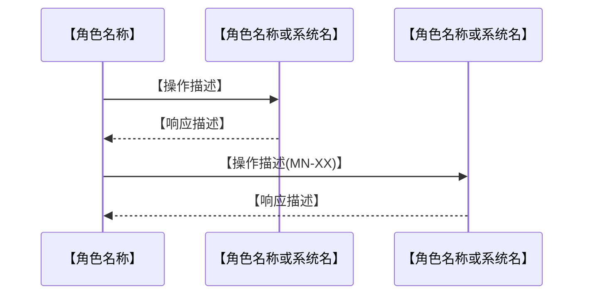

# 功能规划说明书：【产品/功能名称】

> **版本**：v1.0　｜　**状态**：草稿 / 审核中 / 已确认　｜　**PM**：AI 产品经理　｜　**日期**：YYYY-MM-DD

---

## 📌 填写规范（PM 必读，填写前确认）

| 规范项 | 要求 | 反例 → 正例 |
|--------|------|-------------|
| 功能描述有主语 | 禁用"支持 X""允许 Y"等无主语表述，必须说明触发条件和系统行为 | "支持导出 PDF" → "销售人员在报价记录详情页点击「导出 PDF」，系统弹出语言选择后渲染并下载文件" |
| 优先级统一 | 仅用 P0 / P1 / P2，不得用"高/中/低""核心/次要" | "高优先级" → "P0" |
| 边缘情况内嵌 | 子功能的异常路径在描述末尾以「**边缘情况**：」前缀内嵌，不单独起段 | 另起段落写边缘情况 → 在描述末尾写「**边缘情况**：清单为空时按钮置灰，…」 |
| 流程图终态完整 | 每条路径末端必须有终态节点，格式为 `([文字])`；禁止叶节点无出口悬空 | 节点写完就结束，无终态 → 补充 `([流程结束])` 终态节点 |
| 判断节点全覆盖 | 每个菱形 `{}` 节点必须标注所有分支出口条件，不得遗漏 | 菱形只连出"是"分支 → 补充所有分支并标注条件 |

---

> **`[Must]` 正文禁内联变更标记（SSOT #79，跨阶段）**：本阶段产物正文**禁**写 `【vN.N 新增】`/`【历史留痕…】`/含 `CR-…`/`议题 #…`/`SSOT #…` 的圆括号等版本 / 变更标记。变更历史只走**变更记录表 + git**；**查版本差异请用 `git diff` 命令**，不要在正文留内联标记——否则会顺前序阶段被搬进交付 spec/prd，影响下游阅读。**正向原则（该怎么写）**：成果正文只描述产品**当前态**（本版应有的样子），不留新旧版本对照 / 演进批注；版本演进信息只进变更记录表 + git。schema 标记（如 `【业务定位】`…）+ 派生溯源 `（来源：…）` 不在此列。`precheck_stage1/2/3/4` 各 `check_no_inline_change_markers` WARN；定位用 `strip_inline_change_markers.py`（只读报告，删除 PM 手动做）。详 `rule_hard_constraints.md §六 S4-68`。

## 📐 阶段分层粒度纪律（[Must]，SSOT #54）

> **本节定位**：约束阶段 2 产物的描述粒度 + UI 字面来源标注。防"PM 在 mermaid label / 子功能描述中前置写 UI 排版细节 → 后续 UI 调整时跨阶段同步漏判"盲区。详 `rule_hard_constraints.md §S2-XX`。

**阶段 2 功能规划允许 / 禁止写入清单**：

- ✅ **主体写入**（核心层）：模块拆解 / 子功能 / 依赖关系 / mermaid 节点语义 / 系统响应描述
- ✅ **允许 UI 字面承载客户原始诉求**，**`[Must]` 必须显式标注来源**：
  - 标注格式：**`【来源：产品总监诉求 / 客户访谈 / issue #N】`**（同阶段 1）
  - 示例：`【来源：客户访谈】"暂未配置主页包"提示页`
- ❌ **禁写 mermaid label 内 UI 排版细节**：
  - 反例：`节点A[导出 + 资源详单 + 矩阵预览]`（mermaid label 含 UI 字面 → 粒度污染）
  - 正例：`节点A[导出资源（按 NB-210 矩阵）]`（业务语义层）
- ❌ **禁写 PM 推导的 UI 实现细节**（属阶段 4 落点）
- ❌ **禁写阶段 3 / 阶段 4 落点细节**：
  - 阶段 3 落点（交互意图 / 状态机 / 行为描述 / 接口 schema）
  - 阶段 4 落点（视觉细节 / 文案最终字面 / 元素排布 / 帧 / 触点）

**Why（治"mermaid label UI 排版细节前置"根因）**：
- 历史教训：阶段 2 mermaid 节点 label 含"+ 资源详单"/"+ 矩阵预览"等 UI 排版字面，UI 调整时跨阶段同步漏判（mermaid 是 visual model 容易被当作"图示无关业务规则"）
- 治本：mermaid label 仅承载业务语义；UI 字面带【来源】标注（客户原始诉求合法承载），无来源 → 粒度污染清回业务粒度
- 兼容：现有产物无标注 → WARN 不阻断（产品总监已决策）

**机械兜底**：`precheck_stage2.py S2-XX UI 字面来源标注校验`（含 mermaid label 关键词扫描 + ±2 行无【来源：…】→ WARN [Recommended]，不阻断 EXIT=0）

**Supervisor 审核**：`AI产品主管_Agent.md §4.0.X 调整层次纪律核查`（PM 提交阶段 2 时 UI 字面 / mermaid label UI 字面无标注 → WARN 档）

---

## 一、功能模块清单

<!--
两层结构：模块总览表 → 各模块子功能表。
模块总览给出全局视图，各模块子节给出详细子功能。

填写依据：
- 模块（M1/M2…）来自 `epic-breakdown-advisor` skill 的 Epic 拆分结果，每个 Epic 对应一个模块；
  模块优先级来自拆分评估（是否揭示低价值工作），低价值 Story 聚集的模块降为 P1/P2 或排除。
- 子功能（MN-XX）对应拆分出的每条 Story；
  功能描述内容来自 `user-story` skill——将 Mike Cohn 格式的"I want to [action]"转化为触发条件+系统响应，
  Gherkin "Given/When/Then" 中的异常路径转化为末尾的「**边缘情况**：」内嵌描述。
-->

### 模块总览

| 模块编号 | 模块名称 | 优先级 | 说明 |
|----------|----------|--------|------|
| M1 | 【模块名称】 | P0 | 【一句话说明该模块的核心作用】 |
| M2 | 【模块名称】 | P0 | 【说明】 |
| 【MN】 | 【模块名称】 | P0/P1/P2 | 【说明】 |

---

### M1：【模块名称】

<!--
核心交互逻辑（如有，复杂模块使用）：
- 最多 5 条结构化要点（编号或 bullet），禁止散文段落
- 说明子功能之间的执行顺序或关键约束
- 简单模块直接跳过此处，直接写子功能表
-->

| 子功能编号 | 子功能名称 | 优先级 | 功能描述 |
|------------|------------|--------|----------|
| M1-01 | 【子功能名称】 | P0 | 【触发条件 + 核心操作 + 系统响应。有边缘情况时末尾追加：**边缘情况**：[异常路径及处理方式]】 |
| M1-02 | 【子功能名称】 | P1 | 【描述】 |

---

### M2：【模块名称】

<!--
核心交互逻辑（如有，复杂模块使用）：
- 最多 5 条结构化要点（编号或 bullet），禁止散文段落
- 说明子功能之间的执行顺序或关键约束
- 简单模块直接跳过此处，直接写子功能表
-->

| 子功能编号 | 子功能名称 | 优先级 | 功能描述 |
|------------|------------|--------|----------|
| M2-01 | 【子功能名称】 | P0 | 【描述】 |

---

<!-- 按需继续添加 M3、M4…… 结构完全相同 -->

---

## 二、业务流程图

> **`[Must]` 本章节是 spec.md `§3.4 业务流程图` 的 SSOT 主源**——阶段 4 PM 在拼装 spec.md 时，将本章节全部 mermaid 块（含 2.1 主流程 / 2.2 跨角色交互 / 2.3 补充流程）按原标题层级迁入 spec §3.4，禁止在阶段 4 凭空新写或删减。
> **调整方向**：先改本章节 → 再让阶段 4 重新拼装 spec.md → 禁止反向（直接改 spec §3.4 而不回写本章节）。详见 `pm-workflow/rules/proto_spec_md.md §3.4`。
> **prd.html 默认不渲染业务流程图**——业务方消费品已由 prd A-04 用户旅程覆盖体验视角；产品定义层显式要求时按 `pm-workflow/rules/proto_contract.md §十一` flow section 豁免规则处理。
> **`[Recommended]` 流程图类型选型**：业务流程 / 跨角色泳道 / 时序图 / DFD / 决策树 / 多端协作等 10 类流程图选型按需对照 `pm-workflow/rules/proto_business_flow_selection.md`（SSOT 双锚 #70 真源，决策路径性质，非硬约束；业务语境敏感场景以 PM 判断 + 产品总监确认为准）。

<!--
流程图通用格式规则（所有图均适用，PM 自审时逐项检查）：

✅ 规则1：终态完整
  每条路径末端有终态节点，格式：([文字])
  示例：([报价完成，跳转报价记录详情页])

✅ 规则2：判断节点全覆盖
  每个菱形 {} 节点的所有分支都有出口条件标注，不得遗漏任何路径

✅ 规则3：模块 ID 标注
  流程中涉及具体功能操作时，节点描述内用括号标注对应子功能编号
  示例：草稿冲突检查(M2-20)

✅ 规则4：禁止孤岛节点
  所有节点必须有入边或出边，不得存在未连接的浮动节点

图类型选择规则：
  单角色内部操作流程       → flowchart TD
  跨角色 / 跨系统交互时序  → sequenceDiagram
  实体状态变化             → stateDiagram-v2
-->

### 2.1 主流程总览（必选）

<!--
必须存在，覆盖需求分析所有核心业务场景的入口 → 流程 → 终态。
填写依据：流程骨架来自 `user-story-mapping` skill 的 Backbone（Activities），从左到右对应用户旅程时间顺序；
每个 Activity 下的 Steps 对应流程图中的具体操作节点；故事地图的迭代切片（Release 1/2）可体现为注释或分支标注。
图类型：flowchart TD
若主流程节点超过 30 个，可将子流程拆至 2.3，主图节点处标注「见 2.3.X」。
-->

```mermaid
flowchart TD
    Start([【入口描述，如：销售人员进入系统】]) --> A{【第一个决策点】}

    A -->|【分支条件一】| B[【操作节点】]
    A -->|【分支条件二】| C[【操作节点】]

    B --> D[【后续操作(MN-XX)】]
    C --> D

    D --> End([【终态描述，如：流程结束】])
```

---

### 2.2 跨角色交互流程（条件必选）

<!--
有以下任一情况时必须存在：
  - 涉及多个角色协作（如销售人员 + 客户 + 系统）
  - 涉及外部系统数据流转（如询价申请模块 → 报价工具）
  - 涉及异步回写（如报价完成后 PDF 附加至询价记录）

图类型：sequenceDiagram
要求：
  - 所有参与者（participant）必须在图头声明
  - 每段交互必须有明确的终止点，不得以开放性箭头结尾
  - 系统自动触发的动作用 ->> 和 -->> 区分请求与响应

无跨角色/跨系统场景时删除本节。
-->



---

### 2.3 补充流程（按需）

<!--
用于从主流程拆出的复杂子流程，或需要单独说明的内部状态逻辑。
- 每张图须有小标题，说明覆盖范围
- 图类型：flowchart TD 或 stateDiagram-v2
- 同样遵守通用格式规则
- 无需补充时删除本节
-->

#### 2.3.1 【补充流程名称，如：报价清单页内部交互流程】

```mermaid
flowchart TD
    Enter([【进入此子流程的触发条件】]) --> A[【操作节点(MN-XX)】]

    A --> B{【判断条件】}
    B -->|【条件一】| C[【处理方式】]
    B -->|【条件二】| D[【处理方式】]

    C --> End([【子流程终态】])
    D --> End
```

---

## 三、产品架构

> **`[Must]` SSOT 真源声明（双锚 #40）**：本节（尤 3.2 模块依赖关系表）是产品模块架构的**业务定义真源**，下游派生：阶段 3 `tmpl_产品定义.md §6.5 产品架构`（复述，precheck_stage3 模块数对称）→ PM 子阶段一据此构建 `scaffold.json modules[]`（name / 可选 purpose / depends_on）→ 阶段 4 `assemble.py` 现场派生 spec §3.0 + PRD spec-sitemap「模块架构说明」（precheck_stage4 S4-31 数对称）。调整方向：先改本节 → 下游逐层重派同步；禁反向。3.1 页面架构树另由阶段 4 §3.0/spec-sitemap 自动派生（SSOT #38），下游不重复人工搬运。

> **`[Must]` 页面集守恒 SSOT 基线声明（双锚 #74）**：3.1 页面架构 + 3.3 核心页面说明所定义的**页面集合**是**经产品总监审核通过的页面集基线（SSOT）**。后续所有阶段（阶段 3 §6 路由表 / 阶段 4 `scaffold.json` pages）的页面集**必须 ⊆ 本基线**——PM **不得擅自新增**阶段 2 未定义的页面（forward-only 守恒）。
>
> - **内嵌 ≠ 独立页**：本节标注为「内嵌某页」（如「强制下架卡片 = M01-P01 卡片 1 内嵌」）的 UI 面，下游**只能作为承载页的子状态 / 子区域**承载，**禁止外化为独立 page**；modal / 弹窗按工作流既有 convention，但同样以本节是否赋予其独立承载语义为准。
> - **唯一例外（escalation，禁擅自加页）**：当 PM 判断**现有页面结构导致某业务流程无法闭环**（缺承载页则业务路径走不通）时，**不得擅自加页**，须按 `agent_dispatch_protocol.md` 第 8 条「页面集守恒缺页 escalation SOP」**显式上报产品总监**（书面列：缺口位置 / 为何现有页无法闭环 / 建议新增页 / 影响范围），由产品总监拍板后**回写本节基线**，再向下游传导。
> - **与 SSOT #38 正交边界**：#38 管「页面层级**怎么渲染派生**」（`scaffold.json` 仍是阶段 4 渲染真源 → spec §3.0 / PRD sitemap 派生，**方向不变**）；#74 管「页面集**成员不得擅自扩张**」（守恒约束）。二者正交，**非方向倒置**。
> - **机械兜底**：`scaffold.json` 每页可选 `page_source` 字段（`stage2` 追溯本基线 / `director_approved:<YYYY-MM-DD>` escalation 批准）+ `precheck_stage4.check_page_source_provenance`（SSOT #74 WARN）+ Supervisor 中段审核反查项（scaffold pages ⊆ 阶段 2 基线，详 `AI产品主管_Agent.md`）。调整方向：先改本节基线 → 下游 scaffold pages + page_source 同步；禁反向。

### 3.1 页面架构

<!--
ASCII 树形结构，按功能层级展示页面组织。
填写依据：顶层分区对应 `user-story-mapping` skill 的 Activities（用户旅程骨架），
二级页面对应各 Activity 下的 Steps，叶节点对应具体 Task/Story 的落地页面或操作入口。
括号内标注对应模块编号（如 [M1-01]）。
有多个端口时（手机端 + 桌面端）分别列出。
-->

```
【产品名称】（【端口名，如：手机端主要流程】）
│
├── 【一级页面/模块】                            [MN]
│   ├── 【子页面】                              [MN-XX]
│   └── 【子页面】                              [MN-XX]
│       └── 【操作 → 跳转目标（MN-XX）】
│
└── 【一级页面/模块】                            [MN]
    └── 【子页面】                              [MN-XX]
```

---

### 3.2 模块依赖关系

<!--
只写运行时依赖（A 的功能需要调用/读取 B 的数据或接口）。
不写逻辑上的关联或设计上的参考关系。
-->

| 模块 | 依赖于 | 说明 |
|------|--------|------|
| 【模块名】 | 【被依赖模块名】 | 【依赖原因：A 用到 B 的什么数据/接口，一句话】 |

---

### 3.3 核心页面说明

<!--
「端」列固定选项：手机端 / 桌面端 / 两端 / 移动端响应式
不得使用其他表述。
-->

<!--
「对客」列填写规则（角色名以产品定义 §3 用户画像中实际角色为准,不强制使用以下示例字面）：
  - 是：外部用户角色（产品定义 §3 中标注为对外角色,如示例项目的"客户端访客"）可直接访问的页面,须在 §3.4 补充优化说明
  - 否：仅内部用户角色（产品定义 §3 中标注为对内角色,如示例项目的"销售人员/管理员"）使用的页面
-->

| 页面名称 | 访问者 | 关键交互 | 端 | 对客 |
|----------|--------|----------|----|------|
| 【页面名称】 | 【角色名】 | 【最核心的 1-2 个操作，一句话】 | 手机端 / 桌面端 / 两端 / 移动端响应式 | 是 / 否 |

---

### 3.4 对客页面优化说明

<!--
仅当 3.3 中存在「对客=是」的页面时填写，否则注明"本产品无对客公开页面，本节不适用"。
内容须与需求分析 §5.4 的约束保持一致，此处落实到具体页面。
-->

| 对客页面 | SEO 关键词 / Title 方向 | Schema 类型 | SSR/SSG 要求 | 备注 |
|----------|------------------------|------------|-------------|------|
| 【页面名称】 | 【Title 示例 + 目标关键词】 | 【如 Product / Organization / WebPage】 | SSR / SSG / 不要求 | 【其他特殊说明】 |

---

## 四、问题清单

<!--
两个子节必须同时存在，不得删除任一子节。
无阻塞性问题时：4.1 表格内填一行「本阶段无阻塞性问题」。
无非阻塞性问题时：4.2 表格内填一行「本阶段无非阻塞性问题」。
状态列选填：待确认 / 已确认
-->

### 4.1 阻塞性问题

> 以下问题在获得解答前，相关功能 / 流程的设计工作暂停。

| 编号 | 问题描述 | 影响范围 | 待确认内容 | 状态 |
|------|----------|----------|------------|------|
| P-101 | 【具体描述歧义或模糊点】 | 【哪些模块或子功能受影响】 | 【需要产品总监明确的具体答案】 | 待确认 |

### 4.2 非阻塞性问题

| 编号 | 问题描述 | 处理方式 | 待确认内容 | 状态 |
|------|----------|--------------|------------|------|
| NB-101 | 【具体描述疑问点】 | 【当前暂时如何处理该模糊点】 | 【希望产品总监确认的具体内容】 | 待确认 |

---

## 五、自审检查清单

<!--
PM 完成文档后逐项核查，全部通过方可提交主管审核。
-->

- [ ] 3个分析技能已按序调用并产出结论（详见 PM Agent §五.2 技能调用验证）
- [ ] 功能模块清单与需求分析功能边界（§4.1）完全对齐，无扩需求，无遗漏
- [ ] 模块总览表已填写，每个模块均有编号、名称、优先级、说明
- [ ] 每个模块均有子功能表，子功能编号格式正确（MN-XX），优先级已填写（P0/P1/P2）
- [ ] 功能描述包含触发条件和系统行为，无"支持 X""允许 Y"类无主语表述
- [ ] 「核心交互逻辑」说明（如有）采用结构化要点，不超过 5 条，无散文段落
- [ ] 主流程图（2.1）已存在，覆盖需求分析所有核心业务场景的完整路径（入口 → 终态）
- [ ] 有跨角色 / 跨系统交互场景时，2.2 中已用 sequenceDiagram 描述；无则已删除该节
- [ ] 所有流程图通过通用格式规则检查：
  - [ ] 每条路径末端有终态节点 `([...])`，无悬空叶节点
  - [ ] 每个判断节点（菱形）所有分支均有出口条件标注
  - [ ] 涉及功能操作的节点已标注模块编号
  - [ ] 无孤岛节点（每个节点有入边或出边）
- [ ] 3.1 页面架构树与模块编号对应一致
- [ ] 3.2 模块依赖关系表已填写，只包含运行时依赖
- [ ] 3.3 核心页面说明已填写，「端」列使用固定选项，「对客」列已判断并填写
- [ ] 若存在对客页面：3.4 已按页面逐一填写 SEO / Schema / SSR 说明；若无：已注明"本节不适用"
- [ ] 问题清单已按阻塞性 / 非阻塞性分级，两个子节均存在（无问题时填「本阶段无 XX 问题」）
- [ ] 所有阻塞性问题已上报并获得解答后方继续推进
- [ ] latest 文件已写入 `outputs/功能规划_[产品名]_latest.md`
- [ ] 旧版本已归档，归档文件名格式正确（`process_record/versions/功能规划_[产品名]_v[版本]_[日期].md`）
- [ ] 文件末尾已附加变更记录表，版本号、变更内容、日期均已填写
- [ ] process_record/state.md「当前阶段产物」表中阶段2路径已更新

---

【✅ PM 自审完成，提交主管审核】

---

## 六、变更记录

| 版本 | 变更内容 | 变更原因 | 变更人 | 审核人 | 日期 |
|------|---------|---------|--------|--------|------|
| v1.0 | 初始版本 | 新需求启动 | PM Agent | | YYYY-MM-DD |
