# 工作流架构地图（L2 影响范围评估依据）

> **本文件定位**：AI 编排器 + 人类项目维护者**共用**的架构地图。每次 L2 改动前查此文件评估影响范围，避免漏改 SSOT 双锚的下游派生。结构性指针式设计 —— 只列「路径 / 一句话 / 关系」，不复刻具体文件内容，**地图本身的维护负担恒定**。

---

## TL;DR

- **改 L2 前必看**：第 §五「改动影响速查表」，按"改 X → 同步 Y"对照
- **理解整体**：第 §一「架构全景图」mermaid + 第 §六「关键边界」
- **找具体文件**：第 §三「文件分组功能表」按分组速查
- **理解 SSOT 真源/派生关系**：第 §四「SSOT 双锚 TOP 5」+ 完整清单见 `ssot_anchors.md` 头部（动态计数，基数以该文件头部为准）

---

## 如何使用本文件

| 场景 | 跳转节 |
|------|--------|
| 准备改一个 L2 文件，想知道要同步改哪些 | §五 |
| 第一次接手项目，想理解整体架构 | §一 + §二 + §六 |
| 想知道某个文件是做什么的 | §三 |
| 想理解某对 SSOT 真源/派生关系 | §四 + `ssot_anchors.md` |
| 4 阶段执行链路细节 | §二 |
| 新增 L2 文件后是否要更新本地图 | §七 维护守则 |

---

## 一、架构全景图

```mermaid
graph TB
    subgraph Top["顶层规则 L2"]
        CLAUDE[CLAUDE.md]
        SSOT[ssot_anchors.md<br/>SSOT 双锚清单]
        DISPATCH[agent_dispatch_protocol.md]
        METHOD[agent_methodology.md]
        HARD[rule_hard_constraints.md]
        MAINT[workflow_maintenance_protocol.md]
        MAP[workflow_architecture_map.md<br/>本文件]
    end

    subgraph Commands[".claude/commands"]
        NEW[newRequirement]
        NEXT[nextStage]
        STATUS[projectStatus]
        CHANGE[changeRequest]
        RETRO[retro]
        SYNC[syncUpstream]
    end

    subgraph Agents["角色规范"]
        PM[AI产品经理_Agent]
        SUP[AI产品主管_Agent]
    end

    subgraph Tmpl["阶段 1-3 模板"]
        T1[tmpl_需求分析]
        T2[tmpl_功能规划]
        T3[tmpl_产品定义]
    end

    subgraph Stage4["阶段 4 规范"]
        CONTRACT[proto_contract]
        SPECMD[proto_spec_md]
        PRDSTD[prd_expression_standard]
        PRDHTML[prd_template.html<br/>CSS/JS 真源]
        PROJ[proj_component_protocol]
        TASK[task_card_template]
        PLAT[proto_platform_*]
    end

    subgraph FB["bujue-design-system"]
        PUBIDX[pub_components_index]
        FALLCSS[fb-fallback.css]
        FALLMAN[fb-fallback-manifest]
        TOKENS[tokens.md]
        COMP[components/*.md]
    end

    subgraph Scripts["scripts 兜底"]
        PCALL[precheck_stage1-4.py]
        PCC[precheck_common.py]
        ASM[assemble.py]
        GEN[gen_scaffold.py]
        CSS[check_css_sync.py]
        STRUCT[structure_check.py]
        HOOK[hooks/pre-commit]
        OTHER[check_state_paths<br/>check_issues_format<br/>check_rule_coverage]
    end

    subgraph Skills["Skill"]
        WE[workflow-evolution]
        SK[proto-persona/JTBD/PS/<br/>OST/USM/user-story/epic]
    end

    subgraph PR["process_record"]
        STATE[state.md]
        LEDGER[decisions_ledger.md]
        PROG[progress/]
        REV[reviews/]
        TASKS[tasks/scaffold.json]
        DRAFTS[drafts/]
        ISSUES[issues/]
        VER[versions/]
    end

    CLAUDE --> SSOT & DISPATCH & METHOD & MAINT & MAP
    DISPATCH -.派 Agent.-> PM & SUP
    DISPATCH -.L2 skill.-> WE
    NEW --> DISPATCH
    NEXT --> DISPATCH
    RETRO --> ISSUES
    PM -.读阶段模板.-> T1 & T2 & T3
    PM -.阶段4读规范.-> CONTRACT & SPECMD & PRDSTD & PROJ & TASK & PLAT
    PM -.读组件库.-> PUBIDX & FALLMAN & TOKENS & COMP
    T1 & T2 & T3 -.校验.-> PCALL
    CONTRACT & SPECMD & PRDSTD & PROJ -.校验.-> PCALL
    PRDHTML -.SSOT #4.-> PRDSTD & CSS
    FALLCSS -.SSOT #2.-> FALLMAN
    PUBIDX -.SSOT #11.-> FALLCSS
    GEN --> TASKS & DRAFTS
    ASM --> DRAFTS
    PM -.写.-> STATE & PROG & TASKS & DRAFTS
    SUP -.写.-> REV
    HOOK -.L1+L2 混提硬拦截.-> PR & Top
```



---

## 二、四阶段执行链路

```mermaid
flowchart TD
    A[/newRequirement] --> B[编排器创建 state.md<br/>+ decisions_ledger.md]
    B --> S1[阶段1 需求分析]
    S1 --> S1A[派 PM: 路径清单<br/>tmpl_需求分析 + methodology]
    S1A --> S1P[PM 跑 precheck_stage1<br/>FAIL→整改 PASS→自审]
    S1P --> S1S[派 Supervisor 审核]
    S1S -->|不通过| S1A
    S1S -->|通过| W1[🟡 等 /nextStage]
    W1 --> S2[阶段2 功能规划<br/>同闭环+precheck_stage2]
    S2 --> S3[阶段3 产品定义<br/>同闭环+precheck_stage3]
    S3 --> S4{阶段4 模块化 7+ Step}
    S4 --> S41[Step1: PM 任务规划<br/>产 scaffold.json + 任务卡]
    S41 --> S41X[Step1.X: Supervisor 中段审核<br/>≤3 轮独立计数]
    S41X -->|PASS| S415[Step1.5: gen_scaffold.py<br/>产骨架 + drafts/]
    S415 --> S42[Step2: Foundation Agent<br/>S0/S0.5/S1 + 规格区]
    S42 --> S425[Step2.5: 项目组件识别<br/>产 components_latest.md]
    S425 --> S43[Step3: 各模块 Spec 并行<br/>spec_M*_draft.md]
    S43 --> S44[Step4: assemble.py spec]
    S44 --> S45[Step5: 各模块 PRD 并行<br/>prd_M*_draft.html]
    S45 --> S46[Step6: assemble.py prd<br/>FRAME 替换 + CSS 注入]
    S46 --> S465[Step6.5: precheck_stage4.py<br/>24+ 项 FAIL 阻断]
    S465 -->|FAIL| S43
    S465 -->|PASS| S47[Step7: PM 自审]
    S47 --> S48[派 Supervisor 终审<br/>4.0.1 precheck PASS 验证]
    S48 -->|通过| W4[🟡 等终审]
    W4 --> DONE[全流程完成]
```

---

## 三、文件分组功能表

> 每行：路径 / 一句话定位 / 主消费者 / SSOT 角色（真源 / 派生 / 工具 / 元真源）。**不复刻文件内容**，需详情时直接 Read 该文件。

### 顶层规则（编排器 + 全角色入口）

| 文件 | 定位 | 主消费者 | SSOT |
|------|------|---------|------|
| `/CLAUDE.md` | 项目入口 + 编排器规则 + 调整意见 SOP | 编排器 | 真源 #19 |
| `/README.md` | GitHub 入口 + Setup + 快速开始（含 install_hooks.sh 指引） | 新克隆者 | 真源 |
| `ssot_anchors.md` | SSOT 双锚清单（动态计数，详见该文件头部）+ 5 要素维护守则 | 维护者 | 元真源 |
| `agent_dispatch_protocol.md` | 派发协议 + 阶段4 7步 + scaffold v2.0 schema | 编排器/PM/Sup | 真源 #1/#9/#31 |
| `agent_methodology.md` | T1-T6 + X1-X4 通用方法论 | PM/Sup | 真源 |
| `agent_parameters.md` | PM/Sup 角色参数实例化 | PM/Sup | 真源 #3 |
| `rule_hard_constraints.md` | 50+ 条 S/G 硬规则编号 | PM/Sup | 真源 #22 |
| `workflow_maintenance_protocol.md` | L2 维护守则 + 升级 SOP | 维护者 | 真源 |
| `workflow_architecture_map.md` | 本文件（架构地图） | 双方 | 派生（指针式） |

### 角色规范

| 文件 | 定位 | SSOT |
|------|------|------|
| `pm-workflow/agents/AI产品经理_Agent.md` | PM 行为 + 4 阶段自审清单 | 真源 #21/#36 |
| `pm-workflow/agents/AI产品主管_Agent.md` | Sup 审核 + 4.0.1/4.0.2 前置门 | 真源 #35 |

### 阶段 1-3 模板（输入→产出 规范）

| 文件 | 阶段 | SSOT |
|------|------|------|
| `tmpl_需求分析.md` | 1 | 真源 #26/#32/#36 |
| `tmpl_功能规划.md` | 2 | 真源 #27/#30/#40 |
| `tmpl_产品定义.md` | 3 | 真源 #24/#28/#30/#32；派生 #40（§6.5）|

### 阶段 4 交付规范（PRD / spec 生产）

| 文件 | 定位 | SSOT |
|------|------|------|
| `proto_contract.md` | 全局约束 + M/P/T/D 编号体系 | 真源 #13/#23 |
| `proto_spec_md.md` | spec.md 结构规范（含 §3.0 页面层级架构 + 页面结构范式契约段 + §四 页面结构骨架屏 + §三.5 草稿章节标准）| 真源 #14/#29/#41；派生 #38/#39 |
| `prd_expression_standard.md` | PRD 文档结构 + §零 z-index 表 + spec-sitemap（4 块 colocate 含 sk-askel）+ §A-09 范式骨架画廊+帧旁 chip/override（WE-H per-archetype） | 派生 #2/#4/#38/#41 |
| `prd_template.html` | PRD 主模板 CSS/JS 真源（含 .sk-* 骨架色块 + applySkeletonDims）| 真源 #2/#4/#25；视觉真源 #41（经 #4）|
| `proj_component_protocol.md` | proj 组件 + §5.4 父容器契约 | 真源 #8/#34 |
| `task_card_template.md` | 阶段4 模块任务卡模板 | 真源 #10 |
| `proto_platform_app/desktop/h5/miniprogram.md` | 4 端帧规范 | 真源 |
| `proto_cross_platform.md` | 跨端规范 | 真源 |
| `proto_data_display_selection.md` | 数据展示方式选型决策路径（列表 / 详情 / 异常态 / 海量 / 主从布局）| 真源（决策手册性质，非硬约束）|
| `proto_business_flow_selection.md` | 业务流程图选型决策路径（10 类全集矩阵 + 4 缺口补全 DFD/决策树/时序图辨析/多端协作）| 真源 #70（决策手册性质 + 配套 `precheck_stage4.check_business_flow_diagrams` v3 WARN-only 机械兜底）|
| `proto_prd_html.md` ⚠️ | **legacy 存档**（2026-04-22 已拆分到 proto_contract / prd_expression_standard / proto_spec_md / proto_platform_*，**不再使用**） | 备查 |
| `proto_spec_legacy.md` ⚠️ | **legacy 存档**（原《Prototype_Design_Spec.md》备份，**不再使用**） | 备查 |

### 设计系统 `bujue-design-system/`

| 文件 | 定位 | SSOT |
|------|------|------|
| `fb-fallback.css` | 兜底 CSS 技术真源（assemble 注入） | 真源 #2/#11 |
| `fb-fallback-manifest.md` | 27 anchor HTML 模板 + 调用清单 | 派生 #2/#15 |
| `pub_components_index.md` | pub 组件检索入口（PM 优先读） | 真源 #11 |
| `tokens.md` | 颜色/字体/间距 token 唯一源 | 真源 |
| `components/*.md` | 单组件规范（button/input/card/tag-tab/empty-loading） | 真源 |
| `COMPONENTS.md` ⚠️ | **存档**（旧合并文件,已拆到 tokens.md + components/*.md，**非 PM 工作流直接传入**） | 备查 |
| `INSTRUCTIONS.md` ⚠️ | **非 PM 工作流**（UI 工程师 HTML 改造后处理协议；UX 守则已内嵌 proto_contract.md §十三~§十四） | UI 工程师 |
| `icon-discovery.md` | iconfont 图标规范（200 个图标 + class 前缀 `.icon-`） | 真源 / 按需 |

### 脚本兜底 `pm-workflow/scripts/`

| 脚本 | 定位 | 触发时机 |
|------|------|---------|
| `precheck_stage1/2/3/4.py` | 4 阶段机械精检 | PM 自审第一步 |
| `precheck_common.py` | 共享 helper（角色表 / G-01/G-02） | precheck 调用 |
| `assemble.py spec\|prd` | spec/prd 拼装 + fingerprint 手改保护 + 页面层级图（#38）+ 页面结构范式契约表（#39）+ 范式骨架（#41 build_archetype_skeleton_md/_html → §3.0 子节 + PRD sk-askel 画廊，WE-H per-archetype）+ 帧旁 chip/override（inject_page_skeletons）+ 模块架构（#40）现场派生 + **破坏性 --force-overwrite 覆盖前自动备份（#80 B1）+ force 去静默列出刷新区（#80 B2）** | 阶段 4 Step 4/6 |
| `gen_scaffold.py` | scaffold→骨架+草稿+任务卡候选段 + spec-sitemap 空壳（#38）+ page_archetypes 首次闸校验（#39）+ Foundation 范式骨架草稿 `spec_foundation_draft.md` 每范式 ```skeleton 占位 + spec 草稿 S2.M[XX].1 per-page override-only marker（#41 WE-H）+ embedded_components 内嵌子组件渲染（第 4 层 nav + section/FRAME + draft FRAME）+ `iter_page_prd_ids` 统一 prd_id 收集 helper（#76 R3）+ **--force-rescaffold 覆盖 drafts/outputs 前自动备份（#80 B1，治覆盖已填 module drafts）** | 阶段 4 Step 1.5 |
| `gen_render_contract.py` | **（R8 全 5 层 done，SSOT #77 A 组）** 读 spec+scaffold → per-frame 渲染契约（触点 .3 per-state / 字段 .4 per-page / 平台 .2 具体平台 转录 + 人工对照 NB 区 + provenance 自证 + 含内嵌帧 iter_page_prd_ids）；`--write` 落 checklist 进任务卡 `[RENDER-CONTRACT-START]…[END]`。**忠实转录权威列禁推断**，确定性。5 层：导出（本脚本）+ Step 5 逐条强制执行 + data-tp/data-field 标记（`agent_dispatch_protocol Step 5` + `prd_expression_standard §6.2`）+ `precheck_stage4.check_render_contract`(S4-67 验标记 presence 零 FP)+ `AI产品主管 §4.4` 语义抽样 | 阶段 4 Step 4→5 + Step 6.5 |
| `strip_inline_change_markers.py` | **（SSOT #79 A 组，只读报告）** 全阶段产物正文内联变更标记 诊断报告工具：四分类器（schema/version/pure_ref/mixed）定位 + 分类 + 行号供 PM 手动改（**2026-06-10 审计移除 `--write` 自动删除——机械删除损伤语义**）；`PRECHECK_*_RE` + `warn_inline_markers` 单源供 `precheck_stage1/2/3/4.check_no_inline_change_markers`(S4-68) 复用。`--show-fused` | 全阶段 L1 标记定位（PM 手动清）+ precheck Step 6.5 校验 |
| `check_uncommitted_l1.py` | **（SSOT #79 推论机械兜底）** 开始新变更循环（调整意见/CR/nextStage）前扫 `outputs/` 未提交改动 → WARN「上个循环未提交，先 commit 保证 git diff 精确归属」；退出码恒 0 不阻断（[Should]）。编排器在三入口流程开始时调用 | 调整意见第四步 step 0 / changeRequest 1.2 / nextStage 第一步 |
| `doc_query.py` | **（SSOT #81 + #82 A 组）** 大文档目录 + 按需分节读取：outline 标题树（行区间/chars/≈tok）/ fetch 按标题取多节（`--max-tokens` 预算闸超额拒输出吐子目录）/ locate 正则反查章节路径 / **frames 列 outputs/prd FRAME 块 + fetch-frame 按 prd_id 取帧（#82 终审帧级遍历/抽样入口）**。PM/Supervisor 对 3 个派发基线大文件禁全读改分节（必读章节清单真源 = `agent_dispatch_protocol.md §大文件分节读取规范` SECTION-MAP 表 + `test_section_coverage.py` 防漏读元测试）；L1 大成果（产品定义/spec/prd）审核定位读/分批遍历读同样适用 | 所有 PM/Supervisor 派发 + Supervisor 阶段3/4 前序定位读 + 阶段4终审分节全量遍历（默认）/抽样（降级）（`AI产品主管_Agent.md §4.4 终审读取与覆盖协议`）|
| `check_css_sync.py` | template ↔ standard CSS 双向对账 | 维护时 / CI |
| `structure_check.py` | skill 三件套合规 + W 步前缀 | 维护时 |
| `check_state_paths.py` | state.md 路径存在性 | 维护时 |
| `check_issues_format.py` | issues/ 格式校验 | 维护时 |
| `check_rule_coverage.py` | rule↔precheck 元 SSOT 矩阵 | 维护时（SSOT #22）|
| `hooks/pre-commit` | L1+L2 混提硬拦截（SSOT #31）| 每次 git commit |
| `hooks/session_start_state_summary.py` | 新会话注入 state.md 摘要 | SessionStart |
| `install_hooks.sh` | hook 一键安装 | clone 后跑一次 |
| `add_i18n.py` | 阶段 4 prd 草稿 i18n 工具（B+ 档位 data-zh/data-en 注入） | PM（按需） |
| `lint_template_frame_coverage.py` | L2 模板多端 frame CSS 覆盖度机械检查（建议 8 落地） | 维护者 |
| `sync_skills.py` | skills 从上游 vendor 同步（drift detection + update） | 维护者 |

### Skill `pm-workflow/skills/`

| Skill | 定位 | 主消费者 |
|-------|------|---------|
| `workflow-evolution/` | L2 维护编排器直做（8 步 + 三道质量门） | 编排器（SSOT #33） |
| `proto-persona/jobs-to-be-done/problem-statement/opportunity-solution-tree/user-story-mapping/user-story/epic-breakdown-advisor` | 阶段 1-3 PM 分析框架 | PM |

### 斜杠命令 `.claude/commands/`

| 命令 | 触发 |
|------|------|
| `newRequirement.md` | 启动新需求（阶段 1 全闭环）|
| `nextStage.md` | 推进至下一阶段 |
| `projectStatus.md` | 工作流进度简报 |
| `changeRequest.md` | 需求变更（主版本 +1）|
| `retro.md` | 复盘 issues/ 找共性根因 |
| `syncUpstream.md` | （下游仓适用）从上游 claude-code-pm-workflow 拉取最新 L2 升级；自然语义触发（同步上游 / sync upstream / 同步 L2 / sync L2 等）也命中 |

### 过程记录 `process_record/`（L1 业务过程）

| 子目录 / 文件 | 用途 | 写入者 |
|--------------|------|--------|
| `state.md` | 工作流活动态单一事实源（当前阶段 / 产物路径 / 当前阶段 ⏳ 开放问题）| 全角色读 / 编排器写 |
| `decisions_ledger.md` | 已决策清单权威（✅已解答 / ✅已决策,append-only,SSOT #18 真源；B1 拆分 2026-05-23）| 全角色读 / 编排器写 |
| `progress/stage[N]_*_plan.md` | 分步执行进度（中断恢复）| PM / Sup |
| `progress/workflow_evolution_*.md` | L2 维护 skill 进度 | 编排器 |
| `reviews/stage[N]_review.md` | Supervisor 审核报告 | Sup 写 / 编排器读 |
| `tasks/scaffold.json` | 阶段 4 单一蓝图 | gen_scaffold / PM |
| `tasks/task_M[XX]_*.md` | 模块任务卡 | gen_scaffold / PM |
| `drafts/spec_M*_draft.md` `prd_M*_draft.html` | 模块草稿（assemble 拼装源）| PM 写 / assemble 读 |
| `issues/YYYY-MM-DD_HHMM.md` | 临时调整意见存档 | 编排器（按 CLAUDE.md SOP） |
| `versions/` | 历史归档 + assemble fingerprint | assemble / 编排器 |
| `changes/` | 需求变更记录 | /changeRequest |

> ⚠️ **整个 `process_record/` 被 `.gitignore` 排除**（本地过程记录，不入 git）。

### 业务产物 `outputs/`（L1 最终产出）

| 文件 | 阶段 | 命名 |
|------|------|------|
| `[阶段名]_[产品名]_latest.md` | 1-3 | 需求分析/功能规划/产品定义 |
| `spec_[产品名]_latest.md` | 4 (AI 交付) | assemble.py spec 拼装产物 |
| `prd_[产品名]_latest.html` | 4 (人类交付) | assemble.py prd 拼装产物 |
| `components_[产品名]_latest.md` | 4 (Step 2.5) | 项目组件库 |

---

## 四、SSOT 双锚 TOP 5 关键链路

> 完整清单见 `pm-workflow/rules/ssot_anchors.md` 头部（动态计数，基数以该文件头部为准）；本节只列对**架构理解最关键的 5 对**，作为速查指针。

| # | 双锚对 | 真源 → 派生 | 机械兜底 |
|---|--------|------------|---------|
| **#1/#9/#16** | scaffold v2.0 owner 流转链路 | `agent_dispatch_protocol §scaffold v2.0` + `scaffold.json` → 任务卡 C 表 + drafts/ + PRD OWNER-INFO + components A 表 | `gen_scaffold.validate_v2_schema` + `precheck_stage4.check_proj_owner` |
| **#2** | fb-fallback ↔ manifest ↔ standard z-index/frame | `fb-fallback.css` → `fb-fallback-manifest.md` + `prd_expression_standard §零` + `prd_template .frame-card{isolation}` | `precheck check_fb_fallback_sync` + 5 条 fail-loud + `assemble._overwrite_first_style_from_template`(<style>) + `assemble._overwrite_scripts_from_template`(<script>:mermaid CDN+内联,WE-ASM) 主动同步 |
| **#4** | PRD template CSS ↔ standard | `prd_template.html <style>` → standard \`\`\`css 块 | `check_css_sync.py` 字面对账 + 15 测试用例 |
| **#22** | precheck ↔ rule_hard（元 SSOT）| `rule_hard_constraints.md` S/G 编号 → check 函数 docstring | `check_rule_coverage.py --strict` 双向矩阵 |
| **#31** | PM L2 修订诉求 NB 上报 SOP | `agent_dispatch_protocol §6 第 6 条` → PM/Sup 角色规范 + CLAUDE.md Setup | `hooks/pre-commit` + `_check_pre_commit_hook_installed` |

---

## 五、改动影响速查表（**核心高价值表**）

> **L2 改动前必查此表**。每行：左列改的对象 → 右列必须同步检查/改动的下游。漏改 = SSOT 双锚漂移 = 下游派生层假阳性 FAIL 或视觉漂移等。

### `[Must]` L2 改动前置检查 SOP（/retro 2026-05-13 共性根因 4 防御）

任何 L2 改动（含 `workflow-evolution` skill 路径 + SOP 偏离时的直改 L2）开始前，**必须**按以下 5 步前置检查：

1. **查本节速查表（§五）** — 找"改 X → 同步 Y"对照行，列出本次需同步改动的所有下游派生位置
2. **若改 SSOT 真源** → 查 `pm-workflow/rules/ssot_anchors.md` 该双锚行的「派生视图」列，逐项核查派生层（precheck 硬编码字典 / 规范文件描述 / 真源 css / 任务卡 / 模板等）
3. **若改 precheck 加新 rule** → 必须同步 `rule_hard_constraints.md` 加 S4-XX 编号（描述 + 强制对应关系表 + Supervisor 审核项）+ 六.X 对照表行 + check 函数 docstring 顶行 `S4-XX：xxx` 反指 — 否则违反 SSOT #22 元 SSOT
4. **若涉及 path 重命名 / 内容下沉** → 跑本文件 §七 维护守则段「Path 重命名 checklist」+ broken link 自检命令
5. **若改 5 个模板文件之一**（`prd_template.html` / `tmpl_需求分析.md` / `tmpl_功能规划.md` / `tmpl_产品定义.md` / `task_card_template.md`） → 跑 `python3 pm-workflow/scripts/precheck_template_purity.py` 必须 PASS

**强约束理由**：跳过本 SOP 的 L2 改动 = 高漂移风险。本会话 /retro 复盘共性根因 4 显示，至少 3 次"范围评估盲区"事故（# 1 z-index legal_set 漂移 / # 4 frame position 漏判 / # 8 audit P0 S4-25 编号缺位）— 全部因 L2 改动前未查本表导致。

**与 workflow-evolution skill Step 1+7 关系**：
- skill 路径走 Step 1（任务理解 + 路径确认） + Step 7（SSOT 同步检查 9 项）已含本 SOP 的等效检查项
- **本 SOP 适用范围更广**：包括 SOP 偏离时的直改 L2（如下游 PM 在 L1 任务期间发现 L2 缺陷直改场景）— 即使不走 skill 流程，也必须跑本 5 步前置 SOP

---

### 速查表内容

| 改 X | 必须同步检查 / 改 Y |
|------|---------------------|
| `prd_template.html` 的 `<style>` 块 CSS | 同步 `prd_expression_standard.md §九` \`\`\`css 块（如有）+ 跑 `check_css_sync.py` PASS；若涉及 frame 类 → 同步 `fb-fallback-manifest.md` + `precheck_stage4.check_frame_card_isolation`（SSOT #2/#4）|
| `prd_template.html` 的 `<script>` 块 JS（mermaid CDN 标签 / 尾部内联块）| 派生层 `outputs/prd` 由 `assemble._overwrite_scripts_from_template` 重生时自动覆盖同步（WE-ASM，SSOT #2 派生 5）；**注意：仅修 template 不会回改已有 `outputs/prd`，须各产品仓重跑 `assemble.py prd`**；改正则锚定逻辑须跑 `tests/test_assemble_script_sync.py`；**若 JS 注释/选择器含 ` ```mermaid `/`<pre class="mermaid">` 字面 → 见下「新增/改 mermaid 渲染 JS」同族对称行（check_prd 须剥 script/注释域）** |
| `prd_expression_standard.md` 区块 C（交互说明 4 段 C-0/C-1/C-2/C-3 + E.3 inline 字号防御 + 自造结构禁令）| 同步 `prd_template.html` `.interaction-card` 段 CSS（含 .state-diff-note）+ `precheck_stage4.check_interaction_card_no_inline_font`（S4-40 WARN）+ `precheck_stage4.check_interaction_card_class_compliance`（S4-41 WARN，2026-06-02 NB-WE-04 闭环）+ `tests/test_precheck_stage4.py TestS440/TestS441` + `ssot_anchors.md #62`（SSOT #62）|
| `bujue-design-system/tokens.md` Skeleton 尺寸 Tokens 段（10 个 --skel-* token）| 同步 `prd_template.html` :root + 平台 selector（`.phone-frame/.desktop-frame/.h5-frame .fb-state-loading` 自动应用 padding + 圆头像 + 文本行）+ `precheck_stage4.check_skeleton_inline_padding`（S4-42 WARN）+ `tests/test_precheck_stage4.py TestS442` + `ssot_anchors.md #63`（SSOT #63 下游 D1 治本）|
| `proto_contract.md §四 触点容器级唯一性纪律` + `§S4-24` 概念升级 | 同步 `rule_hard_constraints.md §S4-43` + `precheck_stage4.check_prd_data_tp_container_uniqueness`（S4-43 WARN dry-run）+ `tests/test_precheck_stage4.py TestS443` + `ssot_anchors.md #64`（SSOT #64 下游 D2 治本）|
| `proto_contract.md §四 触点编号系统 + §四.A 触点前缀三系` T/D/C 升级 | 同步 `precheck_stage4.py` 11 处 `[TD]` → `[TDC]` 正则升级（`check_touchpoint_canonical` + `DATA_TP_RE` + `TOUCHPOINT_RE` 等向后兼容）+ `rule_hard_constraints.md §S4-34 v2 升级段` + `ssot_anchors.md #65`（SSOT #65 下游 D3 治本，4 项闭环；scaffold kind 字段扩 'container' + C 判定独立 precheck 挂 NB-WE-06）|
| `fb-fallback.css` 新增 selector | 同步 `fb-fallback-manifest.md` HTML 示例 + `pub_components_index.md §三 组件总表` + 跑 `precheck_stage4.check_fb_fallback_sync`（SSOT #2/#11）|
| `fb-fallback.css` 改 z-index 数值 | 同步 `prd_expression_standard.md §零.1` z-index 表 + `precheck_stage4 check_z_index_compliance` legal_set + `tests`（SSOT #2 第 5 要素加固）|
| `fb-fallback.css` 改交互态规则（`:hover` / `:focus` / `.is-selected` / `.is-active` / disabled 视觉）| 同步 `tokens.md §设计迭代压缩` 交互态标准表（SSOT #46，B 组——无机械兜底，靠 `workflow-evolution` skill Step 7 人工同步）|
| `tmpl_需求分析.md` 章节/字段 | 同步 `precheck_stage1.py` 对应 check 函数 + `precheck_common.extract_role_table` 若涉及角色表 + `tmpl_产品定义.md §1` 复述段（SSOT #26/#32/#36）|
| `tmpl_功能规划.md` 章节 | 同步 `precheck_stage2.py` + 若改 §二业务流程图 → `tmpl_产品定义.md §5.5` + spec §3.4 + PRD A-04.2 + **4 处 precheck**（SSOT #27/#30：`check_section_5_5` + `check_business_flow_in_spec` + `check_business_flow_in_prd` + `check_spec_business_flow_double_view` S4-66 双视图三件套 议题 25/26）；**若改 §三 产品架构 → `tmpl_产品定义.md §6.5` 复述 + scaffold.modules + spec §3.0/PRD spec-sitemap 模块架构说明 + precheck_stage3.check_section_6_5 + precheck_stage4.check_module_architecture（SSOT #40）**|
| `prd_expression_standard.md` §A-04.2 业务流程图 / §零 sitemap 急渲段（L305） | 同步规范双向反 pattern 互引（L305 sitemap 急渲 ↔ §A-04.2 business-flow 懒渲 + L640 派生方向表 [Must] 加粗 + §A-04.2 tl;dr 概览块 4 行）+ `precheck_stage4.check_spec_business_flow_double_view`（S4-66）+ `AI产品经理_Agent.md §三.6 §1.D 引用规范 3 项实证`（白名单 + grep 实证 + 完整段落 ≥ 5 行 + 对立字面自检）+ `ssot_anchors.md #30` 派生方 4 处 precheck 同步（议题 25/26 防张冠李戴三层防御）|
| `prd_expression_standard.md` L250-251 业务流程图 nav 归属 / §A-04.2 L642 [Must] 侧栏导航 | 议题 27 规范矛盾修复（L250-251 vs L642 内部对立 → 按 §A-04.2 L642 [Must] 修复 业务流程图 nav 归"产品规格"组紧跟用户旅程）→ 同步 `prd_template.html` L996 SPEC_ITEMS 注释（8→9 + 加业务流程图行）+ L1009 SITEMAP_NAV 注释（5→4 删业务流程图行）+ `gen_scaffold.py` 删 `SITEMAP_NAV_MOVED_SECTIONS` 机制（build_spec_nav 全量 9 项 + build_sitemap_nav 4 项）+ `tests/test_page_skeleton.py` test_sitemap_nav_5_items 改 4_items + 新增 test_spec_nav_9_items_incl_business_flow；同型 [[feedback-l2-commit-msg-design-vs-impl-gap]] 规范 vs 实现脱节族 + 议题 26 §1.D 对立字面忽略反 pattern |
| `gen_scaffold.py` build_spec_nav / build_sitemap_nav 结构变更（sidebar 结构层 SSOT #38 派生方完整化）| 议题 28 NB-WE-NAV-OVERWRITE 派生层兜底（治"议题 27 修 sidebar 结构后 outputs/prd 不自动重生"哑修复根因）→ 同步 `assemble.py` 新增 `_overwrite_sidebar_nav_structure_from_template`（仿 `_overwrite_first_style_from_template` NB-WE-20 / `_overwrite_scripts_from_template` WE-ASM 同模式 + import gen_scaffold + build_*_nav 真源 + `<div class="sidebar-group-body" data-group-body="spec\|sitemap">` regex 整段重写 + idempotent）+ main `assemble_prd` 流程注册（在 `_overwrite_spec_nav_label_from_template` 之前）+ `tests/test_assemble_script_sync.py TestSidebarNavStructureOverwrite` ≥ 4 用例；dry-run 私域 outputs/prd 8+5→9+4 实证 + idempotent；与议题 7 label 重读 / 议题 20 cover-version 重读形成 sidebar 多维度派生兜底 |
| `tmpl_产品定义.md` 章节 | 同步 `precheck_stage3.py` 对应 check 函数 + 涉及 Tier 2 FMT 段时同步对应校验（SSOT #28）；新增/删章节须同步 `precheck_stage3.REQUIRED_SECTIONS` + SSOT #28 行（如 §6.5 → SSOT #40）|
| `rule_hard_constraints.md` 新增 S4-XX | 在 `precheck_stage4.py` 写 `check_*` 函数 + docstring 顶行 `S4-XX：xxx` + 跑 `check_rule_coverage.py --strict`（SSOT #22）|
| **prd 区域真源层 / `assemble` force / `gen_scaffold` force-rescaffold 备份逻辑（SSOT #80）** | 改 `CLAUDE.md §阶段 4 outputs 派生链路硬约束`「区域→真源对照表」真源 → 同步 `AI产品经理_Agent.md §三.5 G.0`「改对真源层」段 + `assemble.py _backup_output_before_overwrite`/`_check_no_manual_drift` force 分支 + `gen_scaffold.py backup_before_rescaffold` + `ssot_anchors.md #80`。**关键认知**：C-4 业务契约 / A-05 功能索引在 prd 是从 spec 派生注入，改 prd draft 必被重装盖回 → 必改 `spec_M[XX]_draft.md .4B/.5B/.7`；`--force-rescaffold` 覆盖已填 module drafts（源层被擦） |
| **5 个分节大文件（`AI产品经理_Agent.md` / `AI产品主管_Agent.md` / `rule_hard_constraints.md` / `prd_expression_standard.md` / `proto_spec_md.md`）新增/改名章节（SSOT #81，2026-06-11 三杠杆批次 3→5）** | 同步 `agent_dispatch_protocol.md §大文件分节读取规范` SECTION-MAP 必读章节清单表（新章节入 ≥1 任务行或豁免行 / 改名同步标题字面）——`tests/test_section_coverage.py` 元测试双向守（漏读漂移 + 悬空声明），pytest 门 1 强制 FAIL 拦漏；新大文件纳入分节体系 → 加表行 + 元测试 MAPPED_FILES 配置；阶段4 子角色（TP/FA/PI/S/P）各有专属行（杠杆 a）+ TP 定点 fetch scaffold schema 节（杠杆 c）|
| **`precheck_stage4.py` 新增 rule-N / check_* 函数** | **反向同步**：在 `rule_hard_constraints.md` 加 S4-XX 条目（强制描述 + Why + 强制对应关系表 + 机械化覆盖段 + Supervisor 审核检查项）+ 六.X 对照表加 S4-XX 行 + check 函数 docstring 顶行加 `S4-XX：xxx` 反指 + 若 rule 落地某 SSOT 双锚（如 #2/#4），在 `ssot_anchors.md` 该双锚行第 5 要素列追加描述 + 关联规范禁令段（如 `prd_expression_standard.md §零.2 反例禁令` / `fb-fallback-manifest.md §3.2`）同步加反例条款。**5 处联动缺一不可，否则 `check_rule_coverage.py --strict` 报漂移**（SSOT #2/#22 元规则）|
| `scaffold.json` schema v2.0 字段 | 同步 `agent_dispatch_protocol.md §scaffold v2.0 schema` + `gen_scaffold.validate_v2_schema` + `task_card_template.md` 候选组件段 + `precheck_stage4`（SSOT #1/#9/#10）|
| `scaffold.json modules[].pages[]`（页面增删 / 重命名 / 改 route）| 重跑 `assemble.py spec` + `assemble.py prd` 刷新 §3.0 + PRD spec-sitemap 派生层级图（**禁手改 outputs**；改 scaffold 后**无需重跑 gen_scaffold**——现场派生不预烘焙）；precheck_stage4.check_page_hierarchy_sitemap 兜底数对称（SSOT #38）|
| `assemble.build_hierarchy_mermaid` / `inject_spec_sitemap` / `inject_prd_sitemap` / `gen_scaffold.DERIVED_SPEC_ITEMS` | 同步 `proto_spec_md.md §3.0` + `prd_expression_standard.md §一/§二` + `agent_dispatch_protocol.md Step2`（Foundation marker 指令）+ `rule_hard_constraints.md S4-29` + 六.X 对照表 + `tests/test_page_hierarchy.py`；页面节点 ID `M\d+_P\d+` 形态改动须同步 `precheck_stage4.check_page_hierarchy_sitemap` 计数正则（SSOT #38）|
| `scaffold.json modules[]`（name/可选 purpose/depends_on，模块增删/依赖改）| 重跑 `assemble.py spec`+`prd` 刷新 spec §3.0/PRD spec-sitemap「模块架构说明」（**禁手改 outputs**；改 scaffold 后**禁重跑 gen_scaffold**——现场派生，H1=(c)）；上游须先改阶段2 §三 → 阶段3 §6.5 复述 → 再 PM 重建 scaffold；precheck_stage4.check_module_architecture 兜底数对称（SSOT #40）|
| `assemble.build_module_arch_md/_html` / `_module_dep_mermaid_lines` / `gen_scaffold.validate_v2_schema`(purpose) / `precheck.check_module_architecture` / `precheck_stage3.check_section_6_5` | 同步 `proto_spec_md.md §3.0`「模块架构说明」段 + `prd_expression_standard.md`（spec-sitemap colocate）+ `agent_dispatch_protocol.md`（purpose 字段/Step1）+ `tmpl_功能规划.md §三` + `tmpl_产品定义.md §6.5` + `AI产品经理/主管_Agent.md` + `rule_hard_constraints.md S4-31` + 六.X 对照表 + `ssot_anchors.md #40`(A 组) + `tests/test_module_architecture.py`（SSOT #40）|
| **新增任何"必含 mermaid 的 section"规则**（如 S4-29/S4-31 强制 spec-sitemap 必含 mermaid）/ 改 `proto_contract §十一` mermaid 豁免白名单 / `precheck_stage4.MERMAID_ALLOWED_SECTION_KEYWORDS` | **同族对称（agent_methodology §七.2，缺则互斥死锁，下游 NB 上报教训）**：强制"某 section 必含 mermaid"的规则与 `check_prd` 局部豁免白名单**必须成对**——`proto_contract §十一` 白名单（真源）⇔ `MERMAID_ALLOWED_SECTION_KEYWORDS`（派生）须同含该 section 关键字；新增 mermaid 承载 section 前先查白名单是否覆盖（`sitemap`→spec-sitemap / `flow`→spec-business-flow / `journey`→spec-journey）|
| **新增/改 mermaid 渲染 JS**（`prd_template.html <script>` 含 `renderStaticMermaid`/`switchJourneyView` 等，注释或选择器含字面 ` ```mermaid ` / `<pre class="mermaid">`，经 `_overwrite_scripts_from_template` 进 `outputs/prd`）| **同族对称（与上行同型，NB-L2-SITEMAP-RENDER-FP，agent_methodology §七.2，9e1a405 同型）**：触发源（渲染 JS 含 mermaid 字面）与检测器剥噪声域**必须成对**——确认 `check_prd` 经 `_blank_mermaid_scan_noise` 等长留白 `<script>`/`<!-- -->` 后再扫；否则 JS 注释字面被误判「游离 mermaid」FAIL（L1 无合法解：删注释违 SSOT #2 且 assemble 覆盖回）；改留白器须跑 `tests/test_page_hierarchy.py` WE-FP 回归（含假阴性守卫）|
| **mermaid 全屏预览**（`prd_template.html` `.mmd-fs-*` CSS + `enhanceMermaidFullscreen`/`openMermaidFs`/`_initMermaidFsInteractions` JS + `.mmd-fs-overlay` 静态遮罩容器）| **`[Must]` class 名禁用 `mermaid` 词元**：检测器 `check_prd` 游离-mermaid 正则 `<(?:pre\|div)[^>]*class="[^"]*\bmermaid\b"` 的 `\b` 在 `mermaid-` 的 `-` 处成边界 → `.mermaid-fs-*` 类**会被误判**游离 mermaid FAIL；故用 `.mmd-fs-*`（同族对称，`agent_methodology §七.2`）。静态遮罩容器**禁含** `<pre class="mermaid">`/` ```mermaid ` 字面（SVG 运行时 clone）。z-index 用 §零.1 **Z-300**（改值须同步 `precheck_stage4.legal_set` + `_parse_z_index_truth_source` 对账，10 行）。规范 `prd_expression_standard.md §A-10`（不复刻 CSS/JS，真源在 template）；机械 `precheck_template_purity`（注释禁运维痕迹）+ check_prd 游离-mermaid 扫描（须经 `_blank_mermaid_scan_noise` 留白）。**WE-F 2026-05-19（下游 R2）**：模态工具按钮（`onclick=resetMermaidFsView/closeMermaidFs`，静态无 class）属 doc-viewer chrome 非业务触点 → S4-24 豁免（`NON_BUSINESS_ONCLICK_PATTERNS` 加 `openMermaidFs/closeMermaidFs/resetMermaidFsView` + `NON_BUSINESS_NAV_CLASSES` 加 `mmd-fs-btn`，同 switchJourneyView/toggleTheme 类）；改全屏控件 onclick 函数名须同步该豁免列表|
| `assemble._module_dep_mermaid_lines` 方向（`graph TB`，Item 3 由 LR→TB）| 同步 `proto_spec_md.md §3.0`「模块架构说明」+ `proto_contract.md §十一`（②模块依赖图）+ `rule_hard_constraints.md S4-31` + `prd_expression_standard.md`(§二 colocate 四块 + §A-04.1.4 函数清单 + §A-10 方向规则) + `tests/test_module_architecture.py`（断言 `graph TB`）；#38 层级图本 `graph TD` 同向，无需改（SSOT #40）|
| `scaffold.json page_archetypes` / `pages[].archetype`（提议2）| 重跑 `assemble.py spec`+`prd` 刷新 §3.0/spec-sitemap 契约表（**禁手改 outputs**；改 scaffold 后**禁重跑 gen_scaffold**——现场消费不预烘焙，H1=(c)）；走路径 B（系统性→路径 i 改共享定义 / 独立类型→路径 ii 新建）→ 重派 Step1.X D-08 → 受影响 Step3/5；`gen_scaffold.validate_v2_schema`（首次闸）+ `precheck_stage4.check_page_archetype_contract`（恒跑承接）兜底（SSOT #39）|
| `precheck_stage4.PLATFORM_FRAME_NAMES`（S4-04 帧类白名单）/ 端口帧 CSS 类名（SSOT #78）| 改帧类名 → **四处必同步**：`proto_cross_platform.md §端口帧表`（真源）+ `prd_template.html` 帧 CSS/JS + `bujue-design-system/fb-fallback.css` 帧样式 + `precheck_stage4`（PLATFORM_FRAME_NAMES 白名单 + 平台覆盖 map + S4-28）；`tests/test_frame_class_css_coverage.py` 锁定「白名单帧类必在 template 有 CSS」。**反 pattern**：白名单声明帧类但样式真源用别名（NB-WE-MP-FRAME-CSS-NAME：mp-frame 在白名单 / miniprogram-frame 在样式 → 产品拿不到样式且过白名单无人发现，议题 #24 反复治标）。canonical = `miniprogram-frame`（方案 B 统一，对齐样式 ground truth）|
| `scaffold.json modules[].pages[].embedded_components`（内嵌子组件构造，SSOT #76 R3）| 改 schema 定义 → 同步 `agent_dispatch_protocol.md §scaffold v2.0 schema`（字段表 + embedded 说明段）+ `gen_scaffold.iter_page_prd_ids`（统一收集 helper，**所有"收集本页全部出帧 prd_id"路径必经此 helper** 防漏内嵌帧）+ `gen_scaffold.validate_v2_schema`（内嵌结构校验）+ `gen_scaffold.build_proto_nav`/`build_module_sections`/`build_prd_module_draft`（第 4 层 nav + section/FRAME + draft FRAME 渲染）+ `precheck_stage4`（import iter_page_prd_ids → `check_scaffold` / `check_scaffold_outputs_frame_consistency` #72 / `check_prd` / `check_exception_coverage` 收集含内嵌）+ `tests/test_embedded_components.py` + `ssot_anchors.md #76`(A 组)；**向后兼容**：无 embedded_components 字段零变化。**NB**：内嵌帧 v1 不派生 C-4 + 不进 page-only 语义校验（check_state_coverage/archetype_semantics/spec_state_table_count）；与 #74 R1 禁擅自增页正交（R1 纪律层 / R3 根因层）|
| `proto_spec_md.md §四「页面结构（骨架屏）」`（#41 真源 WE-H per-archetype，含 `SKELETON_DISCLAIMER` 免责注释字面）| **三处字面同步**：`gen_scaffold.SKELETON_DISCLAIMER` + `precheck_stage4.SKELETON_DISCLAIMER`（先改 §四真源再同步二脚本常量，禁反向）；同步 `§三.5`（.1 override-only 槽 + §四↔§三.5 对齐）+ `prd_expression_standard.md §A-09`（范式骨架画廊+帧旁 chip/override）+ `§一/§二`（nav 5 项 sk-askel + sitemap 4 块）+ `AI产品经理_Agent.md` 子阶段二（Foundation 填范式骨架）/ 子阶段三 5.1（默认复用、罕见 override）/ 8.1（SNB-007 真源）+ `agent_dispatch_protocol.md` Step2/3 prompt（含 spec_foundation_draft 路径）+ `rule_hard_constraints.md S4-32` + 六.X 对照表 + `ssot_anchors.md #41`（SSOT #41）|
| **S4-32 enforcement 档位**（`check_page_skeleton` r.warn vs r.fail）| **`[Must]` 改 enforcement 必同步标位 5 处**：`precheck_stage4.check_page_skeleton` + `_validate_skeleton_blocks`（docstring+section+全部 r.warn→r.fail，**WE-H 后逐处对账：archetype 缺骨架/override/PRD sk-askel 子检查 + `_validate_skeleton_blocks` 内 6 处；勿照 WE-D2「7 处」旧基线**）+ `rule_hard_constraints.md S4-32` 头标 `[MUST · WARN 档 C · WARN 阶段]` + 状态块 + 强制对应表「结构兜底」行 + 六.X 对照表 + `ssot_anchors.md #41` 机械兜底栏 + `proto_spec_md.md §四`×2 + `prd_expression_standard.md §A-09`。**升 FAIL 前置（WE-H 重基线）**：下游全部完成 **per-archetype 范式骨架 + 个别 override** 迁移 + ≥2 下游 dry-run + FP<30%（逆向 **WE-H 后** check，非 WE-D2/WE-G 旧基线；1-vs-N/per-platform token 仍判断层 WARN 不入 FAIL）。**教训（SNB-006）**：新结构 precheck 凡追溯作用于存量产物必先 WARN-phase（S4-25/S4-28/S4-32 同型），FAIL 级追溯硬阻断在飞 L1 是上线事故 |
| `precheck_stage4.check_platform_coverage`（S4-04，含 SNB-005 per-module WARN-phase 块）| 改 per-module 覆盖逻辑须同步 `rule_hard_constraints.md` S4-04 / 六.X 对照表；WARN→FAIL 升级须同 S4-28 档 C 路径（≥2 下游 dry-run + FP<30%）；与 `check_frame_platform_tag`（单帧不适用、合理跳过）互补——真缺口是模块级覆盖，由本 per-module WARN 补，勿把单帧跳过当 bug |
| **#41 WE-H per-archetype 派生链**：`gen_scaffold.build_foundation_skeleton_draft`（`spec_foundation_draft.md` 每范式 `- **<aid>**` 锚+```skeleton 占位）/ `build_spec_module_draft`（per-page override-only 纯注释 marker）/ `build_module_sections`（每页首帧前 `<!-- [PAGE-SKELETON: mid-pid] -->` 占位）/ `assemble.extract_archetype_skeletons`（返回 {aid:[(plat\|None,sk),…]}，aid 白名单锚）/ `build_archetype_skeleton_md/_html`（§3.0 子节 / PRD `sk-askel`+每范式 `sk-askel-<aid>` 子锚）/ `extract_spec_skeletons`（override-only）/ `inject_page_skeletons`（非 override 页 chip 深链 / override 页专属骨架，START/END 幂等）/ `inject_spec_sitemap`+`inject_prd_sitemap`（契约后插 skeleton block，子决策B）/ `precheck_stage4.check_page_skeleton`+`_validate_skeleton_blocks`（三块校验）| 改范式锚格式（`- **<aid> 名称**`）须 `gen_scaffold.build_foundation_skeleton_draft`↔`assemble.extract_archetype_skeletons` `_SK_ARCH_ANCHOR_RE`(precheck) 三处同步；改 §3.0 范式骨架子节标题（`#### 范式骨架`）须 build_archetype_skeleton_md↔check_page_skeleton skel_sec 正则同步；改 `sk-askel`/`sk-askel-<aid>` 锚命名须 inject_prd_sitemap↔gen_scaffold.SITEMAP_NAV_ANCHORS↔inject_page_skeletons chip↔check_page_skeleton PRD 子检查↔check_prd sk-* 正则(WE-F R1) 同步；改 PAGE-SKELETON 占位格式须 build_module_sections↔inject_page_skeletons↔check 同步；**WE-G frame token 集 {phone,desktop,tablet,h5,mp}** 仍 `assemble._SK_FENCE_RE`-类/`PAGE_SKELETON_PLATFORM_LABEL`/`precheck._SK_FENCE_RE`/`_SK_PLATFORM_TOKENS` 四处同步（archetype/override 级复用同一正则）；`FOUNDATION_SKELETON_DRAFT(_NAME)` 文件名 gen_scaffold↔assemble 双向同步；同步 `proto_spec_md.md §四/§三.5` + `prd_expression_standard.md §A-09/§一/§二` + `rule_hard_constraints.md S4-32+六.X` + `tests/test_page_skeleton.py` + `ssot_anchors.md #41`(A 组) + `AI产品经理_Agent.md` 子阶段二/三 5.1；**WE-H：#41=#39 视觉化身，per-page→per-archetype 回正（错颗粒度症状=SNB-006/WE-G 成本）；override-only 无每页必填压力；1-vs-N/是否 override/是否 per-platform 判断层不机械化（同 #39 B 组立场，A 组 5/5 deliberate）**（SSOT #41）|
| `prd_template.html .sk-*` CSS / `applySkeletonDims()`（#41 视觉真源，经 #4）| 同步 `prd_expression_standard.md §A-09` 区域A CSS \`\`\`css 块字面（SSOT #4）+ 跑 `check_css_sync.py` PASS；data-w/data-h 落地逻辑改动须同步 §A-09「渲染」段说明（SSOT #41/#4）|
| **「页面架构总览」顶层 nav 组**（Item 2；WE-E 去 sk-gallery 5→4；**WE-H 2026-05-19 #41 单源回 per-archetype 加 sk-askel 4→5 项**）：`assemble.inject_prd_sitemap` 的 **4** 个 `<div id="sk-*">` 锚（sk-hier/arch/askel/mod）/ `gen_scaffold.SITEMAP_NAV_ANCHORS` / `build_sitemap_nav` / `build_spec_nav`(去 business-flow) / `prd_template.html <!-- [SITEMAP-NAV] -->` 占位 + `data-group="sitemap"` 静态组 | **锚 id 真源 = assemble.inject_prd_sitemap（sk-hier/arch/askel/mod，WE-H 加 sk-askel；sk-askel 内含每范式 sk-askel-<aid> 子锚）↔ 派生对侧 = gen_scaffold.SITEMAP_NAV_ANCHORS**（改名双向同步）；同步 `prd_expression_standard.md §一`(5 大组/data-group 枚举/ASCII 图，本组 **5** 项)+`§二`(spec-sitemap section DOM 不动、nav 升独立组、**四块** colocate 含 sk-askel)+`precheck_stage4.PLACEHOLDER_MARKERS`([SITEMAP-NAV])+NON_BUSINESS_NAV_CLASSES 注释；**spec-sitemap 单 section 不拆**——S4-29/30/31 仍在同 section 找内容、零回归；`SPEC_ITEMS`/`build_spec_sections`/`detect_foundation_written` 不动（business-flow 仅 nav 入口移、section DOM 留 SPEC_ITEMS）；**#41 骨架 WE-H 单源回 per-archetype**——sk-askel 范式骨架画廊（#39 契约后，子决策B 独立子节）+ 帧旁非 override 页 chip 深链 sk-askel-<aid> / 罕见 override 页专属骨架（详上 #41 派生链行 + §A-09）；**WE-F（下游 R1）**：`check_prd` 导航闭环（S4-13）解析集含 `<div id="sk-*">`（showSection getElementById 任意元素生效；sk-askel/sk-askel-<aid> 均匹配 `sk-[\w-]+`，chip showSection 深链不触 orphan）——改 sk-* 锚命名空间须同步 check_prd `sk_div_anchors` 正则|
| `assemble.build_archetype_contract_md/_html` / `gen_scaffold.validate_v2_schema`(page_archetypes) / `precheck.check_page_archetype_contract` / `check_archetype_containment_record` | 同步 `proto_spec_md.md`「页面结构范式契约」段 + `agent_dispatch_protocol.md` Step1/1.X/3/5+回退决策表 + `AI产品经理_Agent.md` 子阶段一/三/五 + `AI产品主管_Agent.md §4.5 D-08` + `rule_hard_constraints.md S4-30` + 六.X 对照表 + `ssot_anchors.md #39`(B 组) + `tests/test_page_archetype.py`；定长记录格式改动须同步 proto_spec_md 格式表 + `check_archetype_containment_record` 解析（SSOT #39）|
| `proj_component_protocol.md §一` 触发因素（A-Dx/B-Dx）| 同步 `gen_scaffold.validate_v2_schema` trigger 枚举集合 + `precheck_stage4`（SSOT #8）|
| `proj_component_protocol.md §二.1` 表格 ID 字面规则 | 同步 `precheck_stage4.check_components_index_consistency` 反引号 fail-loud + `parse_spec_changelog` regex（SSOT #34）|
| `AI产品经理_Agent.md §五` 自审清单 | 同步 `AI产品主管_Agent.md §4.0.X` 验证锚点 + `agent_parameters.md` PM 列 atomic step 声明（SSOT #35）|
| `state.md` schema | 同步 `newRequirement.md` 初始化模板 + `check_state_paths.py` + `hooks/session_start_state_summary.py` 表解析列索引 + 各 Agent 派发 prompt 中 state.md Read 指引（SSOT #21）|
| `decisions_ledger.md` schema（B1 拆分 2026-05-23）| 同步 `newRequirement.md` 初始化模板（ledger 创建步骤）+ `nextStage.md`/`newRequirement.md` 的 ⏳→✅ 移动语义 + `rule_hard_constraints.md G-07` 决策载体 + `agent_dispatch_protocol.md` 派发第 6/7 项 + `session_start_state_summary.py` 恢复指引 + `CLAUDE.md` 会话管理恢复指令（SSOT #18）|
| `CLAUDE.md` 调整意见格式 | 同步 `check_issues_format.py` schema 校验 + tests + `retro.md` 状态字段读取（SSOT #19）|
| `ssot_anchors.md` 新增双锚行 | 5 要素全齐（权威源/派生/调整方向/双向引用/机械兜底）+ A/B/C 组归类 + `workflow-evolution` skill Step 7 自审 + 同步本架构地图 §四 TOP 5 是否需更新 |
| 新增 skill 三件套 | `pm-workflow/skills/<name>/SKILL.md` frontmatter `workflow_stage` 合法 + `template.md` + `examples/sample.md` + 跑 `structure_check.py`（SSOT #3/#5/#33）|
| 阶段 1 §角色定义表新增列 | `precheck_common.extract_role_table` 列定义 + 4 阶段 `SX-NAMING-01` + `AI产品经理_Agent.md §二 准则 9`（SSOT #36）|
| `.claude/commands/newRequirement.md` 阶段 4 子产物表 | 同步 `nextStage.md` + `projectStatus.md` 展示模板 + 阶段 4 派发 7 步（SSOT #7）|
| `proto_contract.md §五` 状态术语 | 同步 `precheck_stage4.check_state_coverage` DEFAULT/TIMING/CONSTRAINT 关键字（SSOT #23）|
| `prd_template.html` 删除 / 新增 frame 类 | 同步 `precheck_stage4.FRAME_CONTAINER_CLASSES` + `check_frame_card_isolation` + `fb-fallback.css` 端口适配规则（SSOT #2 支柱 1.b）|
| **新增 L2 文件本身** | 同步本架构地图 §三「文件分组功能表」+ 评估是否新建 SSOT 双锚（如是,§四 TOP 5 是否上榜）|
| `agent_dispatch_protocol.md` 第 7 条「派发接力基线同步纪律」（三端锁 + Supervisor 整改判定红线）| 同步 `AI产品经理_Agent.md §二 准则 10` 开工基线核查（PM-as-subagent 第一步 git log/reset 对齐）+ `AI产品主管_Agent.md §4.0.3` 派发接力基线判定红线（Supervisor 整改判定三维度 P0 一票否决，禁仅 `git status`，须 HEAD 实证）+ `ssot_anchors.md #42`（A 组 5/5）；若改 Supervisor 4.0.X 编号空间 → 同步 `precheck_common.py` `§4.0.X 通用终审收尾` 字面引用 + AI产品主管_Agent.md 4.0.3/4.0.4 之间的 cross-ref（参 2026-05-22 重排先例）（SSOT #42）|
| `precheck_stage4.check_mermaid_syntax`（S4-33 mermaid 语法校验，含 `_find_mmdc`/`_extract_mermaid_blocks`）| 同步 `rule_hard_constraints.md S4-33` + 六.X 对照表 + check 函数 docstring 顶行 `S4-33` + `tests/test_mermaid_syntax.py` + `ssot_anchors.md #43`；依赖 `mmdc`（npm install -g @mermaid-js/mermaid-cli，缺失 WARN 跳过）；WARN→FAIL 升级须按 dry-run 纪律（≥2 下游 + FP<30%，已验 FP=0%）（SSOT #43）|
| `scaffold.json pages[].touchpoints[]`（S4-34 触点 canonical 单源）/ `precheck_stage4.check_touchpoint_canonical` / `gen_scaffold.build_spec_module_draft`(预填触点表) | 同步 `gen_scaffold.validate_v2_schema`（touchpoints schema 校验）+ `rule_hard_constraints.md S4-34` + 六.X 对照表 + `proto_contract.md §三/§四`（触点编号体系 canonical 单源）+ `agent_dispatch_protocol.md` scaffold v2.0 schema（touchpoints 字段说明）+ `AI产品经理_Agent.md` 子阶段一（预声明）/ 子阶段三（仅补描述禁改 ID）+ `tests/test_touchpoint_canonical.py` + `ssot_anchors.md #44`；向后兼容（无 touchpoints 跳过）；WARN→FAIL 须下游迁移到预声明 touchpoints + dry-run（SSOT #44）|
| `bujue-design-system/fb-fallback.css` `.fb-navbar` 组件族（S4-35 移动端次级页面返回入口）/ `precheck_stage4.check_back_entry` | 同步 `fb-fallback-manifest.md §3.12`（anchor + 子元素表 + anchor 清单计数）+ `pub_components_index.md §3.3.5 布局类(+1)/§二 总计/§四 4.5` + `proto_cross_platform.md` 移动端操作布局 + `proto_platform_h5.md`/`proto_platform_miniprogram.md` 返回入口 + `rule_hard_constraints.md S4-35` + 六.X 对照表 + `tests/test_back_entry.py` + `ssot_anchors.md #45`；改 css 须过 `check_fb_fallback_sync`（css selector ↔ manifest token 双向一致）+ `check_pub_index`（布局类计数 == §3.3.5 行数）；零启发式（keys off `.fb-navbar` 存在性）；WARN→FAIL 须下游迁移到 `fb-navbar` + dry-run（SSOT #45）|
| `workflow_architecture_map.md §六` 组件库二元边界（pub 单库政策）改写 | §六 为该政策权威源；改它必同步 3 处派生：`CLAUDE.md` L277 速查段 + `bujue-design-system/` 13 文件顶部 banner（12 `.md` grep `内建兜底 pub 库（单库` 应 12 命中 + `fb-fallback.css` 头注释 1 处半角括号 `内建兜底 pub 库(单库`）+ memory `pub_library_distribution_decision`（2026-05-15 双目录并列政策已废,本表行防 banner 再漂移）|
| `proto_data_display_selection.md` 新增主题 / 决策路径 | 评估膨胀阈值（行数 > 600 / 主题 ≥ 8 时拆分子文件，元规则已声明）；若主题影响 PM 阶段 2/3 设计触发 → 评估是否同步 `AI产品经理_Agent.md §5.2 / §5.3` 自审清单触发条目（[Recommended] 温和触发，非每主题必挂）|
| `proto_business_flow_selection.md` 新增类型 / 决策路径 | 同型 `proto_data_display_selection.md` 维护纪律（膨胀阈值 600 行 / 8 主题）+ 同步 `tmpl_功能规划.md §二` + `tmpl_产品定义.md §5.5/§6/§8/§11` + `AI产品经理_Agent.md §5.2/§5.3/§5.4` cross-ref + `ssot_anchors.md #70` + `precheck_stage4.check_business_flow_diagrams` v3 算法启发式（frontmatter / subgraph / 系统编号 / DFD edge label 4 维度 FP 收敛纪律）+ `tests/test_precheck_stage4.py TestBusinessFlowDiagrams` 10 用例；机械兜底升 [Must] FAIL 前置：≥ 2 仓真实下游 dry-run + FP < 30%（已验 FP=0%，business-circle 4 TP / private-domain 0 FP）（SSOT #70）|
| `proto_spec_md.md §三.5` 模块子块定义（SSOT #61 升级后 7 必填 + 3 可选）| 同步 `precheck_stage4.py` 5 个新 check_*（S4-44 模块子块完整度 / S4-45 Gherkin 完整度 / S4-46 API ID 闭环 / S4-47 NB ID 闭环 / S4-48 模块编号连续性）+ `gen_scaffold.py L1168` 模块骨架预生成（`.6 API 摘要` 与 SSOT #61 升级一致）+ `tests/test_precheck_stage4.py TestS444~TestS448` + `ssot_anchors.md #66`（SSOT #66 spec.md SSOT 输入 schema 严格化，兑现 #61 B 组待补承诺；5 函数均 WARN 阶段，dry-run 3 仓 FP = 0%）|
| `prd_expression_standard.md §三 A-05`（SSOT #67 信息架构重组：原「功能需求规格」每 F-xxx 独立 article 重组为 4 列轻量索引：编号 + 功能名 + 优先级 + 主页面跳转）| 同步 `assemble.py build_function_overview_index` 派生 + 移除原 A-05 章节生成逻辑 + `precheck_stage4.check_prd_a05_removed`(S4-54) / `check_prd_a_index_complete`(S4-55) + `tests/test_precheck_stage4.py TestS454/TestS455` + `proto_spec_md.md` F-xxx 节「主页面：P-xx」必填字段（决定 A-05 跳转目标，SSOT #68 真源）+ `ssot_anchors.md #67` |
| `prd_expression_standard.md §四 区块 C C-4`（SSOT #68 业务契约派生：业务规则 + 数据规模 + 验收标准三段，主页面全量 / 副页面跳转 + 「五个子区块」表述更新）| 同步 `proto_spec_md.md §三.5 .4B 业务规则 + .5B 数据规模` 真源段头 + F-xxx 节「主页面：P-xx」必填字段 + `assemble.py` 5 派生函数（extract_business_rules / extract_data_scale / extract_gherkin / extract_main_page / inject_c4_into_interaction_card）+ `precheck_stage4.py` 5 个新 check_*（S4-49 业务规则段 / S4-50 数据规模段 / S4-51 主页面字段 / S4-52 F-xxx 必填 4 字段 / S4-53 C-4 派生闭环）+ `tests/test_precheck_stage4.py TestS449~TestS453` + `ssot_anchors.md #68` |
| `prd_expression_standard.md §四 区块 C C-0~C-3 schema`（SSOT #69 interaction-card schema 机械化校验：议题 1 合并）| 同步 `precheck_stage4.py` 5 个新 check_*（S4-56 C-0 状态差异 / S4-57 C-1 列表表格 / S4-58 C-2.A C 单元清单 / S4-59 C-2.B D 字段子表 / S4-60 C-3 触点表）+ `tests/test_precheck_stage4.py TestS456~TestS460` + `ssot_anchors.md #69` |

### 阶段 4 派生注入点清单（SSOT #80 配套，治 retro C1「派生注入散落 + 回归无守」根因）

> **`[Must]` 新增 `assemble.py` 派生注入函数（`inject_*` / `_inject_*` / `_overwrite_*`）必须**：① 登记本清单（按真源分组）② 配回归测试（`tests/` 引用该函数，幂等 / 优雅无 op / 注入行为至少一项）。**统一守 = `tests/test_inject_coverage.py` 元测试**——枚举所有派生注入函数断言各有测试引用，漏测即 pytest FAIL（纯内部 helper 入 `_COVERAGE_ALLOWLIST` 并注明理由）。**权威完整列表以元测试枚举为准**，本表为人读「改对真源层」映射（与 `CLAUDE.md §阶段 4 区域→真源对照表` 对偶：那是 PM 视角 region→source，此是 dev 视角 func→source）。

| 真源层 | 派生注入函数 → 目标区 |
|---|---|
| **从 spec 派生** | `inject_c4_into_interaction_card`（spec `.4B/.5B/.7`→prd C-4）/ `inject_function_overview_index`（spec F-xxx→prd A-05）/ `inject_spec_sitemap`（→spec §3.0）|
| **从 scaffold 派生** | `inject_page_skeletons` / `inject_prd_sitemap` / `_inject_c1/c2/c3_placeholder_when_missing` / `_inject_c2a_index_for_card_field_description` / `_inject_c2b_subtitle_for_no_c_binding` / `_inject_tp_marker_system_attr` |
| **从 prd_template.html 派生** | `_overwrite_first_style_from_template` / `_overwrite_scripts_from_template` / `_overwrite_spec_nav_label_from_template` / `_overwrite_sidebar_nav_structure_from_template` |
| **从 scaffold changelog 派生** | `_overwrite_cover_version_from_scaffold_changelog`（封面版本 ← changelog 末行）|
| **从 drafts / proj / fallback 派生** | `inject_proj_css` / `inject_proj_component_showcase` / `inject_component_changelog_nav` / `inject_fallback_css`（fb-fallback.css）|

**Why（治本）**：retro(2026-06-04_1539) C1 簇 7 条（议题 1/7/8/14/17/18/20）+ SSOT #80 事故同根——派生注入逻辑散落、新注入引入回归无机械守。本清单治「散落」（集中可见 + 改对层映射）+ 元测试治「无守」（漏测即 FAIL）。

---

## 六、关键边界（一句话）

- **编排器读文件边界（硬约束）**：只能 Read `process_record/state.md` / `progress/` / `tasks/scaffold.json` / `reviews/` / `outputs/` 文件头 ≤30 行；其他规范文件、角色规范、前序成果、任务卡等**一律传路径**由 subagent 自读（CLAUDE.md + agent_dispatch_protocol.md 强约束）。
- **L1 vs L2 派发**：L1（`outputs/` + `process_record/`）派 PM+Supervisor 双轮闭环；L2（`pm-workflow/*` + `CLAUDE.md` + `.claude/commands/*`）走 `workflow-evolution` skill 编排器直做；**混合任务拆两次 commit**（git pre-commit hook 拦截 L1+L2 混提）。
- **职责切分**：PM = 生产 L1 业务产物 + 自审 + precheck 前置 + L2 缺陷只 NB 上报不自改；Supervisor = 只审不执行 + 4.0.1/4.0.2 前置门把关；项目维护者 = 走 workflow-evolution skill 改 L2 + 维护 SSOT 双锚清单（动态计数详见 ssot_anchors.md 头部）+ 每次 schema 升级跑 SSOT 5 要素 + 机械兜底 ROI 评估。
- **范围评估硬约束**：任何"检查 / 排查 / 分析 / 是否一致 / 是否漂移"类排查意图，编排器**禁止自审**，必派 PM Agent / Explore subagent / general-purpose subagent 完成。
- **组件库二元边界**（**本 §六 = pub 库分发政策权威源**；派生 3 处：`CLAUDE.md` L277 速查 + `bujue-design-system/` 13 文件顶部 banner + memory `pub_library_distribution_decision`；改本节必按 §五 对照行同步派生，禁反向）：
  - **pub 库（正式组件库,不觉设计系统）当前为单库**（2026-05-16 定案,论证见 memory `pub_library_distribution_decision`）：
    - **内建兜底库** = `pm-workflow/rules/bujue-design-system/` 下全部文件（`pub_components_index.md` / `fb-fallback.css` / `fb-fallback-manifest.md` / `tokens.md` / `components/*.md` 等）。工作流自带、git 跟踪长期保留,**当前唯一 pub 源,可走 `workflow-evolution` skill 直改**（兜底 CSS = 原生 CSS,SSOT #2 体系）。
    - **编排器派发**：阶段 4 统一传 `bujue-design-system/` 索引——**无并列目录、无 `pub-official/`、无存在性判优先级**。
    - **正式 pub 库接入 = 后续工作**：终态由独立仓 `pm-group/bujue-design-system`（本机 `/home/tangjun/Documents/bujue-design-system`）经 **skill/CLI 消费**（纯 Python CLI + 显式 `--root` 路径,PM subagent 用 Bash 调用——本质"Bash 跑带显式路径的 CLI"非"Read plugin 内容",故 2026-05-15「不走 skill / git vendor 双目录 / `pub-official/` + `sync_pub.py`」反 skill 论据已被推翻作废）。接入后本内建库降离线 fallback,PM 阶段 4 发现缺陷按 SSOT #31 NB 上报。
  - **proj 库（项目级临时组件库）** = 各产品仓库 `outputs/components_[产品名]_latest.md` + `process_record/tasks/scaffold.json` `proj_gaps[]`。**本工作流 PM 阶段 4 自主维护**（子阶段一识别 / 子阶段二.5 schema / 子阶段五 CSS），生命周期与产品仓库绑定，**不跨产品复用、无定期审视、无升级 pub 流程**（升级判定属正式库职责）；保持现状,不加版本号 / 不加审核状态 / 不加 promote 脚本。

---

## 七、本文件维护守则

### 何时更新

- ✅ **结构性变化必更新**：新增 L2 文件（→ §三）/ 新增 SSOT 双锚（→ §四 评估是否上榜）/ 改 4 阶段流程 step（→ §二）/ 新增「改 X → 同步 Y」高频场景（→ §五）
- ✅ **职责边界调整**：编排器读文件边界变化 / 角色职责切分变化 → §六
- ❌ **具体文件内容变化不更新**：本地图是指针式设计，文件内容变化由 SSOT 双锚 + 该文件本身追踪；地图只列结构

### 谁维护

走 `workflow-evolution` skill 路径（编排器直做），三道质量门 + commit message 含 `L2: 架构地图同步 X`。

### 与 ssot_anchors.md 的关系

- `ssot_anchors.md` 是 **元真源**（双锚清单动态计数 + 5 要素维护守则，基数以其头部为准）
- 本地图 §四 是 ssot_anchors 的**速查指针**（TOP 5 最关键链路），不复刻完整描述
- 双向引用：本文件顶部声明指针式设计；`ssot_anchors.md` 顶部段反向引用本文件

### Path 重命名特别警示（NB-WE-30 落地）

**触发场景**：本地图 §三 文件分组表 + §五 改动影响速查表中含具体的 `xxx.md §yyy` 跨文件引用（如 `prd_expression_standard.md §零.1` / `proj_component_protocol.md §5.4` 等，全文约 17 种）。当某 L2 文件的章节号重命名 / 内容下沉到新文件 / 文件路径变化时（如 2026-05-13 把 `prd_expression_standard.md §零.3` 下沉到 `proj_component_protocol.md §5.4`），这些引用可能失效形成 broken link。

**`[Must]` Path 重命名 checklist**（每次 L2 path 重命名 / 内容下沉 / 文件路径变化时跑）：

1. **grep 旧路径**：在本地图全文 grep 重命名前的字面（如 `prd_expression_standard §零.3`），命中处全部改为新路径
2. **核查 §三 文件分组表**：被重命名的文件所在行的"定位"列是否需更新（如内容下沉 → 旧文件去掉对应功能描述，新文件加上）
3. **核查 §五 改动影响速查表**：含被重命名 `§xxx` 的对照行全部更新；如下沉跨文件，"改 X → 同步 Y"对照可能新增一行或合并旧行
4. **核查 §四 SSOT TOP 5**：若涉及 TOP 5 双锚，看双锚描述是否含旧路径字面

**Broken link 快速自检命令**（已测试可用）：

```bash
# 列出本地图所有 cross-file 引用清单（每行：文件名 §xxx）
grep -oE '[A-Za-z_]+\.md §[零一二三四五六七八九十0-9.A-Za-z]+' \
  pm-workflow/rules/workflow_architecture_map.md | sort -u

# 含中文文件名（如 tmpl_产品定义.md / AI产品经理_Agent.md）的引用 — 用 grep -n 人眼扫
grep -nE '\.md.*§' pm-workflow/rules/workflow_architecture_map.md

# 逐一在目标文件 grep 节标题是否仍存在（示例：核查 prd_expression_standard.md §零.1）
grep -nE '^#{2,4}.*零\.1' pm-workflow/rules/prd_expression_standard.md
# 核查 proj_component_protocol.md §5.4
grep -nE '^#{2,4}.*5\.4' pm-workflow/rules/proj_component_protocol.md
```

**与 workflow-evolution skill 联动**：`pm-workflow/skills/workflow-evolution/template.md` Step 7 SSOT 同步检查清单含一项「**改动涉及 path 重命名 / 内容下沉时，跑本地图 §七 Path 重命名 checklist**」，作为机制兜底（编排器走 skill 流程时强制提醒）。

### pub 库分发架构（2026-05-16 定案 — 单库内建兜底，正式库接入为后续 skill/CLI）

> **本节取代旧「双目录并列 git vendor + `pub-official/` + `sync_pub.py`，不走 plugin/skill」方向**。该旧方向的反 skill 核心论据「PM subagent 无 frontmatter 不能 preload skill / 不能可靠 Read plugin 内容 → 必须 vendor 落项目文件夹」**已被推翻**：正式库 `pm-group/bujue-design-system` 设计为纯 Python CLI + 显式 `--root` 路径,PM subagent 用 Bash 直接调用即可（本质是"Bash 跑带显式路径的 CLI",非"Read plugin 内容",原 blocker 不适用）。完整论证见 memory `pub_library_distribution_decision`。

**架构（当前单库）**：

| 目录 | 角色 | 生命周期 | 改动路径 |
|------|------|---------|---------|
| `pm-workflow/rules/bujue-design-system/`（13 文件，现存） | **内建兜底库（当前唯一 pub 源）** | 工作流自带，git 跟踪长期保留 | 走 `workflow-evolution` skill **直改**;正式库接入后降离线 fallback |

无 `pub-official/` 并列目录、无 `sync_pub.py`、无存在性判优先级——编排器派发 PM 阶段 4 统一传 `bujue-design-system/`。

**正式 pub 库接入（后续工作，非当前）**：终态以独立仓 `pm-group/bujue-design-system`（本机 `/home/tangjun/Documents/bujue-design-system`）为正式 pub 库,经 **skill/CLI 消费**（`bujue-ds-query` skill + `lookup.py --root <repo>`;PM subagent Bash 调用,显式绝对路径,无 cwd 坑）。轻风险备忘（接入时用）：CLI 仅回 `exampleHtml`+`cssPath`,PM 仍须 Read 内联 CSS+tokens 保证 PRD 离线自包含;`.skill-cache` stale 时 CLI 非 0 退出（INDEX_STALE）需识别 exit code。

**触发条件（接入评估重启）**：官方库 `components/{web,app}` 覆盖到 modal/drawer/toast/card/state/popover 浮层+容器层 **且** CLI 离线/CI 降级方案已定 → 启动接入;未满足前继续单库内建兜底。

**当前阶段**：单库内建兜底,`bujue-design-system/` 即唯一 pub 真源,可直改（已解锁 S4-28 v2 档 C `fb-frame-bottom-bar` 进兜底库等路径）。13 文件顶部 banner 已同步为"内建兜底 pub 库（单库）"表述。

### 反例（不该出现的形态）

- ❌ 在本地图中复刻 `rule_hard_constraints.md` 的具体 S4-XX 编号说明（→ 该去 rule_hard 文件读，本地图只列指针）
- ❌ 在本地图中复刻 `fb-fallback.css` 的具体 selector 清单（→ 直接 grep `fb-fallback.css`）
- ❌ 每次具体文件改动都更新本地图（→ 只有结构性变化才更新）

---

**最后更新**：2026-05-13（首版）
**维护负担**：低（结构性指针式，预期年更频率 ≤ 5 次）
