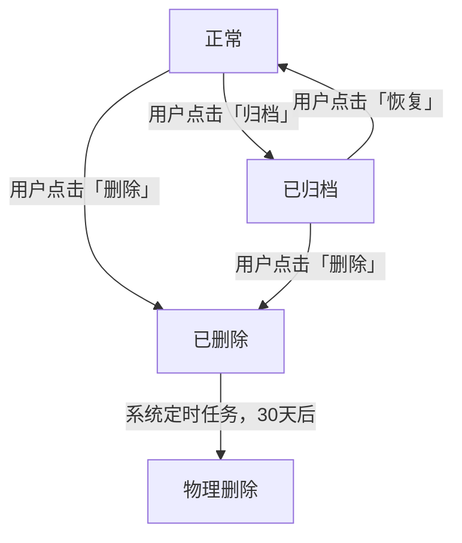

# PRD：【功能/产品名称】

> **本模板用途**：适用于工作流「阶段3 产品定义」的输出。产品定义是最终交付给开发的 PRD 和规格文档（prd.html + spec.md）的功能规格输入，不含交互设计细节。
>
> 阶段3输出：`outputs/产品定义_[产品名]_latest.md`
> 阶段4基于产品定义生成最终交付物：`outputs/prd_[产品名]_latest.html` + `outputs/spec_[产品名]_latest.md`

> **版本**：v1.0　｜　**状态**：草稿 / 评审中 / 已确认　｜　**PM**：【姓名】　｜　**日期**：YYYY-MM-DD

---

## 📌 填写规范（PM 必读，填写前确认）

> 本模板面向 UI Agent · 开发 Agent · 测试 Agent 直接执行，填写须满足以下要求：

| 规范项 | 要求 | 反例 → 正例 |
|--------|------|-------------|
| 无歧义 | 所有数值、规则必须明确，禁止模糊表述 | "不宜过长" → "最多 100 字" |
| 无口语 | 禁止"大概""可能""类似""暂定"等表述 | "大概 3 秒" → "≤ 3 秒" |
| 闭环完整 | 每个功能必须同时描述正常场景和异常场景 | 只写成功路径 → 补充所有异常处理 |
| 前后一致 | 字段名、页面 ID、功能 ID 全文统一，不得前后矛盾 | 同一字段叫"标题"又叫"名称" → 统一用一个 |
| 可验证 | 验收标准必须可被客观判断，不能依赖主观感受 | "体验流畅" → "操作响应 ≤ 200ms" |


---

## 0. 文档导读（Agent 快速定位）

| Agent | 必读章节 | 可跳过章节 | 核心任务 |
|-------|----------|------------|----------|
| 🎨 UI Agent | §3 用户画像、§5 用户旅程、§6 页面路由与跳转、§7 功能需求（交互列） | §2 战略背景、§10 接口规范、§14 技术建议 | 输出每个页面的界面与交互方案 |
| ⚙️ 开发 Agent | §4 权限矩阵、§7 功能需求（业务规则+数据规模列）、§8 状态流转、§9 数据字段、§10 接口规范、§11 异常处理全景、§13 性能意图 → **自动填写 §14** | §2 战略背景 | 实现业务逻辑、接口与数据层；并在 §14 输出技术实现建议 |
| 🧪 测试 Agent | §7 功能需求（验收标准列）、§11 异常处理全景、§13 非功能需求、§14 技术建议（验证方式列）、§15 测试数据准备 | §2 战略背景 | 覆盖功能、边界、异常、性能场景 |

---

## 1. 问题陈述

<!--
回答四个问题，是整份 PRD 的立论基础。
所有 Agent 都应先读本节，理解「为什么做」比「做什么」更重要。
-->

**谁有这个问题？**
【例：日常使用手机记录工作灵感的职场人】

**问题是什么？**
【例：灵感散落在微信、备忘录、便利贴等多处，无法统一检索和复盘】

**为什么痛？**
【例：每次回顾项目时需要翻找 5 个以上的地方，平均浪费 20 分钟，且经常遗漏关键信息】

**用户证据**（引用真实数据或用户原话，禁止填"待补充"）
- 【例：用户访谈 #23："我的想法记在太多地方了，找的时候比想的时候还累。"】
- 【例：问卷数据：68% 的受访用户表示曾因找不到历史记录而重复思考同一个问题】

---

## 2. 战略背景

<!-- Agent 可跳过本节，直接从 §3 开始执行。 -->

**业务目标关联**
- 关联 OKR：【例：Q3 目标——提升用户 DAU，本功能预计贡献次日留存提升 5%】
- 战略意义：【例：补全产品「输入-整理-输出」闭环中缺失的「输入」环节】

**为什么是现在**
【例：竞品 Notion 近期推出移动端快速记录功能，用户流失风险上升；同时内部基础架构已具备支撑条件】

**竞品参考**（🎨 UI Agent 据此了解设计调性，开发 / 测试 Agent 可跳过）

| 竞品 | 借鉴的点 | 差异化的点 |
|------|----------|------------|
| 【例：Notion】 | 悬浮快速入口体验 | 避免层级过深 |
| 【例：Apple 备忘录】 | 极简编辑体验 | 增加标签和搜索能力 |

---

## 3. 用户画像

<!-- 每个角色独立描述，决定功能的权限边界、交互差异和验收视角。 -->

### 角色一：【角色名，例：普通用户】

| 属性 | 描述 |
|------|------|
| 典型用户 | 【例：日常使用手机的职场人，25-35 岁】 |
| 核心诉求 | 【例：快速记录、随时搜索】 |
| 使用场景 | 【例：碎片化时间，通勤、开会间隙】 |
| 关键痛点 | 【例：记录步骤繁琐，历史内容找不到】 |
| Jobs-to-be-done | 【例：当我有突发灵感时，我想在 10 秒内完成记录，这样我就不会因为操作繁琐而放弃】 |

### 角色二：【角色名，例：管理员】（如有则填，无则删除本节）

| 属性 | 描述 |
|------|------|
| 典型用户 | 【描述】 |
| 核心诉求 | 【描述】 |
| 使用场景 | 【描述】 |
| 关键痛点 | 【描述】 |
| Jobs-to-be-done | 【当…时，我想…，这样我就能…】 |

---

## 4. 权限矩阵

<!--
明确每个角色对每个功能点的操作权限。
开发 Agent：权限控制必须在接口层实现，不可仅依赖前端隐藏。
-->

| 功能点 | 普通用户 | 管理员 | 未登录 |
|--------|----------|--------|--------|
| 查看列表 | ✅ | ✅ | ✅ 仅公开内容 |
| 新建内容 | ✅ | ✅ | ❌ 跳转登录页 |
| 编辑自己的内容 | ✅ | ✅ | ❌ |
| 编辑他人内容 | ❌ 返回 403 | ✅ | ❌ |
| 删除内容 | ✅ 仅自己的 | ✅ 全部 | ❌ |
| 【功能点】 | 【权限】 | 【权限】 | 【权限】 |

---

## 5. 用户旅程（主流程）

<!--
描述用户从入口到完成目标的完整路径。
UI Agent 据此确定页面数量；测试 Agent 据此覆盖主路径和异常分支。
每条旅程对应一个核心用户目标，复杂产品可有多条旅程。
-->

### 旅程一：【旅程名，例：用户首次记录一条笔记】

**主路径流程**

```
入口：首页底部导航「+」按钮
  │
  ▼
[P-02 新建页] 用户输入标题和内容
  │ 点击「保存」
  ▼
[成功状态] Toast 提示「已保存」，停留当前页
  │ 点击「返回」
  ▼
[P-01 列表页] 新建内容出现在顶部
```

**步骤说明**

| 步骤 | 页面 | 用户操作 | 系统响应 | 异常 / 边界情况 |
|------|------|----------|----------|-----------------|
| 1 | P-01 | 点击「+」按钮 | 跳转 P-02 新建页 | 未登录：跳转登录页，登录后回到此步骤 |
| 2 | P-02 | 输入内容，点击「保存」 | 保存成功，Toast 提示「已保存」 | 内容为空：保存按钮禁用；网络异常：本地缓存 |
| 3 | P-02 | 点击「返回」 | 回到 P-01，新内容置顶 | 有未保存修改：弹出「是否保存」确认弹窗 |
| 【N】 | 【页面ID】 | 【操作】 | 【响应】 | 【异常处理】 |

---

## 6. 页面路由与跳转关系

<!--
🎨 UI Agent：据此确认需要设计的页面总数和跳转逻辑，路由地址供生成原型链接。
⚙️ 开发 Agent：据此配置前端路由，路由地址为前端相对路径。
-->

### 页面路由表

| 页面 ID | 页面名称 | 路由地址 | 父页面 | 对应功能 | 访问权限 | 类型 |
|---------|----------|----------|--------|----------|----------|------|
| P-01 | 列表页 | /notes | 首页 | F-002 | 登录用户 | 改版 |
| P-02 | 新建 / 编辑页 | /notes/edit | P-01 | F-001 | 登录用户 | 新增 |
| P-03 | 笔记详情页 | /notes/:id | P-01 | F-003 | 登录用户 | 新增 |
| P-04 | 登录页 | /login | 无 | F-010 | 所有人 | 已有 |
| 【P-N】 | 【页面名】 | 【/路径】 | 【父页面ID】 | 【功能ID】 | 【权限】 | 新增/改版/已有 |

### 页面跳转规则

```
[P-04 登录页]
    │ 登录成功
    └──▶ [P-01 列表页]
              │ 点击「+」
              ├──▶ [P-02 新建页] ──保存成功──▶ 返回 P-01
              │
              │ 点击列表项
              └──▶ [P-03 详情页]
                        │ 点击「编辑」
                        └──▶ [P-02 编辑页] ──保存成功──▶ 返回 P-03
```

**补充跳转规则**（明确触发条件 + 目标页面）
- 未登录用户访问任何需登录页面 → 跳转 P-04，登录后返回原目标页
- 【其他特殊跳转规则】

### 设计参考与调性说明

- **整体调性**：【例：简洁高效，减少装饰元素，操作路径越短越好】
- **参考应用**：【例：Apple 备忘录的编辑体验 + Notion 的快速入口设计】
- **需要避免**：【例：复杂层级；进入核心功能前出现过多引导弹窗】
- **特殊要求**：【例：必须支持深色模式；字体大小跟随系统设置缩放】

---

## 7. 功能需求

<!--
每个功能独立描述，按三视角展开——PM 只填需求，不填技术实现。
- 交互说明 → UI Agent 关注
- 业务规则 → 开发 Agent 关注（含数据来源 + 数据规模）
- 验收标准 → 测试 Agent 关注（Given-When-Then，Then 含数据层验证）

⚠️ 数据规模必填说明（PM）：
  业务规则中必须包含「数据规模」子项，描述该功能涉及的数据量级、操作频率、文件大小等。
  这是开发 Agent 在 §14 推导技术实现建议的核心依据——没有数据规模，AI 无法判断是否需要分页、缓存、虚拟列表、分片上传等方案。
  例：「单用户最多 5,000 条 / 单次返回 20 条 / 图片最大 10MB」
-->

---

### F-001：【功能名，例：创建笔记】

**优先级**：P0　｜　**所属旅程**：§5 旅程一　｜　**涉及页面**：P-02

#### 交互说明（UI Agent）

| 元素 | 默认态 | 交互态 | 异常 / 禁用态 |
|------|--------|--------|---------------|
| 页面入口 | P-01 底部「+」悬浮按钮，品牌主色 | 点击：缩小动画 → 跳转 P-02 | — |
| 页面结构 | 顶部导航（返回 + 「保存」）；中部：标题框 + 正文区；底部：工具栏（插图/标签） | — | — |
| 标题输入框 | 占位文字「给这条笔记起个名字」，灰色 | 聚焦：蓝色边框 + 光标 | — |
| 正文编辑区 | 占位文字「开始记录…」，自动聚焦，唤起软键盘 | 输入中：右下角实时显示剩余字数 | ≤ 200 字时字数提示变警示色 |
| 保存按钮 | 内容全空：置灰禁用 | 有内容：高亮可点击；点击后：Loading 态防重复提交 | 保存失败：恢复可点击，Toast 提示「保存失败，请重试」 |
| 离开确认弹窗 | — | 有未保存修改时触发，选项：「保存」/「不保存」/「取消」 | — |

#### 业务规则（开发 Agent）

- **标题**：最长 100 字；可为空，空时系统自动命名为「无标题 YYYY-MM-DD HH:mm」
- **正文**：最长 10,000 字，达到上限后禁止继续输入，不截断已有内容
- **时间戳**：`created_at` 首次保存时生成，`updated_at` 每次保存更新，精度秒，UTC+8，由服务端生成，不信任客户端时间
- **创建频率上限**：同一用户每日创建 ≤ 500 条；超出后拒绝新建，提示「今日创建已达上限，明日 00:00 重置」
- **自动保存**：用户停止输入 3 秒后静默触发；失败时不提示用户，下次手动保存时合并提交；成功时界面显示「已自动保存」
- **数据规模**（⚙️ 开发 Agent 据此推导性能方案，见 §14）：
  - 单用户笔记总量：最多 5,000 条
  - 列表单次请求返回：最多 20 条（分页加载）
  - 正文最大长度：10,000 字（约 20KB 纯文本）
  - 图片附件（如有）：单文件最大 10MB，每条笔记最多 9 张
  - 保存操作频率：自动保存每 3 秒一次，用户手动保存无频率限制但需防重复提交
- **数据来源**：

| 字段 | 来源 | 说明 |
|------|------|------|
| 标题、正文 | 用户输入 | 前端传参 |
| 创建人 ID | 服务端 Session | 不由前端传参，防篡改 |
| created_at / updated_at | 服务端生成 | 不信任客户端时间 |
| 自动命名时间 | 服务端时间 | 格式 `YYYY-MM-DD HH:mm` |

#### 验收标准（测试 Agent）

```gherkin
场景一：正常创建
  Given 用户已登录，位于 P-02 新建页
  When  输入标题「测试笔记」和正文「内容」，点击「保存」
  Then  Toast 显示「已保存」
  And   P-01 列表页第一条显示「测试笔记」，时间戳正确
  And   数据库 created_at 与服务端当前时间误差 ≤ 5 秒

场景二：标题为空自动命名
  Given 用户已登录，位于新建页
  When  不填标题，只填正文，点击「保存」
  Then  保存成功，列表页标题显示「无标题 YYYY-MM-DD HH:mm」
  And   标题中的时间与数据库 created_at 一致

场景三：超出字数限制
  Given 正文已输入 10,000 字
  When  用户继续输入任意字符
  Then  输入框不接受新字符，内容长度保持 10,000
  And   字数提示显示警示色「已达最大字数 10,000」

场景四：网络异常保存
  Given 用户断网状态下已输入内容
  When  点击「保存」
  Then  Toast 提示「已保存至本地，联网后自动同步」
  And   重新联网后数据自动上传，数据库出现对应记录，本地缓存清除

场景五：每日创建上限
  Given 用户当日已创建 500 条笔记（见 §15 测试数据准备）
  When  点击「+」尝试新建
  Then  提示「今日创建已达上限，明日 00:00 重置」，不跳转 P-02
  And   数据库当日该用户记录数仍为 500，无新增

场景六：离开未保存内容
  Given 用户在 P-02 已输入内容但未保存
  When  点击「返回」
  Then  弹出确认弹窗，含「保存」「不保存」「取消」三个按钮
  And   点击「不保存」：返回 P-01，数据库无新增记录
  And   点击「取消」：停留 P-02，已输入内容完整保留

【场景N：补充边界场景】
  Given 【前置条件】
  When  【操作】
  Then  【UI 层期望结果】
  And   【数据层验证】
```

---

### F-002：【功能名，例：笔记列表】

**优先级**：P0　｜　**所属旅程**：§5 旅程一　｜　**涉及页面**：P-01

#### 交互说明（UI Agent）

<!-- 按 F-001 格式填写，交互说明表须包含：默认态 / 交互态 / 异常态三列 -->
<!-- 必须覆盖：空状态（无数据时）、加载态、错误态（加载失败时）、正常列表态 -->

#### 业务规则（开发 Agent）

<!-- 按 F-001 格式填写，注意末尾包含「数据来源」表格 -->

#### 验收标准（测试 Agent）

<!-- 按 F-001 格式填写，Then 必须包含数据层验证 -->

---

<!-- 按需继续添加 F-003、F-004… 结构完全相同 -->

---

## 8. 状态流转

<!--
⚙️ 开发 Agent：据此实现状态机逻辑，枚举值须与 §9 数据字段中的枚举定义一致。
🧪 测试 Agent：据此覆盖所有状态切换路径，包括非法切换。
-->

### 【实体名，例：笔记】状态流转



**状态切换规则**

| 当前状态 | 触发条件 | 目标状态 | 操作权限 | 不可逆说明 |
|----------|----------|----------|----------|------------|
| 正常 | 用户点击「归档」 | 已归档 | 仅本人 / 管理员 | 可恢复 |
| 已归档 | 用户点击「恢复」 | 正常 | 仅本人 / 管理员 | — |
| 正常 / 已归档 | 用户点击「删除」 | 已删除 | 仅本人 / 管理员 | 30 天内可联系管理员恢复 |
| 已删除 | 系统定时任务 | 物理删除 | 系统自动执行 | **不可逆** |
| 【状态】 | 【触发条件】 | 【目标状态】 | 【权限】 | 【备注】 |

---

## 9. 数据字段说明

<!--
PM 只需说明业务含义、约束和数据来源。
字段类型、索引、分表策略由开发 Agent 自行决定。
-->

### 实体：【实体名，例：笔记（Note）】

| 字段 | 业务含义 | 约束 / 说明 | 数据来源 |
|------|----------|-------------|----------|
| 标题 | 笔记的名称 | 最长 100 字；可为空，空时系统自动命名 | 用户输入 |
| 正文 | 笔记的主体内容 | 最长 10,000 字；纯文本，不支持富文本 | 用户输入 |
| 创建人 | 创建该笔记的用户 | 关联用户账号，创建后不可更改 | 系统从 Session 取 |
| 创建时间 | 笔记首次保存的时间 | 精度到秒，UTC+8；创建后不可更改 | 服务端生成 |
| 最后修改时间 | 最近一次保存的时间 | 每次保存自动更新 | 服务端生成 |
| 标签 | 用户给笔记打的分类标签 | 每条笔记最多 10 个；每个标签最长 20 字 | 用户输入 |
| 状态 | 笔记当前状态 | 枚举：正常 / 已归档 / 已删除（见 §8 状态流转） | 系统维护 |
| 【字段】 | 【含义】 | 【约束】 | 用户输入 / 系统生成 / 第三方返回 |

---

## 10. 接口需求说明

<!--
PM 只描述「需要什么能力的接口」和「业务层面的输入输出」。
接口地址、请求方式、参数命名、错误码设计由开发 Agent 决定。
-->

| 接口 ID | 对应功能 | 业务能力描述 | 输入（业务语言） | 输出（业务语言） | 关键业务约束 |
|---------|----------|--------------|-----------------|-----------------|--------------|
| API-001 | F-001 | 创建一条新笔记 | 标题（可空）、正文（可空）、标签列表（可空） | 创建成功的笔记 ID 和时间戳 | 同一用户当日 ≤ 500 条；手机号唯一 |
| API-002 | F-002 | 查询当前用户的笔记列表 | 状态筛选（可空）、关键词（可空）、分页参数 | 笔记列表（含标题、摘要、时间、状态） | 只返回当前登录用户的数据 |
| API-003 | F-001 | 自动保存笔记草稿 | 笔记 ID（已有）或空（新建中）、当前标题、当前正文 | 保存结果（成功 / 失败） | 失败时静默，不影响用户操作 |
| 【API-N】 | 【功能ID】 | 【能力描述】 | 【业务输入】 | 【业务输出】 | 【业务约束】 |

---

## 11. 异常处理全景

<!--
穷举所有异常场景，Agent 不得自行补充未在此列出的处理方式。
🧪 测试 Agent：本表每一行对应至少一个测试用例。
-->

| 场景类型 | 具体场景 | 触发条件 | 用户反馈（界面表现） | 系统处理逻辑 |
|----------|----------|----------|----------------------|--------------|
| 表单校验 | 必填字段未填写 | 点击提交时 | 阻止提交，定位到未填字段，红色边框 + 提示「请填写：XXX」 | 前端拦截，不发送请求 |
| 表单校验 | 字段超出长度限制 | 输入时实时检测 | 禁止继续输入，字数提示变警示色 | 前端拦截，不截断已有内容 |
| 权限异常 | 访问他人数据 | 接口返回 403 | Toast 提示「无权限执行该操作」 | 接口拒绝，前端展示提示 |
| 权限异常 | 未登录访问需登录页 | 页面进入时检测 | 跳转登录页，登录后返回原页面 | 前端路由守卫拦截 |
| 网络异常 | 提交时网络中断 | 接口请求超时 / 失败 | 保留表单数据，Toast「网络异常，请检查网络后重试」，提供「重试」按钮 | 前端捕获异常，不清空表单 |
| 网络异常 | 页面加载时网络中断 | 接口返回失败 | 显示错误态：插画 + 「加载失败，点击重试」 | 前端捕获异常，显示错误组件 |
| 数据异常 | 查询结果为空 | 接口返回空列表 | 显示空态：插画 + 引导文案 + 操作按钮（如「新建笔记」） | 正常响应，前端判断空数组后展示空态 |
| 数据异常 | 唯一性冲突 | 接口返回业务错误 | Toast 提示具体冲突原因（如「该手机号已注册」） | 接口返回明确错误信息，前端透传展示 |
| 系统异常 | 服务端内部错误 | 接口返回 500 | Toast「服务繁忙，请稍后重试」，保留当前页面状态 | 前端统一捕获 5xx，不暴露技术细节 |
| 频率限制 | 超出每日操作上限 | 接口返回业务限制错误 | Toast 提示「今日 XXX 已达上限，明日 00:00 重置」 | 接口拒绝并返回重置时间 |
| 【场景类型】 | 【具体场景】 | 【触发条件】 | 【用户反馈】 | 【系统处理】 |

---

## 12. 数据埋点需求

<!--
PM 说明需要记录哪些用户行为和结果，供后续数据分析使用。
埋点实现方式（SDK 选型、上报格式）由开发 Agent 决定。
-->

| 埋点 ID | 触发时机 | 记录内容 | 用途 |
|---------|----------|----------|------|
| E-001 | 用户点击「保存」按钮 | 用户 ID、笔记 ID（新建时为空）、操作时间、操作结果（成功/失败） | 分析保存成功率，定位失败原因 |
| E-002 | 用户停留 P-02 超过 30 秒后离开且未保存 | 用户 ID、停留时长、内容字数 | 分析放弃率，优化自动保存策略 |
| E-003 | 用户点击「+」新建按钮 | 用户 ID、操作时间、当前所在页面 | 分析新建入口使用频率 |
| 【E-N】 | 【触发时机】 | 【记录内容】 | 【用途】 |

---

## 13. 非功能需求

<!-- 只写「要达到什么结果 + 为什么重要」，不写「怎么实现」。测试 Agent 据此制定非功能测试用例。 -->

### 性能体验

<!--
填写说明（PM）：
  - 填「目标值」「测量条件」「体验意图」三列。
  - 「体验意图」说明这个指标不达标时用户会遇到什么问题——这是开发 Agent 推导技术方案的依据。
  - 意图写得越具体，AI 生成的方案越贴合实际场景；禁止填「体验好」「速度快」等无意义表述。

⚙️ 开发 Agent：读取「体验意图」+ §7 各功能的「数据规模」后，在 §14 自动输出技术实现建议，无需 PM 预设方案。
🧪 测试 Agent：「目标值」+「测量条件」即为性能测试的验收断言，直接转化为测试用例。
-->

| 指标 | 目标值 | 测量条件 | 体验意图（PM 填：不达标时用户会遇到什么问题） |
|------|--------|----------|-------------------------------------------------|
| 列表页首屏加载 | ≤ 2 秒 | 4G 网络，非首次缓存 | 用户在碎片化场景打开 App，超 2 秒会直接放弃；列表是最高频入口，加载慢直接影响 DAU |
| 长列表渲染 | 300 条数据无明显卡顿 | 低端主流机型实测 | 重度用户积累大量笔记后会觉得产品「越用越慢」，是流失主因之一 |
| 搜索结果展示 | ≤ 500ms | 用户停止输入到第一屏结果出现 | 延迟过高用户会以为搜索坏了，转而放弃搜索，核心内容复用率下降 |
| 保存操作反馈 | ≤ 1 秒 | 用户点击到出现 Toast | 反馈慢让用户不确定是否保存成功，倾向重复点击，可能产生重复数据或内容丢失感知 |
| 接口响应 | P95 ≤ 1 秒，P99 ≤ 3 秒 | 正常并发压测 | 接口是所有页面体验的底层保障，超出目标值导致全局性体验下降 |
| 图片 / 文件上传（如有） | 单文件 ≤ 5 秒（10MB 以内） | Wi-Fi 网络 | 上传慢是用户放弃附图的首要原因；弱网下上传失败且无法续传，会让用户丢失内容 |
| 【指标】 | 【目标值】 | 【测量条件】 | 【体验意图：不达标时用户的具体感知和行为后果】 |

### 兼容性

| 平台 | 需支持范围 |
|------|------------|
| iOS | 【例：iOS 16 及以上，对应近 4 年内 iPhone 机型】 |
| Android | 【例：Android 10 及以上，主流品牌近 3 年高销量机型】 |
| Web 浏览器（如适用） | 【例：Chrome 最新 2 个大版本、Safari 近 3 年版本、Edge 最新 2 个大版本；明确不支持 IE 全系列】 |
| 屏幕适配 | 【例：320px 至 2560px，支持系统字体大小调整（无障碍场景）】 |

### 可靠性

- 用户编辑中的内容，即使 App 崩溃或误关闭，重新打开后内容不丢失
- 服务不可用时，已缓存内容仍可正常查看（只读降级，不可编辑）

### 安全与隐私

- 用户只能访问自己的数据，接口层须鉴权，不可仅依赖前端隐藏
- 笔记内容不得用于模型训练或对外共享（除非用户明确授权）
- 用户注销账号后，数据在 30 天内完全物理删除

---

## 14. 技术实现建议（⚙️ 开发 Agent 自动生成，PM 不填）

<!--
本节由开发 Agent 在接收 PRD 后自动填写，PM 不预设任何内容。

⚙️ 开发 Agent 填写指引：
  1. 读取 §13 性能体验表的「体验意图」列，理解每个指标背后的用户场景和风险。
  2. 读取 §7 各功能「业务规则」中的「数据规模」子项，了解数据量级和操作频率。
  3. 结合以上两项，为每个性能指标推导最合适的技术方案，填入下表。
  4. 如对某项意图理解有歧义，优先向 PM 确认，不得自行假设。

🧪 测试 Agent：本节每条建议对应至少一个专项验收场景（如缓存命中验证、幂等性验证），在 §15 测试数据准备中补充对应前置数据。

边界说明：
  ✅ 开发 Agent 可写：「列表使用虚拟滚动，仅渲染可视区域内节点」（具体方案）
  ✅ 开发 Agent 可写：「保存接口基于请求唯一 ID 做幂等，重复请求返回首次结果」
  ❌ PM 不应预填此节：技术方案由开发 Agent 根据实际技术栈选择最优实现
-->

### 14.1 性能实现建议

> ⚙️ 开发 Agent 根据 §13 性能体验意图 + §7 数据规模自动填写，示例如下：

| 约束 ID | 对应指标 | 体验意图摘要 | 技术实现建议 | 可验证方式 |
|---------|----------|--------------|--------------|------------|
| C-010 | 列表页首屏加载 ≤ 2s | 碎片化场景，超 2s 用户放弃 | 【开发 Agent 填，例：客户端缓存列表数据，二次进入优先展示缓存，后台静默刷新；首屏加载前 20 条，滚动时懒加载】 | 【例：关闭网络后进入列表页，验证缓存数据正常展示】 |
| C-011 | 长列表渲染无卡顿 | 重度用户积累 300+ 条后感知变慢 | 【开发 Agent 填，例：列表条目超 50 条启用虚拟滚动，只渲染可视区域节点】 | 【例：模拟 300 条数据，低端机快速滚动，FPS ≥ 50】 |
| C-012 | 搜索结果 ≤ 500ms | 延迟高用户以为搜索坏了 | 【开发 Agent 填，例：输入防抖 300ms，停止输入后再发请求】 | 【例：快速连续输入 10 个字符，验证只触发 1 次请求】 |
| C-013 | 保存反馈 ≤ 1s | 反馈慢导致重复点击 / 重复数据 | 【开发 Agent 填，例：接口幂等设计，按钮点击后立即 Loading 防重复提交】 | 【例：网络延迟 2s 下快速点击保存 3 次，验证数据库只新增 1 条】 |
| C-014 | 接口响应 P95 ≤ 1s | 接口慢导致全局体验下降 | 【开发 Agent 填，例：列表和详情接口加服务端缓存层，写操作时主动失效】 | 【例：并发 100 用户压测，P95 响应时间不超过 1s】 |
| C-015 | 文件上传 ≤ 5s（10MB） | 弱网上传失败且无法续传 | 【开发 Agent 填，例：超 2MB 分片上传（每片 ≤ 1MB）+ 断点续传；上传前客户端压缩图片】 | 【例：模拟网络中断后恢复，验证已上传分片不重传】 |
| 【C-N】 | 【对应指标】 | 【意图摘要】 | 【开发 Agent 填写】 | 【验证方式】 |

### 14.2 数据一致性建议

> ⚙️ 开发 Agent 根据 §7 业务规则中涉及写操作、并发、重试的场景自动填写：

| 约束 ID | 适用场景 | 技术实现建议 | 原因 |
|---------|----------|--------------|------|
| C-020 | 【开发 Agent 填，例：所有写操作接口】 | 【例：基于幂等 Token 或业务唯一键去重，重复请求返回首次结果】 | 【例：防止网络抖动重试产生重复数据】 |
| C-021 | 【开发 Agent 填，例：自动保存接口】 | 【例：以笔记 ID + 用户 ID 为唯一键，upsert 语义】 | 【例：避免自动保存产生重复草稿】 |
| 【C-N】 | 【场景】 | 【建议】 | 【原因】 |

### 14.3 安全实现建议

> ⚙️ 开发 Agent 根据 §4 权限矩阵 + §11 异常处理中的权限异常场景自动填写：

| 约束 ID | 适用范围 | 技术实现建议 | 原因 |
|---------|----------|--------------|------|
| C-030 | 【开发 Agent 填，例：所有需登录接口】 | 【例：服务端独立校验 Token + 操作权限，不信任前端传入的 userId / role 参数】 | 【例：防止参数篡改越权访问】 |
| C-031 | 【开发 Agent 填，例：所有用户输入字段】 | 【例：服务端统一转义，禁止用户输入直接拼接 SQL / HTML】 | 【例：防止 SQL 注入和 XSS】 |
| 【C-N】 | 【范围】 | 【建议】 | 【原因】 |

### 14.4 可靠性实现建议

> ⚙️ 开发 Agent 根据 §13 可靠性需求 + §11 网络异常场景自动填写：

| 约束 ID | 适用场景 | 技术实现建议 | 原因 |
|---------|----------|--------------|------|
| C-040 | 【开发 Agent 填，例：编辑页草稿保存】 | 【例：内容写入本地持久化存储（非内存），App 重启后自动恢复未提交草稿】 | 【例：防止崩溃或系统杀进程导致内容丢失】 |
| C-041 | 【开发 Agent 填，例：所有写操作网络失败】 | 【例：保留表单数据，提供重试入口，禁止自动清空】 | 【例：避免用户因网络问题重复填写】 |
| 【C-N】 | 【场景】 | 【建议】 | 【原因】 |

---

## 15. 测试数据准备

<!--
🧪 测试 Agent 专用——执行 §7 验收标准所需的前置数据和环境条件。
PM 写验收场景时，同步在此说明对应的数据准备需求。
-->

| 对应场景 | 所需前置数据 | 准备方式 | 准备责任方 |
|----------|-------------|----------|------------|
| F-001 场景五（每日上限） | 测试账号当日已有 500 条笔记 | 执行脚本 `seed_500_notes.sh` | 开发 Agent 提供脚本，测试 Agent 执行 |
| §8 软删除 30 天到期验证 | 存在 deleted_at > 30 天的已删除记录 | 直接写入测试库，修改 deleted_at 时间 | 开发 Agent |
| §4 权限验证（403 场景） | 两个不同角色的测试账号（普通用户 + 管理员） | 测试账号由开发 Agent 预置，凭据文档存放位置：【填写】 | 开发 Agent |
| 【场景】 | 【所需数据】 | 【准备方式】 | 【责任方】 |

**测试环境约定**
- 测试数据与生产数据完全隔离，使用独立 Staging 环境
- 每次回归测试前执行 `reset_test_data.sh` 恢复基准数据
- 敏感字段（手机号、姓名）使用脱敏占位值（如 `138****0001`、`测试用户A`）

---

## 16. 待解决问题（Open Questions）

<!--
记录尚未决策的问题，避免 Agent 自行假设导致返工。
**Agent 遇到与未决问题相关的逻辑时，必须暂停执行并标注，等待 PM 决策后继续。**
PM 目标：需求评审前清零本节。
-->

| # | 问题描述 | 影响范围 | 负责人 | 截止日期 | 状态 |
|---|----------|----------|--------|----------|------|
| Q1 | 【例：自动保存是否计入每日 500 条上限？】 | F-001 业务规则、API-003 | 【PM】 | YYYY-MM-DD | 待决策 |
| Q2 | 【例：已删除笔记 30 天内管理员能否恢复？】 | §8 状态流转、§4 权限矩阵 | 【PM】 | YYYY-MM-DD | 待决策 |
| Q3 | 【例：多设备同时编辑同一笔记，冲突如何解决？】 | F-001 业务规则 | 【PM + 开发】 | YYYY-MM-DD | 讨论中 |
| 【Qn】 | 【问题】 | 【影响章节 / 功能 ID】 | 【负责人】 | — | 待决策 / 已决策 |

---

## 17. 依赖与风险

| 类型 | 描述 | 影响范围 | 当前状态 | 应对措施 |
|------|------|----------|----------|----------|
| 内部依赖 | 【例：用户账号体系 API】 | 所有需登录功能 | ✅ 已就绪 | — |
| 外部依赖 | 【例：第三方图片 OCR 接口】 | F-003 图片识别 | ⏳ 待签约 | 本期做纯文本，OCR 下期补充 |
| 风险 | 【例：长文本在低端安卓机性能未知】 | F-001 编辑体验 | 🔍 待评估 | 上线前目标机型专项压测 |
| 【类型】 | 【描述】 | 【影响】 | 【状态】 | 【应对】 |

---

## 18. 里程碑

| 节点 | 计划日期 | 交付内容 | 负责方 |
|------|----------|----------|--------|
| 需求评审通过 | YYYY-MM-DD | §16 Open Questions 全部清零，PRD 状态更新为「已确认」 | PM |
| 设计交付 | YYYY-MM-DD | 所有页面设计稿 + 交互标注，覆盖 §6 页面路由表全部页面 | UI Agent |
| 开发完成 | YYYY-MM-DD | 功能开发完毕，§10 接口联调通过，可供测试 | 开发 Agent |
| 测试通过 | YYYY-MM-DD | 测试报告输出，0 P0 / P1 Bug | 测试 Agent |
| 灰度上线 | YYYY-MM-DD | 5% 流量，监控 §1 成功指标 | 全体 |
| 正式上线 | YYYY-MM-DD | 100% 流量，§1 成功指标正式计量 | 全体 |

---

## 变更日志

| 版本 | 日期 | 变更内容 | 变更人 |
|------|------|----------|--------|
| v1.0 | YYYY-MM-DD | 初稿创建 | 【PM】 |
| v1.1 | YYYY-MM-DD | 【说明改动内容及原因；变更须同步检查一致性：字段名 / 路由 / 功能 ID 前后是否统一】 | 【PM】 |
