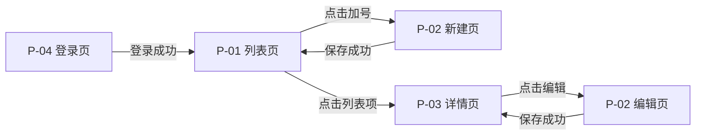

# 交付文档生成规范 v3.0

> **适用对象**：Claude PM Agent
> **读取时机**：接收产品定义后，生成最终交付文档前，必须完整读取本规范
> **规范目标**：确保输出的两份最终交付文档内容完全一致、格式规范、可直接被人类和 Agent 消费
> **适配场景**：B 端 / C 端产品，支持手机端、桌面端或双端产品设计
>
> **输出文件（两份，内容完全一致，表达方式不同）：**
> - `outputs/prd_[产品名]_latest.html`：**人类可读版 PRD**，面向产品经理、设计师、业务人员，含可视化页面、交互说明、业务规则
> - `outputs/spec_[产品名]_latest.md`：**AI 结构化规格**，面向 AI 开发、AI UI、AI 测试，严格 Markdown 结构，无装饰性内容

---

## 规则强度说明

本规范各条规则按以下强度等级标注，标签出现在规则标题或条款开头：

| 标签 | 含义 |
|------|------|
| `[Must]` | 必须遵守，无例外，直接影响原型质量或工具链一致性的底线规则 |
| `[Should]` | 原则上必须遵守，极端场景或特殊业务需求下可谨慎突破，须在 spec.md 中注明理由 |
| `[Recommended]` | 建议遵守，有明确理由时可灵活调整，属最佳实践 |
| `[Optional]` | 可选，根据产品特性决定是否采用 |

---

## 一、总体要求

### 1.1 输入

PM Agent 接收以下输入后启动交付文档生成流程：

- 阶段3《产品定义》文档（必须）
- 产品平台说明（如产品定义未注明，默认生成移动端手机版，画布尺寸遵循 §7.1 标准：440 × 956 pt）
- 设计调性说明（如未提供，按中保真灰度风格输出）

### 1.2 两份产出的定义

|  | 产出 A：prd.html 人类可读版 | 产出 B：spec.md AI结构化版 |
|--|--------------------------|--------------------------|
| **文件名** | `prd_[产品名]_latest.html` | `spec_[产品名]_latest.md` |
| **受众** | 人类 PM / UI / 开发 / 测试 | UI Agent / 开发 Agent / 测试 Agent |
| **表达方式** | 可点击的页面线框图 + 人类可读说明，浏览器直接查看 | 严格 Markdown 结构，无 HTML，无装饰性内容 |
| **内容覆盖** | 完全相同 | 完全相同 |
| **交互深度** | 中保真：规范色系，真实组件状态，可点击跳转 | 精确描述：每个组件的默认态 / 交互态 / 异常态 |

**`[Must]` 核心约束：两份产出必须内容完全一致。**
- prd.html 展示的任何页面、状态、逻辑，spec.md 中必须有对应的文字描述
- spec.md 描述的任何规则，prd.html 中必须有对应的视觉表现
- **`[Must]` 对称性硬性要求**：spec.md 每页状态表行数 = prd.html 对应视觉帧数，误差为零；触点总表行数 = 触点卡片数，完全对应

### 1.3 保真度标准（中保真）

| 维度 | 包含 ✅ | 不包含 ❌ |
|------|--------|---------|
| 视觉 | 规范色系、合理间距和层级、清晰元素边界、Source Han Sans CN 字体 | 品牌色、真实图片、图标库 |
| 内容 | 真实占位文字（非 Lorem ipsum）、真实字段名 | 真实用户数据、真实图片 |
| 交互 | 页面间跳转、组件状态切换、表单校验提示 | 动效、手势、复杂动画 |
| 逻辑 | 正常流程 + 所有异常状态 + 边界情况 | 后端逻辑实现 |

### 1.4 多端文件组织

交付文档统一输出到 `outputs/` 目录，无子目录分端口结构：

```
outputs/
├── prd_[产品名]_latest.html    ← 产出 A：人类可读版 PRD
└── spec_[产品名]_latest.md     ← 产出 B：AI 结构化规格
```

**多端产品处理**：产品涉及多个端口（手机/桌面/小程序）时，两份文档均在同一文件中覆盖所有端口，通过平台标签区分帧（如 `P-03 报价列表 [手机] / P-03 报价列表 [桌面]`）。

**跨平台页面编号规则**：
- 页面编号在产品定义页面路由表中统一定义，各端共用同一套编号体系
- 同一页面在不同端均有帧时，使用相同编号（如 `P-03`），在页面标题行后用平台标签区分：`P-03 报价列表 [手机] / [桌面]`
- 仅存在于某一端的页面，照常分配编号，在页面清单「访问权限」列注明端口限制

---

## 二、产出 A 规范：prd.html 人类可读版

### 2.1 文件命名

```
outputs/prd_[产品名]_latest.html
```

prd.html 不仅包含可视化交互页面，还包含来自产品定义的完整功能规格（业务规则、数据字典、验收标准），是面向人类的完整产品需求文档。

### 2.2 页面组织结构

HTML 文件包含以下三个区域：

#### 区域一：导航侧栏（左侧固定，宽 220px）

```
┌──────────────────────────────────────────────┐
│ 导航侧栏（固定）    │  内容区（可滚动）          │
│                    │                          │
│ ▼ P-01 列表页      │  [当前显示的页面/状态]     │
│   · S01 默认态     │                          │
│   · S02 空状态     │                          │
│   · S03 加载态     │                          │
│   · S04 错误态     │                          │
│ ▼ P-02 新建页      │                          │
│   · S01 默认态     │                          │
│   · S02 填写中     │                          │
└──────────────────────────────────────────────┘
```

侧栏要求：
- 按页面 ID 分组（对应产品定义页面路由表）
- 每个页面下列出该页面所有状态变体，状态 ID 格式：`S[两位序号]`
- 当前选中项高亮显示；点击任意项，右侧内容区切换至对应页面/状态

#### 区域二：内容区（右侧主体）

- **移动端原型**：内容区居中显示，宽度固定 440px，外侧为页面背景色
- **桌面端原型**：内容区宽度 1440px，自适应浏览器宽度
- 每个页面/状态作为独立的 `<section>` 节点，通过 JS `showSection(id)` 控制显示/隐藏

#### 区域三：页面信息栏（每个状态帧顶部）

```
┌───────────────────────────────────────────────────────┐
│ P-02 · 新建页 · S03 字段错误态 │ 功能：F-001 │ 优先级：P0 │
└───────────────────────────────────────────────────────┘
```

#### 区域四：触点卡片区（视觉帧下方）

每个触点一张卡片，浅灰背景、左侧蓝色竖线（`#0055CC`）：

```
[P02-T01]  保存按钮
触发：点击
条件：内容全空时禁用，有内容时可触发
行为：触发表单校验 + 调用保存接口
反馈：按钮进入 Loading 态，防重复提交
跳转：保存成功→停留当前页，Toast「已保存」；失败→Toast「保存失败」
边缘：网络断开时内容存本地缓存，恢复网络后自动上传
```

### 2.3 色彩规范

> `[Must]` 所有颜色必须通过 CSS 变量引用，prd.html 中禁止直接硬编码 Hex 值。

#### CSS 变量定义（在 `<style>` 根级声明）

```css
:root {
  /* 文字 */
  --bj-text-primary:   #333333;   /* 标题、主要内容 */
  --bj-text-secondary: #666666;   /* 说明、标签 */
  --bj-text-hint:      #999999;   /* placeholder、次级信息 */
  --bj-text-disabled:  #cccccc;   /* 禁用文字 */

  /* 语义色 */
  --bj-error:          #E60023;   /* 错误/危险语义（唯一用红场景） */
  --bj-selected-light: #FDE6E9;   /* 选中态浅背景 */

  /* 背景 */
  --bj-white:          #ffffff;   /* 卡片、白底 */
  --bj-bg-1:           #fafafa;   /* 最浅层背景 */
  --bj-bg-2:           #f5f5f5;   /* 页面背景、分组背景 */
  --bj-bg-3:           #f1f1f1;
  --bj-bg-4:           #ededed;
  --bj-bg-5:           #e2e2e2;

  /* 线框/分割线 */
  --bj-border-1:       #ebebeb;   /* 轻分割线 */
  --bj-border-2:       #dbdbdb;   /* 标准边框 */

  /* 遮罩 */
  --bj-overlay:        rgba(0, 0, 0, 0.5);

  /* 导航栏毛玻璃底色 */
  --bj-nav-bg:         rgba(255, 255, 255, 0.8);
}
```

#### 色彩使用原则

| 优先级 | 强度 | 原则 |
|--------|------|------|
| ★★★ | `[Should]` | **主视觉以黑白灰为主**：页面整体色调用 `--bj-text-*` 和 `--bj-bg-*` 构建 |
| ★★★ | `[Must]` | **红色 `--bj-error` 仅用于错误/危险语义**：报错、校验失败、删除/不可逆操作确认 |
| ★★ | `[Recommended]` | **操作主色**：若产品定义未指定产品主色，主按钮使用 `--bj-text-primary`（深色按钮），而非蓝色 |
| ★ | `[Should]` | **彩色图标原则上禁止**：图标默认使用 `--bj-text-secondary` 或 `--bj-text-hint` 灰度色；仅在有明确业务语义（如状态区分、品牌色系要求）时可例外，须在 spec.md 中注明原因 |

`[Should]` **默认禁止项**（原则上不使用，仅在产品主色要求或有明确业务语义的特殊场景下可谨慎突破，须在 spec.md 中注明理由）：紫色、青色、粉色等装饰性颜色；渐变背景；光晕（glow）；超过 4 种状态色的标签系统；直接使用 Hex 硬编码色值

#### `[Recommended]` 阴影规范

| 名称 | CSS 写法 | 适用场景 |
|------|---------|---------|
| 白底阴影 | `box-shadow: 0 0 12px rgba(0,0,0,0.06)` | 白底卡片悬浮层 |
| 灰底阴影 | `box-shadow: 0 0 12px rgba(0,0,0,0.04)` | 灰底卡片 |
| 悬浮框阴影 | `box-shadow: 0 0 12px rgba(0,0,0,0.08)` | 弹窗、浮层、Sheet |
| APP导航栏 | `backdrop-filter: blur(80px)` | 顶部导航栏毛玻璃 |
| APP模糊悬浮窗 | `box-shadow: 0 0 12px rgba(0,0,0,0.08); backdrop-filter: blur(80px)` | 底部 Sheet 叠加态 |

### 2.4 字体、间距与圆角规范

`[Should]` **字体**：**Source Han Sans CN**（思源黑体），字重使用 Normal / Regular / Medium 三档；`letter-spacing: 0`（默认不做字间距调整）

```css
font-family: 'Source Han Sans CN', 'PingFang SC', 'Microsoft YaHei', sans-serif;
```

> **越南语适配**：渲染越南语（VN）时，若 lineHeight 导致字母上下溢出，允许在语义范围内将 lineHeight 增加 2px 作为缓冲。

**字号层级（移动端 / 手机）**

| 层级 | 字号 | 行高 | 字重 | 用途 |
|------|------|------|------|------|
| 标题超大 | 20px | 30px | Regular | 页面大标题 |
| 标题大 | 16px | 24px | Regular | 导航栏标题、模块主标题 |
| 标题 | 14px | 21px | Regular / Normal | 卡片主标题、列表项标题 |
| 标题小 | 12px | 19px | Normal | 分组标题、次级标题 |
| 正文大（常态） | 14px | 21px | Normal | 表单内容、列表主信息 |
| 正文大（输入） | 14px | 24px | Normal | 输入框内文字 |
| 正文中（常态） | 12px | 19px | Normal / Medium | 说明文字、辅助信息 |
| 正文中（多行） | 12px | 21px | Normal | 多行说明段落 |
| 正文中（输入） | 12px | 24px | Normal | 小输入框内文字 |
| 正文小 | 10px | 15px | Normal | Tag、Badge、角标 |
| TAB 选中 | 14px | 21px | Medium | 底部 Tab 选中态 |
| TAB 未选中 | 14px | 21px | Normal | 底部 Tab 未选中态 |

**字号层级（Web / 桌面端）**

| 层级 | 字号 | 行高 | 字重 | 用途 |
|------|------|------|------|------|
| 超大标题 | 40px | 60px | Medium | 落地页、Dashboard 大标题 |
| 大标题 | 20px | 30px | Medium | 页面 H1、模块主标题 |
| 弹窗标题 | 16px | 24px | Medium / Regular | 弹窗、侧边面板标题 |
| 正文常规 | 14px | 21px | Normal / Regular / Medium | 表单内容、列表主信息 |
| 正文中 | 12px | 19px | Normal / Medium | 说明、标签 |
| 辅助信息 | 10px | 15px | Normal / Regular | Tag、Badge、角标 |
| 特殊极小 | 8px | 12px | Regular | 极小说明（谨慎使用） |

`[Recommended]` **圆角规范**

| 平台 | 常规圆角 | 胶囊/圆形头像 |
|------|---------|-------------|
| 手机 | `4px` | `100px` |
| 平板 | `4px` | `100px` |
| Web / 桌面 | `8px` | `100px` |

> 弹窗（Modal）圆角：手机/平板 `8px`，桌面 `8px`；胶囊按钮/圆形头像统一 `100px`，与平台无关。

`[Recommended]` **基础间距（移动端）**：以 4px 为基础单位，常用值：4 / 8 / 12 / 16 / 20 / 24px

| 场景 | 间距 |
|------|------|
| 页面内边距（左右） | 16px |
| 卡片内边距 | 12~16px |
| 表单字段间距 | 12px |
| 列表项垂直内边距 | 12px 上 + 12px 下 |

`[Recommended]` **基础间距（桌面端）**

| 场景 | 间距 |
|------|------|
| 主内容区左右 padding | 24px |
| 卡片内边距 | 16~24px |
| 表单字段间距 | 16px |
| 列表行垂直内边距 | 14px 上 + 14px 下 |

### `[Should]` 2.5 触控尺寸规范（移动端）

依据 Apple HIG、Google Material Design 及 WCAG 2.5.8 标准。

**最小触控目标**

| 组件类型 | 最小尺寸 | 说明 |
|---------|---------|------|
| 主/次/危险按钮 | 44×44px | 点击区域（视觉可小于此值） |
| 列表行 | 高度 ≥ 52px | 整行可点击 |
| 图标按钮 | 44×44px | 外层透明点击区达标即可 |
| 步进器按钮（±） | 36×36px（最低） | 步进器整体宽度 ≥ 120px |
| Tab 标签项 | 高度 ≥ 44px | 宽度不限 |
| 底部操作栏 | 高度 ≥ 52px | 含底部安全区 padding |
| 表单字段行 | 高度 ≥ 48px | 含 label + input |
| 表单输入框 | 44px | 独立输入框高度 |
| 导航栏 | 44px（含 Dynamic Island 区域 59px，总计 103px；iPhone 17 Pro Max 基准） | — |

**相邻元素间距**

| 场景 | 最小间距 |
|------|---------|
| 相邻可点击元素 | ≥ 8px |
| 同行多个操作按钮 | ≥ 8px |
| 列表行内右侧操作区与主内容 | ≥ 16px |

`[Should]` **密度控制**：单屏可见主要操作入口不超过 3 个（不含导航栏）；次要操作收入「···」菜单或底部抽屉，不平铺于主界面。

### `[Recommended]` 2.6 组件渲染规范

#### 输入框

```
默认态：   ┌────────────────────────┐  高度 44px，圆角 4px（手机）/ 8px（桌面），边框 var(--bj-border-2)
           │ 占位文字（var(--bj-text-hint)） │
           └────────────────────────┘

聚焦态：   ┌════════════════════════┐  边框变 var(--bj-border-2) 加粗 2px，或产品指定主色
           │ 已输入内容（var(--bj-text-primary)） │
           └════════════════════════┘

错误态：   ┌────────────────────────┐  边框变 var(--bj-error)
           │ 已输入内容              │
           └────────────────────────┘
             ⚠ 错误提示文字（var(--bj-error)，12px/19px）

禁用态：   ┌────────────────────────┐  背景 var(--bj-bg-2)，文字 var(--bj-text-hint)
           │ 内容（灰色）            │  pointer-events: none
           └────────────────────────┘
```

#### 按钮

```
主按钮（正常）：  [████ 操作文字 ████]   var(--bj-text-primary) 底，白字，高 44px，圆角 4px/8px
主按钮（禁用）：  [░░░░ 操作文字 ░░░░]   var(--bj-text-disabled) 底，var(--bj-text-hint) 字，pointer-events:none
主按钮（加载）：  [⟳ 处理中...      ]   var(--bj-text-primary) 底，白字，按钮内 Spinner，pointer-events:none
次按钮（正常）：  [ 操作文字 ]            白底，var(--bj-border-2) 边框，var(--bj-text-primary) 字
危险按钮（正常）：[ 删除 ]               白底，var(--bj-error) 边框和字
```

> 若产品定义指定了产品主色（如盘八斗 #3A7BFF），主按钮底色和聚焦态边框改用产品主色；在 `:root` 中增加 `--bj-brand` 变量并替换对应位置。

#### Toast 提示

位置：**移动端在屏幕底部居中**，距底部操作栏上方 12px；**桌面端在屏幕左下角**，距左 24px、距底 24px

```
成功：  ╔══════════════════════╗  左边线 var(--bj-text-secondary)，白底，var(--bj-text-primary) 字
        ║ ✓  操作成功提示文字  ║  持续 2 秒
        ╚══════════════════════╝

警告：  ╔══════════════════════╗  左边线 var(--bj-text-secondary)
        ║ ⚠  警告提示文字      ║  持续 3 秒
        ╚══════════════════════╝

错误：  ╔══════════════════════╗  左边线 var(--bj-error)
        ║ ✕  操作失败提示文字  ║  持续 3 秒
        ╚══════════════════════╝

含操作：╔════════════════════════════╗  左边线 var(--bj-text-primary)
        ║ ℹ  提示文字       [撤销]  ║  持续 4 秒
        ╚════════════════════════════╝
```

多条 Toast 叠加时：新 Toast 替换旧 Toast，不堆叠显示。

#### 弹窗（Modal）

```
        ┌──────────────────────────────┐  圆角 8px，悬浮框阴影
        │ 弹窗标题（16px Medium）       │
        │──────────────────────────────│
        │ 内容描述文字（14px，var(--bj-text-secondary)） │  背景遮罩 var(--bj-overlay)
        │                              │
        │   [取消（次按钮）]  [确认]   │  按钮区域左右 padding 16px
        └──────────────────────────────┘
```

不可逆操作弹窗（如登录过期）：点击背景遮罩无响应，必须通过按钮操作关闭。

#### 加载态

| 场景 | 使用方式 |
|------|---------|
| 首屏加载 / 页面主体内容加载 | 骨架屏（`var(--bj-bg-5)` 占位块，圆角 4px，模拟最终布局轮廓，shimmer 动画） |
| 局部数据刷新（筛选、搜索结果更新） | Spinner（直径 24px，置于内容区中央，页面其余部分 opacity: 0.4） |
| 按钮提交等待 | 按钮内 Spinner（直径 16px，替换按钮文字，按钮保持原宽度） |
| 下拉刷新触发 | 刷新图标旋转（位于列表顶部，高度 44px 的指示区） |

触发骨架屏的时机：接口请求 > 300ms 未返回，且无客户端缓存时。

#### 空状态

三要素缺一不可：

| 要素 | 规格 |
|------|------|
| 图示 | 灰色线性图标或简单几何图形，80×80px，水平居中 |
| 主文案 | 14px / Medium / `var(--bj-text-primary)`，说明空态原因（如「暂无笔记」）。**禁止统一用「暂无数据」** |
| 辅助文案 | 12px / Normal / `var(--bj-text-secondary)`，引导下一步操作 |
| 行动按钮 | 可选；若有明确主操作，放置主按钮，文案不超过 8 字 |
| 布局 | 三要素垂直排列，整体置于内容区垂直 40% 处（视觉略偏上） |

#### 列表与分页

| 模式 | 适用端口 | 触发条件 | 视觉反馈 |
|------|---------|---------|---------|
| 下拉刷新 | 移动端 | 列表处于顶部，继续下拉 ≥ 64px | 顶部指示区（高 44px），图标旋转；完成后淡出 |
| 上滑加载更多 | 移动端 | 滚动至底部距离 ≤ 200px 时预加载 | 底部「加载中」行；无更多数据时显示「已显示全部 X 条」 |
| 分页控件 | 桌面端 | — | 分页控件置于列表底部右侧，含上/下页、页码、每页条数选择器 |

移动端不使用分页控件；桌面端优先分页控件。

### `[Must]` 2.7 触点编号系统

视觉帧内每个可交互元素须标注触点编号徽章，供审阅者与下方触点卡片快速对照。

**触点 ID 命名规则**：`[页面编号]-T[两位序号]`，示例：`P01-T01`、`P02-T12`

同一触点 ID 在两份产出中完全相同，不得各自编号。

**徽章样式**：

```css
.tp-marker {
  position: absolute;
  top: -6px; right: -6px;
  width: 16px; height: 16px;
  background: #0055CC; color: #fff;
  border-radius: 50%; font-size: 10px; font-weight: 600;
  display: flex; align-items: center; justify-content: center;
  z-index: 10; pointer-events: none;
}
.tp-wrap { position: relative; display: inline-flex; }
```

**使用方式**：

```html
<!-- 普通按钮 -->
<div class="tp-wrap">
  <button class="btn-primary">保存</button>
  <span class="tp-marker">01</span>
</div>

<!-- 表单行（块级元素） -->
<div class="form-group" style="position:relative;">
  <input type="text" placeholder="标题">
  <span class="tp-marker">02</span>
</div>
```

**注意事项**：
- 导航栏区域（含圆角裁切时）徽章改为 `bottom: -4px; right: -4px`，避免被裁切：
  ```html
  <div class="tp-wrap">
    <div class="phone-nav-action">编辑</div>
    <span class="tp-marker" style="top:auto;bottom:-4px;right:-4px;">02</span>
  </div>
  ```
- `.card` / `.p-card` 类须设 `overflow: visible`（而非 `hidden`），防止圆角裁切绝对定位的徽章
- 弹窗/抽屉内触点独立编号，徽章前加前缀 `D`（如 `D01`、`D02`），避免与主页触点混淆
- 仅展示性元素（纯文本、图片）不加徽章

**触发方式标准词**（填写触点卡片时从以下列表选取，不得自造词汇）：

| 触发方式 | 适用端口 |
|---------|---------|
| 点击 | 所有端 |
| 长按 | 移动端 |
| 下拉刷新 | 移动端 |
| 上滑加载 | 移动端 |
| 输入 / 清空 | 所有端 |
| 鼠标悬浮 | 桌面端 |
| 键盘 Tab | 桌面端 |
| 键盘 Enter / Space | 桌面端 |

桌面端 hover/focus 记录规则：若某元素有 hover 态，在触点卡片中新增一条，触发方式填「鼠标悬浮」，描述样式变化（背景色、Tooltip 出现等）；仅样式变化、无业务逻辑的可合并为末尾注记行。

### 2.8 状态枚举规范

每个页面在视觉帧之前，先列出状态索引卡片：

```
[S01] 默认态（有数据）— 触发前提：接口返回非空数据，与 S02/S03 互斥
[S02] 空态            — 触发前提：接口返回空数据，与 S01/S03 互斥
[S03] 加载失败态      — 触发前提：接口超时或网络错误，与 S01/S02 互斥
[S04] 角色差异态      — 触发前提：当前用户为管理员，可与 S01 叠加
```

**`[Must]` 强制规则**：
- 每个状态 ID 对应一个且仅一个视觉帧，不得跳过、不得多出
- 「是否互斥」必须明确标注；互斥状态不得在同一帧中共存
- **叠加态**（弹窗/抽屉/Toast 覆盖在主页面上）不单独占状态表一行，在触发它的主状态行备注说明
- **瞬态**（骨架屏、短暂 Toast）可在注释中说明，不强制单独成帧
- 禁用态须在对应状态帧中明确展示，不得仅靠文字描述
- 同一页面多个状态帧须展示**完全一致的字段集合**，不得因状态不同而省略字段

#### `[Should]` 状态可视化方式（标准做法）

**使用 section-header 状态 chip 高亮，不使用 frame-label 标签条。**

每个页面的 section-header 中显示该页面全部状态列表（S01 / S02 / S03 …），当前激活状态的 chip 以主色高亮。视觉帧本身不再放置独立的状态名称标签条（frame-label）。

> **原因**：frame-label 仅标注当前帧自身的状态名，与其他状态孤立。而 section-header 中的 chip 列表始终可见全部状态，切换状态时高亮位置产生对比，审阅者可一眼看出各状态之间的关系与数量，更有利于跨状态比对审阅。

### `[Should]` 2.9 新增业务组件标注规范

「新增组件」指本次需求首次引入、产品定义中未曾存在的 UI 组件单元（如「项目卡片」「订单行」），不包含通用系统组件（按钮、输入框等）。

**在 prd.html 中**：每个使用到新增组件的页面帧区块，在帧组右侧放置「组件说明栏」（宽约 300px，`var(--bj-bg-1)` 背景，左边线 3px `#0055CC`），与帧组并排展示。

每个组件状态须用 HTML/CSS 绘制可视化卡片（真实渲染，不得仅用文字替代）：

```
┌──────────────────────────────────────┐
│ [新增组件]  笔记卡片                  │ ← 标题行
│ 首次出现于：P-01 列表页               │
├──────────────────────────────────────┤
│ C01 · 正常态                         │ ← 状态标签行
│ ┌────────────────────────────────┐   │ ← 可视化卡片
│ │ 笔记标题                   › │   │
│ │ 正文预览（灰色单行截断）       │   │
│ │ 2025-01-12  工作              │   │
│ └────────────────────────────────┘   │
│ 触发：笔记状态为「正常」              │ ← 触发前提
├──────────────────────────────────────┤
│ C02 · 已归档态                       │
│ ┌────────────────────────────────┐   │
│ │ 笔记标题             [已归档] │   │
│ │ 正文预览（灰色）               │   │
│ └────────────────────────────────┘   │
│ 触发：笔记状态为「已归档」            │
└──────────────────────────────────────┘
```

**组件说明栏内容要求**：组件名称、首次出现页面、每个状态的可视化卡片（体现关键视觉差异）、每个状态的触发前提、状态互斥说明。

**重复出现的组件**：首次出现页面完整绘制；后续出现页面仅注明「[复用组件] 组件名 — 见 P-xx 完整说明」，仅补充本页特有差异状态（若有）。

### `[Must]` 2.10 必须覆盖的状态清单

PM Agent 对产品定义中每个功能，必须生成以下状态（功能无关则跳过）：

| 状态类型 | 必须生成 | 说明 |
|---------|---------|------|
| 默认 / 初始态 | ✅ | 用户进入页面时的初始状态 |
| 空状态 | ✅ | 列表无数据、搜索无结果 |
| 加载态（骨架屏） | ✅ | 接口 > 300ms 未返回 |
| 填写中 / 交互中 | ✅ | 表单有内容，按钮激活 |
| 成功态 | ✅ | 操作成功反馈 |
| 字段错误态 | ✅ | 校验失败，红色提示 |
| 网络错误态 | ✅ | 接口失败，重试入口 |
| 禁用态 | ✅ | 无权限或条件不满足 |
| 越权提示态 | ✅（有权限矩阵时） | 403 场景 |
| 确认弹窗态 | ✅（有不可逆操作时） | 删除、放弃编辑等 |
| 角色差异态 | ✅（有多角色时） | 不同角色看到不同操作项 |

### `[Must]` 2.11 状态帧（Section）强制结构模板

每个状态帧在 HTML 中是一个 `<section>` 节点，内部必须按以下固定顺序包含三个区块，缺一不可：

```
┌─────────────────────────────────────────────────────────────────┐
│  区块A：section-header（页面标识 + 全状态导航）                    │
│  ┌──────────────────────────────────────────────────────────┐   │
│  │  [P-01 项目列表页]  [销售视角]                             │   │
│  │  S01 · S02 · S03 · S04 · S05 · S06 · S07                │   │  ← 全部状态 chip，当前帧高亮
│  └──────────────────────────────────────────────────────────┘   │
├─────────────────────────────────────────────────────────────────┤
│  区块B：视觉帧主体（phone-frame / desktop-frame）                  │
│  ┌──────────────────────────────────────────────────────────┐   │
│  │  手机帧 / 桌面帧内容（页面 UI 原型）                        │   │
│  └──────────────────────────────────────────────────────────┘   │
├─────────────────────────────────────────────────────────────────┤
│  区块C：交互说明表（本状态帧所有触点的说明）                         │
│  ┌──────────────────────────────────────────────────────────┐   │
│  │  交互说明 - S01 默认态（有报价记录）                         │   │  ← block-title 格式
│  │  ┌────────┬──────────────────────────────────────────┐   │   │
│  │  │ 编号   │  触点名称 / 触发 / 行为 / 跳转 / 边缘      │   │   │  ← 表格行
│  │  └────────┴──────────────────────────────────────────┘   │   │
│  └──────────────────────────────────────────────────────────┘   │
└─────────────────────────────────────────────────────────────────┘
```

**各区块强制规则：**

**`[Must]` 区块A — section-header**
- 每个 `<section>` 必须有且仅有一个 section-header，位于帧内容之前
- section-header 横向撑满内容区全宽，不受 phone-frame 宽度限制
- 显示内容：页面编号（如 `P-PRJ-LIST`）、页面名称、访问角色标签
- 状态 chip 列：列出该页面全部状态 ID，当前帧对应的 chip 高亮（见 §2.8 状态可视化方式）
- **page-level section**（侧栏页面组节点）和 **state-level section**（具体状态帧节点）均须有自己的 section-header；page-level 的 section-header 显示页面基本信息和状态列表，state-level 的 section-header 是同一份内容并高亮对应 chip

**`[Must]` 区块B — 视觉帧主体**
- 移动端：phone-frame 宽度固定 440px，居中展示
- 桌面端：desktop-frame 自适应内容区宽度（最大 1440px）
- 视觉帧内所有可交互元素须附加触点编号徽章（见 §2.7）

**`[Must]` 区块C — 交互说明表**
- block-title 格式：`交互说明 - S[XX] [状态名称]`，位于表格上方，作为区块标题
- 交互说明统一使用**表格**呈现（禁止使用垂直卡片堆叠的方式），列定义：

  | 编号 | 触点名称 | 触发 | 行为 | 跳转 | 边缘情况 |
  |------|---------|------|------|------|---------|

- 触发条件、互斥说明等帧级说明写入本表最后一行或表格注记，不单独放置标签条
- 若本帧无可交互触点（如纯加载骨架帧），交互说明表可省略，但需在区块C位置注明「本状态帧无交互触点」

> **原因**：表格格式允许审阅者横向扫描所有触点的触发-行为-跳转，比垂直卡片堆叠节省大量垂直空间，且更便于同页对比多个触点的信息密度。

---

### `[Must]` 2.12 导航组件槽位契约

导航组件使用**三槽位模型**，无论内容是否存在，三个槽位在 HTML 中**必须始终存在**，以保证布局稳定性。

#### NavBar（顶部导航栏）

```
┌──────────────────────────────────────────────┐
│  [左槽位]      [中槽位·标题]      [右槽位]     │
│  min-width     flex:1            min-width    │
│  固定宽度       居中              固定宽度      │
└──────────────────────────────────────────────┘
```

| 槽位 | 内容规则 | 占位规则 |
|------|---------|---------|
| 左槽位 | 有返回时：`‹ 返回` 按钮；有关闭时：`✕` 按钮 | **无内容时必须放置等宽空白占位块**（与右槽位同宽），确保标题居中 |
| 中槽位 | 当前页面名称，居中显示 | 始终存在 |
| 右槽位 | 操作按钮（编辑、保存、···等）；多个操作时横向排列 | **无内容时必须放置等宽空白占位块**（与左槽位同宽），确保标题居中 |

`[Should]` **槽位对称原则**：左槽位与右槽位的保留宽度必须相等（同为 60px 或按实际按钮宽度对齐），以保证标题视觉居中。若两侧按钮数量不同，以较多的一侧为基准设定保留宽度。

> **原因**：NavBar 的居中对齐依赖两侧空间对称。若某一侧缺少占位，flex 布局中标题会向空白侧偏移，产生视觉失衡。左侧无返回按钮时如不占位，标题将偏左。

`[Should]` **操作入口唯一性原则**：原则上同一操作在同一页面内只有一个入口，避免入口重复造成歧义。若页面已有「···更多」菜单且其中包含某操作（如编辑），则 NavBar 右槽位原则上不再单独放置该操作的独立按钮。spec.md 中须在触点说明里明确注明「编辑入口通过 ··· 更多菜单访问」。仅当某操作属于主流程中使用频率极高的核心操作（用户每次进入该页面几乎必然触发）时，可酌情在主位置设置快捷入口，但须在 spec.md 中标注其与主入口的关系及设置快捷入口的理由。

#### BottomBar（底部操作栏）

- `[Should]` 主操作按钮（如「新建」「提交」「确认报价」）统一放置于 BottomBar，不得放置于内容区的标题行内
- 同一页面的不同状态帧，BottomBar 内的按钮集合须保持一致（按钮可有禁用态，但不得在不同状态帧中出现或消失）
- 若某状态下 BottomBar 整体不可操作（如加载中），以 `opacity: 0.4 + pointer-events: none` 表示禁用，而非移除

---

### 2.13 交互完整性标准

本节规定原型在"运行期交互体验"层面的强制要求，作为 §5.4 自审清单的规范依据。

#### `[Should]` 按钮导航覆盖率

原则上所有 phone-frame / desktop-frame 内的可交互元素均须绑定 onclick 跳转逻辑，不得存在点击无响应的按钮、列表项或菜单项。以下情形可例外，但须在对应触点说明中注明原因：① 明确处于禁用态（disabled）且视觉上已清晰呈现禁用样式的元素；② 原型中标注为「待后续迭代实现」的占位功能入口。

**高优先级必覆盖清单**（PM 实现后须逐项确认）：

| 元素类型 | 典型示例 | 跳转要求 |
|---------|---------|---------|
| ··· 更多按钮 | 项目详情页、报价详情页 | → 对应更多菜单叠加态 |
| 导出按钮 | 报价详情页 | → 导出确认/成功态 |
| 分享/生成链接按钮 | 项目详情页、报价详情页 | → 分享设置面板叠加态 |
| 列表项（卡片/行） | 项目卡片、报价记录行、询价记录行 | → 对应详情页默认态 |
| 底部操作栏全部按钮 | 新增报价、确认报价等 | → 对应目标帧 |

#### `[Should]` 光标样式

所有 phone-frame 内可点击元素均须添加 `cursor: pointer`。禁止依赖浏览器默认光标（文本/箭头）来表示可交互区域。覆盖范围：

- 所有 `<button>` 元素
- `nav-back`、`nav-action` 子元素
- `sheet-item`、`project-card` 等列表/卡片单元
- `[data-nav-bound]`（已绑定导航规则的元素）

推荐实现方式：在全局 CSS 中使用通配选择器统一覆盖，而非逐元素单独声明。

#### `[Must]` 数据回显说明（必填项）

每个状态帧的交互说明表**必须**包含「数据回显」行，描述：

1. **数据来源**：接口名称（如 `API-PRJ-004`）或本地缓存/URL 参数
2. **展示字段**：该帧展示哪些关键字段（可列举前3–5个核心字段）
3. **兜底策略**：空值/加载超时/接口错误时的降级处理（骨架屏、空态引导、错误提示等）

> **例外**：纯加载骨架帧（本身即加载状态）、弹窗叠加帧（数据来自基底帧）可省略，但须在表格注记中说明原因。

#### `[Must]` comp-panel 与 interaction-card 内容分工

两种区块的职责边界**严格区分**，不得混用：

| 区块类型 | 允许内容 | 禁止内容 |
|---------|---------|---------|
| `comp-panel` | 组件的多个**可视化状态卡片**（默认态/禁用态/错误态/选中态） | 说明性文字、规范条文、业务规则、交互行为描述 |
| `interaction-card` | 触点触发-行为-跳转说明、数据回显说明、边缘情况、业务规则文字 | 可视化渲染的组件帧 |

若发现某 comp-panel 内存在说明性文字，须将其迁移至同一状态帧的 interaction-card ic-row 中，再删除 comp-panel 内的文字内容。

---

## 三、产出 B 规范：spec.md AI 结构化版

### 3.1 文件命名

```
outputs/spec_[产品名]_latest.md
```

### 3.2 文档整体结构

```
├── 区块 0：文档头
│   ├── 版本信息、日期、对应产品定义版本
│   ├── Agent 阅读指引
│   └── 全局编号说明
│
├── 区块 1：页面流转总图
│   ├── 全量页面清单
│   ├── 核心流程跳转链路（Mermaid 流程图，每条流程单独呈现）
│   └── 页面跳转关系总表
│
├── 区块 2～N：各页面区块（按产品页面架构顺序）
│   ├── 页面标题行（编号、名称、路由、访问权限）
│   ├── 状态枚举表（所有状态 + 触发前提 + 互斥说明）
│   ├── 元素交互规范表
│   ├── 业务逻辑规则
│   ├── 触点总表（本页所有触点）
│   ├── 页面跳转表
│   ├── 状态清单与验收标准（Given-When-Then）
│   └── 本页新增组件（如有）
│
└── 区块 N+1：文档尾部
    ├── 全局交互规则
    ├── 组件状态库
    ├── 异常场景全景
    ├── 非阻塞性问题清单
    └── 变更记录表
```

### 3.3 Agent 阅读指引（区块 0）

| Agent | 必读章节 | 可跳过 | 核心任务 |
|-------|---------|-------|---------|
| 🎨 UI Agent | 全局交互规则、各页面（元素交互列）、组件状态库、新增组件说明 | 非阻塞性问题清单 | 输出高保真设计稿，所有组件状态须覆盖组件状态库 |
| ⚙️ 开发 Agent | 各页面（业务逻辑 + 触点总表）、异常场景全景、页面跳转总表 | 组件状态库 | 实现页面逻辑、路由、状态控制 |
| 🧪 测试 Agent | 各页面（验收标准列）、异常场景全景、页面跳转总表 | 组件状态库 | 覆盖每个状态和每条跳转路径 |

### 3.4 页面流转总图（区块 1）

#### 全量页面清单

| 页面编号 | 页面名称 | 路由地址 | 访问角色 | 状态数量 |
|---------|---------|---------|---------|---------|
| P-01 | 列表页 | /notes | 登录用户 | 6 |
| P-02 | 新建/编辑页 | /notes/edit | 登录用户 | 10 |

#### 核心流程 Mermaid 图

每条核心用户流程独立一个 `flowchart LR` 代码块：



**节点类型约定**：

| 类型 | Mermaid 语法 | 适用场景 |
|------|-------------|---------|
| 普通页面 | `[P01 页面名称]` | 独立路由页面 |
| 弹窗/抽屉 | `(P05c 组件名称)` | 覆盖在页面上的浮层 |
| 条件分支 | `{条件判断?}` | 流程分叉节点 |
| 外部页面 | `{{P12 外部页面}}` | 无需登录的公开页面 |

#### 跳转关系总表

| 来源页面 | 触发操作 | 跳转目标 | 跳转条件 | 携带参数 | 失败处理 |
|---------|---------|---------|---------|---------|---------|
| P-01 列表页 | 点击「+」 | P-02 新建页 | 已登录 + 当日 < 500 条 | 无 | 未登录→P-04；达上限→Toast |
| P-01 列表页 | 点击列表项 | P-03 详情页 | — | noteId | 笔记不存在→错误态 |
| {来源} | {触发} | {目标} | {条件} | {参数} | {失败处理} |

**要求**：穷举所有页面间跳转（含边缘路径），产品定义中用户旅程和页面路由为主要来源。

### 3.5 各页面区块格式（区块 2～N）

每个页面独立一节，格式固定：

```markdown
---

### P-{ID}：{页面名称}

**路由**：`/路径`　｜　**对应功能**：F-xxx　｜　**访问权限**：{角色}　｜　**类型**：新增/改版

#### 状态枚举表

| 状态 ID | 状态名称 | 触发前提 | 是否互斥 | 对应帧 |
|--------|---------|---------|---------|-------|
| S01 | 默认态（有数据） | 接口返回非空 | 与 S02/S03 互斥 | 帧1 |
| S02 | 空态 | 接口返回空数据 | 与 S01/S03 互斥 | 帧2 |
| S03 | 加载失败态 | 接口超时/网络错误 | 与 S01/S02 互斥 | 帧3 |
| S04 | 角色差异态（管理员） | 当前用户为管理员 | 可与 S01 叠加 | 帧4 |

#### 页面结构

[P-xx 页面名称]
├── 顶部导航栏
│   ├── 左：返回按钮「← 返回」
│   ├── 中：页面标题「{标题}」
│   └── 右：{操作按钮}（若超过 2 个操作，收入「···」菜单）
├── 内容区（可滚动）
│   └── {区域和元素层级}
└── 底部固定区（如有）

#### 元素交互规范

| 元素 | 默认态 | 交互态 | 异常/禁用态 | 触发条件 |
|------|--------|--------|------------|---------|
| {元素名} | {描述} | {描述} | {描述} | {条件} |

#### 业务逻辑规则

- **{规则名}**：{具体描述，包含边界值}

#### 触点总表

| 触点 ID | 操作对象 | 触发方式 | 行为描述 | 系统反馈 | 跳转目标 | 边缘情况 |
|--------|---------|---------|---------|---------|---------|---------|
| P01-T01 | {按钮名} | 点击 | {行为} | {反馈} | P-02 | {边缘} |

#### 页面跳转

| 触发操作 | 跳转目标 | 跳转条件 | 携带参数 |
|---------|---------|---------|---------|
| 点击{操作} | P-xx {页面名} | {条件} | {参数} |

#### 状态清单与验收标准

**S01：默认态**
- 互斥说明：与 S02、S03 互斥
- 触发条件：{描述}
- 页面表现：{描述每个元素的状态}
- 验收标准：
  ```gherkin
  Given {前置条件}
  When  {用户操作}
  Then  {UI 层期望结果}
  And   {数据层验证}
  ```

**S02：{状态名}**
（同上格式）

#### 本页新增组件（如有）

| 状态 ID | 状态名称 | 触发前提 | 关键视觉差异 |
|--------|---------|---------|------------|
| C01 | 正常态 | {条件} | {描述} |
| C02 | {状态名} | {条件} | {描述} |
```

### 3.6 全局交互规则（文档尾部）

```markdown
### 导航行为
- 返回按钮：始终返回上一个历史页面，无历史时返回首页
- 底部导航栏：在所有一级页面显示，二级及以上页面隐藏

### 全局反馈规则
- Toast：移动端底部居中，桌面端左下角；成功 2 秒，错误 3 秒，含撤销操作 4 秒
- 加载 > 300ms：显示骨架屏；> 10s：显示超时错误态
- 所有写操作按钮：点击后立即进入 Loading 态，防止重复提交

### 全局异常规则
- 网络断开：Toast「网络异常，请检查连接」，保留当前页面状态
- 登录态失效（401）：弹窗提示，用户确认后跳转登录页，登录成功返回原页面
- 无权限（403）：Toast「无权限执行该操作」，不跳转页面
- 服务器异常（5xx）：Toast「服务繁忙，请稍后重试」

### 表单全局规则
- 校验时机：字段失焦触发单字段校验；点击提交触发全量校验
- 错误展示：字段边框变 `var(--bj-error)` + 字段下方红色提示文字（12px）
- 提交中：禁用所有输入（opacity 0.6），按钮显示 Loading
- 表单保留：网络请求失败时，表单数据不自动清空
```

### 3.7 组件状态库（文档尾部）

描述本产品中出现的所有通用组件及完整状态，UI Agent 直接以此为设计输入：

```markdown
### {组件名，例：文本输入框（单行）}

| 状态 | 视觉描述 | 触发条件 | 交互行为 |
|------|---------|---------|---------|
| 默认态 | 边框 `var(--bj-border-2)`，占位文字 `var(--bj-text-hint)` | 页面加载 | 点击进入聚焦态 |
| 聚焦态 | 边框 `var(--bj-border-2)` 加粗 2px，光标显示 | 用户点击或 Tab 聚焦 | 移动端键盘弹起 |
| 填写态 | 边框加粗，文字 `var(--bj-text-primary)` | 用户输入内容后 | 失焦触发单字段校验 |
| 错误态 | 边框 `var(--bj-error)`，字段下方 `var(--bj-error)` 提示文字 | 校验失败 | 再次输入后错误消失 |
| 禁用态 | 背景 `var(--bj-bg-2)`，文字 `var(--bj-text-hint)`，不可点击 | 条件不满足 | 无交互响应 |
```

### 3.8 异常场景全景（文档尾部）

| # | 异常类型 | 具体场景 | 触发页面 | 触发条件 | 用户感知 | 元素变化 | 可用操作 |
|---|---------|---------|---------|---------|---------|---------|---------|
| E-01 | 网络异常 | 列表加载失败 | P-01 | 接口超时，无缓存 | 错误态插图 + 「加载失败」 | 内容区替换为错误态 | 「重新加载」按钮 |
| E-02 | 网络异常 | 保存失败 | P-02 | 保存接口失败 | Toast「保存失败，已缓存本地」 | 「保存」按钮恢复可点击 | 手动重试 |
| {E-N} | {类型} | {场景} | {页面} | {条件} | {感知} | {变化} | {操作} |

---

## 四、移动端操作布局规范

> 本章规定移动端原型中操作按钮的布局原则。核心原因：**手机屏幕空间有限，操作按钮过多会遮挡内容、造成视觉拥挤、增加误操作概率**。规范的目标是让最常用的操作触手可及，不常用的操作有序收纳。

### `[Should]` 4.1 页面级操作的收纳阈值

「页面级操作」指放置在页面内容区或底部固定栏的操作按钮（如「保存」「提交」「导出」等）。

**收纳规则**：

| 页面操作数量 | 处理方式 |
|------------|---------|
| 1 个操作 | 直接展示在导航栏右侧或底部固定栏 |
| 2 个操作 | 可直接展示，注意区分主次（主按钮 + 次按钮） |
| **≥ 3 个操作** | **必须收纳**：最高频的 1 个操作直接展示，其余收入导航栏右侧「···」更多菜单 |

**「···」菜单规范**：
- 点击「···」→ 底部抽屉弹出，列出收纳的操作清单
- 清单排序：常用操作在上，危险操作（删除、清空等）在底部，以红色文字区分
- 若页面无任何次级操作，可省略「···」按钮

**导航栏布局**：

```
导航栏：[← 返回]  [页面标题（居中）]  [主操作（最多 1 个）]  [···]
```

**示例对比**：

| ❌ 错误做法 | ✅ 正确做法 |
|-----------|-----------|
| 详情页内容区放「编辑」「归档」「分享」「删除」4 个按钮 | 内容区放「编辑」1 个主操作；导航栏加「···」，内含「归档」「分享」「删除」 |
| 导航栏放 3 个文字按钮 | 导航栏最多 1 个主操作 + 1 个「···」 |

### `[Should]` 4.2 卡片/列表项操作规范

「卡片操作」指对列表中单条数据项的操作（如「编辑」「删除」「复制」等）。

**基本原则**：卡片/列表项的行内常驻操作按钮原则上不超过 1 个；超过 1 个时，通过**长按触发上下文菜单**统一收纳。

**允许直接在卡片上展示的例外**（仅以下两种，不得以「高频」「常用」为由自行豁免）：

| 场景 | 理由 |
|------|------|
| 步进器（数量 +/-，如购物车） | 数量调整属实时频繁操作，需直接响应 |
| 列表项右侧「›」导航箭头 | 表达导航语义，不属于行为操作按钮 |

**长按菜单规范**：
- 用户长按卡片/列表项 → 底部抽屉或气泡菜单弹出，列出可用操作
- 菜单排序：普通操作在上，危险操作（删除）在底部，以红色文字区分
- 需绘制「[叠加态-长按菜单]」帧，展示菜单弹出后的视觉状态

**批量操作入口**：通过长按列表项弹出上下文菜单，菜单中提供「多选」选项，点击后进入批量选择模式（每行出现复选框，导航栏切换为「取消 / 批量操作」工具栏）。

### 4.3 PM Agent 执行时的判断流程

PM Agent 在设计每个页面时，按以下流程判断操作布局：

```
Step 1：列出该页面所有操作
  ↓
Step 2：判断页面级操作数量
  · 1-2 个 → 直接展示，确定主次按钮
  · ≥3 个  → 选最高频 1 个直接展示，其余收入「···」菜单
  ↓
Step 3：判断卡片操作类型
  · 步进器/SKU/单一核心操作 → 直接在卡片上展示
  · 其他操作（编辑/删除/分享等）且数量 ≥ 2 → 收入长按菜单
  ↓
Step 4：需绘制的叠加态帧
  · 有「···」菜单 → 绘制「[叠加态-更多菜单]」帧
  · 有长按操作   → 绘制「[叠加态-长按菜单]」帧
  · 有批量选择   → 绘制「[叠加态-批量选择]」帧
```

---

## `[Optional]` 五、深色模式声明

默认立场：本规范产出的原型**仅覆盖浅色模式**，不要求输出深色模式帧。

**例外**：若产品定义「目标平台」明确写明「需支持深色模式」，则在浅色模式全部完成并通过审核后，追加深色模式帧：

- 深色模式仅调整色彩，交互逻辑与浅色模式完全一致，不单独建立状态枚举表
- 深色帧紧跟对应页面浅色帧之后，标题标注「[深色模式]」

深色模式使用以下 Token，在 `:root` 中覆盖对应 CSS 变量：

```css
/* 深色模式 — 覆盖 :root 同名变量 */
[data-theme="dark"] {
  --bj-text-primary:   rgba(255, 255, 255, 0.85);  /* 主要文字 */
  --bj-text-secondary: rgba(255, 255, 255, 0.65);  /* 次要文字 */
  --bj-text-hint:      rgba(255, 255, 255, 0.45);  /* 辅助文字 */
  --bj-text-disabled:  rgba(255, 255, 255, 0.25);  /* 禁用文字 */
  --bj-border-1:       rgba(255, 255, 255, 0.15);  /* 轻分割线 */
  --bj-border-2:       rgba(255, 255, 255, 0.15);  /* 标准边框 */
  --bj-white:          #151515;                    /* 卡片背景 */
  --bj-bg-1:           #000000;                    /* 最深背景 */
  --bj-bg-2:           #151515;                    /* 页面背景 */
  --bj-bg-3:           #2a2a2a;                    /* 分组背景 */
  --bj-bg-4:           #454545;                    /* 悬浮层背景 */
  --bj-nav-bg:         rgba(0, 0, 0, 0.3);         /* 导航栏底色 */
}
```

| 浅色模式 Token | 深色模式值 | 用途 |
|-----------|--------|------|
| `--bj-bg-1` | `#000000` | 最底层背景 |
| `--bj-bg-2` | `#151515` | 页面背景 |
| `--bj-bg-3` | `#2A2A2A` | 分组/卡片背景 |
| `--bj-bg-4` | `#454545` | 悬浮层/高亮背景 |
| `--bj-white` | `#151515` | 卡片白底替代 |
| `--bj-text-primary` | `rgba(255,255,255,0.85)` | 主要文字 |
| `--bj-text-secondary` | `rgba(255,255,255,0.65)` | 次要文字 |
| `--bj-text-hint` | `rgba(255,255,255,0.45)` | 辅助/占位文字 |
| `--bj-text-disabled` | `rgba(255,255,255,0.25)` | 禁用文字 |
| `--bj-border-1/2` | `rgba(255,255,255,0.15)` | 分割线/边框 |

---

## 六、变更与版本管理

- 交付文档版本号与产品定义版本号对应，产品定义更新时交付文档须同步更新
- 每次更新在产出 B 文档头部记录变更内容（变更页面、变更原因、变更人）
- 历史版本归档至：
  ```
  process_record/versions/deliverable_v[版本]_[日期]/
    ├── prd.html
    └── spec.md
  ```

---

## 七、帧尺寸与平台覆盖规范

### `[Must]` 7.1 帧尺寸全局统一原则

#### 帧高度模式

根据页面内容量，选择以下两种高度模式之一：

**固定标准高度（默认）**：内容可在标准高度内完整显示时，使用 `aspect-ratio: 440 / 956` 固定宽高比，高度随帧实际渲染宽度自动计算（如帧宽 264px → 高度 ≈ 573.6px）。内容不足时空白区域保持页面背景色。

**自适应高度（长页面模式）**：内容量超出标准高度时，帧高度自适应内容（`height: auto`，最小高度不低于标准高度），完整展示全部内容。实现方式：在页面帧元素上附加 CSS class `phone-screen-long`。

```css
.phone-screen-long {
  aspect-ratio: auto;
  height: auto;
  min-height: /* 标准高度 */;
}
```

**判断依据**：
- 列表页、空态、加载态、短表单（≤ 4 个字段）→ 固定高度
- 多分区设置页、长表单（≥ 5 个字段）、多段落详情页 → 自适应高度
- 底部操作栏使用 `position:absolute;bottom:0` 的页面（如报价清单页）→ 保持固定高度，维持吸底栏定位正确性

#### 标准画布尺寸

| 端口 | 设备参考 | 逻辑分辨率（宽 × 高 pt） | 备注 |
|------|---------|----------------------|------|
| 手机-APP | iPhone 17 Pro Max | **440 × 956 pt** | 含 Dynamic Island 区域 59pt |
| PAD-APP | iPad Pro M5 13英寸 | **1032 × 1376 pt** | 2× 物理像素 |
| 桌面端 | 1920×1080 主流分辨率 | **1440 × 900 pt** | 两侧留白体现真实视觉比例 |

> **年度更新**：每年应在此处更新当年旗舰机型号与分辨率，保证原型基准与用户实际设备一致。

#### 弹框与浮层嵌套规则

弹窗（Modal）、底部抽屉（Bottom Sheet）、Popover、Toast 等覆盖层，**必须以「叠加态」方式绘制在父级页面帧内**，不得单独作为独立帧展示：

- 父级帧呈现完整遮罩层（`rgba(0,0,0,0.5)` 半透明覆盖）+ 弹窗/抽屉内容
- 弹窗内部触点使用「弹窗前缀 D」独立编号（如 `D01`、`D02`）
- 唯一例外：底部抽屉内容极长（超过帧高度 70%）且需单独说明内部多级滚动结构时，可额外绘制「[辅助帧-抽屉内部结构]」帧，不计入状态枚举表

### `[Must]` 7.2 平台覆盖原则

原型须严格按产品定义「目标平台」字段确定覆盖范围：

| 产品定义目标平台 | 原型覆盖要求 |
|------------|------------|
| 仅 APP 端 | 所有页面绘制手机帧和 PAD 帧 |
| 仅桌面端 | 所有页面只绘制桌面帧 |
| 双端（APP 端为主） | 所有页面先绘 APP 帧（手机+PAD），再绘桌面帧；布局完全一致的可标注"布局同 APP 端"并简化 |
| 双端（桌面端为主） | 所有页面先绘桌面帧，再绘 APP 帧；布局一致的可简化 |
| 双端（权重相同） | 所有页面完整绘制两端帧，不得简化任一端 |

**"布局一致"判断标准**：两端页面结构、组件层级、操作入口完全相同，仅尺寸不同。任何组件位置或操作路径差异，均视为需完整绘制。

### 7.3 APP 端帧规范（手机 + PAD）

APP 端原型须同时包含手机帧和 PAD 帧，两者共用同一套状态枚举表。

| 平台 | 画布逻辑尺寸 | 布局结构 |
|------|------------|---------|
| 手机帧（iPhone 17 Pro Max） | **440 × 956 pt** | Dynamic Island 占位（59pt）+ 导航栏（44pt）+ 内容区 + 底部操作栏 + 底部安全区（34pt，iOS） |
| PAD 帧（iPad Pro M5 13英寸） | **1032 × 1376 pt** | 顶部状态栏（24pt）+ 导航栏（50pt）+ 内容区（可利用宽屏做双栏或侧边栏）+ 底部安全区（20pt） |

**简化规则**：PAD 帧与手机帧布局完全一致的页面可标注"布局同手机帧，尺寸适配 PAD"并省略完整绘制；操作路径有任何差异须完整绘制 PAD 帧。

#### PAD 多品牌设备适配

PAD 端原型以 iPad Pro M5 13英寸为基准，同时兼容主流 Android PAD：

| 品牌/系列 | 代表型号 | 屏幕比例 | 窗口化支持 |
|---------|---------|---------|----------|
| Apple iPad Pro | M5 13英寸 | 4:3 | Stage Manager |
| Apple iPad Air | M3 13英寸 | 4:3 | Stage Manager |
| Samsung Galaxy Tab | S10 Ultra | 约 16:10.3 | DeX 桌面模式 |
| Huawei MatePad | Pro 13.2 | 约 16:11 | 悬浮窗口 |
| Xiaomi Pad | 7 Pro | 约 3:2 | 分屏/小窗 |
| 通用 Android PAD | — | 16:10 ~ 16:9 | 分屏/小窗 |

其余设备差异通过响应式断点规则覆盖，不单独绘制其他品牌原型帧。

#### PAD 响应式布局断点

| 宽度范围 | 布局模式 | 说明 |
|---------|---------|------|
| < 440 pt/dp | 手机布局 | 完全切换为单列手机布局，底部导航 Tab、顶部导航栏与手机帧一致 |
| 440 ~ 700 pt/dp | PAD 紧凑布局 | 单列内容区，左侧边栏收起或以汉堡菜单替代 |
| > 700 pt/dp | PAD 宽屏布局 | 双列或固定左侧边栏布局，与全屏 PAD 帧一致 |

**最小窗口约束**：窗口宽度 ≥ 375 pt/dp，窗口高度 ≥ 480 pt/dp。

**标注要求**：在 prd.html 每个 PAD 帧区块末尾以文字说明卡标注上述规则（无需绘制各断点帧）；spec.md 在 PAD 帧状态枚举表末尾增加一行「窗口化-手机布局触发态」，触发前提为「窗口宽度 < 440pt/dp」，备注「布局同手机帧」。

#### `[Must]` PAD 默认方向

PAD 帧**默认展示横屏态**，画布尺寸为 **1376 × 1032 pt**（宽 × 高）。若横竖屏布局存在差异，需额外绘制竖屏帧（1032 × 1376 pt）。

#### `[Should]` PAD 横竖屏适配

| 情况 | 处理方式 |
|------|---------|
| 横竖屏布局完全一致（仅宽度变化） | PAD 帧标题行标注「横竖屏布局一致，宽度自适应」，无需单独绘制竖屏帧 |
| 横竖屏布局存在差异（导航结构、内容列数、操作面板位置不同） | PAD 帧区块内额外绘制竖屏帧，标注「竖屏态」 |

竖屏帧画布尺寸：**1032 × 1376 pt**（iPad Pro M5 13英寸竖屏逻辑分辨率）。

**常见需绘制竖屏帧的场景**：横屏双列布局 → 竖屏宽度不足须改为单列；横屏固定左侧边栏 → 竖屏须收起为汉堡菜单；横屏左右分栏操作区 → 竖屏须改为上下堆叠。

#### `[Should]` PAD 骨架屏标准

PAD 帧与手机帧布局完全一致时，可绘制骨架屏帧代替完整绘制；布局或交互有任何差异时，必须绘制完整的 PAD 宽屏帧。

**骨架屏定义**：骨架屏必须是具有真实视觉结构的帧，须包含灰色矩形占位块（`var(--bj-bg-5)`）、分区色块差异或分隔线，能从视觉上传达页面信息层级和布局结构。**纯文字标注卡（仅写"布局同手机帧"等文字说明）不等同于骨架屏**，不可替代视觉帧。

**骨架屏执行要求**：

| 要求项 | 规则 |
|-------|------|
| 功能分区 | 导航区、内容区、底部操作区须通过背景色差异或分隔线明确区分，不得融为一体 |
| 按钮占位 | 底部操作区中**一个按钮对应一个独立占位块**，占位块数量必须与对应手机帧的实际按钮数量一致 |
| 关键入口 | 骨架屏须保留核心操作按钮的占位（如「立即报价」「提交」等主操作），不得因绘制骨架而省略关键交互入口 |

#### `[Should]` PAD 交互一致性原则

PAD 帧的交互设计**以对应手机帧为基准**，不得：

- 新增手机帧中不存在的功能按钮或操作入口
- 改变手机帧中已确立的交互触发方式（如将长按触发改为常驻按钮）
- 仅因"PAD屏幕更大/更高端"而升级或调整交互模式

**允许偏差的唯一条件**：手机端方案在 PAD 横屏宽度下存在布局结构性冲突（例如单列布局无法适配双栏场景，或导航结构与宽屏布局不兼容），且须在该 PAD 帧的 interaction-card 中明确注明偏差原因。

#### 手机横屏适配

手机端原型默认为竖屏。以下组件须额外绘制横屏帧：

| 需横屏适配的组件/页面 | 说明 |
|-------------------|------|
| 图片预览 / 图片浏览器 | 横屏最大化展示图片，支持双指缩放 |
| 视频播放器 | 横屏全屏播放，显示播放控制栏 |
| PDF 预览 | 横屏展示更宽内容，可切换单页/双页 |
| 相机/扫码 | 系统级横竖屏随陀螺仪旋转 |

手机横屏帧画布尺寸：**956 × 440 pt**（iPhone 17 Pro Max 横屏），状态栏降至 24pt，动态岛区域位于屏幕左侧。

### `[Must]` 7.4 小程序帧规范

小程序运行于微信等宿主 App 容器内，Chrome 结构由宿主控制，PM 不得在原型中自行绘制宿主组件。

| 要素 | 规格 |
|------|------|
| 画布宽度 | 375px |
| 顶部宿主区 | 预留 44px 占位（胶囊按钮区 + 状态栏），使用灰色占位块标注「宿主导航区-不可干预」，不绘制任何自定义内容 |
| 自定义导航区 | 位于宿主区下方，可自定义标题和左侧返回操作，高度约 44px |
| 底部 Tab 栏 | 若宿主接管 Tab：页面内不绘制底部 Tab；若小程序自有 Tab：高度 50px，与 APP 端底部 Tab 规范一致 |
| 底部安全区 | iOS 预留 34px |

**与 APP 端关键差异**（须在触点卡片「边缘情况」列标注）：
- 原生组件（picker、map、camera 等）外观由宿主决定，原型中用占位块 + 文字说明替代
- 需宿主授权的能力（摄像头、位置、文件读写等），在触点「边缘情况」列注明「弹出宿主授权弹窗，用户拒绝后的降级路径」
- 微信小程序页面栈最多 10 层，深层导航须在流程图中标注返回策略，不得出现无法返回的路径

### `[Must]` 7.5 手机-H5 帧规范

H5 运行于手机浏览器，布局须按最保守视口绘制。

| 要素 | 规格 |
|------|------|
| 画布逻辑尺寸 | **440 × 956 pt**（与手机帧一致，遵循 §7.1） |
| 顶部浏览器 Chrome | 预留 56pt 占位，灰色占位块标注「浏览器地址栏-不可干预」；原型一律按展开态（最保守布局）绘制 |
| 自定义导航 | 可选；若使用页面内导航栏，高度约 44pt；**无原生返回按钮**，须在页面内设计返回/关闭入口 |
| 底部工具栏 | Safari 底部工具栏约 49pt，底部操作栏须在此之上；无原生底部 Tab，依赖页面内 Tab 或侧边导航 |
| 底部安全区 | iOS Safari 额外预留 34pt |

**与 APP 端关键差异**（须在触点卡片「边缘情况」列标注）：
- 无法调用部分原生能力（蓝牙、NFC、后台常驻），受限触点须注明降级方案
- 分享、保存图片依赖浏览器原生菜单，触点行为描述写「呼起系统分享菜单」，不绘制自定义分享界面
- 跨域请求、Cookie SameSite 等安全策略可能影响登录态，相关触点「边缘情况」注明「登录态失效跳转登录页」

**产品自有公开 H5 页面**（如报价分享页、无需登录的只读页面）：
- 原型中不绘制登录入口、用户头像等私有态元素
- 须绘制响应式断点帧：**手机态（440pt，主要设计基准）** + **平板/宽屏态（1032pt，展示布局拉伸效果）**；若两种布局无本质差异，平板态可标注"布局同手机态，内容区水平居中，最大宽度 640pt"并省略
- 在页面清单「访问角色」列注明「外部客户-无需登录」
- 在 Mermaid 流程图中使用 `{{P12 外部页面}}` 节点类型

### `[Must]` 7.6 桌面端帧规范

画布逻辑尺寸：**1440 × 900 pt**（对应 1920×1080 主流物理分辨率，浏览器窗口最大化典型视口）。

- 设计有效区居中，左右各留 240pt 空白体现真实页面比例
- 标准布局：顶部导航栏（60pt）+ 左侧边栏（约 200pt）+ 主内容区 + 可选右侧面板（约 320pt）
- 桌面帧紧跟对应页面 APP 手机帧之后，标题注明"桌面端"
- 桌面端状态与 APP 端共用状态枚举表，在备注列注明布局差异

### 7.7 流程图中的平台区分

prd.html 流程图中，APP 端与桌面端的同名流程分行展示，各自独立成行，不混合排列。APP 端行包含手机帧，PAD 帧如有差异单独标注。

### `[Should]` 7.8 设计范围外页面（外部依赖页面）处理规则

**定义**：不在本次需求设计范围内、但与本次需求存在业务关联的页面（属于其他已有模块），称为「外部依赖页面」。

**基本原则**：
- 本次需求的功能页面中，不设置指向外部依赖页面的常驻导航入口
- 在原型中单独开「外部依赖说明」章节，说明各外部页面的模块归属及与本次需求的业务关系

**原型呈现方式（按依赖性质分两类）**：

**类型一：外部页面上的操作是流程关键步骤**（影响本次需求的数据或状态）
→ 生成**简化版页面**，只包含支撑该步骤所需的最少元素和触点，帧内标注「[外部模块-简化版]」，不作为该页面的完整设计依据

**类型二：外部页面仅作为流程的来源或去向**（只需知道「从这里来」或「到这里去」）
→ 以**占位节点**表达（标注页面名称和「[外部模块]」的方框），不绘制页面内容

**流程图处理**：外部依赖页面凡是某条流程的必经节点，均须出现在对应流程图中，按上述两类之一呈现。若与本次需求仅有业务关联但不出现在任何流程路径上，只在「外部依赖说明」章节描述，不进入流程图。
